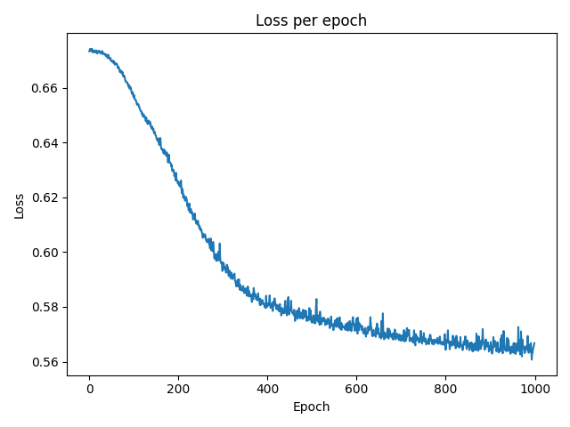
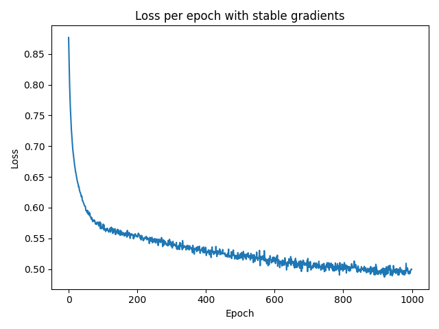
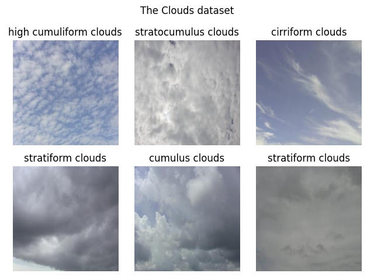
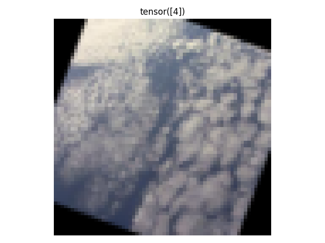
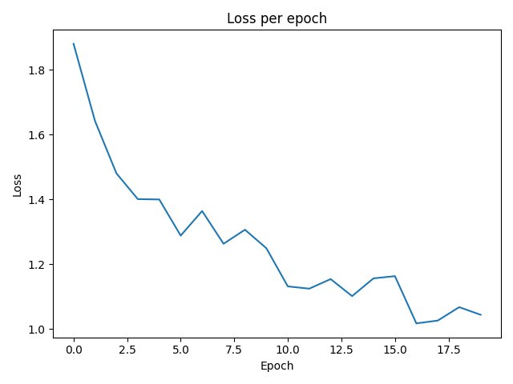
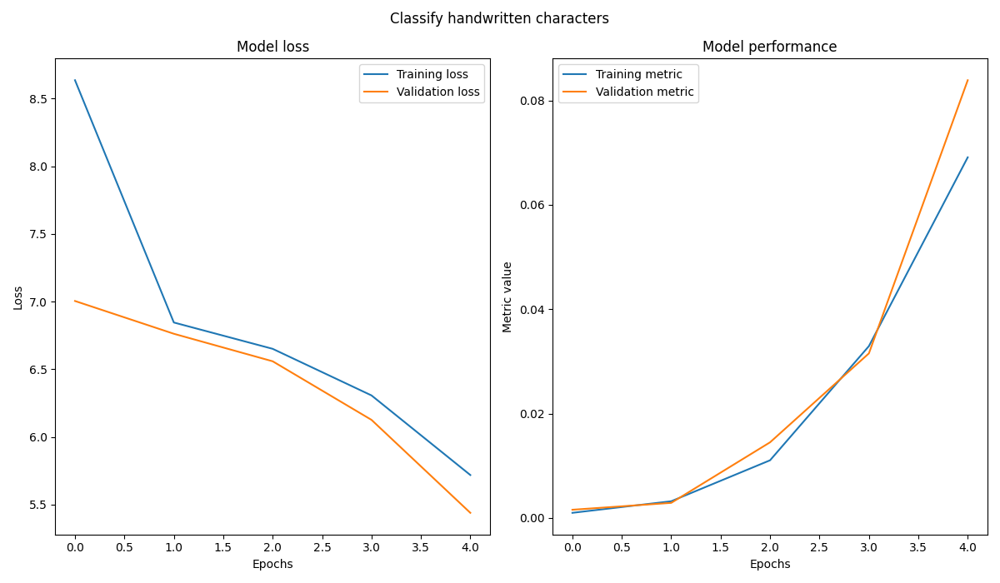
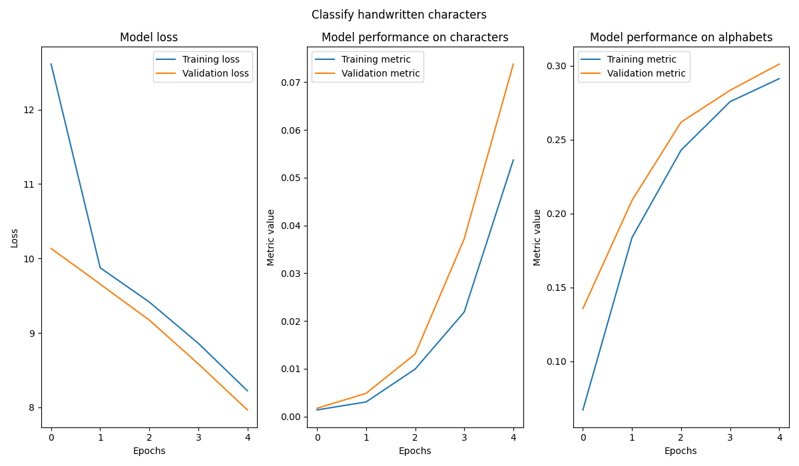

# 🎯 Goals for week 04

1. Create custom PyTorch datasets.
2. Work with convolutional neural networks (CNNs).
3. Practice building multi-input and multi-output models.
4. Practice writing high quality code:
   1. Easy to read.
   2. Safe from bugs.
   3. Ready for change.

## Task 01

**Description:**

Build a PyTorch Dataset for the water potability data. Define a class called `WaterDataset` that loads data from a CSV file. Store the data in a NumPy array. Create an object from this class, using the training data, and output:

- the number of instances;
- the fifth item in the data.

Then, create a `DataLoader` object and pass the dataset to it, shuffling it and breaking it down into batches of two. Output the first batch of features and labels from the `DataLoader` object.

**Acceptance criteria:**

1. The test case passes.

**Test case:**

```console
python task01.py
```

```console
Number of instances: 1508
Fifth item: (array([0.61088305, 0.52523539, 0.46561915, 0.47513312, 0.63433849,
       0.19640938, 0.62342348, 0.52058877, 0.75585562]), 0.0)
tensor([[0.3921, 0.4874, 0.4012, 0.5431, 0.6080, 0.4304, 0.5240, 0.3609, 0.5177],
        [0.6141, 0.3594, 0.7207, 0.3401, 0.5015, 0.5395, 0.5549, 0.5834, 0.4812]],
       dtype=torch.float64) tensor([1., 1.], dtype=torch.float64)
```

## Task 02

**Description:**

Build a model with three linear layers and ReLU activations in-between. Here's the model defined using `nn.Sequential()`. Your goal is to rewrite it using the `class-based` approach.

```python
net = nn.Sequential(
  nn.Linear(9, 16),
  nn.ReLU(),
  nn.Linear(16, 8),
  nn.ReLU(),
  nn.Linear(8, 1),
  nn.Sigmoid(),
)
```

For reproducibility after the imports and before any of the function declarations set the seed of `torch` to `42`.

Then create a `train_model` function that trains the neural network. It should accept the following as parameters:

- `dataloader_train`: a `DataLoader` object;
- `optimizer`: an object with an instantiated optimizer;
- `net`: an object with an instantiated neural network;
- `num_epochs`: a natural number, representing the number of epochs to train the neural network;
- `create_plot`: an optional parameter that if set to `True` will produce a line plot for the loss per epoch. Default value: `False`.

The function `train_model` should output the average loss per epoch. Use it to train the above model for `10` epochs with a learning rate of `0.001`. Compare the values of the loss when using `4` different optimizers:

- `SGD`;
- `RMSprop`;
- `Adam`;
- `AdamW`.

As a final step, use the `AdamW` optimizer to train the neural network with the above setup for `1000` epochs. Then evaluate it on the test set (`water_test.csv`) and output its `f1` score.

Research how to use and apply [`tqdm`](https://tqdm.github.io/) to show the training progress visually in the console.

In a comment, answer the question: *Does the model perform well?*. You may also compute other metrics (besides the `f1` score) to determine that.

**Acceptance criteria:**

1. The test case passes.
2. Naming conventions are used when importing the libraries. Refer to the examples in `notes.md`.
3. The package `tqdm` is used to show training progress.
4. A comment is written answering the question in the description.
5. The variable holding the loss function is named `criterion`.
6. The variable holding the optimizer is named `optimizer`.

**Test case:**

```console
python task02.py
```

```console
Using the SGD optimizer:
100%|█████████████████████████████████████████████████████████████████████████████████████████████████████████████████████████████████████████████████████████| 10/10 [00:00<00:00, 24.33it/s]
Average loss: 0.6805641366934069
Using the RMSprop optimizer:
100%|█████████████████████████████████████████████████████████████████████████████████████████████████████████████████████████████████████████████████████████| 10/10 [00:00<00:00, 23.98it/s]
Average loss: 0.6728743024581424
Using the Adam optimizer:
100%|█████████████████████████████████████████████████████████████████████████████████████████████████████████████████████████████████████████████████████████| 10/10 [00:00<00:00, 21.94it/s]
Average loss: 0.6711271806203386
Using the AdamW optimizer:
100%|█████████████████████████████████████████████████████████████████████████████████████████████████████████████████████████████████████████████████████████| 10/10 [00:00<00:00, 21.99it/s]
Average loss: 0.6688455635771181
100%|█████████████████████████████████████████████████████████████████████████████████████████████████████████████████████████████████████████████████████| 1000/1000 [00:44<00:00, 22.53it/s]
Average loss: 0.5930093977063516

F1 score on test set: 0.5508021116256714
```

and the following plot is created:



## Task 03

**Description:**

Our `Net` model is prone to the problems of unstable (vanishing or exploding) gradients. This task is about expanding its architecture to make it more immune to those problems.

Here's what we can do:

1. Substitute ReLU with ELU.
2. Improve the weight initialization by using the He (Kaiming) uniform initialization strategy, accounting for the correct values for the `nonlinearity` parameter. Look for the proper initializer in the `torch.nn.init` module. Since `elu` is not supported, for the layers that have this activation function, use the default value - `leaky_relu`.
3. Add batch normalization.

Apply the new model on the setup you created in `Task 2` (using the seed of `42`) and report the test set `f1` score.

Answer the following question in a comment:

Which of the following statements is true about batch normalization?

A. Adding batch normalization doesn't impact the number of parameters the model has to learn.
B. Batch normalization normalizes a layer's inputs to a standard normal distribution and passes these normalized values further.
C. Batch normalization effectively learns the optimal input distribution for each layer it precedes.

**Acceptance criteria:**

1. The test case passes.
2. The proper `nonlinearity` values are specified when using the initialization strategy.
3. The letter of the correct option is written in a comment.
4. F1 on test set is outputted.

**Test case:**

```console
python task03.py
```

```console
Using the SGD optimizer:
100%|█████████████████████████████████████████████████████████████████████████████████████████████████████████████████████████████████████████████████████████| 10/10 [00:00<00:00, 16.40it/s]
Average loss: 0.7231906765081529
Using the RMSprop optimizer:
100%|█████████████████████████████████████████████████████████████████████████████████████████████████████████████████████████████████████████████████████████| 10/10 [00:00<00:00, 13.84it/s]
Average loss: 0.6660845685743654
Using the Adam optimizer:
100%|█████████████████████████████████████████████████████████████████████████████████████████████████████████████████████████████████████████████████████████| 10/10 [00:00<00:00, 16.87it/s]
Average loss: 0.6405066689781016
Using the AdamW optimizer:
100%|█████████████████████████████████████████████████████████████████████████████████████████████████████████████████████████████████████████████████████████| 10/10 [00:00<00:00, 17.59it/s]
Average loss: 0.6218260192843735
100%|█████████████████████████████████████████████████████████████████████████████████████████████████████████████████████████████████████████████████████| 1000/1000 [00:56<00:00, 17.74it/s]
Average loss: 0.5319020461751744

F1 score on test set: 0.5141388177871704
```

and the following plot is created:



## Task 04

**Description:**

Try to create a better model than the one we obtained in the previous tasks. Things you could play around with:

- adding a validation set and tracking performance on it during training;
- batch size;
- activation functions;
- architecture:
  - more linear layers;
  - you could implement the famous `VGG` architectures: <https://viso.ai/deep-learning/vgg-very-deep-convolutional-networks/>. It's a model that's mainly used for image-related tasks but its architecture could inspire you to create your own twist that solves our problem.
- number of epochs;
- learning rates;
- etc., etc.

The above are just examples. There are numerous other things to try out.

**Treat this task as a playground for conducting experiments to understand what makes a good neural network.**

**Acceptance criteria:**

1. A training process that results in a model giving a higher per-class `F1` score on the test dataset.

## Task 05

**Description:**

Create a plot with `6` randomly chosen pictures from the training data of the clouds dataset. Do not set a seed, so that the result is different every time.

**Acceptance criteria:**

1. A figure is created with `6` randomly chosen pictures.
2. No seed it set.

**Test case:**

```console
python task05.py
```



## Task 06

**Description:**

Create the dataset for training the model. Compose the following `6` transformations:

1. Random horizontal flip.
2. Random vertical flip.
3. A rotation by a random angle between `0` and `45` degrees.
4. Random automatic contrast adjustment.
5. Parse the image to a tensor.
6. Resize the image to `64` by `64`.

Display the first image in the preprocessed dataset.

Define a convolutional neural network, consisting of two parts:

- A feature extractor that learns a vector of features from the input batch of images.
- A classifier that predicts the class for each image in the batch based on the learned features.

The feature extractor should comprise of the following:

- Two convolutional layers with sizes of filters equal to `3`:
  - the first creating `32` feature maps;
  - the second - `64`.
- Zero-padding of `1` tile on each border.
- Max pooling with size `2`.
- `ELU` activation functions.

The classifier should be a single linear layer.

Train the model for `20` epochs using:

- a batch size of `16`;
- the `AdamW` optimizer;
- a learning rate of `0.001`.

Output the average loss across training batches and across the epochs. Create a plot from the latter.

**Acceptance criteria:**

1. Preprocessing is applied to all images.
2. The variable holding the loss function is named `criterion`.
3. The architecture of the neural network matches its description.
4. `tqdm` is used to show the progression through the batches for every epoch.

**Test case:**

Due to randomness while shuffling and augmentation operations, your output may vary.

```console
python task06.py
```



```console
Epoch 1: 100%|████████████████████████████████████████████████████████████████████████████████████████████████████████████████████████████████████████████████| 30/30 [00:03<00:00,  8.94it/s]
Average training loss per batch: 1.8804709315299988
Epoch 2: 100%|████████████████████████████████████████████████████████████████████████████████████████████████████████████████████████████████████████████████| 30/30 [00:03<00:00,  9.65it/s]
Average training loss per batch: 1.6421570380528767
Epoch 3: 100%|████████████████████████████████████████████████████████████████████████████████████████████████████████████████████████████████████████████████| 30/30 [00:03<00:00,  9.74it/s]
Average training loss per batch: 1.4803926865259807
Epoch 4: 100%|████████████████████████████████████████████████████████████████████████████████████████████████████████████████████████████████████████████████| 30/30 [00:03<00:00,  9.67it/s]
Average training loss per batch: 1.4007591962814332
Epoch 5: 100%|████████████████████████████████████████████████████████████████████████████████████████████████████████████████████████████████████████████████| 30/30 [00:03<00:00,  9.34it/s]
Average training loss per batch: 1.3997631867726643
Epoch 6: 100%|████████████████████████████████████████████████████████████████████████████████████████████████████████████████████████████████████████████████| 30/30 [00:03<00:00,  8.53it/s]
Average training loss per batch: 1.2880900959173838
Epoch 7: 100%|████████████████████████████████████████████████████████████████████████████████████████████████████████████████████████████████████████████████| 30/30 [00:03<00:00,  9.61it/s]
Average training loss per batch: 1.3640881101290385
Epoch 8: 100%|████████████████████████████████████████████████████████████████████████████████████████████████████████████████████████████████████████████████| 30/30 [00:03<00:00,  9.56it/s]
Average training loss per batch: 1.2628552218278248
Epoch 9: 100%|████████████████████████████████████████████████████████████████████████████████████████████████████████████████████████████████████████████████| 30/30 [00:03<00:00,  9.50it/s]
Average training loss per batch: 1.3062392791112265
Epoch 10: 100%|███████████████████████████████████████████████████████████████████████████████████████████████████████████████████████████████████████████████| 30/30 [00:03<00:00,  9.41it/s]
Average training loss per batch: 1.2490018725395202
Epoch 11: 100%|███████████████████████████████████████████████████████████████████████████████████████████████████████████████████████████████████████████████| 30/30 [00:03<00:00,  9.58it/s]
Average training loss per batch: 1.1311754703521728
Epoch 12: 100%|███████████████████████████████████████████████████████████████████████████████████████████████████████████████████████████████████████████████| 30/30 [00:03<00:00,  9.67it/s]
Average training loss per batch: 1.124160369237264
Epoch 13: 100%|███████████████████████████████████████████████████████████████████████████████████████████████████████████████████████████████████████████████| 30/30 [00:03<00:00,  9.56it/s]
Average training loss per batch: 1.1537493507067362
Epoch 14: 100%|███████████████████████████████████████████████████████████████████████████████████████████████████████████████████████████████████████████████| 30/30 [00:03<00:00,  9.52it/s]
Average training loss per batch: 1.1011268635590872
Epoch 15: 100%|███████████████████████████████████████████████████████████████████████████████████████████████████████████████████████████████████████████████| 30/30 [00:03<00:00,  9.42it/s]
Average training loss per batch: 1.1560158749421439
Epoch 16: 100%|███████████████████████████████████████████████████████████████████████████████████████████████████████████████████████████████████████████████| 30/30 [00:03<00:00,  9.15it/s]
Average training loss per batch: 1.162852003177007
Epoch 17: 100%|███████████████████████████████████████████████████████████████████████████████████████████████████████████████████████████████████████████████| 30/30 [00:03<00:00,  9.55it/s]
Average training loss per batch: 1.0168438176314036
Epoch 18: 100%|███████████████████████████████████████████████████████████████████████████████████████████████████████████████████████████████████████████████| 30/30 [00:03<00:00,  9.57it/s]
Average training loss per batch: 1.0256097475687662
Epoch 19: 100%|███████████████████████████████████████████████████████████████████████████████████████████████████████████████████████████████████████████████| 30/30 [00:03<00:00,  9.00it/s]
Average training loss per batch: 1.0670619587103525
Epoch 20: 100%|███████████████████████████████████████████████████████████████████████████████████████████████████████████████████████████████████████████████| 30/30 [00:03<00:00,  9.41it/s]
Average training loss per batch: 1.0435174524784088
Average training loss per epoch: 1.2627965263525645
```



## Task 07

**Description:**

In this task we'll add more metrics to the process in `Task 06` and track how our model performs on the test set.

Firstly, let's log how much is the total time needed to train the model. Use the `time` module and more specifically the function `time.time()`.

Secondly, let's see how the model scores on the test set. Output the global macro precision, global macro recall as well as the global macro `F1` score. To get a clearer view of which class has the lowest `F1` score, output the `F1` scores per class, rounded to the fourth digit. Use the `pprint` module to output a more readable version of the dictionary with scores.

Analyze the results and write out your conclusions in a comment.

**Acceptance criteria:**

1. The time needed for data preparation is logged in seconds.
2. The following metrics are logged: global macro precision, global macro recall, global macro `F1` score, per-class `F1` score.
3. The module `pprint` is used.
4. A comment is written with an analysis of the results.

**Test case:**

Due to randomness while shuffling and augmentation operations, your output may vary.

```console
python task07.py
```

```console
Epoch 1: 100%|████████████████████████████████████████████████████████████████████████████████████████████████████████████████████████████████████████████████| 30/30 [00:03<00:00,  9.31it/s]
Average training loss per batch: 1.9962177197138469
Epoch 2: 100%|████████████████████████████████████████████████████████████████████████████████████████████████████████████████████████████████████████████████| 30/30 [00:03<00:00,  9.67it/s]
Average training loss per batch: 1.6752891023953755
Epoch 3: 100%|████████████████████████████████████████████████████████████████████████████████████████████████████████████████████████████████████████████████| 30/30 [00:03<00:00,  9.38it/s]
Average training loss per batch: 1.5002583344777425
Epoch 4: 100%|████████████████████████████████████████████████████████████████████████████████████████████████████████████████████████████████████████████████| 30/30 [00:03<00:00,  9.59it/s]
Average training loss per batch: 1.4287975907325745
Epoch 5: 100%|████████████████████████████████████████████████████████████████████████████████████████████████████████████████████████████████████████████████| 30/30 [00:03<00:00,  9.81it/s]
Average training loss per batch: 1.358592732747396
Epoch 6: 100%|████████████████████████████████████████████████████████████████████████████████████████████████████████████████████████████████████████████████| 30/30 [00:03<00:00,  9.61it/s]
Average training loss per batch: 1.2679957528909047
Epoch 7: 100%|████████████████████████████████████████████████████████████████████████████████████████████████████████████████████████████████████████████████| 30/30 [00:03<00:00,  9.80it/s]
Average training loss per batch: 1.4660948197046915
Epoch 8: 100%|████████████████████████████████████████████████████████████████████████████████████████████████████████████████████████████████████████████████| 30/30 [00:03<00:00,  9.76it/s]
Average training loss per batch: 1.4036619583765666
Epoch 9: 100%|████████████████████████████████████████████████████████████████████████████████████████████████████████████████████████████████████████████████| 30/30 [00:03<00:00,  9.29it/s]
Average training loss per batch: 1.191452964146932
Epoch 10: 100%|███████████████████████████████████████████████████████████████████████████████████████████████████████████████████████████████████████████████| 30/30 [00:03<00:00,  9.73it/s]
Average training loss per batch: 1.1919040143489839
Epoch 11: 100%|███████████████████████████████████████████████████████████████████████████████████████████████████████████████████████████████████████████████| 30/30 [00:03<00:00,  9.64it/s]
Average training loss per batch: 1.1105531851450603
Epoch 12: 100%|███████████████████████████████████████████████████████████████████████████████████████████████████████████████████████████████████████████████| 30/30 [00:03<00:00,  9.70it/s]
Average training loss per batch: 1.2726434310277304
Epoch 13: 100%|███████████████████████████████████████████████████████████████████████████████████████████████████████████████████████████████████████████████| 30/30 [00:03<00:00,  9.75it/s]
Average training loss per batch: 1.0501343568166097
Epoch 14: 100%|███████████████████████████████████████████████████████████████████████████████████████████████████████████████████████████████████████████████| 30/30 [00:03<00:00,  9.54it/s]
Average training loss per batch: 1.1131938139597575
Epoch 15: 100%|███████████████████████████████████████████████████████████████████████████████████████████████████████████████████████████████████████████████| 30/30 [00:03<00:00,  9.51it/s]
Average training loss per batch: 1.236708535750707
Epoch 16: 100%|███████████████████████████████████████████████████████████████████████████████████████████████████████████████████████████████████████████████| 30/30 [00:03<00:00,  9.56it/s]
Average training loss per batch: 1.0538346747557321
Epoch 17: 100%|███████████████████████████████████████████████████████████████████████████████████████████████████████████████████████████████████████████████| 30/30 [00:03<00:00,  9.62it/s]
Average training loss per batch: 1.0497526168823241
Epoch 18: 100%|███████████████████████████████████████████████████████████████████████████████████████████████████████████████████████████████████████████████| 30/30 [00:03<00:00,  9.12it/s]
Average training loss per batch: 1.0329633315404256
Epoch 19: 100%|███████████████████████████████████████████████████████████████████████████████████████████████████████████████████████████████████████████████| 30/30 [00:03<00:00,  9.71it/s]
Average training loss per batch: 1.052131285270055
Epoch 20: 100%|███████████████████████████████████████████████████████████████████████████████████████████████████████████████████████████████████████████████| 30/30 [00:03<00:00,  9.53it/s]
Average training loss per batch: 1.1012929062048593

Summary statistics:
Average training loss per epoch: 1.2776736563444138
Precision: 0.559047520160675
Recall: 0.5428035259246826
F1: 0.4866856336593628
Total time taken to train the model in seconds: 62.65556859970093

Per class F1 score
{'cirriform clouds': 0.0488,
 'clear sky': 0.6066,
 'cumulonimbus clouds': 0.3478,
 'cumulus clouds': 0.5464,
 'high cumuliform clouds': 0.552,
 'stratiform clouds': 0.881,
 'stratocumulus clouds': 0.4242}
```

## Task 08

**Description:**

Try to create a better model than the one we obtained in the previous tasks. Things you could play around with:

- adding a validation set and tracking performance on it during training;
- batch size;
- image size;
- activation functions;
- architecture:
  - adding batch normalization;
  - more linear layers;
  - more convolutional layers;
  - more feature maps produced;
  - you could implement the famous `VGG` architectures: <https://viso.ai/deep-learning/vgg-very-deep-convolutional-networks/>.
- different augmentation techniques;
- number of epochs;
- learning rates;
- etc., etc.

The above are just examples. There are numerous other things to try out.

**Treat this task as a playground for conducting experiments to understand what makes a good neural network.**

**Acceptance criteria:**

1. A training process that results in a model giving a higher per-class `F1` score on the test dataset.

## Task 09

**Description:**

Build a custom dataset for the Omniglot training and testing data.

The constructor should accept:

- a path to the folder, containing the images;
- a chained composition of transformations as provided by `torchvision.transforms`.

When indexing the dataset object, it should return a tuple with three elements:

- the transformed image of the character at that index as a PyTorch tensor;
- the one-hot encoding of the alphabet the character comes from;
- the label of the hard-written character.

The method `len` should return the number of samples in the dataset.

To try out the custom class, load the training set, applying the following transformations:

- converting the loaded `PIL` objects into tensors;
- resizing the tensors to `64x64`.

Output the number of instances in the training set, the **last** entry in it and the shape of the image in the last entry.

**Acceptance criteria:**

1. The dataset object can be indexed. Each call returns a tuple.
2. The length of the dataset object can be taken.
3. A chain of transformations be applied to the images.

**Test case:**

```console
python task09.py
```

```console
Number of instances: 14400
Last item: (tensor([[[1., 1., 1.,  ..., 1., 1., 1.],
         [1., 1., 1.,  ..., 1., 1., 1.],
         [1., 1., 1.,  ..., 1., 1., 1.],
         ...,
         [1., 1., 1.,  ..., 1., 1., 1.],
         [1., 1., 1.,  ..., 1., 1., 1.],
         [1., 1., 1.,  ..., 1., 1., 1.]]]), tensor([0., 0., 0., 0., 0., 0., 0., 0., 0., 0., 0., 0., 0., 0., 0., 0., 0., 0.,
        0., 0., 0., 0., 0., 0., 0., 0., 0., 0., 0., 1.]), 963)
Shape of the last image: torch.Size([1, 64, 64])
```

## Task 10

**Description:**

Create the model discussed in `notes.md` to classify an image of a handwritten character into one of the `964` classes.

Play around with:

- The architecture: number of neurons and type of layers.
- Parameter initialization.
- The number of epochs.
- The batch size.
- The learning rate.
- The choice of optimizer.

Plot the average training and validation losses every epoch and a metric of choice. Because it's hard to split this dataset into a validation and testing subsets, use the `omniglot_test` subset as a validation set. We won't have a test set for this task.

In addition, plot the most appropriate metric for the task of choice on the training and validation sets.

Try to create the best possible model.

**Acceptance criteria:**

1. The network is defined using the class-based approach. `nn.Sequential` is not used.
2. The network has two internal networks that process the image and label-encoded alphabet correspondingly.
3. The most appropriate metic for the task is chosen.

**Test case:**

The below outputs were obtained using a test model - the output should show you the structure of the output. Due to differences in architecture, your output may be different.

```console
python task10.py
```

```console
100%|█████████████████████████████████████████████████████████████████████████████████████████████████████████████████████████████████████████████████████████| 29/29 [00:30<00:00,  1.05s/it]
100%|█████████████████████████████████████████████████████████████████████████████████████████████████████████████████████████████████████████████████████████| 24/24 [00:18<00:00,  1.30it/s]
Epoch [1/5]:
 Average training loss: 8.635514242895718
 Average validation loss: 7.003970166047414
 Training metric score: 0.0009722222457639873
 Validation metric score: 0.0015639147022739053
100%|█████████████████████████████████████████████████████████████████████████████████████████████████████████████████████████████████████████████████████████| 29/29 [00:28<00:00,  1.03it/s]
100%|█████████████████████████████████████████████████████████████████████████████████████████████████████████████████████████████████████████████████████████| 24/24 [00:16<00:00,  1.47it/s]
Epoch [2/5]:
 Average training loss: 6.845109725820607
 Average validation loss: 6.761820773283641
 Training metric score: 0.0031944443471729755
 Validation metric score: 0.002880895510315895
100%|█████████████████████████████████████████████████████████████████████████████████████████████████████████████████████████████████████████████████████████| 29/29 [00:27<00:00,  1.04it/s]
100%|█████████████████████████████████████████████████████████████████████████████████████████████████████████████████████████████████████████████████████████| 24/24 [00:16<00:00,  1.46it/s]
Epoch [3/5]:
 Average training loss: 6.650477540904078
 Average validation loss: 6.558390200138092
 Training metric score: 0.011041666381061077
 Validation metric score: 0.014486788772046566
100%|█████████████████████████████████████████████████████████████████████████████████████████████████████████████████████████████████████████████████████████| 29/29 [00:27<00:00,  1.05it/s]
100%|█████████████████████████████████████████████████████████████████████████████████████████████████████████████████████████████████████████████████████████| 24/24 [00:17<00:00,  1.40it/s]
Epoch [4/5]:
 Average training loss: 6.306156618841763
 Average validation loss: 6.125509778658549
 Training metric score: 0.03291666507720947
 Validation metric score: 0.031525228172540665
100%|█████████████████████████████████████████████████████████████████████████████████████████████████████████████████████████████████████████████████████████| 29/29 [00:27<00:00,  1.04it/s]
100%|█████████████████████████████████████████████████████████████████████████████████████████████████████████████████████████████████████████████████████████| 24/24 [00:16<00:00,  1.44it/s]
Epoch [5/5]:
 Average training loss: 5.717926617326407
 Average validation loss: 5.438516616821289
 Training metric score: 0.06909722089767456
 Validation metric score: 0.08387521654367447
```

and the following plot is created:



## Task 11

**Description:**

Let's now make slight changes in the process (dataset, network, etc) so that we can use the same dataset, but now we're going to make the model predict the label of the character in the image and the alphabet it comes from.

Try to create the best possible model.

**Acceptance criteria:**

1. Appropriate changes are made to the model architecture, so that it becomes single-input, multi-output.

**Test case:**

The below outputs were obtained using a test model - the output should show you the structure of the output. Due to differences in architecture and weight initialization, your output may be different.

```console
python task11.py
```

```console
100%|█████████████████████████████████████████████████████████████████████████████████████████████████████████████████████████████████████████████████████████| 29/29 [00:39<00:00,  1.35s/it]
100%|█████████████████████████████████████████████████████████████████████████████████████████████████████████████████████████████████████████████████████████| 24/24 [00:19<00:00,  1.23it/s]
Epoch [1/5]:
 Average training loss: 12.609868871754614
 Average validation loss: 10.134438514709473
 Training metric score characters: 0.0013888889225199819
 Validation metric score characters: 0.0017285373760387301
 Training metric score alphabets: 0.06715277582406998
 Validation metric score alphabets: 0.13573133945465088
100%|█████████████████████████████████████████████████████████████████████████████████████████████████████████████████████████████████████████████████████████| 29/29 [00:35<00:00,  1.23s/it]
100%|█████████████████████████████████████████████████████████████████████████████████████████████████████████████████████████████████████████████████████████| 24/24 [00:22<00:00,  1.09it/s]
Epoch [2/5]:
 Average training loss: 9.875058996266333
 Average validation loss: 9.655383825302124
 Training metric score characters: 0.0030555555131286383
 Validation metric score characters: 0.004856366664171219
 Training metric score alphabets: 0.18368054926395416
 Validation metric score alphabets: 0.2088237702846527
100%|█████████████████████████████████████████████████████████████████████████████████████████████████████████████████████████████████████████████████████████| 29/29 [00:33<00:00,  1.15s/it]
100%|█████████████████████████████████████████████████████████████████████████████████████████████████████████████████████████████████████████████████████████| 24/24 [00:18<00:00,  1.32it/s]
Epoch [3/5]:
 Average training loss: 9.414977698490537
 Average validation loss: 9.172844807306925
 Training metric score characters: 0.009930555708706379
 Validation metric score characters: 0.013087497092783451
 Training metric score alphabets: 0.24284721910953522
 Validation metric score alphabets: 0.26183223724365234
100%|█████████████████████████████████████████████████████████████████████████████████████████████████████████████████████████████████████████████████████████| 29/29 [00:30<00:00,  1.06s/it]
100%|█████████████████████████████████████████████████████████████████████████████████████████████████████████████████████████████████████████████████████████| 24/24 [00:17<00:00,  1.35it/s]
Epoch [4/5]:
 Average training loss: 8.860261062095905
 Average validation loss: 8.583840469519297
 Training metric score characters: 0.02187499962747097
 Validation metric score characters: 0.03720470890402794
 Training metric score alphabets: 0.27569442987442017
 Validation metric score alphabets: 0.2833978235721588
100%|█████████████████████████████████████████████████████████████████████████████████████████████████████████████████████████████████████████████████████████| 29/29 [00:29<00:00,  1.03s/it]
100%|█████████████████████████████████████████████████████████████████████████████████████████████████████████████████████████████████████████████████████████| 24/24 [00:19<00:00,  1.26it/s]
Epoch [5/5]:
 Average training loss: 8.222758490463782
 Average validation loss: 7.966013928254445
 Training metric score characters: 0.053680554032325745
 Validation metric score characters: 0.07375092804431915
 Training metric score alphabets: 0.29124999046325684
 Validation metric score alphabets: 0.30109474062919617
```

and the following plot is created:


