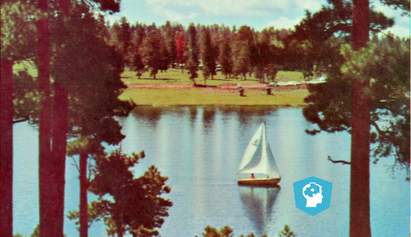
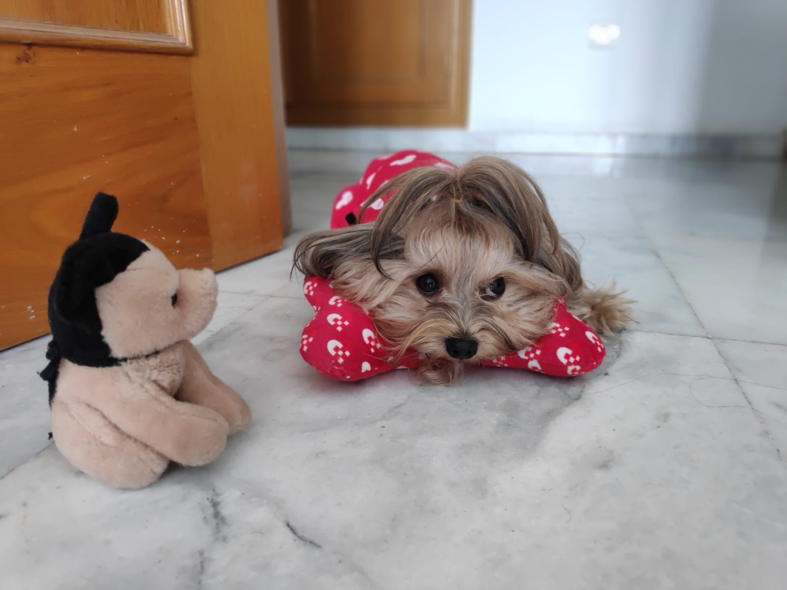
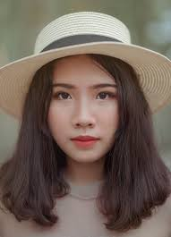
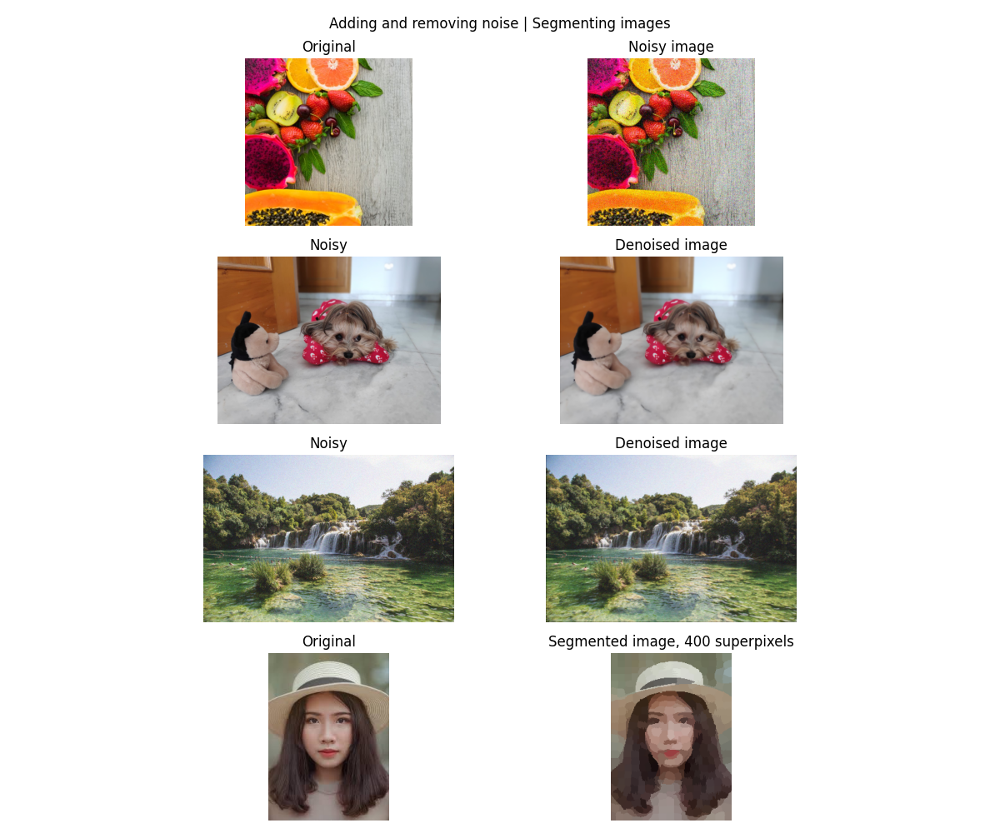
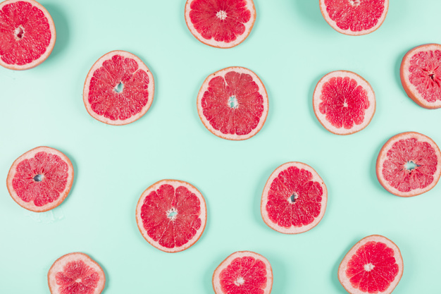
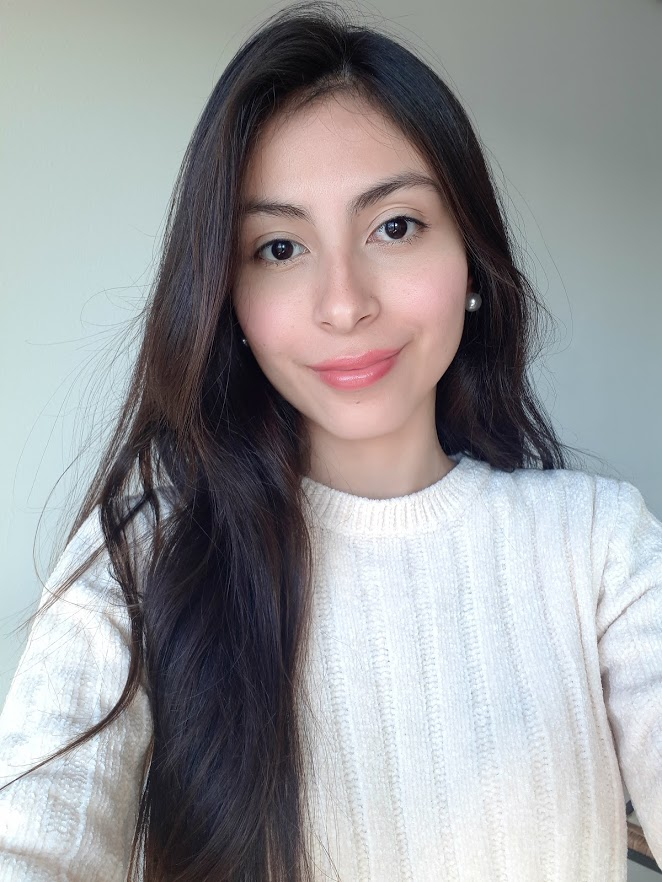

# 🎯 Goals for week 05

1. Perform image segmentation using histograms and global and local threshold.
2. Find contours and edges in images.
3. Practice writing high quality code:
   1. Easy to read.
   2. Safe from bugs.
   3. Ready for change.

## Task 01

**Description:**

Load [the Rocket image](https://scikit-image.org/docs/stable/api/skimage.data.html#skimage.data.rocket).

Create a figure with `4` plots:

- on the first row of images, display it in its original form and after converting it to grayscale;
- on the second row of images, display the original image flipped horizontally and vertically;

Create a figure with `9` plots:

- on the first row of images, display the three color channels;
- on the second row of images, display the intensities of the three color channels;
- on the third row of images, display the histograms of the three color channels;

**Acceptance criteria:**

1. The test case matches your output entirely.
2. Two figures are created.

**Test case:**

```console
python task01.py
```


## Task 02

**Description:**

In our data folder you'll find the following pictures:

- Chess Pieces:


- Text page:


- Fruits:


- Shapes:


Perform the following thresholding operations:

1. Otsu thresholding and local thresholding on the chess pieces and text page pictures. Experiment with different block sizes and offsets.
2. Try multiple algorithms on the fruits picture. In a comment write down which one is most appropriate.
3. Apply appropriate thresholding (only local or only global - as you deem most appropriate) on the shapes picture.

**Acceptance criteria:**

1. A comment is written with the most appropriate thresholding algorithm to apply on the fruits picture.
2. Three figures are generated for each of the points.

**Test case:**

Due to different block sizes and offset, your output may vary.

```console
python task02.py
```


## Task 03

**Description:**

In our data folder you'll find the following pictures:

- Soaps:


- Buildings:


- Chest X-ray:


- Aerial:


Apply the following transformations:

1. Edge detection. Use the picture with soaps.
2. Gaussian filter. Use the picture with the building.
3. Standard histogram equalization. Use the X-ray image and the aerial image.
4. CLAHE. Use the [built-in coffee image](https://scikit-image.org/docs/stable/api/skimage.data.html#skimage.data.coffee).

**Acceptance criteria:**

1. An appropriate filter is used for edge detection.
2. An appropriate filter is used for image blurring.
3. Standard histogram equalization is applied.
4. CLAHE is applied.

**Test case:**

Due to filter selection and parameter specification, your output may vary.

```console
python task03.py
```


## Task 04

**Description:**

In our data folder you'll find the following pictures:

- Capital-case `R`:


- World map:


Apply appropriate image morphology transformations to remove the noise from the images. Output one figure with 4 graphs showing the comparison.

**Acceptance criteria:**

1. Appropriate image morphology transformations are applied.
2. One figure with four graphs is outputted.

**Test case:**

Due to differences in the structuring elements, your outputs may vary.

```console
python task04.py
```


## Task 05

**Description:**

In our data folder you'll find the following pictures:

- Damaged photo of an astronaut:


- Image with logo:



Apply appropriate techniques to restore the damaged photo and remove the logo from the second picture. Output one figure with 4 graphs showing the comparison.

**Acceptance criteria:**

1. Appropriate image restoration transformations are applied.
2. One figure with four graphs is outputted.

**Test case:**

```console
python task05.py
```


## Task 06

**Description:**

In our data folder you'll find the following pictures:

- Fruits:


- Dog:



- Landscape:


- Lady:



Apply appropriate techniques to:

- add noise to the first image;
- remove noise from the second and third images. We want to preserve the edges only in the third image;
- segment the fourth image into 400 regions.

Output one figure with 8 graphs showing the comparisons.

**Acceptance criteria:**

1. Appropriate techniques are applied.
2. One figure with eight graphs is outputted.

**Test case:**

```console
python task06.py
```



## Task 07

**Description:**

In `scikit-image` there is a built-in binary image of a horse:


In our data folder you'll find an RGB image of dice:


Find and display the contours of both images and output the number of dots in the dice. Note that because the contours are lines, you would need to plot them manually. You could create a separate function for that.

**Acceptance criteria:**

1. A figure with four plots is outputted.
2. There is a console log of the number of dots in the dice.

**Test case:**

Depending on the filter you choose, your output may vary.

```console
python task07.py
```

```console
Number of dots in dice: 9.
```


## Task 08

**Description:**

In our data folder you'll find the following images:

- Grapefruits:



- Building:


Apply canny edge detection on the first image. Compare the results when changing the value of the parameter `sigma`. Use `0.8`, `1`, `1.8` and `2.2`.

Apply corner detection on the second image. Compare the results when changing the value of the parameters `min_distance` and `threshold_rel`. Use `10, 0.01`, `10, 0.02`, `20, 0.03` and `60, 0.02`. Output the total number of corners for each combination.

**Acceptance criteria:**

1. One figure with ten plots is produced.
2. The correct values for the parameter `sigma` are used when applying edge detection.
3. The correct values for the parameters `min_distance` and `threshold_rel` are used when applying corner detection.

**Test case:**

```console
python task08.py
```

```console
With min_distance=10 and threshold_rel=0.01 we detect a total 91 corners in the image.
With min_distance=10 and threshold_rel=0.02 we detect a total 89 corners in the image.
With min_distance=20 and threshold_rel=0.03 we detect a total 65 corners in the image.
With min_distance=60 and threshold_rel=0.02 we detect a total 20 corners in the image.
```


## Task 09

**Description:**

In our data folder you'll find the following images:

- A person at night:


- Friends:


- Profile:



Apply face detection and output the detected faces. Apply superpixel segmentation and obtain `100` segments on the third image.

Output one figure with all detected faces as plots in it. Because the number of plots per row is not equal between the rows, you'll have to set some of the axes to not be visible. This can be done via the method `set_visible` of an axis. Pass `False` and the plot will not be shown in the final figure (example: `axs[1][0].set_visible(False)`).

**Acceptance criteria:**

1. All detected faces are outputted on a single figure.
2. The third image is broken down into `100` segments using superpixel segmentation.

**Test case:**

Due to differences in the values you set for various parameters, your output may vary.

```console
python task09.py
```


## Task 10

**Description:**

In our data folder you'll find the following images:

- Music group:


- Graduation:


Blur the faces in the first image.

The second image is corrupted and we need to fix it:

1. Rotate the image.
2. Apply noise reduction.
3. Some parts of the image are missing. Reconstruct those damaged parts.

**Acceptance criteria:**

1. All faces in the first image are blurred.
2. Rotation is applied on the second image.
3. Noise reduction is applied on the second image.
4. Reconstruction of the missing parts is applied on the second image.

**Test case:**

Due to differences in the values you set for various parameters, your output may vary.

```console
python task10.py
```


