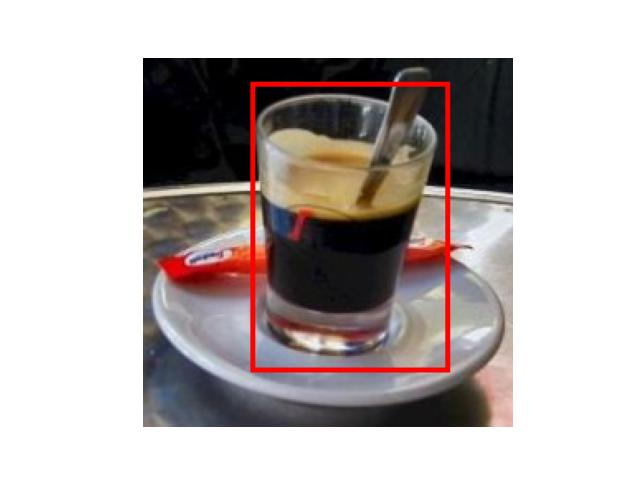

# 🎯 Goals for week 06

1. Practice defining neural networks for binary and multiclass image classification.
2. Practice defining neural networks for object detection.
3. Practice writing high quality code:
   1. Easy to read.
   2. Safe from bugs.
   3. Ready for change.

## Task 01

**Description:**

Create two convolutional neural networks.

The first network should be able to perform **binary** classification on **`RGB`** images that have a resolution of `64x64`.

The second network should be able to perform **multiclass** classification on **`RGB`** images that have a resolution of `64x64`. Do not hard-code the number of classes. The user of the network should be able to set them.

Initialize objects from both networks and output the total number of parameters in them. Then, add a new convolutional layer and activation to the binary classifier. The updated model will pass its input first through its initial CNN layer and then through the new one. Outputs the new total number of parameters. Also, output the new model.

The goal of this task is to define the architectures and show how new modules can be added to an already created network. Whether you apply the networks in any training process and on any data is out of the scope of this task, but is encouraged.

**Acceptance criteria:**

1. A convolutional neural network is defined that can classify images into two classes.
2. A convolutional neural network is defined that can classify images into a user-specified number of classes.
3. Both architectures include the typical layers convolutional neural networks have.
4. The total number of parameters in each of the networks is outputted.
5. A new convolutional layer with an activation function is added the binary classifier. The new layer and activation should go after the initial convolutional layer and activation. They should not be last.

**Test case:**

Due to differences in the architectures, your output may vary.

```console
python task01.py
```

```console
Number of parameters in CNN for binary classification: 16,833
Number of parameters in CNN for multiclass classification (4 classes): 65,988
Number of parameters in CNN for binary classification with two convolutional layers: 82,385
<output the new model by calling print on the Python object>
```

## Task 02

**Description:**

Let's do another playground-type task for conducting experiments to understand what makes a good convolutional neural network.

We'll leverage transfer learning to compare multiple models on the task of brain tumor multiclass classification. When we are satisfied with their architectures we'll save the final models as `.pt` files.

In our `DATA` folder you'll find the archive `brain_tumor_dataset`. It contains MRI scans of varying dimensions and resolutions of the brain, categorized into four classes:

- [Glioma](https://en.wikipedia.org/wiki/Glioma);
- [Meningioma](https://en.wikipedia.org/wiki/Meningioma);
- [Pituitary](https://en.wikipedia.org/wiki/Pituitary_adenoma);
- No Tumor for healthy scans.

Follow the standard process for creating, training and evaluation at least four deep learning models.

- The first model should be a custom-made one without using any pre-trained architecture.
- The second and third models should be building-up on the famous [`Inception V3`](https://pytorch.org/vision/stable/models/inception.html#inception-v3) and [`VGG 11`](https://pytorch.org/vision/stable/models/vgg.html#vgg) models (in whatever order you decide).
- The fourth model should be something from your choice that is also [built-in PyTorch](https://pytorch.org/vision/stable/models.html#models-and-pre-trained-weights).
- Comparing additional models is encouraged though not strictly part of this task.

Before you start modelling the data make sure you perform:

- data splitting: from the dataset folder, labelled `Testing`, perform random shuffling and splitting to obtain `validation` and `testing` sets.
- exploratory data analysis:
  - show `5` images of each class;
  - show the class distribution in all three sets;
  - any other technique that will be useful for this task.
- image augmentations: we learned a lot of techniques for this - now is the time to show how applying them can lead to better models.

Use `tqdm` to show training, validation and testing progression through epochs. Compare the final models using (multiple) appropriate metrics and save them as `.pt` files. After you save them, load them from the saved files and repeat the evaluation procedure to demonstrate that the loaded models are same as the ones that were initially trained. Also output `5` images and how each of them is classified by all the models you have loaded.

**Acceptance criteria:**

1. Exploratory data analysis is performed.
2. Appropriate image augmentation techniques are applied.
3. A comparison is made between the pre-trained models `Inception V3` and `VGG 11`.
4. `Inception V3` and `VGG 11` are compared to a third model that the student chooses.
5. `tqdm` is used to visualize model training, validation and testing.
6. The training dataset is used to form a validation set.
7. The testing dataset is used to obtain the final metrics from each model.
8. Transfer learning is used to tweak the outputs of the models for the given task.
9. All newly obtained (and trained) models are saved as `.pt` files with appropriate names.
10. Appropriate metrics are used given the distribution of the data.
11. The saved models are loaded and the evaluation procedure is repeated to showcase that the saved models are the same as the ones that were initially trained.
12. A plot is created that shows how each of the created models classifies `5` randomly chosen images.

## Task 03

**Description:**

Draw a bounding box around the below espresso shot. Load the image (`DATA/w06_task03_start.jpeg`) and apply a transformation to resize it to a square with `224` pixels on each side before drawing the box.


**Acceptance criteria:**

1. The image preprocessing operations in the description are applied.
2. A bounding box is drawn around the espresso shot.

**Test case:**

Due to differences in the coordinates you specify, your output may vary.

```console
python task03.py
```



## Task 04

**Description:**

In our `DATA` folder you'll find the dataset `car_bee_detection`. It contains images of cars, bees, hornets and images in which none of these are present. In each subfolder there is an `_annotation` file that maps each image the bounding boxes and object classes.

Create and compare at least three object detection models that perform **car detection** using the `car_bee_detection` dataset.

- The first model should be based on a `R-CNN` model.
- The second model should be based on a `Faster R-CNN` model.
- The third model should be based on the [YOLO family](https://en.wikipedia.org/wiki/You_Only_Look_Once), for example [YOLOv5](https://pytorch.org/hub/ultralytics_yolov5/).
- Comparing additional models is encouraged though not strictly part of this task.

Before you start modelling the data make sure you perform:

- exploratory data analysis:
  - show `5` images of each class;
  - show the class distribution in the training set. The validation and test sets all should have only cars in them.
- image augmentations: we learned a lot of techniques for this - now is the time to show how applying them can lead to better models.

Use `tqdm` to show training, validation and testing progression through epochs. Compare the final models using (multiple) appropriate metrics and save them as `.pt` files. After you save them, load them from the saved files and output `5` images and how each of them is processed by all the models you have loaded.

**Acceptance criteria:**

1. Exploratory data analysis is performed.
2. Appropriate image augmentation techniques are applied.
3. A comparison is made between the models based on `R-CNN`, `Faster R-CNN` and `YOLO`.
4. `tqdm` is used to visualize model training, validation and testing.
5. The testing dataset is used to obtain the final metrics from each model.
6. Transfer learning is used to tweak the outputs of the models for the given task.
7. All newly obtained (and trained) models are saved as `.pt` files with appropriate names.
8. Appropriate metrics are used to evaluate each model.
9. A plot is created that shows the output of the created models on `5` randomly chosen images from the `test` set.
