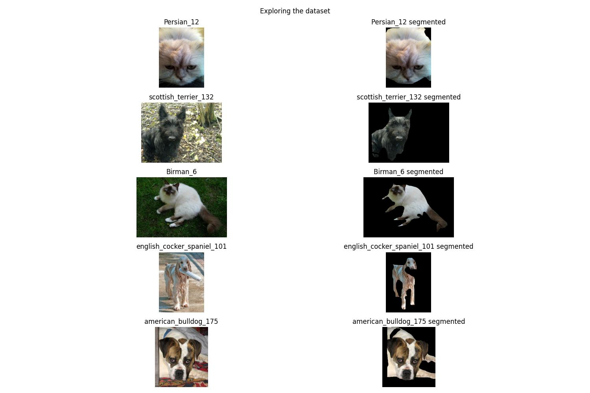
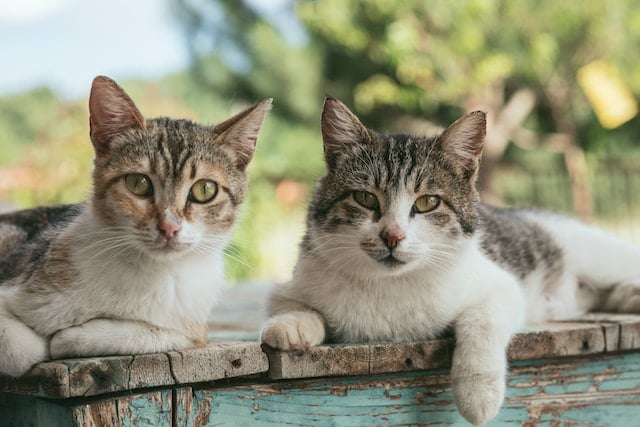
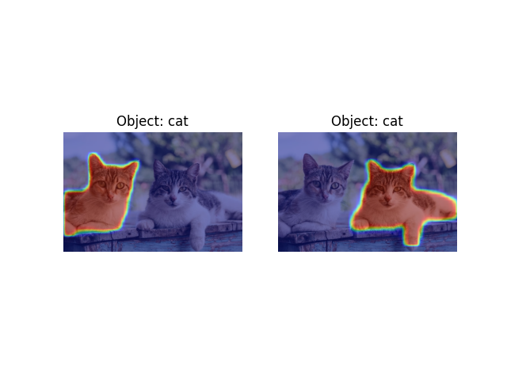

# 🎯 Goals for week 07

1. Practice defining neural networks for image segmentation.
2. Practice writing high quality code:
   1. Easy to read.
   2. Safe from bugs.
   3. Ready for change.

## Task 01

**Description:**

Load the dataset `segmentation_cats_dogs`, sample `5` randomly chosen images and segment out the objects present in them.

**Acceptance criteria:**

1. A figure is generated with `5` randomly chosen pictures.
2. The objects in the pictures are segmented out.
3. Labels and titles are present as shown in the test case.
4. New images are generated on every run of the script.

**Test case:**

Due to randomness, your output may vary.

```console
python task01.py
```



## Task 02

**Description:**

Perform instance segmentation on the following image (present in `DATA/w07_task02.jpg`) with a pre-trained Mask R-CNN.



Output the predicted categories as present in the COCO dataset (and discussed in `notes.md`) and their associated scores for the top two masks.

Obtain and plot the soft masks of the recognized objects.

**Acceptance criteria:**

1. The predicted categories and their associated scores for the top two masks are outputted.
2. The predicted categories are obtained by using the list of classes in the COCO dataset, discussed in `notes.md`.
3. The probabilities are rounded to the `4` digit.
4. A single figure with `2` soft masks is displayed.

**Test case:**

```console
python task02.py
```

```console
Object with highest confidence (0.9979) is "cat".
Second object with highest confidence (0.9951) is "cat".
```



## Task 03

**Description:**

Let's define a convolutional block as a sequence of `2` pairs of convolutional and `ReLU` layers. One convolutional block is therefore:

1. A convolution from `in_channels` channels / feature maps to `out_channels` channels / feature maps.
2. `ReLU` applied on the output of `1.`.
3. A convolution from `out_channels` channels / feature maps to `out_channels` channels / feature maps applied on the output of `2.`.
4. `ReLU` applied on the output of `3.`.

Define a U-Net with the following architecture:

- An initial block of convolutions to transform the input channels into `64` feature maps.
- An encoder with `3` convolutional blocks:
  - block `1`: takes `64` channels, outputs `128` channels.
  - block `2`: takes `128` channels, outputs `256` channels.
  - block `3`: takes `256` channels, outputs `512` channels.
- Appropriate pooling layers between the convolutional blocks in the encoder.
- A decoder with `3` convolutional blocks:
  - block `1`: takes `512` channels, outputs `256` channels.
  - block `2`: takes `256` channels, outputs `128` channels.
  - block `3`: takes `128` channels, outputs `64` channels.
- Appropriate transposed convolutions between the convolutional blocks in the decoder.
- A final convolutional layer to transform the `64` feature maps into the output channels.
- Appropriate skip connections.

Create the neural network and instantiate an object that takes in `16` channels and outputs `5`. Output its total number of parameters.

**Acceptance criteria:**

1. A U-Net architecture is implemented.
2. The total number of parameters in an object from this network is printed to the console.
3. The `forward` method of the network is also defined.

**Test case:**

```console
python task03.py
```

```console
Total number of parameters in UNet(16, 5): 7,705,093
```

## Task 04

**Description:**

Define a neural network with the U-Net architecture that solves the task of semantic segmentation on the dataset `segmentation_cats_dogs`.

**Acceptance criteria:**

1. A U-Net architecture is implemented.
2. Appropriate metrics are displayed.
3. `tqdm` is used to show the training, validation and testing processes.
4. Train-validation-test datasets are created.

## Task 05

**Description:**

Define a neural network that solves the task of panoptic segmentation on the dataset `relabelled_coco`. It is present in our `DATA` folder and you'll find a subfolder `masks` in it as well as a `JSON` file with metainformation. Load and explore the `JSON` file. You'll see it has several keys, among them:

- `images`: holds the maps between the images in the `COCO` dataset and their corresponding masks. Use the `images` folder to load the corresponding images.
- `annotations`: holds the segmentation maps / masks of each image and maps them to the classes.
- `categories`: all classes and what they mean.

Use the approach we discussed in class to perform panoptic segmentation. You can check out available pretrained models in the [PyTorch hub](https://pytorch.org/hub/) and in [Torchvision](https://pytorch.org/vision/main/models).

**Acceptance criteria:**

1. Appropriate metrics are displayed.
2. `tqdm` is used to show the training, validation and testing processes.
3. Train-validation-test datasets are created.
4. The approach discussed in class is used.
