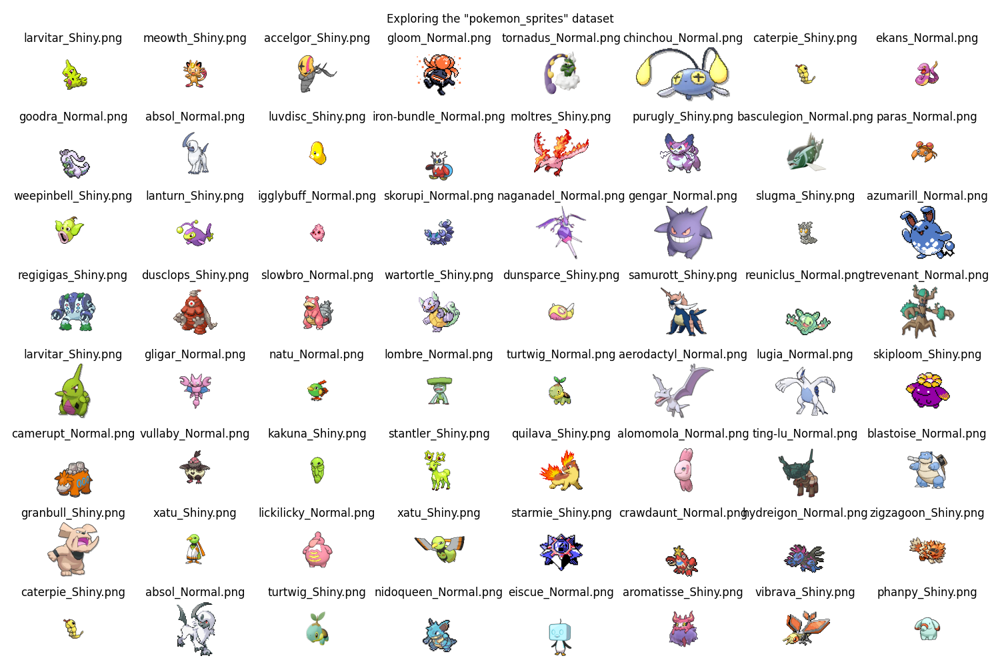

# 🎯 Goals for week 08

1. Practice defining, training, evaluating and improving generative adversarial neural networks.
2. Practice writing high quality code:
   1. Easy to read.
   2. Safe from bugs.
   3. Ready for change.

## Task 01

**Description:**

Load the dataset `pokemon_sprites` and output `64` randomly chosen instances in an `8x8` grid.

**Acceptance criteria:**

1. An `8x8` grid is generated.
2. Images are randomly chosen.
3. The class of each image is the title of its subplot.

**Test case:**

Due to randomness while sampling, your output may vary.



## Task 02

**Description:**

Define three variants of `Generator` - `Discriminator` pairs as discussed in `notes.md`:

- First one uses regular `Linear` layers and no convolutions.
- The second one replaces the `Linear` layers with convolutional ones, but not adhere to the `DCGAN` architecture guidelines.
- The third one uses convolutional layers adhering to the `DCGAN` architecture guidelines.

Instantiate an object from each of the three variants. Output their total number of parameters.

> **Note:** This task is only about creating the architectures, not about training/using them.

**Acceptance criteria:**

1. The architectures of all three pairs of `Generator` - `Discriminator` classes match the ones shown in `notes.md`.
2. The total number of parameters is outputted.

**Test case:**

Due to differences in the number of input and output dimensions, your output may vary.

```console
python task02.py
```

```console
Number of total parameters in Generator (linear only): 734,528.
Number of total parameters in Discriminator (linear only): 722,945.

Number of total parameters in Generator (conv layer, not following guidelines): 10,933,528.
Number of total parameters in Discriminator (conv layer, not following guidelines): 10,884,865.

Number of total parameters in Generator (DCGAN architecture): 385,012,995.
Number of total parameters in Discriminator (DCGAN architecture): 303,469,057.
```

## Task 03

**Description:**

Using the GAN with linear layers only, create a program (training, evaluation and testing included) that outputs new images of Pokemons using the dataset `pokemon_sprites`.

Sample and show `9` new images from the trained model.

**Acceptance criteria:**

1. The architectures uses only linear layers.
2. `tqdm` is used to show training, validation and testing.
3. An appropriate metric is used to evaluate model performance.
4. `9` new images are sampled from the trained model.

## Task 04

**Description:**

Define a GAN with convolutional layers, but not adhering to the DCGAN guidelines.

Using it create a program (training, evaluation and testing included) that outputs new images of Pokemons using the dataset `pokemon_sprites`.

Sample and show `9` new images from the trained model.

**Acceptance criteria:**

1. The architectures uses convolutional layers.
2. The architecture is naive in that it does not adhere to the DCGAN guidelines.
3. `tqdm` is used to show training, validation and testing.
4. An appropriate metric is used to evaluate model performance.
5. `9` new images are sampled from the trained model.

## Task 05

**Description:**

Define and use a DCGAN to create a program (training, evaluation and testing included) that outputs new images of Pokemons using the dataset `pokemon_sprites`.

Sample and show `9` new images from the trained model.

**Acceptance criteria:**

1. A DCGAN model is created.
2. `tqdm` is used to show training, validation and testing.
3. An appropriate metric is used to evaluate model performance.
4. `9` new images are sampled from the trained model.
