# Table of Contents

- [Table of Contents](#table-of-contents)
- [Week 01 - Hello, Deep Learning. Implementing a Multilayer Perceptron](#week-01---hello-deep-learning-implementing-a-multilayer-perceptron)
  - [So what can deep learning models model?](#so-what-can-deep-learning-models-model)
  - [Modeling a neuron that can multiply by `2`](#modeling-a-neuron-that-can-multiply-by-2)
  - [Python Packages](#python-packages)
    - [Introduction](#introduction)
    - [Importing means executing `main.py`](#importing-means-executing-mainpy)
  - [NumPy](#numpy)
    - [Context](#context)
    - [Problems](#problems)
    - [Solution](#solution)
    - [Benefits](#benefits)
    - [Usage](#usage)
    - [2D NumPy Arrays](#2d-numpy-arrays)
    - [Basic Statistics](#basic-statistics)
    - [Generate data](#generate-data)
  - [Matplotlib](#matplotlib)
    - [Line plot](#line-plot)
    - [Scatter plot](#scatter-plot)
    - [Drawing multiple plots on one figure](#drawing-multiple-plots-on-one-figure)
    - [The logarithmic scale](#the-logarithmic-scale)
    - [Histogram](#histogram)
      - [Introduction](#introduction-1)
      - [In `matplotlib`](#in-matplotlib)
      - [Use cases](#use-cases)
    - [Checkpoint](#checkpoint)
    - [Customization](#customization)
      - [Axis labels](#axis-labels)
      - [Title](#title)
      - [Ticks](#ticks)
      - [Adding more data](#adding-more-data)
      - [`plt.tight_layout()`](#plttight_layout)
        - [Problem](#problem)
        - [Solution](#solution-1)
  - [Random numbers](#random-numbers)
    - [Context](#context-1)
    - [Random generators](#random-generators)
  - [A note on code formatting](#a-note-on-code-formatting)
- [Week 02 - Implementing Gradient Descent](#week-02---implementing-gradient-descent)
  - [Backpropagation](#backpropagation)
  - [Topological sort](#topological-sort)
  - [The hyperbolic tangent](#the-hyperbolic-tangent)
  - [Python OOP (Magic Methods)](#python-oop-magic-methods)
    - [Initialization and Construction](#initialization-and-construction)
    - [Arithmetic operators](#arithmetic-operators)
    - [String Magic Methods](#string-magic-methods)
    - [Comparison magic methods](#comparison-magic-methods)
- [Week 03 - Hello, PyTorch](#week-03---hello-pytorch)
  - [PyTorch. A deep learning framework](#pytorch-a-deep-learning-framework)
  - [Tensors. The building blocks of networks](#tensors-the-building-blocks-of-networks)
    - [What is a tensor?](#what-is-a-tensor)
    - [Creating tensors](#creating-tensors)
    - [Useful attributes](#useful-attributes)
    - [Shapes matter](#shapes-matter)
    - [Multiplication](#multiplication)
  - [Our first neural network using PyTorch](#our-first-neural-network-using-pytorch)
  - [Stacking layers with `nn.Sequential()`](#stacking-layers-with-nnsequential)
  - [Checkpoint](#checkpoint-1)
  - [Stacked linear transformations is still just one big linear transformation](#stacked-linear-transformations-is-still-just-one-big-linear-transformation)
  - [Sigmoid in PyTorch](#sigmoid-in-pytorch)
    - [Individually](#individually)
    - [As part of a network](#as-part-of-a-network)
  - [Softmax](#softmax)
  - [Checkpoint](#checkpoint-2)
  - [Training a network](#training-a-network)
  - [Cross-entropy loss in PyTorch](#cross-entropy-loss-in-pytorch)
  - [Minimizing the loss](#minimizing-the-loss)
    - [Backpropagation](#backpropagation-1)
    - [Optimizers](#optimizers)
  - [Putting it all together. Training a neural network](#putting-it-all-together-training-a-neural-network)
  - [Creating dataset and dataloader](#creating-dataset-and-dataloader)
  - [Gradients of the sigmoid and softmax functions](#gradients-of-the-sigmoid-and-softmax-functions)
  - [Introducing the **Re**ctified **L**inear **U**nit (`ReLU`)](#introducing-the-rectified-linear-unit-relu)
  - [Introducing Leaky ReLU](#introducing-leaky-relu)
  - [Counting the number of parameters](#counting-the-number-of-parameters)
    - [Layer naming conventions](#layer-naming-conventions)
    - [PyTorch's `numel` method](#pytorchs-numel-method)
    - [Checkpoint](#checkpoint-3)
  - [Learning rate and momentum](#learning-rate-and-momentum)
    - [Optimal learning rate](#optimal-learning-rate)
    - [Optimal momentum](#optimal-momentum)
  - [Layer initialization](#layer-initialization)
  - [Transfer learning](#transfer-learning)
    - [The goal](#the-goal)
    - [Fine-tuning](#fine-tuning)
    - [Checkpoint](#checkpoint-4)
  - [The Water Potability Dataset](#the-water-potability-dataset)
  - [Evaluating a model on a classification task](#evaluating-a-model-on-a-classification-task)
  - [Calculating validation loss](#calculating-validation-loss)
  - [The Bias-Variance Tradeoff](#the-bias-variance-tradeoff)
  - [Calculating accracy with `torchmetrics`](#calculating-accracy-with-torchmetrics)
  - [Fighting overfitting](#fighting-overfitting)
  - [Using a `Dropout` layer](#using-a-dropout-layer)
  - [Weight decay](#weight-decay)
  - [Data augmentation](#data-augmentation)
  - [Steps to maximize model performance](#steps-to-maximize-model-performance)
    - [Step 1: overfit the training set](#step-1-overfit-the-training-set)
    - [Step 2: reduce overfitting](#step-2-reduce-overfitting)
    - [Step 3: fine-tune hyperparameters](#step-3-fine-tune-hyperparameters)
- [Week 04 - Convolutional Neural Networks. Building multi-input and multi-output models](#week-04---convolutional-neural-networks-building-multi-input-and-multi-output-models)
  - [Custom PyTorch Datasets](#custom-pytorch-datasets)
  - [Checkpoint](#checkpoint-5)
  - [Class-Based PyTorch Model](#class-based-pytorch-model)
  - [Unstable gradients](#unstable-gradients)
    - [Solutions to unstable gradients](#solutions-to-unstable-gradients)
      - [Proper weights initialization](#proper-weights-initialization)
      - [Batch normalization](#batch-normalization)
  - [The Clouds dataset](#the-clouds-dataset)
  - [Converting pixels to tensors and tensors to pixels](#converting-pixels-to-tensors-and-tensors-to-pixels)
    - [`ToTensor()`](#totensor)
    - [`PILToTensor()`](#piltotensor)
    - [`ToPILImage()`](#topilimage)
  - [Loading images with PyTorch](#loading-images-with-pytorch)
  - [Data augmentation](#data-augmentation-1)
  - [CNNs - The neural networks for image processing](#cnns---the-neural-networks-for-image-processing)
  - [Architecture](#architecture)
  - [Precision \& Recall for Multiclass Classification (revisited)](#precision--recall-for-multiclass-classification-revisited)
    - [Computing total value](#computing-total-value)
    - [Computing per class value](#computing-per-class-value)
  - [Multi-input models](#multi-input-models)
  - [The Omniglot dataset](#the-omniglot-dataset)
  - [Multi-output models](#multi-output-models)
  - [Character and alphabet classification](#character-and-alphabet-classification)
  - [Loss weighting](#loss-weighting)
    - [Varying task importance](#varying-task-importance)
    - [Losses on different scales](#losses-on-different-scales)
  - [Checkpoint](#checkpoint-6)
- [Week 05 - Image Processing](#week-05---image-processing)
  - [Introduction](#introduction-2)
    - [Context](#context-2)
    - [Problem](#problem-1)
    - [Solution](#solution-2)
    - [Benefits](#benefits-1)
    - [Context](#context-3)
    - [Problem](#problem-2)
    - [Solution - scikit-image](#solution---scikit-image)
    - [Images in scikit-image](#images-in-scikit-image)
  - [RGB and Grayscale](#rgb-and-grayscale)
    - [Context](#context-4)
    - [Problem](#problem-3)
    - [Solution - `color.rgb2gray` and `color.gray2rgb`](#solution---colorrgb2gray-and-colorgray2rgb)
  - [Basic image operations](#basic-image-operations)
    - [Using `numpy`](#using-numpy)
      - [Vertical flip](#vertical-flip)
      - [Horizontal flip](#horizontal-flip)
    - [The `transform` module](#the-transform-module)
      - [Rotating](#rotating)
      - [Rescaling](#rescaling)
      - [Resizing](#resizing)
        - [Problem](#problem-4)
        - [Solution - anti-aliasing](#solution---anti-aliasing)
  - [Thresholding](#thresholding)
    - [Context](#context-5)
    - [Problem](#problem-5)
    - [Simple solution - global / histogram based thresholding](#simple-solution---global--histogram-based-thresholding)
    - [Advanced solutions: local / adaptive thresholding](#advanced-solutions-local--adaptive-thresholding)
  - [Edge detection](#edge-detection)
    - [Context](#context-6)
    - [Problem](#problem-6)
    - [Solution - Sobel filter](#solution---sobel-filter)
    - [Advanced solution - edge detection with the Canny algorithm](#advanced-solution---edge-detection-with-the-canny-algorithm)
  - [Contrast enhancement](#contrast-enhancement)
    - [Context](#context-7)
    - [Problem](#problem-7)
    - [Solutions](#solutions)
      - [Standard Histogram Equalization](#standard-histogram-equalization)
      - [Contrastive Limited Adaptive Equalization](#contrastive-limited-adaptive-equalization)
    - [Checkpoint](#checkpoint-7)
  - [Image Morphology](#image-morphology)
  - [Checkpoint](#checkpoint-8)
  - [Shapes in `scikit-image`](#shapes-in-scikit-image)
  - [Restoring images with inpainting](#restoring-images-with-inpainting)
  - [Denoising images](#denoising-images)
    - [Simple solution - Gaussian smoothing](#simple-solution---gaussian-smoothing)
    - [Advanced solutions](#advanced-solutions)
  - [Segmentation](#segmentation)
    - [Superpixels](#superpixels)
    - [Simple Linear Iterative Clustering (SLIC)](#simple-linear-iterative-clustering-slic)
  - [Image contours](#image-contours)
  - [Corner detection](#corner-detection)
    - [Corners](#corners)
    - [Harris corner detector](#harris-corner-detector)
  - [Face detection](#face-detection)
  - [Applications](#applications)
- [Week 06 - Object Detection](#week-06---object-detection)
  - [Checkpoint](#checkpoint-9)
  - [Adding new layers to an already instantiated model](#adding-new-layers-to-an-already-instantiated-model)
  - [Leveraging pre-trained models](#leveraging-pre-trained-models)
  - [Download `torchvision` models](#download-torchvision-models)
  - [Generating a new prediction](#generating-a-new-prediction)
  - [Saving the parameters of a trained PyTorch model](#saving-the-parameters-of-a-trained-pytorch-model)
  - [Loading PyTorch models](#loading-pytorch-models)
  - [Object detection](#object-detection)
    - [The context around object detection](#the-context-around-object-detection)
    - [Drawing bounding boxes](#drawing-bounding-boxes)
    - [Checkpoint](#checkpoint-10)
    - [Detecting multiple objects](#detecting-multiple-objects)
      - [Problem - multiple objects](#problem---multiple-objects)
      - [Problem - different scales](#problem---different-scales)
      - [Problem - different aspect ratios](#problem---different-aspect-ratios)
    - [Rich feature hierarchies for accurate object detection and semantic segmentation (`R-CNN`)](#rich-feature-hierarchies-for-accurate-object-detection-and-semantic-segmentation-r-cnn)
    - [R-CNN: extracting Region proposals via Selective search](#r-cnn-extracting-region-proposals-via-selective-search)
    - [R-CNN: extracting feature representations](#r-cnn-extracting-feature-representations)
      - [Problem - fixed input size](#problem---fixed-input-size)
    - [R-CNN: object category classifiers](#r-cnn-object-category-classifiers)
    - [R-CNN: bounding-box regression](#r-cnn-bounding-box-regression)
    - [R-CNN: **custom** backbone, classifier and regressor](#r-cnn-custom-backbone-classifier-and-regressor)
    - [Evaluating object detection models](#evaluating-object-detection-models)
      - [Intersection over union (IoU)](#intersection-over-union-iou)
      - [IoU in PyTorch](#iou-in-pytorch)
    - [Non-maximum suppression (NMS)](#non-maximum-suppression-nms)
    - [Faster R-CNN model: an advanced version of R-CNN](#faster-r-cnn-model-an-advanced-version-of-r-cnn)
      - [Faster R-CNN architecture](#faster-r-cnn-architecture)
      - [Region Proposal Network (RPN)](#region-proposal-network-rpn)
    - [Running object recognition on a single image](#running-object-recognition-on-a-single-image)
- [Week 07 - Segmentation](#week-07---segmentation)
  - [Setting the context around the task of Segmentation](#setting-the-context-around-the-task-of-segmentation)
  - [Semantic segmentation](#semantic-segmentation)
    - [Data annotations](#data-annotations)
    - [Fully Convolutional Networks for Semantic Segmentation (FCN)](#fully-convolutional-networks-for-semantic-segmentation-fcn)
    - [Upsampling techniques](#upsampling-techniques)
      - [Simplest form - Nearest Neighbor](#simplest-form---nearest-neighbor)
      - [Bilinear interpolation](#bilinear-interpolation)
      - [Max Unpooling](#max-unpooling)
      - [Transposed Convolutions / Inverse Convolutions / Deconvolutions](#transposed-convolutions--inverse-convolutions--deconvolutions)
    - [Skip connections](#skip-connections)
    - [Learning Deconvolution Network for Semantic Segmentation](#learning-deconvolution-network-for-semantic-segmentation)
    - [U-Net](#u-net)
    - [U-Net: Architecture](#u-net-architecture)
  - [Instance segmentation](#instance-segmentation)
    - [`Mask R-CNN`](#mask-r-cnn)
      - [Pre-trained Mask R-CNN in PyTorch](#pre-trained-mask-r-cnn-in-pytorch)
      - [Soft masks](#soft-masks)
  - [Panoptic segmentation](#panoptic-segmentation)
- [Week 08 - Generative Adversarial Nets](#week-08---generative-adversarial-nets)
  - [What are GANs?](#what-are-gans)
  - [Pokemon Sprites Dataset](#pokemon-sprites-dataset)
  - [Training GANs](#training-gans)
  - [Evaluating GANs](#evaluating-gans)
    - [Fréchet Inception Distance](#fréchet-inception-distance)
  - [Deep Convolutional GAN](#deep-convolutional-gan)
  - [Linearly interpolating coordinates in $z$ space](#linearly-interpolating-coordinates-in-z-space)
- [Week 09 - Recurrent Neural Networks. Language Models](#week-09---recurrent-neural-networks-language-models)
  - [Sequential data](#sequential-data)
  - [Electricity consumption prediction](#electricity-consumption-prediction)
  - [Recurrent Neural Networks (RNNs)](#recurrent-neural-networks-rnns)
    - [The recurrent neuron](#the-recurrent-neuron)
      - [Internals of the `RNN` cell](#internals-of-the-rnn-cell)
      - [Unrolling through time](#unrolling-through-time)
      - [Deep RNNs](#deep-rnns)
    - [Architecture types](#architecture-types)
      - [Sequence-to-sequence architecture](#sequence-to-sequence-architecture)
      - [Sequence-to-vector architecture](#sequence-to-vector-architecture)
      - [Vector-to-sequence architecture](#vector-to-sequence-architecture)
      - [Encoder-decoder architecture](#encoder-decoder-architecture)
      - [Choosing the right architecture for the problem](#choosing-the-right-architecture-for-the-problem)
    - [The problem with using plain RNNs the model sequential data](#the-problem-with-using-plain-rnns-the-model-sequential-data)
    - [Internals of the `GRU` cell](#internals-of-the-gru-cell)
    - [Internals of the `LSTM` cell](#internals-of-the-lstm-cell)
    - [Should I use RNN, LSTM, or GRU?](#should-i-use-rnn-lstm-or-gru)
  - [Large Language Models](#large-language-models)
    - [Using HuggingFace models](#using-huggingface-models)
      - [Summarization](#summarization)
      - [Text Generation](#text-generation)
        - [Prompt Engineering](#prompt-engineering)
      - [Language Translation](#language-translation)
    - [What is a Transformer?](#what-is-a-transformer)
      - [Encoder-only](#encoder-only)
      - [Decoder-only](#decoder-only)
      - [Encoder-decoder](#encoder-decoder)
      - [Transfomer: Checkpoint](#transfomer-checkpoint)
    - [Preparing for fine-tuning](#preparing-for-fine-tuning)
      - [Auto Classes](#auto-classes)
      - [LLM Development Lifecycle](#llm-development-lifecycle)
    - [Loading a dataset for fine-tuning and tokenizing it](#loading-a-dataset-for-fine-tuning-and-tokenizing-it)
    - [Training "loop"](#training-loop)
    - [Saving and loading models and tokenizers](#saving-and-loading-models-and-tokenizers)
    - [Using the fine-tuned model](#using-the-fine-tuned-model)
    - [Fine-tuning approaches](#fine-tuning-approaches)
      - [Full fine-tuning](#full-fine-tuning)
      - [Partial fine-tuning](#partial-fine-tuning)
    - [Fine-Tuning vs Transfer Learning](#fine-tuning-vs-transfer-learning)
    - [N-shot learning](#n-shot-learning)
    - [Evaluating LLMs](#evaluating-llms)
      - [The `evaluate` library](#the-evaluate-library)
      - [Text classification metrics](#text-classification-metrics)
      - [Text generation metrics](#text-generation-metrics)
        - [Perplexity](#perplexity)
        - [Bilingual Evaluation Understudy (`BLEU`)](#bilingual-evaluation-understudy-bleu)
      - [Summarization metrics](#summarization-metrics)
        - [Recall-Oriented Understudy for Gisting Evaluation (`ROUGE`)](#recall-oriented-understudy-for-gisting-evaluation-rouge)
      - [Translation metrics](#translation-metrics)
        - [Metric for Evaluation of Translation with Explicit ORdering (`METEOR`)](#metric-for-evaluation-of-translation-with-explicit-ordering-meteor)
      - [Question-answering metrics](#question-answering-metrics)
        - [Extractive QA](#extractive-qa)
          - [Exact Match (EM)](#exact-match-em)
        - [Generative QA](#generative-qa)
      - [Summary diagram](#summary-diagram)
- [Week 10 - The Transformer Architecture](#week-10---the-transformer-architecture)
  - [The paper that changed everything](#the-paper-that-changed-everything)
  - [Building intuition](#building-intuition)
  - [Input embedding](#input-embedding)
  - [Positional encoding](#positional-encoding)
  - [Multi-head self-attention](#multi-head-self-attention)
    - [Step 1](#step-1)
    - [Step 2](#step-2)
    - [Steps 3 and 4](#steps-3-and-4)
    - [Steps 5 and 6](#steps-5-and-6)
    - [Combining outputs](#combining-outputs)
  - [Masking in the encoder](#masking-in-the-encoder)
  - [Position-wise Feed-Forward Networks](#position-wise-feed-forward-networks)
  - [Addition and Layer Normalization](#addition-and-layer-normalization)
  - [The Encoder block](#the-encoder-block)
  - [Encoder-only transformers](#encoder-only-transformers)
  - [Decoder-only transformers](#decoder-only-transformers)
    - [Masking in the decoder](#masking-in-the-decoder)
    - [Decoder layer](#decoder-layer)
  - [Encoder-decoder-only transformers](#encoder-decoder-only-transformers)
    - [Cross-attention + `LayerNorm`](#cross-attention--layernorm)
    - [Some changes required](#some-changes-required)
  - [Using a pre-built architecture](#using-a-pre-built-architecture)
- [Week 11 - Bigram language model using counting](#week-11---bigram-language-model-using-counting)
  - [Generating human names](#generating-human-names)
  - [Character-level language model](#character-level-language-model)
  - [An $n$-gram language model](#an-n-gram-language-model)
  - [Building out a character-level bigram language model](#building-out-a-character-level-bigram-language-model)
  - [The Multinomial Distribution](#the-multinomial-distribution)
  - [Sampling from a multinomial distribution with PyTorch](#sampling-from-a-multinomial-distribution-with-pytorch)
    - [The `Generator` class in PyTorch](#the-generator-class-in-pytorch)
    - [Sampling with a `Generator`](#sampling-with-a-generator)
  - [Negative Log Likelihood](#negative-log-likelihood)
  - [Model Smoothing and Regularization](#model-smoothing-and-regularization)
- [Week 12 - Building a bigram language model using a neural network](#week-12---building-a-bigram-language-model-using-a-neural-network)
  - [Defining the architecture](#defining-the-architecture)
  - [Fighting overfitting](#fighting-overfitting-1)
- [Week 13 - Multilayer Perceptron as a Generative model](#week-13---multilayer-perceptron-as-a-generative-model)
  - [Problems with the previous approach(es)](#problems-with-the-previous-approaches)
  - [How can we overcome them?](#how-can-we-overcome-them)
  - [Implementing the solution ourselves](#implementing-the-solution-ourselves)
  - [Recap of training techniques](#recap-of-training-techniques)
    - [Faster training](#faster-training)
    - [Optimal hyperparameter values](#optimal-hyperparameter-values)
  - [Activations \& Gradients / How to do a health check of a neural network?](#activations--gradients--how-to-do-a-health-check-of-a-neural-network)
    - [Fixing the initial loss](#fixing-the-initial-loss)
    - [Fixing saturated activations](#fixing-saturated-activations)
    - [Proper layer initialization](#proper-layer-initialization)
- [Week 14 - Generatively Pretrained Transformer (part 1)](#week-14---generatively-pretrained-transformer-part-1)
  - [Block sizes](#block-sizes)
    - [Single sample](#single-sample)
    - [Batch of samples](#batch-of-samples)
  - [Implementing an $n$-gram language model](#implementing-an-n-gram-language-model)
- [Week 15 - Generatively Pretrained Transformer (part 2)](#week-15---generatively-pretrained-transformer-part-2)
  - [Implementing self-attention in a *Decoder*](#implementing-self-attention-in-a-decoder)
    - [Setup](#setup)
    - [Version 1](#version-1)
    - [Version 2](#version-2)
      - [Goal 1](#goal-1)
      - [Goal 2](#goal-2)
      - [Goal 3](#goal-3)
      - [Applying version 2](#applying-version-2)
    - [Version 3](#version-3)
  - [The use-case for self-attention](#the-use-case-for-self-attention)
  - [The solution](#the-solution)
    - [The $K$ and the $Q$](#the-k-and-the-q)
    - [The $V$](#the-v)
  - [The crux](#the-crux)

# Week 01 - Hello, Deep Learning. Implementing a Multilayer Perceptron

What is your experience with deep learning? Who has built a deep learning model? What was it about?

<details>

<summary>What is deep learning?</summary>

- Deep learning is a class of algorithms that solve the task of `automatic pattern recognition`.
- There are two main paradigms of programming: `imperative` and `functional`. Deep learning can be regarded as a third paradigm, different from the other two as follows: let's say you have a particular `task` you want to solve.
  - In imperative and functional programming, `you write the code directly`; you tell the machine what it has to do **explicitly** and you write exactly the code solves the task by outlining and connecting multiple steps together (i.e. **you** create an algorithm).
  - In deep learning you are **not** explicitly / directly writing the logic that would solve the task. Instead, you build a `deep learning model` that models the task you are tying to solve and **the model itself creates the algorithm** for solving your task.
- A deep learning model is a set of parameters connected in various ways. It solves tasks by finding optimal values of those parameters - i.e. values for which it can in **most** cases solve a task. The word **most** is important - notice that all a deep learning model is an `automatic mathematical optimization model` for a set of parameters. **`It solves tasks by approximation, not by building explicit logic`**.
- The process during which the model optimizes its parameters is called `training`.

</details>

<details>

<summary>How are deep learning models built?</summary>

Deep learning models are built by codifying the `description` of the desired model behavior. This description of the expected behavior is `implicitly` hidden in the data in the form of `patterns`. Thus, deep learning is uncovering those patterns and using them to solve various problems.

The process is called `training` - you give the untrained model your data (your `description` of desired behavior) and the model "tweaks" its parameters until it fits your description well enough. And there you have it - a deep learning model that does what you want (probably 😄 (i.e. with a certain probability, because it's never going to be perfect)).

You can think about the "tweaking" process as the process in which multiple models are created each with different values for their parameters, their accuracies are compared and the model with the highest accuracy is chosen as the final version.

</details>

## So what can deep learning models model?

Here is the twist - `everything`! For any task as long as you have enough data, you can model it.

One of the things you can model is **the probability of the next word in a sentence**. Surprise - the models that solve these types of tasks are called `Large Language Models`! You have a partially written sentence and you can create a mathematical model that predicts how likely every possible word, in the language you're working in, is to be the next word in that sentence. And after you've selected the word, you can repeat the process on this extended sentence - that's how you get `ChatGPT`.

## Modeling a neuron that can multiply by `2`


We want to teach the model that `w` has to equal `2`.

<details>

<summary>How would we go about doing this?</summary>

1. We start with a random guess for `w`. For the sake of concreteness, let's say a random floating-point number in the interval `[0, 10)`. The interval does not matter  - even if it does not contain `2` the traning process would converge towards it.


2. We calculate the value of the loss function at that initial random guess.


3. We can see what will happen if we "wiggle" `w` by a tiny amount `eps`.

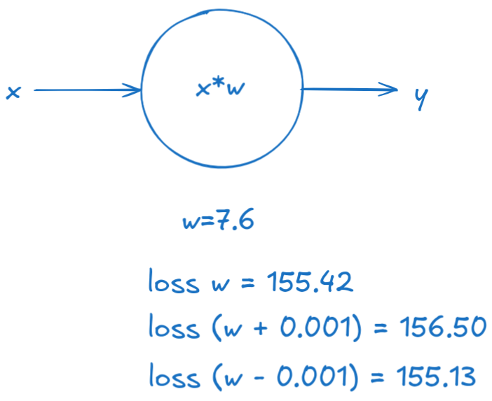

4. So, the value either goes up or down. This means that our loss function would represent a parabola.


5. If only we had a way to always know in which direction the value would go down? Oh, wait - we do! It's the opposite direction of the one in which the derivative grows!


For now, we won't calculate the exact derivative because we don't need to do that - we can use its general formula:

$${\displaystyle L=\lim _{eps\to 0}{\frac {loss(w+eps)-loss(w)}{eps}}}$$

6. We can then use `L` to step in the direction of decline, by doing: `w -= L`.

7. This, however, will have a problem: the value of `L` might be very high. If our step is always `L` we would start oscilating. Therefore, we'll use a learning rate that will say how large our step would be: `w -= learning_rate * L`.

And this is it! This process is guaranteed to find `2` as the optimal value. Moreover, this iterative algorithm for minimizing a differentiable multivariate function is what is also known as [Gradient Descent](https://en.wikipedia.org/wiki/Gradient_descent) 😇.

</details>

<details>

<summary>What would the architecture and process for creating a model of an "AND" logical gate look like?</summary>

We might start off with something like this:


However, because our task now shifts from being a regression one into a classification one, we can also add the `sigmoid` function to control the output values:

$${\displaystyle f(x)={\frac {1}{1+e^{-x}}}}$$

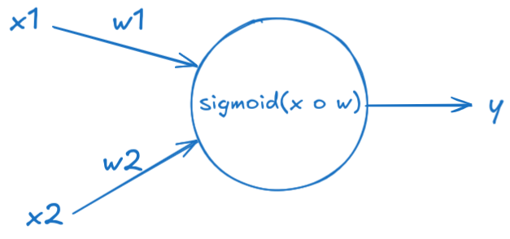

<details>

<summary>But! Adding the sigmoid activation function actually causes another problem - for what values of w1 and w2 would we have a problem?</summary>

Look at what happens when we have $w_1=0$ and $w_2=0$ (our model is guessing correctly that the output should be `0`):


</details>

<details>

<summary>How do we fix this?</summary>

We need to keep the weights at `0` but also add another term that can control the logit value when all weights are `0`. Welcome, ***bias***.


</details>

</details>

<details>

<summary>How do we model the "XOR" logical gate?</summary>

Let's see how the classes are distributed in `2D` space:


The models we defined above are actually called perceptrons. They calculate a weighted sum of their inputs and thresholds it with a step function.

Geometrically, this means **the perceptron can separate its input space with a hyperplane**. That’s where the notion that a perceptron can only separate linearly separable problems comes from.

Since the `XOR` function **is not linearly separable**, it really is impossible for a single hyperplane to separate it.

<details>

<summary>What are our next steps then?</summary>

We need to describe the `XOR` gate using non-`XOR` gates. This can be done:

`(x|y) & ~(x&y)`

So, the `XOR` model can then be represented using the following architecture:


<details>

<summary>How many parameters would we have in total?</summary>

9

</details>

</details>

</details>

## Python Packages

### Introduction

You write all of your code to one and the same Python script.

<details>

<summary>What are the problems that arise from that?</summary>

- Huge code base: messy;
- Lots of code you won't use;
- Maintenance problems.

</details>

<details>

<summary>How do we solve this problem?</summary>

We can split our code into libraries (or in the Python world - **packages**).

Packages are a directory of Python scripts.

Each such script is a so-called **module**.

Here's the hierarchy visualized:


These modules specify functions, methods and new Python types aimed at solving particular problems. There are thousands of Python packages available from the Internet. Among them are packages for data science:

- there's **NumPy to efficiently work with arrays**;
- **Matplotlib for data visualization**;
- **scikit-learn for machine learning**.

</details>

Not all of them are available in Python by default, though. To use Python packages, you'll first have to install them on your own system, and then put code in your script to tell Python that you want to use these packages. Advice:

- always install packages in **virtual environments** (abstractions that hold packages for separate projects).
  - You can create a virtual environment by using the following code:

    ```console
    python3 -m venv .venv
    ```

    This will create a hidden folder, called `.venv`, that will store all packages you install for your current project (instead of installing them globally on your system).

  - If there is a `requirements.txt` file, use it to install the needed packages beforehand.
    - In the github repo, there is such a file - you can use it to install all the packages you'll need in the course. This can be done by using this command:

    ```console
    (if on Windows) > .venv\Scripts\activate
    (if on Linux) > source .venv/bin/activate
    (.venv) > pip install -r requirements.txt
    ```

Now that the package is installed, you can actually start using it in one of your Python scripts. To do this you should import the package, or a specific module of the package.

You can do this with the `import` statement. To import the entire `numpy` package, you can do `import numpy`. A commonly used function in NumPy is `array`. It takes a Python list as input and returns a [`NumPy array`](https://numpy.org/doc/stable/reference/generated/numpy.array.html) object as an output. The NumPy array is very useful to do data science, but more on that later. Calling the `array` function like this, though, will generate an error:

```python
import numpy
array([1, 2, 3])
```

```console
NameError: name `array` is not defined
```

To refer to the `array` function from the `numpy` package, you'll need this:

```python
import numpy
numpy.array([1, 2, 3])
```

```console
array([1, 2, 3])
```

This time it works.

Using this `numpy.` prefix all the time can become pretty tiring, so you can also import the package and refer to it with a different name. You can do this by extending your `import` statement with `as`:

```python
import numpy as np
np.array([1, 2, 3])
```

```console
array([1, 2, 3])
```

Now, instead of `numpy.array`, you'll have to use `np.array` to use NumPy's functions.

There are cases in which you only need one specific function of a package. Python allows you to make this explicit in your code.

Suppose that we ***only*** want to use the `array` function from the NumPy package. Instead of doing `import numpy`, you can instead do `from numpy import array`:

```python
from numpy import array
array([1, 2, 3])
```

```console
array([1, 2, 3])
```

This time, you can simply call the `array` function without `numpy.`.

This `from import` version to use specific parts of a package can be useful to limit the amount of coding, but you're also loosing some of the context. Suppose you're working in a long Python script. You import the array function from numpy at the very top, and way later, you actually use this array function. Somebody else who's reading your code might have forgotten that this array function is a specific NumPy function; it's not clear from the function call.


^ using numpy, but not very clear

Thus, the more standard `import numpy as np` call is preferred: In this case, your function call is `np.array`, making it very clear that you're working with NumPy.


- Suppose you want to use the function `inv()`, which is in the `linalg` subpackage of the `scipy` package. You want to be able to use this function as follows:

    ```python
    my_inv([[1,2], [3,4]])
    ```

    Which import statement will you need in order to run the above code without an error?

  - A. `import scipy`
  - B. `import scipy.linalg`
  - C. `from scipy.linalg import my_inv`
  - D. `from scipy.linalg import inv as my_inv`

    <details>

    <summary>Reveal answer:</summary>

    Answer: D

    </details>

### Importing means executing `main.py`

Remember that importing a package is equivalent to executing everything in the `main.py` module. Thus. you should always have `if __name__ == '__main__'` block of code and call your functions from there.

Run the scripts `test_script1.py` and `test_script2.py` to see the differences.

## NumPy

### Context

Python lists are pretty powerful:

- they can hold a collection of values with different types (heterogeneous data structure);
- easy to change, add, remove elements;
- many built-in functions and methods.

### Problems

This is wonderful, but one feature is missing, a feature that is super important for aspiring data scientists and machine learning engineers - carrying out mathematical operations **over entire collections of values** and doing it **fast**.

Let's take the heights and weights of your family and yourself. You end up with two lists, `height`, and `weight` - the first person is `1.73` meters tall and weighs `65.4` kilograms and so on.

```python
height = [1.73, 1.68, 1.71, 1.89, 1.79]
height
```

```console
[1.73, 1.68, 1.71, 1.89, 1.79]
```

```python
weight = [65.4, 59.2, 63.6, 88.4, 68.7]
weight
```

```console
[65.4, 59.2, 63.6, 88.4, 68.7]
```

If you now want to calculate the Body Mass Index for each family member, you'd hope that this call can work, making the calculations element-wise. Unfortunately, Python throws an error, because it has no idea how to do calculations on lists. You could solve this by going through each list element one after the other, and calculating the BMI for each person separately, but this is terribly inefficient and tiresome to write.

### Solution

- `NumPy`, or Numeric Python;
- Provides an alternative to the regular Python list: the NumPy array;
- The NumPy array is pretty similar to the list, but has one additional feature: you can perform calculations over entire arrays;
- super-fast as it's based on C++
- Installation:
  - In the terminal: `pip install numpy`

### Benefits

Speed, speed, speed:

- Stackoverflow: <https://stackoverflow.com/questions/73060352/is-numpy-any-faster-than-default-python-when-iterating-over-a-list>
- Visual Comparison:

    

### Usage

```python
import numpy as np
np_height = np.array(height)
np_height
```

```console
array([1.73, 1.68, 1.71, 1.89, 1.79])
```

```python
import numpy as np
np_weight = np.array(weight)
np_weight
```

```console
array([65.4, 59.2, 63.6, 88.4, 68.7])
```

```python
# Calculations are performed element-wise.
# 
# The first person's BMI was calculated by dividing the first element in np_weight
# by the square of the first element in np_height,
# 
# the second person's BMI was calculated with the second height and weight elements, and so on.
bmi = np_weight / np_height ** 2
bmi
```

```console
array([21.851, 20.975, 21.750, 24.747, 21.441])
```

in comparison, the above will not work for Python lists:

```python
weight / height ** 2
```

```console
TypeError: unsupported operand type(s) for ** or pow(): 'list' and 'int'
```

You should still pay attention, though:

- `numpy` assumes that your array contains values **of a single type**;
- a NumPy array is simply a new kind of Python type, like the `float`, `str` and `list` types. This means that it comes with its own methods, which can behave differently than you'd expect.

    ```python
    python_list = [1, 2, 3]
    numpy_array = np.array([1, 2, 3])
    ```

    ```python
    python_list + python_list
    ```

    ```console
    [1, 2, 3, 1, 2, 3]
    ```

    ```python
    numpy_array + numpy_array
    ```

    ```console
    array([2, 4, 6])
    ```

- When you want to get elements from your array, for example, you can use square brackets as with Python lists. Suppose you want to get the bmi for the second person, so at index `1`. This will do the trick:

    ```python
    bmi
    ```

    ```console
    [21.851, 20.975, 21.750, 24.747, 21.441]
    ```

    ```python
    bmi[1]
    ```

    ```console
    20.975
    ```

- Specifically for NumPy, there's also another way to do list subsetting: using an array of booleans.

    Say you want to get all BMI values in the bmi array that are over `23`.

    A first step is using the greater than sign, like this: The result is a NumPy array containing booleans: `True` if the corresponding bmi is above `23`, `False` if it's below.

    ```python
    bmi > 23
    ```

    ```console
    array([False, False, False, True, False])
    ```

    Next, you can use this boolean array inside square brackets to do subsetting. Only the elements in `bmi` that are above `23`, so for which the corresponding boolean value is `True`, is selected. There's only one BMI that's above `23`, so we end up with a NumPy array with a single value, that specific BMI. Using the result of a comparison to make a selection of your data is a very common way to work with data.

    ```python
    bmi[bmi > 23]
    ```

    ```console
    array([24.747])
    ```

### 2D NumPy Arrays

If you ask for the type of these arrays, Python tells you that they are `numpy.ndarray`:

```python
np_height = np.array([1.73, 1.68, 1.71, 1.89, 1.79])
np_weight = np.array([65.4, 59.2, 63.6, 88.4, 68.7])
type(np_height)
```

```console
numpy.ndarray
```

```python
type(np_weight)
```

```console
numpy.ndarray
```

`ndarray` stands for n-dimensional array. The arrays `np_height` and `np_weight` are one-dimensional arrays, but it's perfectly possible to create `2`-dimensional, `3`-dimensional and `n`-dimensional arrays.

You can create a 2D numpy array from a regular Python list of lists:

```python
np_2d = np.array([[1.73, 1.68, 1.71, 1.89, 1.79],
                  [65.4, 59.2, 63.6, 88.4, 68.7]])
np_2d
```

```console
array([[ 1.73,  1.68,  1.71,  1.89,  1.79],
       [65.4 , 59.2 , 63.6 , 88.4 , 68.7 ]])
```

Each sublist in the list, corresponds to a row in the `2`-dimensional numpy array. Using `.shape`, you can see that we indeed have `2` rows and `5` columns:

```python
np_2d.shape
```

```console
(2, 5) # 2 rows, 5 columns
```

`shape` is a so-called **attribute** of the `np2d` array, that can give you more information about what the data structure looks like.

> **Note:** The syntax for accessing an attribute looks a bit like calling a method, but they are not the same! Remember that methods have round brackets (`()`) after them, but attributes do not.
>
> **Note:** For n-D arrays, the NumPy rule still applies: an array can only contain a single type.

You can think of the 2D numpy array as a faster-to-work-with list of lists: you can perform calculations and more advanced ways of subsetting.

Suppose you want the first row, and then the third element in that row - you can grab it like this:

```python
np_2d[0][2]
```

```console
1.71
```

or use an alternative way of subsetting, using single square brackets and a comma:

```python
np_2d[0, 2]
```

```console
1.71
```

The value before the comma specifies the row, the value after the comma specifies the column. The intersection of the rows and columns you specified, are returned. This is the syntax that's most popular.

Suppose you want to select the height and weight of the second and third family member from the following array.

```console
array([[ 1.73,  1.68,  1.71,  1.89,  1.79],
       [65.4 , 59.2 , 63.6 , 88.4 , 68.7 ]])
```

<details>

<summary>How can this be achieved?</summary>

Answer: np_2d[:, [1, 2]]

</details>

### Basic Statistics

A typical first step in analyzing your data, is getting to know your data in the first place.

Imagine you conduct a city-wide survey where you ask `5000` adults about their height and weight. You end up with something like this: a 2D numpy array, that has `5000` rows, corresponding to the `5000` people, and `2` columns, corresponding to the height and the weight.

```python
np_city = ...
np_city
```

```console
array([[ 2.01, 64.33],
       [ 1.78, 67.56],
       [ 1.71, 49.04],
       ...,
       [ 1.73, 55.37],
       [ 1.72, 69.73],
       [ 1.85, 66.69]])
```

Simply staring at these numbers, though, won't give you any insights. What you can do is generate summarizing statistics about them.

- you can try to find out the average height of these people, with NumPy's `mean` function:

```python
np.mean(np_city[:, 0]) # alternative: np_city[:, 0].mean()
```

```console
1.7472
```

It appears that on average, people are `1.75` meters tall.

- What about the median height? This is the height of the middle person if you sort all persons from small to tall. Instead of writing complicated python code to figure this out, you can simply use NumPy's `median` function:

```python
np.median(np_city[:, 0]) # alternative: np_city[:, 0].median()
```

```console
1.75
```

You can do similar things for the `weight` column in `np_city`. Often, these summarizing statistics will provide you with a "sanity check" of your data. If you end up with a average weight of `2000` kilograms, your measurements are most likely incorrect. Apart from mean and median, there's also other functions, like:

```python
np.corrcoef(np_city[:, 0], np_city[:, 1])
```

```console
array([[1.       , 0.0082912],
       [0.0082912, 1.       ]])
```

```python
np.std(np_city[:, 0])
```

```console
np.float64(0.19759467357193614)
```

`sum()`, `sort()`, etc, etc. See all of them [here](https://numpy.org/doc/stable/reference/routines.statistics.html).

### Generate data

The data used above was generated using the following code. Two random distributions were sampled 5000 times to create the `height` and `weight` arrays, and then `column_stack` was used to paste them together as two columns.

```python
import numpy as np
height = np.round(np.random.normal(1.75, 0.2, 5000), 2)
weight = np.round(np.random.normal(60.32, 15, 5000), 2)
np_city = np.column_stack((height, weight))
```

## Matplotlib

The better you understand your data, the better you'll be able to extract insights. And once you've found those insights, again, you'll need visualization to be able to share your valuable insights with other people.

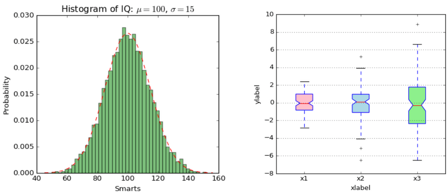

There are many visualization packages in python, but the mother of them all, is `matplotlib`. You will need its subpackage `pyplot`. By convention, this subpackage is imported as `plt`:

```python
import matplotlib.pyplot as plt
```

### Line plot

Let's try to gain some insights in the evolution of the world population. To plot data as a **line chart**, we call `plt.plot` and use our two lists as arguments. The first argument corresponds to the horizontal axis, and the second one to the vertical axis.

```python
year = [1950, 1970, 1990, 2010]
pop = [2.519, 3.692, 5.263, 6.972]

# "plt.plot" creates the plot, but does not display it
plt.plot(year, pop)

# "plt.show" displays the plot
plt.show()
```

You'll have to call `plt.show()` explicitly because you might want to add some extra information to your plot before actually displaying it, such as titles and label customizations.

As a result we get:


We see that:

- the years are indeed shown on the horizontal axis;
- the populations on the vertical axis;
- this type of plot is great for plotting a time scale along the x-axis and a numerical feature on the y-axis.

There are four data points, and Python draws a line between them.


In 1950, the world population was around 2.5 billion. In 2010, it was around 7 billion.

> **Insight:** The world population has almost tripled in sixty years.
>
> **Note:** If you pass only one argument to `plt.plot`, Python will know what to do and will use the index of the list to map onto the `x` axis, and the values in the list onto the `y` axis.

### Scatter plot

We can reuse the code from before and just swap `plt.plot(...)` with `plt.scatter(...)`:

```python
year = [1950, 1970, 1990, 2010]
pop = [2.519, 3.692, 5.263, 6.972]

# "plt.plot" creates the plot, but does not display it
plt.scatter(year, pop)

# "plt.show" displays the plot
plt.show()
```


The resulting scatter plot:

- plots the individual data points;
- dots aren't connected with a line;
- is great for plotting two numerical features (example: correlation analysis).

### Drawing multiple plots on one figure

This can be done by first instantiating the figure and two axis and the using each axis to plot the data. Example taken from [here](https://matplotlib.org/stable/api/_as_gen/matplotlib.pyplot.subplots.html#matplotlib.pyplot.subplots).

```python
import numpy as np
import matplotlib.pyplot as plt

x = np.linspace(0, 2*np.pi, 400)
y = np.sin(x**2)

f, (ax1, ax2) = plt.subplots(1, 2, sharey=True)
f.suptitle('Sharing Y axis')

ax1.plot(x, y)
ax2.scatter(x, y)

plt.show()
```


### The logarithmic scale

Sometimes the correlation analysis between two variables can be done easier when one or all of them is plotted on a logarithmic scale. This is because we would reduce the difference between large values as this scale "squashes" large numbers:


In `matplotlib` we can use the [plt.xscale](https://matplotlib.org/stable/api/_as_gen/matplotlib.pyplot.xscale.html) function to change the scaling of an axis using `plt` or [ax.set_xscale](https://matplotlib.org/stable/api/_as_gen/matplotlib.axes.Axes.set_xscale.html#matplotlib.axes.Axes.set_xscale) to set the scale of an axis of a subplot.

### Histogram

#### Introduction

The histogram is a plot that's useful to explore **distribution of numeric** data;

Imagine `12` values between `0` and `6`.


To build a histogram for these values, you can divide the line into **equal chunks**, called **bins**. Suppose you go for `3` bins, that each have a width of `2`:


Next, you count how many data points sit inside each bin. There's `4` data points in the first bin, `6` in the second bin and `2` in the third bin:


Finally, you draw a bar for each bin. The height of the bar corresponds to the number of data points that fall in this bin. The result is a histogram, which gives us a nice overview on how the `12` values are **distributed**. Most values are in the middle, but there are more values below `2` than there are above `4`:


#### In `matplotlib`

In `matplotlib` we can use the `.hist` function. In its documentation there're a bunch of arguments you can specify, but the first two are the most used ones:

- `x` should be a list of values you want to build a histogram for;
- `bins` is the number of bins the data should be divided into. Based on this number, `.hist` will automatically find appropriate boundaries for all bins, and calculate how may values are in each one. If you don't specify the bins argument, it will by `10` by default.


The number of bins is important in the following way:

- too few bins will oversimplify reality and won't show you the details;
- too many bins will overcomplicate reality and won't show the bigger picture.

Experimenting with different numbers and/or creating multiple plots on the same canvas can alleviate that.

Here's the code that generated the above example:

```python
import matplotlib.pyplot as plt
xs = [0, 0.6, 1.4, 1.6, 2.2, 2.5, 2.6, 3.2, 3.5, 3.9, 4.2, 6]
plt.hist(xs, bins=3)
plt.show()
```

and the result of running it:


#### Use cases

Histograms are really useful to give a bigger picture. As an example, have a look at this so-called **population pyramid**. The age distribution is shown, for both males and females, in the European Union.


Notice that the histograms are flipped 90 degrees; the bins are horizontal now. The bins are largest for the ages `40` to `44`, where there are `20` million males and `20` million females. They are the so called baby boomers. These are figures of the year `2010`. What do you think will have changed in `2050`?

Let's have a look.

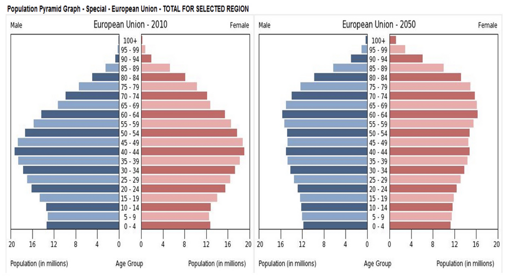

The distribution is flatter, and the baby boom generation has gotten older. **With the blink of an eye, you can easily see how demographics will be changing over time.** That's the true power of histograms at work here!

### Checkpoint

<details>

<summary>
You want to visually assess if the grades on your exam follow a particular distribution. Which plot do you use?

```text
A. Line plot.
B. Scatter plot.
C. Histogram.
```

</summary>

Answer: C.

</details>

<details>

<summary>
You want to visually assess if longer answers on exam questions lead to higher grades. Which plot do you use?

```text
A. Line plot.
B. Scatter plot.
C. Histogram.
```

</summary>

Answer: B.

</details>

### Customization

Creating a plot is one thing. Making the correct plot, that makes the message very clear - that's the real challenge.

For each visualization, you have many options:

- change colors;
- change shapes;
- change labels;
- change axes, etc., etc.

The choice depends on:

- the data you're plotting;
- the story you want to tell with this data.

Below are outlined best practices when it comes to creating an MVP plot.

If we run the script for creating a line plot, we already get a pretty nice plot:

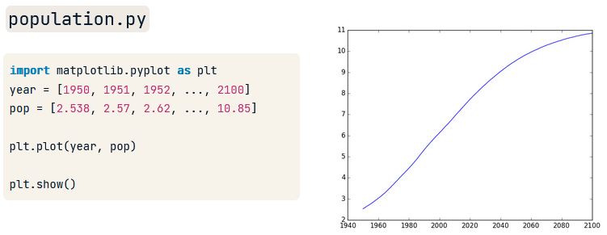

It shows that the population explosion that's going on will have slowed down by the end of the century.

But some things can be improved:

- **axis labels**;
- **title**;
- **ticks**.

#### Axis labels

The first thing you always need to do is label your axes. We can do this by using the `xlabel` and `ylabel` functions. As inputs, we pass strings that should be placed alongside the axes.


#### Title

We're also going to add a title to our plot, with the `title` function. We pass the actual title, `'World Population Projections'`, as an argument:


#### Ticks

Using `xlabel`, `ylabel` and `title`, we can give the reader more information about the data on the plot: now they can at least tell what the plot is about.

To put the population growth in perspective, the y-axis should start from `0`. This can be achieved by using the `yticks` function. The first input is a list, in this example with the numbers `0` up to `10`, with intervals of `2`:


Notice how the curve shifts up. Now it's clear that already in `1950`, there were already about `2.5` billion people on this planet.

Next, to make it clear we're talking about billions, we can add a second argument to the `yticks` function, which is a list with the display names of the ticks. This list should have the same length as the first list.


#### Adding more data

Finally, let's add some more historical data to accentuate the population explosion in the last `60` years. If we run the script once more, three data points are added to the graph, giving a more complete picture.

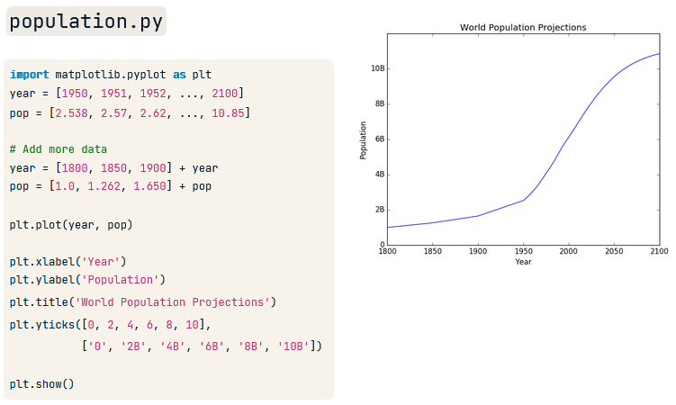

#### `plt.tight_layout()`

##### Problem

With the default Axes positioning, the axes title, axis labels, or tick labels can sometimes go outside the figure area, and thus get clipped.

```python
import matplotlib.pyplot as plt
import numpy as np

def example_plot(ax, fontsize=12):
    ax.plot([1, 2])
    ax.locator_params(nbins=3)
    ax.set_xlabel('x-label', fontsize=fontsize)
    ax.set_ylabel('y-label', fontsize=fontsize)
    ax.set_title('Title', fontsize=fontsize)

fig, ax = plt.subplots()
example_plot(ax, fontsize=24)
plt.show()
```


##### Solution

To prevent this, the location of Axes needs to be adjusted. `plt.tight_layout()` does this automatically:

```python
import matplotlib.pyplot as plt
import numpy as np

def example_plot(ax, fontsize=12):
    ax.plot([1, 2])
    ax.locator_params(nbins=3)
    ax.set_xlabel('x-label', fontsize=fontsize)
    ax.set_ylabel('y-label', fontsize=fontsize)
    ax.set_title('Title', fontsize=fontsize)

fig, ax = plt.subplots()
example_plot(ax, fontsize=24)
plt.tight_layout()
plt.show()
```


When you have multiple subplots, often you see labels of different Axes overlapping each other:

```python
import matplotlib.pyplot as plt
import numpy as np

def example_plot(ax, fontsize=12):
    ax.plot([1, 2])
    ax.locator_params(nbins=3)
    ax.set_xlabel('x-label', fontsize=fontsize)
    ax.set_ylabel('y-label', fontsize=fontsize)
    ax.set_title('Title', fontsize=fontsize)

fig, ((ax1, ax2), (ax3, ax4)) = plt.subplots(nrows=2, ncols=2)
example_plot(ax1)
example_plot(ax2)
example_plot(ax3)
example_plot(ax4)
plt.show()
```


`plt.tight_layout()` will also adjust spacing between subplots to minimize the overlaps:

```python
import matplotlib.pyplot as plt
import numpy as np

def example_plot(ax, fontsize=12):
    ax.plot([1, 2])
    ax.locator_params(nbins=3)
    ax.set_xlabel('x-label', fontsize=fontsize)
    ax.set_ylabel('y-label', fontsize=fontsize)
    ax.set_title('Title', fontsize=fontsize)

fig, ((ax1, ax2), (ax3, ax4)) = plt.subplots(nrows=2, ncols=2)
example_plot(ax1)
example_plot(ax2)
example_plot(ax3)
example_plot(ax4)
plt.tight_layout()
plt.show()
```


## Random numbers

### Context

Imagine the following:

- you're walking up the empire state building and you're playing a game with a friend.
- You throw a die `100` times:
  - If it's `1` or `2` you'll go one step down.
  - If it's `3`, `4`, or `5`, you'll go one step up.
  - If you throw a `6`, you'll throw the die again and will walk up the resulting number of steps.
- also, you admit that you're a bit clumsy and have a chance of `0.1%` of falling down the stairs when you make a move. Falling down means that you have to start again from step `0`.

With all of this in mind, you bet with your friend that you'll reach `60` steps high. What is the chance that you will win this bet?

- one way to solve it would be to calculate the chance analytically using equations;
- another possible approach, is to simulate this process thousands of times, and see in what fraction of the simulations that you will reach `60` steps.

We're going to opt for the second approach.

### Random generators

We have to simulate the die. To do this, we can use random generators.

```python
import numpy as np
np.random.rand() # Pseudo-random numbers
```

```console
0.026360555982748446
```

We get a random number between `0` and `1`. This number is so-called pseudo-random. Those are random numbers that are generated using a mathematical formula, starting from a **random seed**.

This seed was chosen by Python when we called the `rand` function, but you can also set this manually. Suppose we set it to `123` and then call the `rand` function twice.

```python
import numpy as np
np.random.seed(123)
print(np.random.rand())
print(np.random.rand())
```

```console
0.6964691855978616
0.28613933495037946
```

> **Note:** Set the seed in the global scope of the Python module (not in a function).

We get two random numbers, however, if call `rand` twice more ***from a new python session***, we get the exact same random numbers!

```python
import numpy as np
np.random.seed(123)
print(np.random.rand())
print(np.random.rand())
```

```console
0.6964691855978616
0.28613933495037946
```

This is funky: you're generating random numbers, but for the same seed, you're generating the same random numbers. That's why it's called pseudo-random; **it's random but consistent between runs**; this is very useful, because this ensures ***"reproducibility"***. Other people can reproduce your analysis.

Suppose we want to simulate a coin toss.

- we set the seed;
- we use the `np.random.randint()` function: it will randomly generate either `0` or `1`. We'll pass two arguments to determine the range of the generated numbers - `0` and `2` (non-inclusive on the right side).

```python
import numpy as np
np.random.seed(123)
print(np.random.randint(0, 2))
print(np.random.randint(0, 2))
print(np.random.randint(0, 2))
```

```console
0
1
0
```

We can extend the code with an `if-else` statement to improve user experience:

```python
import numpy as np
np.random.seed(123)
coin = np.random.randint(0, 2)
print(coin)
if coin == 0:
    print('heads')
else:
    print('tails')
```

```console
heads
```

## A note on code formatting

In this course we'll strive to learn how to develop scripts in Python. In general, good code in software engineering is one that is:

1. Easy to read.
2. Safe from bugs.
3. Ready for change.

This section focuses on the first point - how do we make our code easier to read? Here are some principles:

1. Use a linter/formatter.
2. Simple functions - every function should do one thing. This is the single responsibility principle.
3. Break up complex logic into multiple steps. In other words, prefer shorter lines instead of longer.
4. Do not do extended nesting. Instead of writing nested `if` clauses, prefer [`match`](https://docs.python.org/3/tutorial/controlflow.html#match-statements) or many `if` clauses on a single level.

You can automatically handle the first point - let's see how to install and use the `yapf` formatter extension in VS Code.

1. Open the `Extensions` tab, either by using the UI or by pressing `Ctrl + Shift + x`. You'll see somthing along the lines of:
  


2. Search for `yapf`:


3. Select and install it:


4. After installing, please apply it on every Python file. To do so, press `F1` and type `Format Document`. The script would then be formatted accordingly.


# Week 02 - Implementing Gradient Descent

!!!

- [ ] We created a chat in Messenger: DL_24-25!

!!!

## Backpropagation

<details>

<summary>How do we translate the expression "slope of a line"?</summary>

Наклон на линия.

</details>

<details>

<summary>How would you define the slope of a line?</summary>

- slope (also gradient) = a number that describes the direction of the line on a plane.
- often denoted by the letter $m$.


- calculated as the ratio of the vertical change to the horizontal change ("rise over run") between two distinct points on the line:
  - a 45° rising line has slope $m = 1$ (tan(45°) = 1)
  - a 45° falling line has slope $m = -1$ (tan(-45°) = -1)

</details>

<details>

<summary>What is the sign of the slope of an increasing line going up from left to right?</summary>

Positive ($m > 0$).

</details>

<details>

<summary>What is the sign of the slope of a decreasing line going down from left to right?</summary>

Negative ($m < 0$).

</details>

<details>

<summary>What is the slope of a horizontal line?</summary>

$0$.

</details>

<details>

<summary>What is the slope of a vertical line?</summary>

A vertical line would lead to a $0$ in the denominator, so the slope can be regarder as `undefined` or `infinite`.

</details>

<details>

<summary>What is the steepness of a line?</summary>

- The absolute value of its slope:
  - greater absolute value indicates a steeper line.

</details>

<details>

<summary>Suppose a line runs through two points: P = (1, 2) and Q = (13, 8). What is its slope, direction and level of steepness?</summary>

$dy = 8 - 2 = 6$
$dx = 13 - 1 = 12$
$m = \frac{dy}{dx} = \frac{6}{12} = \frac{1}{2} = 0.5$

Direction: $0.5 > 0$ => up
Steepness: $0 < 0.5 < 1$ => not very steep (less steep than a 45° rising line)

</details>

<details>

<summary>Suppose a line runs through two points: P = (4, 15) and Q = (3, 21). What is its slope, direction and level of steepness?</summary>

$dy = 21 - 15 = 6$
$dx = 3 - 4 = -1$
$m = \frac{dy}{dx} = \frac{6}{-1} = -6$

Direction: $-6 < 0$ => down
Steepness: $|-6| = 6 > 1$ => steep

</details>

<details>

<summary>What is the link between "slope" and "derivative"?</summary>

- For non-linear functions, the rate of change varies along the curve.
- The derivative of the function at a point
$=$ The slope of the line, tangent to the curve at the point
$=$ The rate of change of the function at that point


Formula for slope:

$m = \frac{dy}{dx}$

Formula for derivative:

${\displaystyle L=\lim _{eps\to 0}{\frac {f(x+eps)-f(x)}{eps}}}$

it's the same formula as for the slope, only here the change in $x$ is infinitesimally small.

For example, let $f$ be the squaring function: ${\displaystyle f(x)=x^{2}}$. Then the derivative is:

$$\frac{f(x+eps) - f(x)}{eps} = \frac{(x+eps)^2 - x^2}{eps} = \frac{x^2 + 2xeps + eps^2 - x^2}{eps} = 2x + eps$$

The division in the last step is valid as long as $eps \neq 0$. The closer $eps$ is to $0$, the closer this expression becomes to the value $2x$. The limit exists, and for every input $x$ the limit is $2x$. So, the derivative of the squaring function is the doubling function: ${\displaystyle f'(x)=2x}$.

</details>

<details>

<summary>So, what added value does the derivative have?</summary>

**It tells us by how much the value of a function increases when we *increase* its input by a tiny bit.**

Do we remember the below diagram?


</details>

<details>

<summary>What are the rules of derivatives that you can recall - write out the rule and an example of it?</summary>

Recall the rules of computation [here](https://en.wikipedia.org/wiki/Derivative#Rules_of_computation).

Also, recall the chain rule [here](https://en.wikipedia.org/wiki/Chain_rule).

<details>

<summary>What is the derivative of sin(6x)?</summary>

$\frac{d}{dx}[\sin(6x)] = \cos(6x) * \frac{d}{dx}[6x] = \cos(6x) * 6 = 6\cos(6x)$

See how the above corresponds with this definition:

$${\displaystyle {\frac {dz}{dx}}={\frac {dz}{dy}}\cdot {\frac {dy}{dx}},}$$

$z = \sin$
$y = 6x$

In other words, $x$ influences the value of $\sin$ through the value of $y=6x$.

</details>

</details>

<details>

<summary>What is backpropagation then?</summary>

Backpropagation is the iterative process of calculating derivatives of the loss function with respect to every `value` node leading up to it.

Rules of thumb:

```text
Start from the final child (the last node in topological order).
+ => copy gradient to parents:
    parent1.grad = current.grad
    parent2.grad = current.grad
* => multiply value of other parent with current gradient:
    parent1.grad = parent2.value * current.grad
    parent2.grad = parent1.value * current.grad
```

Let's say we have the following computational graph and we have to see how tiny changes in the weights and biases influence the value of `L`:


<details>

<summary>Reveal answer</summary>


End:


</details>

</details>

## Topological sort

Topological ordering of a directed graph is a linear ordering of its vertices such that for every directed edge $(u,v)$ from vertex $u$ to vertex $v$, $u$ comes before $v$ in the ordering.

The canonical application of topological sorting is in scheduling a sequence of jobs or tasks based on their dependencies.

Two ways to sort elements in topological order are given in [Wikipedia](https://en.wikipedia.org/wiki/Topological_sorting).

## The hyperbolic tangent

<details>

<summary>Why are activation functions needed?</summary>

They introduce nonlinearity, making it possible for our network to learn non-linear transformations. Composition of matrices is a single matrix (as the matrix is a linear operation).

</details>

$${\displaystyle \tanh x={\frac {\sinh x}{\cosh x}}={\frac {e^{x}-e^{-x}}{e^{x}+e^{-x}}}={\frac {e^{2x}-1}{e^{2x}+1}}.}$$

We observe that the `tanh` function is a shifted and stretched version of the `sigmoid`. Below, we can see its plot when the input is in the range $[-10, 10]$:


The output range of the tanh function is $(-1, 1)$ and presents a similar behavior with the `sigmoid` function. Thus, the main difference is the fact that the `tanh` function pushes the input values to $1$ and $-1$ instead of $1$ and $0$.

The important difference between the two functions is the behavior of their gradient.

$${\frac {d}{dx}}\sigma(x) = \sigma(x) (1 - \sigma(x))$$
$${\frac {d}{dx}}\tanh(x) = 1 - \tanh^{2}(x)$$


Using the `tanh` activation function results in higher gradient values during training and higher updates in the weights of the network. So, if we want strong gradients and big steps, we should use the `tanh` activation function.

Another difference is that the output of `tanh` is symmetric around zero, which could sometimes lead to faster convergence.

## Python OOP (Magic Methods)

### Initialization and Construction

- `__init__`: To get called by the `__new__` method. This is the `constructor` function for Python classes.
- `__new__`: To get called in an object’s instantiation (**do not use unless no other option**).
- `__del__`: It is the destructor (**do not use unless no other option**).

### Arithmetic operators

- `__add__(self, other)`: Implements behavior for the `+` operator (addition).
- `__sub__(self, other)`: Implements behavior for the `–` operator (subtraction).
- `__mul__(self, other)`: Implements behavior for the `*` operator (multiplication).
- `__floordiv__(self, other)`: Implements behavior for the `//` operator (floor division).
- `__truediv__(self, other)`: Implements behavior for the `/` operator (true division).
- `__mod__(self, other)`: Implements behavior for the `%` operator (modulus).
- `__pow__(self, other)`: Implements behavior for the `**` operator (exponentiation).
- `__and__(self, other)`: Implements behavior for the `&` operator (bitwise and).
- `__or__(self, other)`: Implements behavior for the `|` operator (bitwise or).
- `__xor__(self, other)`: Implements behavior for the `^` operator (bitwise xor).
- `__neg__(self)`: Implements behavior for negation using the `–` operator.

### String Magic Methods

- `__str__(self)`: Defines behavior for when `str()` is called on an instance of your class.
- `__repr__(self)`: To get called by built-int `repr()` method to return a machine readable representation of a type. **This method gets called when an object is passed to the `print` function.**

### Comparison magic methods

- `__eq__(self, other)`: Defines behavior for the equality operator, `==`.
- `__ne__(self, other)`: Defines behavior for the inequality operator, `!=`.
- `__lt__(self, other)`: Defines behavior for the less-than operator, `<`.
- `__gt__(self, other)`: Defines behavior for the greater-than operator, `>`.
- `__le__(self, other)`: Defines behavior for the less-than-or-equal-to operator, `<=`.
- `__ge__(self, other)`: Defines behavior for the greater-than-or-equal-to operator, `>=`.

# Week 03 - Hello, PyTorch

## PyTorch. A deep learning framework

<details>

<summary>Having done everything until now, what's the biggest differentiating factor between machine learning algorithms and deep learning algorithms?</summary>

Machine learning relies on **hand-crafted** feature engineering.

Deep learning enable **automatic** feature engineering from raw data. Automatic feature engineering is also known as **representation learning**.

</details>

<details>

<summary>Have you used PyTorch before? What problems did it help you solve?</summary>

PyTorch:

- is one of the most popular deep learning frameworks;
- is the framework used in many published deep learning papers;
- is intuitive and user-friendly;
- has much in common with NumPy;
- has a really good documentation. Check it out [here](https://pytorch.org/).

Be sure to update your virtual environment (if you haven't done so already): `pip install -Ur requirements.txt`.

</details>

## Tensors. The building blocks of networks

### What is a tensor?

A wrapper around an **n-dimensional NumPy array**, i.e. a class that has extended functionality (e.g. automatic backpropagation).


### Creating tensors

**From a Python list:**

```python
import torch
xs = [[1, 2, 3], [4, 5, 6]]
tensor = torch.tensor(xs)
tensor
```

```console
tensor([[1, 2, 3],
        [4, 5, 6]])
```

```python
type(tensor)
```

```console
<class 'torch.Tensor'>
```

**From a NumPy array:**

```python
import numpy as np
import torch
np_array = np.array([1, 2, 3])
np_tensor = torch.from_numpy(np_array)
np_tensor
```

```console
tensor([1, 2, 3])
```

**Creating a tensor via `torch.tensor` vs `torch.Tensor`. When to choose which?**

- `torch.tensor` infers the data type automatically.
- `torch.Tensor` returns a `FloatTensor`.
- Advice: Stick to `torch.tensor`.

### Useful attributes

```python
import torch
xs = [[1, 2, 3], [4, 5, 6]]
tensor = torch.tensor(xs)
tensor.shape, tensor.dtype
```

```console
(torch.Size([2, 3]), torch.int64)
```

- Deep learning often requires a GPU, which, compared to a CPU can offer:
  - parallel computing capabilities;
  - faster training times.
- To see on which device the Tensor is currently sitting it, we can use the `.device` attribute:

```python
tensor.device
```

```console
device(type='cpu')
```

### Shapes matter

**Compatible:**

```python
a = torch.tensor([
    [1, 1],
    [2, 2],
])
b = torch.tensor([
    [2, 2],
    [3, 3],
])

a + b
```

```console
tensor([[3, 3],
        [5, 5]])
```

**Incompatible:**

```python
a = torch.tensor([
    [1, 1],
    [2, 2],
])
b = torch.tensor([
    [2, 2, 4],
    [3, 3, 4],
])

a + b
```

```console
Traceback (most recent call last):
  File "<stdin>", line 1, in <module>
RuntimeError: The size of tensor a (2) must match the size of tensor b (3) at non-singleton dimension 1
```

### Multiplication

<details>

<summary>What is broadcasting?</summary>

An implicit operation that copies an element (or a group of elements) `n` times along a dimension.

</details>

Element-wise multiplication can be done with the operator `*`:

```python
a = torch.tensor([
    [1, 1],
    [2, 2],
])
b = torch.tensor([
    [2, 2],
    [3, 3],
])

a * b
```

```console
tensor([[2, 2],
        [6, 6]])
```

We can do matrix multiplication with the function `torch.matmul`:

```python
# vector x vector
tensor1 = torch.randn(3)
tensor2 = torch.randn(3)
res = torch.matmul(tensor1, tensor2)
res, res.size()

# matrix x vector
tensor1 = torch.randn(3, 4)
tensor2 = torch.randn(4)
torch.matmul(tensor1, tensor2).size()

# batched matrix x broadcasted vector
tensor1 = torch.randn(10, 3, 4)
tensor2 = torch.randn(4)
torch.matmul(tensor1, tensor2).size()

# batched matrix x batched matrix
tensor1 = torch.randn(10, 3, 4)
tensor2 = torch.randn(10, 4, 5)
torch.matmul(tensor1, tensor2).size()

# batched matrix x broadcasted matrix
tensor1 = torch.randn(10, 3, 4)
tensor2 = torch.randn(4, 5)
torch.matmul(tensor1, tensor2).size()
```

```console
(tensor(0.7871), torch.Size([]))
torch.Size([3])
torch.Size([10, 3])
torch.Size([10, 3, 5])
torch.Size([10, 3, 5])
```

Check other built-in functions [here](https://pytorch.org/docs/main/torch.html).

## Our first neural network using PyTorch

We'll begin by building a basic, two-layer network with no hidden layers.


All functions and classes related to creating and managing neural networks can be explored in the [`torch.nn` module](https://pytorch.org/docs/stable/nn.html).

```python
import torch
import torch.nn as nn

linear_layer = nn.Linear(in_features=3, out_features=2)

user_data_tensor = torch.tensor([[0.3471, 0.4547, -0.2356]])
output = linear_layer(user_data_tensor)
output
```

```console
tensor([[-0.7252,  0.3228]], grad_fn=<AddmmBackward0>)
```

[Linear layer](https://pytorch.org/docs/stable/generated/torch.nn.Linear.html#linear):

- `in_features` (`int`) – size of each input sample;
- `out_features` (`int`) – size of each output sample;
- `bias` (`bool`) – If set to `False`, the layer will not learn an additive bias. Default: `True`.
- each linear layer has a `.weight` attribute:

```python
linear_layer.weight
```

```console
Parameter containing:
tensor([[-0.1971, -0.4996,  0.1233],
        [ 0.2203,  0.3508, -0.1402]], requires_grad=True)
```

- and a `.bias` attribute (by default):

```python
linear_layer.bias
```

```console
Parameter containing:
tensor([-0.4006,  0.0538], requires_grad=True)
```

For input $X$, weights $W_0$ and bias $b_0$, the linear layers performs:

$$y_0 = W_0 \cdot X + b_0$$


- in the example above, the linear layer is used to transform the output from shape $(1, 3)$ to shape $(1, 2)$. We refer to $1$ as the **batch size**: how many observations were passed at once to the neural network.
- networks with only linear layers are called **fully connected**: each neuron in a layer is connected to each neuron in the next layer.

## Stacking layers with `nn.Sequential()`

We can easily compose multiple layers using the [`Sequential` class](https://pytorch.org/docs/stable/generated/torch.nn.Sequential.html#sequential):

```python
model = nn.Sequential(
    nn.Linear(10, 18),
    nn.Linear(18, 20),
    nn.Linear(20, 5),
)
model
```

```console
Sequential(
  (0): Linear(in_features=10, out_features=18, bias=True)
  (1): Linear(in_features=18, out_features=20, bias=True)
  (2): Linear(in_features=20, out_features=5, bias=True)
)
```

- Input is passed through the linear layers automatically.
- Here's how the sizes change: **Input 10** => output 18 => output 20 => **Output 5**.

```python
input_tensor
```

```console
tensor([[-0.0014,  0.4038,  1.0305,  0.7521,  0.7489, -0.3968,  0.0113, -1.3844,
          0.8705, -0.9743]])
```

```python
output_tensor = model(input_tensor)
output_tensor
```

```console
tensor([[-0.2361, -0.0336, -0.3614,  0.1190,  0.0112]],
       grad_fn=<AddmmBackward0>)
```

The output of this neural network:

- is still not yet meaningful. This is because the weights and biases are initially random floating-point values.
- is called a **logit**: non-normalized, raw network output.

## Checkpoint

What order should the following blocks be in, in order for the snippet to be correct:

1. `nn.Sequential(`
2. `nn.Linear(14, 3)`
3. `)`
4. `nn.Linear(3, 2)`
5. `nn.Linear(20, 14)`
6. `nn.Linear(5, 20)`

<details>

<summary>Reveal answer</summary>

1, 6, 5, 2, 4, 3

</details>

## Stacked linear transformations is still just one big linear transformation

Applying multiple stacked linear layers is equivalent to applying one linear layer that's their composition [[proof](https://www.3blue1brown.com/lessons/matrix-multiplication)]:


<details>

<summary>What is the problem with this approach?</summary>

We still have a model that can represent **only linear relationships** with the input.


</details>

<details>

<summary>How do we fix this?</summary>

We need to include a transformation (i.e. a function) that is non-linear, so that we can also model nonlinearities. Such functions are called **activation functions**.


- **Activation functions** add **non-linearity** to the network.
- A model can learn more **complex** relationships with non-linearity.
- `Logits` are passed to the activation functions and the results are called `activations`.

</details>

<details>

<summary>What activations functions have you heard of?</summary>

- `sigmoid`: Binary classification.


- `softmax`: Softmax for multi-class classification.


- `relu`.
- `tanh`.
- etc, etc.


</details>

## Sigmoid in PyTorch

### Individually

**Binary classification** task:

- Predict whether an animal is **1 (mammal)** or **0 (not mammal)**.
- We take the logit: `6`.
- Pass it to the sigmoid.
- Obtain a value between `0` and `1` and treat it as a probability.


```python
input_tensor = torch.tensor([[6.0]])
sigmoid = nn.Sigmoid()
probability = sigmoid(input_tensor)
probability
```

```console
tensor([[0.9975]])
```

### As part of a network

Sigmoid as a last step in a network of stacked linear layers is equivalent to traditional logistic regression.

```python
model = nn.Sequential(
    nn.Linear(6, 4),
    nn.Linear(4, 1),
    nn.Sigmoid(),
)
```

## Softmax

- Takes N-element vector as input and outputs vector of same size.
- Outputs a probability distribution:
  - each element is a probability (it's bounded between `0` and `1`).
  - the sum of the output vector is equal to `1`.


- `dim=-1` indicates softmax is applied to the input tensor's last dimension:

```python
input_tensor = torch.tensor([[4.3, 6.1, 2.3]])
softmax = nn.Softmax(dim=-1)
probabilities = softmax(input_tensor)
probabilities
```

```console
tensor([[0.1392, 0.8420, 0.0188]])
```

## Checkpoint

Which of the following statements about neural networks are true? (multiple selection)

A. A neural network with a single linear layer followed by a sigmoid activation is similar to a logistic regression model.
B. A neural network can only contain two linear layers.
C. The softmax function is widely used for multi-class classification problems.
D. The input dimension of a linear layer must be equal to the output dimension of the previous layer.

<details>

<summary>Reveal answer</summary>

A, C, D.

</details>

## Training a network

<details>

<summary>List out the steps of the so-called forward pass.</summary>

1. Input data is passed forward or propagated through a network.
2. Computations are performed at each layer.
3. Outputs of each layer are passed to each subsequent layer.
4. Output of the final layer is the prediction(s).

</details>

<details>

<summary>List the steps that are performed in the "training loop"?</summary>

1. Forward pass.
2. Compare outputs to true values.
3. Backpropagate to update model weights and biases.
4. Repeat until weights and biases are tuned to produce useful outputs.

</details>

<details>

<summary>Wait - why was the loss function needed again?</summary>

It dictates how the weights and biases should be tweaked to more closely resemble the training distribution of labels.

Ok - let's say that:

- $y$ is a single integer (class label), e.g. $y = 0$;
- $\hat{y}$ is a tensor (output of softmax), e.g. $[0.57492, 0.034961, 0.15669]$.

<details>

<summary>How do we compare an integer to a tensor when the task is classification?</summary>

We one-hot encode the integer and pass both of them to the cross entropy loss function.


OHE in Pytorch:

```python
import torch.nn.functional as F
F.one_hot(torch.tensor(0), num_classes=3)
```

```console
tensor([1, 0, 0])
```

Cross entropy (multiclass):

$H(p,q)\ =\ -\sum _{i}p_{i}\log q_{i}$

Binary case:

$H(p,q)\ =\ -\sum _{i}p_{i}\log q_{i}\ =\ -y\log {\hat {y}}-(1-y)\log(1-{\hat {y}})$

</details>

</details>

## Cross-entropy loss in PyTorch

The PyTorch implementation has built-in softmax, so it takes logits and target classes.

```python
import torch
from torch.nn import CrossEntropyLoss

scores = torch.tensor([[-0.1211,  0.1059]])
one_hot_target = torch.tensor([[1., 0.]])

criterion = CrossEntropyLoss()
criterion(scores, one_hot_target)
```

```console
tensor(0.8131)
```

## Minimizing the loss


### Backpropagation

Consider a network made of three layers, $L0$, $L1$ and $L2$:

- we calculate local gradients for $L0$, $L1$ and $L2$ using backpropagation;
- we calculate loss gradients with respect to $L2$, then use $L2$ gradients to calculate $L1$ gradients and so on.


PyTorch does automatic backpropagation:

```python
criterion = CrossEntropyLoss()
loss = criterion(prediction, target)
loss.backward() # compute the gradients
```

```python
# Access each layer's gradients
model[0].weight.grad, model[0].bias.grad
model[1].weight.grad, model[1].bias.grad
model[2].weight.grad, model[2].bias.grad
```

We can then update the model paramters.

Here's how this can be done manually:

```python
lr = 0.001

weight = model[0].weight
weight_grad = model[0].weight.grad
weight = weight - lr * weight_grad

bias = model[0].bias
bias_grad = model[0].bias.grad
bias = bias - lr * bias_grad
```

### Optimizers

In PyTorch, an **optimizer** takes care of weight updates. Different optimizers have different logic for updating model parameters (or weights) after calculation of local gradients. Some built-in optimizers include:

- RMSProp;
- Adam;
- AdamW;
- SGD (Stochastic Gradient Descent).

They are all used in the same manner:

```python
from torch import 

optimizer = optim.SGD(model.parameters(), lr=0.001)

<... trainig loop ...>

optimizer.zero_grad() # make the current gradients 0
loss.backward()       # calculate the new gradients
optimizer.step()      # update the parameters

<... trainig loop ...>
```

## Putting it all together. Training a neural network

<details>

<summary>List the steps that would be used to train a neural network.</summary>

1. Create a dataset.
2. Create a model.
3. Define a loss function.
4. Define an optimizer.
5. Run a training loop, where for each batch of samples in the dataset, we repeat:
   1. Zeroing the graidents.
   2. Forward pass to get predictions for the current training batch.
   3. Calculating the loss.
   4. Calculating gradients.
   5. Updating model parameters.

</details>

<details>

<summary>What metrics can we use for regressions problems?</summary>

The mean squared error loss:

$$MSE = \frac{1}{N} * \sum(y - \hat{y})^2$$

In PyTorch:

```python
criterion = nn.MSELoss()
loss = criterion(prediction, target)
print(loss.item())
```

</details>

## Creating dataset and dataloader

- `TensorDataset`: acts as a wrapper around our features and targets.
- `DataLoader`: splits the dataset into batches.

```python
dataset = TensorDataset(torch.tensor(features).float(), torch.tensor(target).float()) # has to be the same datatype as the parameters of the model
input_sample, label_sample = dataset[0]

dataloader = DataLoader(dataset, batch_size=4, shuffle=True)
for batch_inputs, batch_labels in dataloader:
    print(f'{batch_inputs=}')
    print(f'{batch_labels=}')
```

## Gradients of the sigmoid and softmax functions


Gradients:

- Approach $0$ for low and high values of $x$.
- The far left (value $0$) and far right (value $1$) regions are known as **saturation regions** because the gradient/derivative there is too small, slowing down learning.
  - Learning slows down when the gradient is small, because the weight upgrade of the network at each iteration is directly proportional to the gradient magnitude.
  - The sooner the learning starts to slow down, the less the first layers are going to learn. This is known as **the vanishing gradient problem**.

## Introducing the **Re**ctified **L**inear **U**nit (`ReLU`)


<details>

<summary>Looking at the graph, what is the function that ReLU applies?</summary>

$f(x) = max(x, 0)$

In PyTorch:

```python
relu = nn.ReLU()
```

</details>

<details>

<summary>What is the output for positive input?</summary>

The output is equal to the input.

</details>

<details>

<summary>What is the output for negative inputs?</summary>

$0$.

</details>

<details>

<summary>Why does ReLU solve the vanishing gradient problem?</summary>

Because it has a deriviative value of $1$ for large positive values as well.

</details>

<details>

<summary>However, what problem does ReLU introduce that is not present when using sigmoid?</summary>

The dying neuron problem.

A large gradient flowing through a ReLU neuron could cause the bias to update in such a way that it becomes very negative, which in turn leads to the neuron outputting only negative values.

This would mean that the derivative will be $0$ and in the future the weights and bias will not be updated.

It acts like permanent brain damage.

Note:

- In practice, dead ReLUs connections are not a **major** issue.
- Most deep learning networks can still learn an adequate representations with only sub-selection of possible connections.
  - This is possible because deep learning networks are highly over-parameterized.
- The computational effectiveness and efficiency of ReLUs still make them one of the best options currently available (even with the possible drawbacks of dead neurons).

</details>

<details>

<summary>How can we solve this?</summary>

## Introducing Leaky ReLU


- Same behavior for positive inputs.
- Negative inputs get multiplied by a small coefficient: `negative_slope` (defaulted to $0.01$).
- The gradients for negative inputs are very small, but never $0$.

In PyTorch:

```python
leaky_relu = nn.LeakyReLU(negative_slope=0.05)
```

</details>

## Counting the number of parameters

### Layer naming conventions


<details>

<summary>What is the dependency between the number of neurons in the input layer and the user data?</summary>

The number of neurons in the input layer depends on the number of features in a single observation.

</details>

<details>

<summary>What is the dependency between the number of neurons in the output layer and the user data?</summary>

The number of neurons in the output layer depends on the number of classes that can be assigned.

<details>

<summary>What if it's a regression problem?</summary>

Then the output layer is a single neuron.

So, we get the following architecture:

```python
model = nn.Sequential(nn.Linear(n_features, 8),
                      nn.Linear(8, 4),
                      nn.Linear(4, n_classes))
```

</details>

</details>

### PyTorch's `numel` method

- We could vary the number of neurons in the hidden layers (and the amount of hidden layers).
- However, we should remember that increasing the number of hidden layers = increasing the number of parameters = increasing the **model capacity**.

Given the followin model:

```python
n_features = 8
n_classes = 2

model = nn.Sequential(nn.Linear(n_features, 4),
                      nn.Linear(4, n_classes))
```

We can manually count the number of parameters:

- first layer has $4$ neurons, each connected to the $8$ neurons in the input layer and $1$ bias $= 36$ parameters.
- second layer has $2$ neurons, each connected to the $4$ neurons in the input layer and $1$ bias $= 10$ parameters.
- Total: $46$ learnable parameters.

In PyTorch, we can use the `numel` method to get the number of parameters of a neuron:

```python
total = 0
for parameter in model.parameters():
    total += parameter.numel()
print(total)
```

### Checkpoint

Calculate manually the number of parameters of the model below. How many does it have?

```python
model = nn.Sequential(nn.Linear(16, 4),
                      nn.Linear(4, 2),
                      nn.Linear(2, 1))
```

<details>

<summary>Reveal answer</summary>

$81$.

We can confirm it:

```python
model = nn.Sequential(nn.Linear(16, 4),
                      nn.Linear(4, 2),
                      nn.Linear(2, 1))

print(sum(param.numel() for param in model.parameters()))
```

</details>

## Learning rate and momentum

- Training a neural network = solving an **optimization problem**.
- Most algorithms have two parameters:
  - **learning rate**: controls the step size.
  - **momentum**: controls the inertia of the optimizer.
- Poor choice of values can lead to:
  - long training times.
  - bad overall performance.

### Optimal learning rate

Optimal learning rates vary between `1` and `0.0001`:


Small learning rate = more training time:


Big learning rate = oscilation:


### Optimal momentum

Momentum is the functionality of an optimizer to continue making large steps when the previous steps were large. Thus, steps become small when we're in a valley.


Reference taken from [this](https://arxiv.org/pdf/1609.04747) paper.

No momentum (`momentum=0`) = stuck in local minimum:


Optimal momentum values vary between `0.5` and `0.99`:


## Layer initialization

Often it can happen that the initial loss of the network is very high and then rather fast it decreases to a valley type of graph:


This happens because the logits that come out in the very first iteration are:

- very high or very low numbers;
- the difference between each of them is very high, meaning that they are not very close to one another in terms of value.

We can solve this by making the logits closer together:

- be it around `0`;
- or just making them equal to each other.

This is because the softmax would then treat them as probabilities and the more "clustered" their values are, the more uniform the output distribution will be.

We can solve this by normalizing the weight's values.

Instead of writing this:

```python
import torch.nn as nn
layer = nn.Linear(64, 128)
print(layer.weight.min(), layer.weight.max())
```

```console
tensor(-0.1250, grad_fn=<MinBackward1>) tensor(0.1250, grad_fn=<MaxBackward1>)
```

We can write this:

```python
import torch.nn as nn
layer = nn.Linear(64, 128)
nn.init.uniform_(layer.weight)
print(layer.weight.min(), layer.weight.max())
```

```console
tensor(3.0339e-05, grad_fn=<MinBackward1>) tensor(1.0000, grad_fn=<MaxBackward1>)
```

## Transfer learning

### The goal

<details>

<summary>What have you heard about transfer learning?</summary>

Reusing a model trained on task for accomplishing a second similar task.

</details>

<details>

<summary>What is the added value?</summary>

- Faster training (fewer epochs).
- Don't need as large amount of data as would be needed otherwise.
- Don't need as many resources as would be needed otherwise.

</details>

<details>

<summary>Can we think of some examples?</summary>

We trained a model on a dataset of data scientist salaries in the US and want to get a new model on a smaller dataset of salaries in Europe.

</details>

### Fine-tuning

- A way to do transfer learning.
- Smaller learning rate.
- Not every layer is trained (some of the layers are kept **frozen**).

<details>

<summary>What does it mean to freeze a layer?</summary>

No updates are done to them (gradient for them is $0$).

</details>

<details>

<summary>Which layers should be frozen?</summary>

The early ones. The goal is to use (and change) the layers closer to the output layer.

In PyTorch:

```python
import torch.nn as nn

model = nn.Sequential(nn.Linear(64, 128),
                      nn.Linear(128, 256))

for name, param in model.named_parameters():
    if name == '0.weight':
        param.requires_grad = False
```

</details>

### Checkpoint

Order the sentences to follow the fine-tuning process.

1. Train with a smaller learning rate.
2. Freeze (or not) some of the layers in the model.
3. Load pre-trained weights.
4. Find a model trained on a similar task.
5. Look at the loss values and see if the learning rate needs to be adjusted.

<details>

<summary>Reveal answer</summary>

4, 3, 2, 1, 5

</details>

## The Water Potability Dataset

- Task: classify a water sample as potable or drinkable (`1` or `0`) based on its chemical characteristics.
- All features have been normalized to between zero and one. Two files are present in our `DATA` folder: `water_train.csv` and `water_test.csv`. Here's how both of them look like:

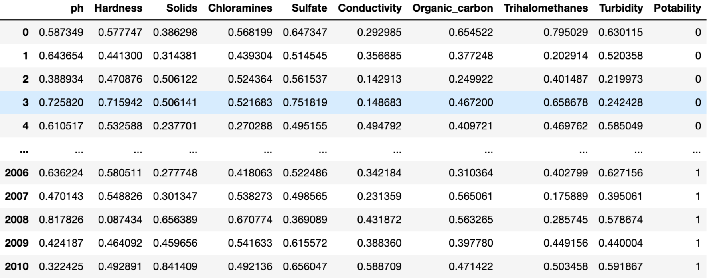

## Evaluating a model on a classification task

Let's recall the steps for training a neural network:

1. Create a dataset.
2. Create a model.
3. Define a loss function.
4. Define an optimizer.
5. Run a training loop, where for each batch of samples in the dataset, we repeat:
   1. Zeroing the graidents.
   2. Forward pass to get predictions for the current training batch.
   3. Calculating the loss.
   4. Calculating gradients.
   5. Updating model parameters.

<details>

<summary>Could we elaborate a bit more on point 5 - what dataset are we talking about?</summary>

When training neural networks in a supervised fashion we typically break down all the labeled data we have into three sets:

| Name       | Percent of data | Description                                                                                                 |
| ---------- | --------------- | ----------------------------------------------------------------------------------------------------------- |
| Train      | 70-90           | Learn optimal values for model parameters                                                                   |
| Validation | 5-15            | Hyperparameter tuning (batch size, learning rate, number of layers, number of neurons, type of layers, etc) |
| Test       | 5-15            | Only used once to calculate final performance metrics                                                       |

</details>

<details>

<summary>What classification metrics have you heard of?</summary>

- Accuracy: percentage of correctly classified examples.
- Recall: from all true examples, what percentage did our model find.
- Precision: from all the examples are model labelled as true, what percentage of the examples are actually true.
- F1: harmonic mean of precision and recall.


<details>

<summary>When should we use accuracy?</summary>

Only when all of the classes are perfectly balanced.

</details>

<details>

<summary>What metic should we use when we have an unbalanced target label?</summary>

F1-score.

</details>

</details>

## Calculating validation loss

After each training epoch we iterate over the validation set and calculate the average validation loss.

It's important to put the model in an evaluation mode, so no gradients get calculated and all layers are used as if they were processing user data.

```python
validation_loss = 0.0
model.eval()
with torch.no_grad():
    for sample, label in validation_loader:
        model(sample)
        loss = criterion(outputs, labels)
        validation_loss += loss.item()
epoch_validation_loss = validation_loss / len(validation_loader)
model.train()
```

## The Bias-Variance Tradeoff

<details>

<summary>What have you heard about it?</summary>

It can be used to determine whether a model has reached its best capabilities, is underfitting or is overfitting.


<details>

<summary>What is underfitting?</summary>

High training loss and high validation loss.

</details>

<details>

<summary>What is overfitting?</summary>

Low training loss and high validation loss.

</details>

</details>

## Calculating accracy with [`torchmetrics`](https://lightning.ai/docs/torchmetrics/stable//index.html)

The package `torchmetrics` provides implementations of popular classification and regression metrics:

- [accuracy](https://lightning.ai/docs/torchmetrics/stable/classification/accuracy.html#id4).
- [recall](https://lightning.ai/docs/torchmetrics/stable/classification/recall.html#id4).
- [precision](https://lightning.ai/docs/torchmetrics/stable/classification/precision.html#id4).
- [f1-score](https://lightning.ai/docs/torchmetrics/stable/classification/f1_score.html#f-1-score).
- [mean squared error](https://lightning.ai/docs/torchmetrics/stable/regression/mean_squared_error.html#mean-squared-error-mse).

```python
import torchmetrics

metric = torchmetrics.Accuracy(task='multiclass', num_classes=3)
for samples, labels in dataloader:
    outputs = model(samples)
    acc = metric(outputs, labels.argmax(dim=-1))
acc = metric.compute()
print(f'Accuracy on all data: {acc}')
metric.reset()
```

## Fighting overfitting

<details>

<summary>What is the result of overfitting?</summary>

The model does not generalize to unseen data.

</details>

<details>

<summary>What are the causes of overfitting?</summary>

| Problem                     | Solution                              |
| --------------------------- | ------------------------------------- |
| Model has too much capacity | Reduce model size / Add dropout       |
| Weights are too large       | Use weight decay                      |
| Dataset is not large enough | Get more data / Use data augmentation |

</details>

## Using a [`Dropout` layer](https://pytorch.org/docs/stable/generated/torch.nn.Dropout.html#dropout)

- During training, randomly zeroes some of the elements of the input tensor with probability `p`.
  - This would mean that the neuron did not "fire" / did not get triggered.
- Add after the activation function.
- Behaves differently during training and evaluation/prediction:
  - we must remember to switch modes using `model.train()` and `model.eval()`.

```python
nn.Sequential(
    nn.Linear(n_features, n_classes),
    nn.ReLU(),
    nn.Dropout(p=0.8))
```

We can try it out:

```python
import numpy as np
import torch
from torch import nn

m = nn.Dropout(p=0.2)

inp = torch.randn(20, 16)
(m(inp).view(-1).numpy() == 0).mean()
```

```console
np.float64(0.1925)
```

## Weight decay

```python
optimizer = optim.SGD(model.parameters(), lr=1e-3, weight_decay=1e-4)
```

- Weight decay adds `L2` penalty to loss function to discourage large weights and biases.
  - Effectively, this is done by increasing the gradient with a `weight_decay` fraction of the weights:

```python
d_p = p.grad.data
if weight_decay != 0:
    d_p.add_(weight_decay, p.data)
```

- Optimizer's `weight_decay` parameter takes values between `0` and `1`.
  - Typically small value, e.g. `1e-3`.
- The higher the parameter, the stronger the regularization, thus the less likely the model is to overgit.
- More on the topic [in this post](https://discuss.pytorch.org/t/how-pytorch-implement-weight-decay/8436/3).

> **Note:** Using strong regularization, results in slower training times.

## Data augmentation


- End result: Increased size and diversity of the training set.
- We'll discuss different pros and cons of this strategy in the upcoming weeks.

## Steps to maximize model performance

1. Overfit the training set (rarely possible to a full extend).
   - We ensure that the problem is solvable using deep learning.
   - We set a baseline to aim for with the validation set.
2. Reduce overfitting.
   - Improve performance on the validation set.
3. Fine-tune hyperparameters.

### Step 1: overfit the training set

If this is not possible to do with the full training set due to memory constraints, modify the training loop to overfit a `batch_size` of points (`batch_size=1` is also a possibility).

```python
features, labels = next(iter(trainloader))
for i in range(1e3):
    outputs = model(features)
    loss = criterion(outputs, labels)
    loss.backward()
    optimizer.step()
```

- Should reach accuracy (or your choice of metric) `1.0` and loss close (or equal) to `0.0`.
- This also helps with finding bugs in the code or in the data.
- Use the default value for the learning rate.
- Deliverables:
    1. Large enough model.
    2. Minimum training loss.

### Step 2: reduce overfitting

- Start to keep track of:
  - training loss;
  - training metric values;
  - validation loss;
  - validation metric values.
- Experiment with:
  - Dropout;
  - Data augmentation;
  - Weight decay;
  - Reducing the model capacity.
- Keep track of each hyperparamter.
- Deliverables:
  1. Maximum metric value on the validation set.
  2. Minimum loss on the validation set.
  3. Plots validating model performance.


Be careful to not increase the training loss and reduce the training metric by too much (overfitting-reduction strategies often lead to this):


### Step 3: fine-tune hyperparameters

Grid search:


Random search:


# Week 04 - Convolutional Neural Networks. Building multi-input and multi-output models

## Custom PyTorch Datasets

We can create a custom dataset for our water potability data by inheriting the PyTorch [Dataset class](https://pytorch.org/docs/stable/data.html#torch.utils.data.Dataset). All customs `Dataset` classes must implement the following methods:

- `__init__`: to loads and saves the data in the state of the class. Typically accepts a CSV or an already loaded numpy matrix;
- `__len__`: returns the number of instaces in the saved data;
- `__getitem__`: returns the features and label for a single sample. Note: this method returns **a tuple**! The first element is an array of the features, the second is the label.

See an example [here](https://pytorch.org/tutorials/beginner/basics/data_tutorial.html#creating-a-custom-dataset-for-your-files).

> **Note:** While it's not shown in the example, please don't forget to initialize the parent class as well by calling `super().__init__()`.

## Checkpoint

What is the correct way of iterating through the dataloader and passing the inputs to the model?

A. `for img, alpha, labels in dataloader_train: outputs = net(img, alpha)`
B. `for img, alpha, labels in dataloader_train: outputs = net(img)`
C. `for img, alpha in dataloader_train: outputs = net(img, alpha)`
D. `for img, alpha in dataloader_train: outputs = net(img)`

<details>
<summary>Reveal answer</summary>

A.

</details>

## Class-Based PyTorch Model

This time we'll use another syntax to define models: the `class-based` approach. It provides more flexibility the the functional style.

Here's an example of sequential model definition:

```python
import torch.nn as nn

net = nn.Sequential(
  nn.Linear(9, 16),
  nn.ReLU(),
  nn.Linear(16, 8),
  nn.ReLU(),
  nn.Linear(8, 1),
  nn.Sigmoid(),
)
```

Here's how it can be re-written using the `class-based` approach:

```python
class Net(nn.Module):
  def __init__(self):
    super(Net, self).__init__()
    self.fc1 = nn.Linear(9, 16)
    self.fc2 = nn.Linear(16, 8)
    self.fc3 = nn.Linear(8, 1)
  
  def forward(self, x):
    x = nn.functional.relu(self.fc1(x))
    x = nn.functional.relu(self.fc2(x))
    x = nn.functional.sigmoid(self.fc3(x))
    return x

net = Net()
```

As can be seen above, every model should define the following two methods:

- `__init__()`: defines the layers that are used in the `forward()` method;
- `forward()`: defines what happens to the model inputs once it receives them; this is where you pass inputs through pre-defined layers.

By convention `torch.nn.functional` gets imported with an alias `F`. That means that the above body of `forward` can be rewritten like:

```python
import torch.nn.functional as F

...

x = F.relu(self.fc1(x))
x = F.relu(self.fc2(x))
x = F.sigmoid(self.fc3(x))
```

- PyTorch has many famous deep learning models already built-in.
- For example, various vision models can be found in the [torchvision.models package](https://pytorch.org/vision/0.9/models.html).

## Unstable gradients

- **Vanishing gradients**: Gradients get smaller and smaller during backward pass.


- Results:
  - Earlier layers get smaller parameter updates;
  - Model does not learn.
  - Loss becomes constant.

- **Exploding gradients**: Gradients get larger and larger during backward pass.


- Results:
  - Parameter updates are too large.
  - Loss becomes higher and higher.

### Solutions to unstable gradients

1. Proper weights initialization.
2. More appropriate activation functions.
3. Batch normalization.

#### Proper weights initialization

Good weight initialization ensures that the:

- Variance of layer inputs = variance of layer outputs;
- Variance of gradients is the same before and after a layer.

How to achieve this depends on the activation function:

- For ReLU and similar (sigmoid included), we can use [He/Kaiming initialization](https://paperswithcode.com/method/he-initialization).

```python
import torch.nn.init as init

init.kaiming_uniform_(layer.weight) # https://pytorch.org/docs/stable/nn.init.html#torch.nn.init.kaiming_uniform_
```

#### Batch normalization

- Good choice of initial weights and activations doesn't prevent unstable gradients during training (only during initialization).
- Solution is to add another transformation after each layer - batch normalization:
  1. Standardizes the layer's outputs by subtracting the mean and diving by the standard deviation **in the batch dimension**.
  2. Scales and shifts the standardized outputs using learnable parameters.
- Result:
  - Model learns optimal distribution of inputs for each layer.
  - Faster loss decrease.
  - Helps against unstable gradients during training.
- Available as [`nn.BatchNorm1d`](https://pytorch.org/docs/stable/generated/torch.nn.BatchNorm1d.html).
  - **Note 1:** The number of features has to be equal to the number of output neurons of the previous layer.
  - **Note 2:** Done after applying layer and before the activation.
- `BatchNorm1d` vs `BatchNorm2d`:
  - Mathematically, there is no difference between them:
    - <https://discuss.pytorch.org/t/why-2d-batch-normalisation-is-used-in-features-and-1d-in-classifiers/88360>;
    - <https://github.com/christianversloot/machine-learning-articles/blob/main/batch-normalization-with-pytorch.md>.
  - [`BatchNorm1d`](https://pytorch.org/docs/main/generated/torch.nn.BatchNorm1d.html): Applies Batch Normalization over a `2D` or `3D` input.
  - [`BatchNorm2d`](https://pytorch.org/docs/main/generated/torch.nn.BatchNorm2d.html): Applies Batch Normalization over a `4D` input.
  - In general:
    - Whenever the previous layer handles image data with convolutions, we use `BatchNorm2d` (as each sample in the batch has `3` channels whole batch is `4D`).
    - Whenever the previous layer is `Linear`, we use `BatchNorm1d`.

## The Clouds dataset

We will be working with a dataset containing pictures of various types of clouds.


<details>

<summary>How can we load one of those images in Python?</summary>

We can use the [`pillow`](https://pypi.org/project/pillow/) package. It is imported with the name `PIL` and has a very handly [`Image.open` function](https://pillow.readthedocs.io/en/latest/handbook/tutorial.html#using-the-image-class).

</details>

<details>

<summary>Wait - what is an image again?</summary>

- The image is a matrix of pixels ("picture elements").
- Each pixel contains color information.

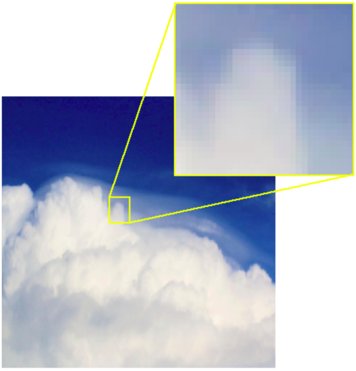

- Grayscale images: integer in the range $[0 - 255]$.
  - 30:

    

- Color images: three/four integers, one for each color channel (**R**ed, **G**reen, **B**lue, sometimes also **A**lpha).
  - RGB = $(52, 171, 235)$:

    

</details>

## Converting pixels to tensors and tensors to pixels

### [`ToTensor()`](https://pytorch.org/vision/main/generated/torchvision.transforms.ToTensor.html#totensor)

- Converts pixels to float tensors (PIL image => `torch.float`).
- Scales values to $[0.0, 1.0]$.

### [`PILToTensor()`](https://pytorch.org/vision/main/generated/torchvision.transforms.PILToTensor#piltotensor)

- Converts pixels to `8`-bit unsigned integers (PIL image => `torch.uint8`).
- Does not scale values: they stay in the interval $[0, 255]$.

### [`ToPILImage()`](https://pytorch.org/vision/0.9/transforms.html#torchvision.transforms.ToPILImage)

- Converts a tensor or an numpy `ndarray` to PIL Image.
- Does not change values.

## Loading images with PyTorch

The easiest way to build a `Dataset` object when we have a classification task is with a predefined directory structure.

As we load the images, we could also apply preprocessing steps using `torchvision.transforms`.

```text
clouds_train
  - cumulus
    - 75cbf18.jpg
    - ...
  - cumulonimbus
  - ...
clouds_test
  - cumulus
  - cumulonimbus
```

- Main folders: `clouds_train` and `clouds_test`.
  - Inside: one folder per category.
    - Inside: image files.

```python
from torchvision.datasets import ImageFolder
from torchvision import transforms
from torch.utils import data

train_transforms = transforms.Compose([
  transforms.ToTensor(), # convert the object into a tensor
  transforms.Resize((128, 128)), # resize the images to be of size 128x128
])

dataset_train = ImageFolder(
  'DATA/clouds/clouds_train',
  transform=train_transforms,
)

dataloader_train = data.DataLoader(
  dataset_train,
  shuffle=True,
  batch_size=1,
)

image, label = next(iter(dataloader_train))
print(image.shape)
```

```console
torch.Size([1, 3, 128, 128])
```

In the above output:

- `1`: batch size;
- `3`: three color channels;
- `128`: height;
- `128`: width.

We could display these images as well, but we'll have to do two transformations:

1. We need to have a three dimensional matrix. The above shape represents a `4D` one. To remove all dimensions with size `1`, we can use the `squeeze` method of the `image` object.
2. The number of color channels must come after the height and the width. To change the order of the dimensions, we can use the `permute` method of the `image` object.

```python
image = image.squeeze().permute(1, 2, 0)
print(image.shape)
```

```console
torch.Size([128, 128, 3])
```

We can now, plot this using `matplotlib`:

```python
import matplotlib.pyplot as plt
plt.imshow(image)
plt.axis('off')
plt.show()
```


## Data augmentation

<details>

<summary>What is data augmentation?</summary>

Applying random transformations to original data points.

</details>

<details>

<summary>What is the goal of data augmentation?</summary>

Generating more data.

</details>

<details>

<summary>On which set should data augmentation be applied to - train, validation, test, all, some?</summary>

Only to the training set.

</details>

<details>

<summary>What is the added value of data augmentation?</summary>

- Increase the size of the training set.
- Increase the diversity of the training set.
- Improve model robustness.
- Reduce overfitting.

</details>

All supported image augmentation transformation can be found in [the documentation of torchvision](https://pytorch.org/vision/stable/transforms.html#v2-api-reference-recommended).

<details>

<summary>Image augmentation operations can sometimes negatively impact the training process. Can you think of two deep learning tasks in which specific image augmentation operations should not be used?</summary>

- Fruit classification and changing colors:

One of the supported image augmentation transformations is [`ColorJitter`](https://pytorch.org/vision/stable/auto_examples/transforms/plot_transforms_illustrations.html#colorjitter) - it randomly changes brightness, contrast, saturation, hue, and other properties of an image.

If we are doing fruit classification and decide to apply a color shift augmentation to an image of the lemon, the augmented image will still be labeled as lemon although it would represent a lime.


- Hand-written characters classification and vertical flip:


</details>

<details>

<summary>So, how do we choose appropriate augmentation operations?</summary>

- Whether an augmentation operation is appropriate depends on the task and data.
- Remember: Augmentations impact model performance.

<details>

<summary>Ok, but then how do we see the dependence in terms of data?</summary>

Explore, explore, explore!

</details>

</details>

<details>

<summary>What transformations can you think of for our current task (cloud classification)?</summary>

```python
train_transforms = transforms.Compose([
  transforms.RandomHorizontalFlip(), # simulate different viewpoints of the sky
  transforms.RandomRotation(45), # expose model to different angles of cloud formations
  transforms.RandomAutocontrast(), # simulate different lighting conditions
  transforms.ToTensor(), # convert the object into a tensor
  transforms.Resize((128, 128)), # resize the images to be of size 128x128
])
```


</details>

Which of the following statements correctly describe data augmentation? (multiple selection)

A. Using data augmentation allows the model to learn from more examples.
B. Using data augmentation increases the diversity of the training data.
C. Data augmentation makes the model more robust to variations and distortions commonly found in real-world images.
D. Data augmentation reduces the risk of overfitting as the model learns to ignore the random transformations.
E. Data augmentation introduces new information to the model that is not present in the original dataset, improving its learning capability.
F. None of the above.

<details>

<summary>Reveal answer</summary>

Answers: A, B, C, D.

Data augmentation allows the model to learn from more examples of larger diversity, making it robust to real-world distortions.

It tends to improve the model's performance, but it does not create more information than is already contained in the original images.

<details>

<summary>What should we prefer - using more real training data or generating it artificially?</summary>

If available, using more training data is preferred to creating it artificially with data augmentation.

</details>

</details>

## CNNs - The neural networks for image processing

Let's say that we have the following image:


<details>

<summary>What is the problem of using linear layers to solve the classification task?</summary>

Too many parameters.

If the input size is `256x256`, that means that the network has `65,536` inputs!

If the first linear layer has `1000` neurons, only it alone would result in over `65` **million** parameters! For a color image, this number would be even higher.


So, the three main problems are:

- Incredible amount of resources needed.
- Slow training.
- Overfitting.

</details>

<details>

<summary>What is another more subtle problem of using linear layers only?</summary>

They are not space-invariant.

Linearly connected neurons could learn to detect the cat, but the same cat **won't be recognized if it appears in a *different* location**.


</details>

<details>

<summary>So, ok - the alternative is using CNNs. How do they work?</summary>


- Parameters are collected in one or more small grids called **filters**.
- **Slide** filter(s) over the input.
- At each step, perform the **convolution** operation.
- The end result (after the whole image has been traversed with **one filter**) is called a **feature map**:
  - Preserves spatial patterns from the input.
  - Uses fewer parameters than linear layer.
- Remember: one filter = one feature map. We can slide **multiple filters over an original image**, to get multiple feature maps.
- We can then apply activations to the feature maps.
- The set of all feature maps combined, form the output of a single convolutional layer.
- Available in `torch.nn`: [`nn.Conv2d(in_channels=3, out_channels=32, kernel_size=3)`](https://pytorch.org/docs/stable/generated/torch.nn.Conv2d.html):
  - `in_channels`: number of input dimensions.
  - `out_channels`: number of filters.
  - `kernel_size`: height and width of the filter(s).

</details>

<details>

<summary>What does the convolution operation comprise of?</summary>

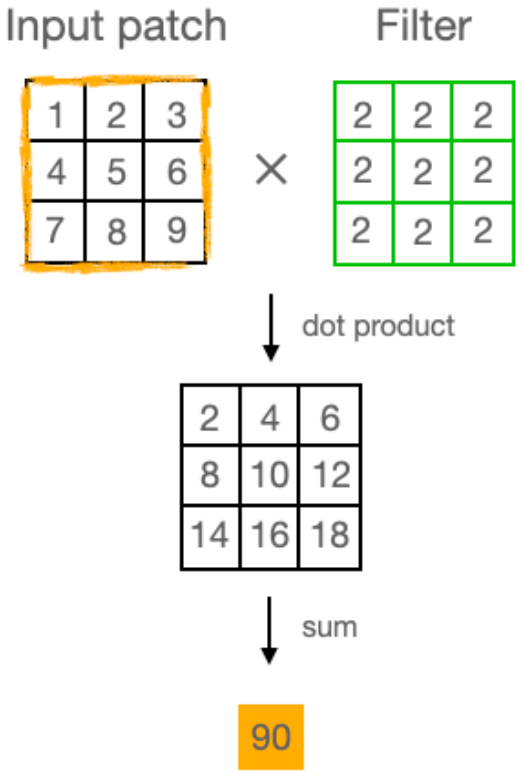

</details>

<details>

<summary>What is zero padding?</summary>

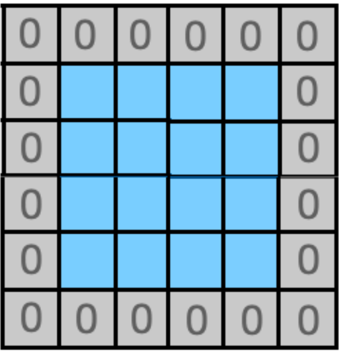

- Add a frame of zeros to the input of the convolutional layer.
- This maintains the spatial dimensions of the input and output tensors.
- Ensures border pixels are treated equally to others.

Available as `padding` argument: `nn.Conv2d(3, 32, kernel_size=3, padding=1)`.

</details>

<details>

<summary>What is max pooling?</summary>


- Slide non-overlapping window over input.
- At each position, retain only the maximum value.
- Used after convolutional layers to reduce spatial dimensions.

Available in `torch.nn`: [`nn.MaxPool2d(kernel_size=2)`](https://pytorch.org/docs/stable/generated/torch.nn.MaxPool2d.html).

</details>

<details>

<summary>But what happens when the input is three dimensional - what do the filters look like?</summary>

The `2D` part of a `2D` convolution does not refer to the dimension of the convolution input, nor of dimension of the filter itself, but rather of the space in which the filter is allowed to move (`2` directions only).

Different `2D`-array filters are applied to each dimension and then their outputs are summed up (you can also think of this as a single `3D` matrix):


$$(1*1+2*2+4*3+5*4)+(0*0+1*1+3*2+4*3) = 56$$

More on this [here](https://stackoverflow.com/a/62544803/16956119) and [here](https://d2l.ai/chapter_convolutional-neural-networks/channels.html).

</details>

## Architecture

The typical architecture follows the style:

1. Convolution.
2. Activation function - `ReLU`, `ELU`, etc.
3. Max pooling.
4. Iterate the above until there are much more filters than heigh and width (effectively, until we get a much "deeper" `z`-axis).
5. Flatter everything into a single vector using [`nn.Flatten`](https://pytorch.org/docs/stable/generated/torch.nn.Flatten.html). This vector is the ***summary of the original input image***.
6. Apply several regular linear layers to it.


Here's one famous architecture - [VGG-16](https://arxiv.org/abs/1409.1556v6):


In our case, we could have something like the following:


Which of the following statements are true about convolutional layers? (multiple selection)

A. Convolutional layers preserve spatial information between their inputs and outputs.
B. Adding zero-padding around the convolutional layer's input ensures that the pixels at the border receive as much attention as those located elsewhere in the feature map.
C. Convolutional layers in general use fewer parameters than linear layers.

<details>

<summary>Reveal answer</summary>

All of them.

</details>

## Precision & Recall for Multiclass Classification (revisited)

### Computing total value

Sample results for multiclass classification:

```console
              precision    recall  f1-score   support

     class 0       0.50      1.00      0.67         1
     class 1       0.00      0.00      0.00         1
     class 2       1.00      0.67      0.80         3

    accuracy                           0.60         5
   macro avg       0.50      0.56      0.49         5
weighted avg       0.70      0.60      0.61         5
```

`Support` represents the number of instances for each class within the true labels. If the column with `support` has different numbers, then we have class imbalance.

- `macro average` = $\frac{F1_{class1} + F1_{class2} + F1_{class3}}{3}$
- `weighted average` = $\frac{F1_{class1}*SUPPORT_{class1} + F1_{class2}*SUPPORT_{class2} + F1_{class3}*SUPPORT_{class3}}{3}$
- `micro average` = $\frac{F1_{class1}*SUPPORT_{class1} + F1_{class2}*SUPPORT_{class2} + F1_{class3}*SUPPORT_{class3}}{SUPPORT_{class1} + SUPPORT_{class2} + SUPPORT_{class3}}$

To calculate them with `torch`, we can use the classes [`torchmetrics.Recall`](https://lightning.ai/docs/torchmetrics/stable/classification/recall.html) and [`torchmetrics.Precision`](https://lightning.ai/docs/torchmetrics/stable/classification/precision.html):

```python
from torchmetrics import Recall

recall_per_class = Recall(task='multiclass', num_classes=7, average=None)
recall_micro = Recall(task='multiclass', num_classes=7, average='micro')
recall_macro = Recall(task='multiclass', num_classes=7, average='macro')
recall_weighted = Recall(task='multiclass', num_classes=7, average='weighted')
```

When to use each:

- `micro`: imbalanced datasets.
- `macro`: consider errors in small classes as equally important as those in larger classes.
- `weighted`: consider errors in larger classes as most important.

We also have the [F1 score metric](https://lightning.ai/docs/torchmetrics/stable/classification/f1_score.html).

<details>

<summary>What does multilabel classification mean?</summary>

When one instance can get multiple classes assigned to it. This is the case, for example, in research article authorship identification: one article has multiple authors.

</details>

### Computing per class value

- We can also analyze the performance per class.
- To do this, compute the metric, setting `average=None`.
  - This gives one score per each class:

```python
print(f1)
```

```console
tensor([0.6364, 1.0000, 0.9091, 0.7917,
        0.5049, 0.9500, 0.5493],
        dtype=torch.float32)
```

- Then, use the `Dataset`'s `.class_to_idx` attribute that maps class names to indices.

```python
dataset_test.class_to_idx
```

```console
{'cirriform clouds': 0,
 'clear sky': 1,
 'cumulonimbus clouds': 2,
 'cumulus clouds': 3,
 'high cumuliform clouds': 4,
 'stratiform clouds': 5,
 'stratocumulus clouds': 6}
```

## Multi-input models

- Models that accept more than one source of data.
- We might want the model to use **multiple information sources**, such as two images of the same car to predict its model.
- **Multi-modal models** can work on different input types such as image and text to answer a question about the image and/or the text.
- In **metric learning**, the model learns whether two inputs represent the same object.
  - Passport control system that compares our passport photo with a picture it takes of us.
- The model can learn that that two augmented versions of the same input represent the same object, thus outputting what the commonalities are or what transformations were applied.


## The Omniglot dataset

A collection of images of `964` different handwritten characters from `30` different alphabets.


**Task:** Build a two-input model to classify handwritten characters. The first input will be the image of the character, such as this Latin letter `k`. The second input will the the alphabet that it comes from expressed as a one-hot vector.


<details>
<summary>How can we solve this?</summary>

Process both inputs separately, then concatenate their representations.


The separate processing, would just be us implementing two networks and using them as layers in our one network that will process one sample:

- The image processing network/layer can have the following architecture:
  - several chained convolutional -> max pool -> activation layers;
  - a final linear layer than ouputs a given size, for example `128`.
- The alphabet processing layer can have:
  - several linear -> activation layers;
  - a final linear layer that outputs a given size, for example `8`.
- We can then `fuse` the the outputs in another linear layer by passing the [concatenated output](https://pytorch.org/docs/main/generated/torch.cat.html#torch-cat) from the other two neural networks:

```python
class MyModel(nn.Module):
  def __init__(self):
    super().__init__()
    self.layers1 = nn.ModuleList([
      nn.Linear(32, 64),
      nn.ReLU(),
      nn.Linear(64, 10)
    ])
    self.layers2 = nn.ModuleList([
      nn.Linear(64, 32),
      nn.ReLU(),
      nn.Linear(32, 1)
    ])
    self.classfier = nn.Linear(10 + 1, 42)
      
  def forward(self, x1, x2):
    for layer in self.layers1:
      x1 = layer(x1)
    for layer in self.layers2:
      x2 = layer(x2)
    x = torch.cat((x1, x2), dim=1)
    return self.classfier(x)
```

</details>

## Multi-output models

- **Predict multiple labels** from the same input, such as a car's make and model from its picture;
- **Multi-label classification**: the input can belong to multiple classes simultaneously:
  - Authorship attribution of a research paper (one paper => many authors).
- In very deep models built of blocks of layers we can add **extra outputs** predicting the same targets after each block.
  - Goal: ensure that the early parts of the model are learning features useful for the task at hand while also serving as a form of regularization to boost the robustness of the network.


## Character and alphabet classification

Build a model to predict both the character and the alphabet it comes from based on the image.


<details>
<summary>What will be the architecture of the model?</summary>

- Define image-processing sub-network.
- Define output-specific classifiers.
- Pass image through dedicated sub-network.
- Pass the result through each output layer.
- Return both outputs.
- We'll therefore have two loss function objects and two metric tracking objects.

</details>

## Loss weighting

- Now that we have two losses (for alphabets and for characters), we have to choose how to combine them to form the final loss of the model.
- The most intuitive way is to just sum them up:

```python
loss = loss_alpha + loss_char
```

<details>
<summary>What are the advantages of this approach?</summary>

Both classification tasks are deemed equally important.

</details>

<details>
<summary>What are the disadvantages of this approach?</summary>

Both classification tasks are deemed equally important.

</details>

### Varying task importance

Classifing the alphabet should be the easier task, since it has less classes.

<details>
<summary>How could we translate this understanding to the model?</summary>

We could multiply the character loss by a scaler:

```python
loss = loss_alpha + loss_char * 2
```

The above is more intuitive for us, however, it'd be better for the model if the weights sum up to `1`, so let's use the below approach:

```python
loss = 0.33 * loss_alpha + 0.67 * loss_char
```

</details>

### Losses on different scales

Losses must be on the same scale before they are weighted and added.

<details>
<summary>But, why - what problems would we have otherwise?</summary>

Example tasks:

- Predict house price => MSE loss.
- Predict quality: low, medium, high => CrossEntropy loss.

- CrossEntropy loss is typically in the single-digits range.
- MSE loss can reach tens of thousands.
- **Result:** Model would ignore quality assessment task.

</details>

<details>
<summary>How do we solve this?</summary>

Normalize both losses before weighing and adding.

```python
loss_price = loss_price / torch.max(loss_price)
loss_quality = loss_quality / torch.max(loss_quality)
loss = 0.7 * loss_price + 0.3 * loss_quality
```

</details>

## Checkpoint

Three versions of the two-output model for alphabet and character prediction that we discussed have been trained: `model_a`, `model_b`, and `model_c`. For all three, the loss was defined as follows:

```python
loss_alpha = criterion(outputs_alpha, labels_alpha)
loss_char = criterion(outputs_char, labels_char)
loss = ((1 - char_weight) * loss_alpha) + (char_weight * loss_char)
```

Each of the three models was trained with a different `char_weight`: `0.1`, `0.5`, or `0.9`.

Here's what accuracies you have recorded:

```python
evaluate_model(model_a)
```

```console
Alphabet: 0.2808536887168884
Character: 0.1869264841079712
```

```python
evaluate_model(model_b)
```

```console
Alphabet: 0.35044848918914795
Character: 0.01783689111471176
```

```python
evaluate_model(model_c)
```

```console
Alphabet: 0.30363956093788147
Character: 0.23837509751319885
```

Which `char_weight` was used to train which model?

A. `model_a`: `0.1`, `model_b`: `0.5`, `model_c`: `0.9`
B. `model_a`: `0.1`, `model_b`: `0.9`, `model_c`: `0.5`
C. `model_a`: `0.5`, `model_b`: `0.1`, `model_c`: `0.9`
D. `model_a`: `0.9`, `model_b`: `0.1`, `model_c`: `0.5`
C. `model_a`: `0.9`, `model_b`: `0.5`, `model_c`: `0.1`

<details>
<summary>Reveal answer</summary>

C.

Notice how the model with `90%` of its focus on alphabet recognition (`char_weight=0.1`) does very poorly on the character task.

As we increase `char_weight` to `0.5`, the alphabet accuracy drops slightly due to the increased focus on characters, but when it reaches `char_weight=0.9`, the alphabet accuracy increases slightly with the character accuracy, highlighting the synergy between the tasks.

</details>

# Week 05 - Image Processing

**This session is focused on helping you increase the quality of your entire dataset (validation and test included) before you start thinking about modelling it. As such the results from the below techniques have many different downstream applications, only one of which is creating and training deep learning models.**

## Introduction

### Context

We understand now that the quality of images we pass to our models directly affects the quality of the model's predictions. We also want to:

- train a model using a low number of epochs;
- train a model that does not underfit our data;
- train a model that does not overfit our data;
- train the smallest model possible (small and simple architecture) that would do the job (Occam's razor):
  - smaller => faster inferece;
  - smaller => faster training;
  - smaller => faster fine-tuning;
  - smaller => less storage.

### Problem

We start creating and experimenting with multiple models but they all:

- become too big in terms of parameters;
- take long to train and predict;
- don't manage to obtain high metric scores on the validation set.

### Solution

We can try to help the models by **removing unnecessary information in their inputs**. For example, we can:

- leave only the edges of the objects present in the images;
- give the models the contours of the objects instead of the full objects. The model then would:
  - only have to figure out what shape the contours represent
  - not have to deal with extracting the edges and forming contours using them (i.e. we reduce the amount of feature engineering, by doing it beforehand for all incoming data).
- reduce the noise in the images:
  - be it background noise;
  - or just removing objects (parts of the image) that the models should not pay attention to.
- and do a lot more to help get a better representation of our data, by **focusing the model's attention** on what would help it do better.

### Benefits

- We get all the above benefits.
- We get a higher quality dataset.
- Because the preprocessing it predefined we know what task the model will be solving (because we do the feature engineering).

### Context

We want to transform our images:

- be it their entire representation (ex. going from a matrix to a vector of points);
- or by altering how (and how much) information they represent.

### Problem

We don't know a library that can do that.

### Solution - scikit-image


- Easy to use.
- Makes use of Machine Learning.
- Out of the box / Built-in complex algorithms.

### Images in scikit-image

The library has a lot of built-in images. Check them out [in the data module](https://scikit-image.org/docs/stable/api/skimage.data.html#).

```python
from skimage import data
rocket_image = data.rocket()
print(type(rocket_image))
print(rocket_image.shape)
print(rocket_image[0])
```

```console
<class 'numpy.ndarray'>
(427, 640, 3)
[[17 33 58]
 [17 33 58]
 [17 33 59]
 ...
 [ 8 19 37]
 [ 8 19 37]
 [ 7 18 36]]
```

Display images:

```python
def show_image(image, title='Image', cmap_type='gray'):
  plt.imshow(image, cmap=cmap_type)
  plt.title(title)
  plt.axis('off')
  plt.show()

show_image(rocket_image)
```


## RGB and Grayscale

### Context

Often we want to reduce the information present by converting to grayscale.

It can also be the case that we want to go back from grayscale to RGB.

Grayscale:


RGB:


### Problem

How would we do that?

### Solution - `color.rgb2gray` and `color.gray2rgb`

Convert between the two:

```python
from skimage import data, color
original = data.astronaut()
grayscale = color.rgb2gray(original)
rgb = color.gray2rgb(grayscale)
```

```python
show_image(original)
```


```python
show_image(grayscale)
```


The value of each grayscale pixel is calculated as the weighted sum of the corresponding red, green and blue pixels as:

```text
Y = 0.2125 R + 0.7154 G + 0.0721 B
```

```python
show_image(rgb)
print(f'{grayscale.shape=}')
print(f'{rgb.shape=}')
```


```console
grayscale.shape=(512, 512)
rgb.shape=(512, 512, 3)
```

Note that `color.gray2rgb` just duplicates the gray values over the three color channels (as it cannot know the true intensities).

## Basic image operations

### Using `numpy`

Because the type of the loaded images is `<class 'numpy.ndarray'>`, we can directly apply `numpy` manipulations.

#### Vertical flip

```python
show_image(np.flipud(original))
```


#### Horizontal flip

```python
show_image(np.fliplr(original))
```


### The `transform` module

For more complex transformations, we can use the `skimage` library instead:

#### Rotating

```python
from skimage import transform
transform.rotate(image, -90)
```


#### Rescaling

```python
from skimage import transform
transform.rescale(image, 1/4, anti_aliasing=True)
```


#### Resizing

```python
from skimage import transform
height = 400
width = 500
transform.resize(image, (height, width), anti_aliasing=True)
```


##### Problem

When we rescale/reside by a large factor:

- we lose the bondaries of the objects;
- background and foreground objects merge (the distinction is lost).


##### Solution - anti-aliasing

The is because of the [Aliasing phenomenon](https://en.wikipedia.org/wiki/Aliasing): a reconstructed signal from samples of the original signal contains low frequency components that **are not present in the original one**.

- Aliasing makes the image look like it has waves or ripples radiating from a certain portion.
  - This happens because the pixelation of the image is poor.

We can then set the `anti_aliasing` parameter to `True`.

## Thresholding

### Context

- We have a task for detecting whether there is a human in a picture.
- We decide that it would be best to reduce the information in an image so as to get a separation between foreground and background.
  - We want all background parts to have `0` and all foreground to have `1`.


In essence, this is a type of image segmentation for object detection. However, we may also have different applications:

- Object detection;
- Face detection;
- Noise removal;
- etc.


### Problem

How do we do that?

### Simple solution - global / histogram based thresholding

- **Image histogram:** A graphical representation of the amount of pixels of each intensity value.
  - From `0` (pure black) to `255` (pure white).


- Goal: Partition an image into a foreground and background, by setting one threshold for all pixels.
- Best for **bimodal** histograms.
- Steps:
  1. Convert to grayscale.
  2. Obtain a threshold value: either manually by looking at the histogram or by using an algorithm.
  3. Set each pixel to:
     - `255` (white) if `value > thresh`
     - `0`, otherwise

We can also automatically try out several global thresholding algorithms. This can be useful when we don't want to manually experiment and choose a value.

```python
from skimage.filters import try_all_threshold
fig, axis = try_all_threshold(grayscale, verbose=False)
```


Once we like what one of the algorithms has produced we can instantiate it manually:

```python
from skimage.filters import threshold_otsu
thresh = threshold_otsu(image)
binary_global = image > thresh
show_image(image, 'Original')
show_image(binary_global, 'Global thresholding')
```


### Advanced solutions: local / adaptive thresholding

- Determine based on surronding values up to a given range.
- Good for uneven background illumination.
- The threshold value is the weighted mean for the local neighborhood of a pixel subtracted by a constant [reference](https://scikit-image.org/docs/stable/api/skimage.filters.html#skimage.filters.threshold_local).
- General tips:
  1. Keep `block_size` relatively large and `offset` relatively small.
  2. Set `block_size` to an odd number.


```python
from skimage.filters import threshold_local
thresh = threshold_local(text_image, block_size=35, offset=10)
binary_global = text_image > thresh
show_image(text_image, 'Original')
show_image(binary_global, 'Local thresholding')
```


## Edge detection

### Context

We have a task about creating a deep learning model that can count the number of coins in an image.

We don't need to know the value of the coints - just their count.

### Problem

How can we increase the quality of our data to help the model?

### Solution - Sobel filter

We can use the [Sobel filter](https://en.wikipedia.org/wiki/Sobel_operator):


The Sobel filter is [built-in](https://scikit-image.org/docs/stable/api/skimage.filters.html#skimage.filters.sobel) in scikit-image. Whenever, you're using it, make sure the image is grayscaled first.

Just like in convolutional neural networks, filters work on a neighborhood of points.


For example the Sobel filter uses the following two filters:


### Advanced solution - edge detection with the [Canny algorithm](https://en.wikipedia.org/wiki/Canny_edge_detector)

Let's say that we do want to also get the sum of the coints. Then Sobel might not work for us. We would have to use a more complex algorithm.

The process of Canny edge detection algorithm can be broken down to four different steps:

1. Smooth the image using a Gaussian with `sigma` width.
2. Apply the horizontal and vertical Sobel operators to get the gradients within the image. The edge strength is the norm of the gradient.
3. Thin potential edges to `1`-pixel wide curves. First, find the normal to the edge at each point. This is done by looking at the signs and the relative magnitude of the `X`-Sobel and `Y`-Sobel to sort the points into `4` categories: `horizontal`, `vertical`, `diagonal` and `antidiagonal`. Then look in the normal and reverse directions to see if the values in either of those directions are greater than the point in question. Use interpolation to get a mix of points instead of picking the one that’s the closest to the normal.
4. Perform a hysteresis thresholding: first label all points above the high threshold as edges. Then recursively label any point above the low threshold that is `8`-connected to a labeled point as an edge.

Here is a visual walkthorugh:


Compared to the Sobel algorithm, Canny:

- can detect more complex edges;
- is faster.

Thus, Canny is widely considered to be the standard edge detection method in image processing:


We can use the function [canny](https://scikit-image.org/docs/stable/api/skimage.feature.html#skimage.feature.canny) to perform edge detection using the Canny algorithm.

Two parameters should be considered when using it:

- `image`: This is the input image. Note that it should be a **2D array**, i.e. **is has to be converted to grayscale first**.
- `sigma`: This is the standard deviation of the Gaussian filter that is applied on step `1` of the execution of the algorithm.
  - It can be any positive floating point value.
  - The higher it is, the less edges are going to be detected, since more aggressive smoothing will be applied. The default value of `1` often works pretty well.

## Contrast enhancement

### Context

We have a task about detecting lung disease:


### Problem

The images that we receive do not show the details well. They are not very contrastive.

The contrast is the difference between the maximum and minimum pixel intensity in the image.


- An image of low contrast has small difference between its dark and light pixel values.
  - Is usually skewed either to the right (being mostly light), to the left (when is mostly dark), or located around the middle (mostly gray).


### Solutions

- **Contrast stretching**: stretches the histogram so the full range of intensity values of the image is filled.
- **Histogram equalization (HE)**: spreads out the most frequent histogram intensity values using a probability distribution.
  - Standard HE;
  - Adaptive HE (also known as AHE);
  - Contrast Limited Adaptive HE (also known as [CLAHE](https://en.wikipedia.org/wiki/Adaptive_histogram_equalization)).


#### Standard Histogram Equalization

```python
from skimage import exposure
image_eq = exposure.equalize_hist(image)
```

Sometimes this works well:


But other times, we get a result that, despite the increased contrast, doesn't look natural. In fact, it doesn't even look like the image has been enhanced at all.


#### Contrastive Limited Adaptive Equalization

We can then utilize the CLAHE method to obtain a better representation of our image:


```python
from skimage import exposure
exposure.equalize_adapthist(image, clip_limit=0.03)
```


### Checkpoint

What is the contrast of the following image?


A. The contrast is `255` (high contrast).
B. The contrast is `148`.
C. The contrast is `189`.
D. The contrast is `49` (low contrast).

<details>
<summary>Reveal answer</summary>

B.

It can be inferred from the histogram:

- The maximum value is almost `250` (`247` in reality).
- The minimum value is around `100` (`99` in reality).

$247 - 99 = 148$

</details>

## Image Morphology

<details>
<summary>What is image morphology?</summary>

The study of the shapes/textures of objects in an image.

</details>

<details>
<summary>What task can image morphology help with?</summary>

- Object detection.
- Optical character recognition.

</details>

<details>
<summary>Does image morphology work best with binary, grayscale or color images?</summary>

- It is typically applied after (binary) thresholding, so is works best with binary images.
- Can be extended to [grayscale](https://citeseerx.ist.psu.edu/document?repid=rep1&type=pdf&doi=8ae9fc1e08c790f737d52c4ab6e20234aa269faa).

</details>

<details>
<summary>What problems might binary images have that could be addressed by image morphology?</summary>

They can often be distorted by noise and texture:


Simple tasks can start to become complex:


</details>

<details>
<summary>What are the two most basic morphological operations?</summary>

Dilation:


and erosion:


<details>
<summary>Looking at the examples what does dilation do?</summary>

It adds pixels to the boundaries of objects in an image.

</details>

<details>
<summary>Looking at the examples what does erosion do?</summary>

It removes pixels on object boundaries.

</details>

</details>

<details>
<summary>What is the "structuring element"?</summary>

- It defines the number of pixels added or removed.
- It's implemented as a small binary image used to `probe` the input image.
- The input image should be padded:
  - with `1`s, if the operation is erosion.
  - with `0`s, if the operation is dilation.

We try to `fit` it in the object we want to apply erosion or dilation to.


Dilation then is the set of all points where the structuring element `touches` or `hits` the foreground. If that is the case, `1` is outputted at the origin of the structuring element.

Erosion is the set of all points in the image where the structuring element fits **entirely**. If that is the case, `1` is outputted at the origin of the structuring element.

</details>

## Checkpoint

Compute dilation on the image using the structuring element.


<details>
<summary>Reveal answer</summary>


You can play around with dilation and erosion [here](https://animation.geekosophers.com/morphological-operations/Dilation/Dilation%20Animation%20Js/index.html) and [here](https://animation.geekosophers.com/morphological-operations/Erosion/Erosion%20Animation%20Js/index.html).

</details>

## Shapes in `scikit-image`

To create structuring elements we can use the function [`footprint_rectangle`](https://scikit-image.org/docs/stable/api/skimage.morphology.html#skimage.morphology.footprint_rectangle).

```python
from skimage import morphology
morphology.footprint_rectangle((4, 4))
```

```console
array([[1, 1, 1, 1],
       [1, 1, 1, 1],
       [1, 1, 1, 1],
       [1, 1, 1, 1]], dtype=uint8)
```

We can then use the functions [`binary_erosion`](https://scikit-image.org/docs/stable/api/skimage.morphology.html#skimage.morphology.binary_erosion) and [`binary_dilation`](https://scikit-image.org/docs/stable/api/skimage.morphology.html#skimage.morphology.binary_dilation).

## Restoring images with [inpainting](https://en.wikipedia.org/wiki/Inpainting)

We can restore damaged sections of an image, provided it has regions of the same context as the missing piece(s).

> **Definition:** **Inpainting** is a conservation process where damaged, deteriorated, or missing parts of an artwork are filled in to present a complete image.


To do this in `scikit-image` we can use the function [inpaint_biharmonic](https://scikit-image.org/docs/stable/api/skimage.restoration.html#skimage.restoration.inpaint_biharmonic). It takes two arguments:

- `image`: the image to be inpainted;
- `mask`: a NumPy array of `0`s and `1`s. The regions with `1`s should correspond to the regions in `image` that should be inpainted. Thus, the sizes of `mask` and `image` should match.
- `channel_axis` is an optional, but also an important parameter. If `None`, the image is assumed to be a **grayscale** (single channel) image. Otherwise, this parameter indicates **which axis of the array corresponds to channels**.

## Denoising images

- Noise is the result of errors in the image acqusition process.
- Results in pixel values that do not reflect the true intensities of the real scene.

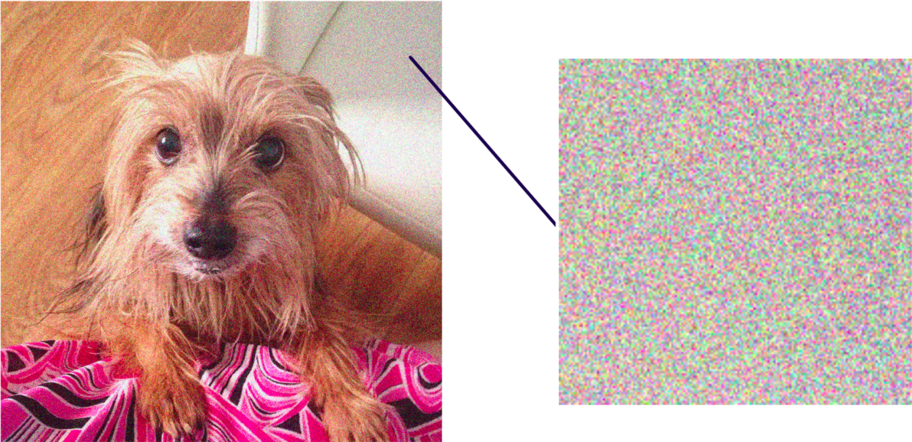

In scikit-learn, we can introduce noise in an image using the function [`random_noise`](https://scikit-image.org/docs/stable/api/skimage.util.html#skimage.util.random_noise). It only requires the image to be passed in.

### Simple solution - Gaussian smoothing

Examples for Gaussian smoothing (also [built-in](https://scikit-image.org/docs/stable/api/skimage.filters.html#skimage.filters.gaussian)):


### Advanced solutions

There are several strategies to remove noise if it's harder to pinpoint it:

- Total variation (TV): minimize the total variation of the image. It tends to produce cartoon-like images, that is, piecewise-constant images, thus any edges in the image are lost;
- Bilateral: replaces the intensity of each pixel with a weighted average of intensity values from nearby pixels. Use when the goal is to preserve the edges in the image;
- [Wavelet](https://scikit-image.org/docs/stable/auto_examples/filters/plot_denoise_wavelet.html);
- [Non-local means](https://en.wikipedia.org/wiki/Non-local_means).


We can apply TV denoising using the function [`denoise_tv_chambolle`](https://scikit-image.org/docs/stable/api/skimage.restoration.html#skimage.restoration.denoise_tv_chambolle) and bilateral filtering using the function [`denoise_bilateral`](https://scikit-image.org/docs/stable/api/skimage.restoration.html#skimage.restoration.denoise_bilateral). Note that both of them have the argument `channel_axis`.

## Segmentation

<details>
<summary>What is segmentation?</summary>

The process of partitioning images into regions (called segments) to simplify and/or change the representation into something more meaniningful and easier to analyze.


</details>

<details>
<summary>What is semantic segmentation?</summary>

Classifying each pixel as belonging to a certain class from a prefined set of classes. This task is usually solved with deep neural networks of type [Autoencoder](https://en.wikipedia.org/wiki/Autoencoder).


</details>

There are two types of segmentation:

- Supervised: we specify the threshold value ourselves;
- Unsupervised: algorithms that subdivide images into meaningful regions automatically.
  - The user may still be able to tweak certain settings to obtain the desired output.

<details>
<summary>What is an example of an unsupervised algorithm for segmentation we saw earlier?</summary>

The otsu thresholding algorithm.

</details>

### Superpixels

- We'll look into segmentation first without neural networks.
- Since looking at single pixels by themselves is a hard task that is solved using neural networks, we'll use groups of pixels.

> **Definition:** A region of pixels is called a **superpixel**.


### Simple Linear Iterative Clustering ([SLIC](https://mrl.cs.vsb.cz/people/gaura/ano/slic.pdf))

- Segments the image using K-Means clustering.
- Takes in all the pixel values of the image and tries to separate them into a predefined number of sub-regions.
- In `scikit-image` it is implemented in the function [`slic`](https://scikit-image.org/docs/stable/api/skimage.segmentation.html#skimage.segmentation.slic).
  - Also has a parameter `channel_axis`.
  - Returns an array that is the same shape as the original image in which each pixel is assigned a label.

```python
import matplotlib.pyplot as plt
from skimage import segmentation, color, data

segments = segmentation.slic(data.astronaut(), n_segments=300, channel_axis=-1)
segments
```

```console
array([[ 1,  1,  1, ...,  9,  9,  9],
       [ 1,  1,  1, ...,  9,  9,  9],
       [ 1,  1,  1, ...,  9,  9,  9],
       ...,
       [51, 51, 51, ..., 56, 56, 56],
       [51, 51, 51, ..., 56, 56, 56],
       [51, 51, 51, ..., 56, 56, 56]], shape=(512, 512))
```

We can then use the function [label2rgb](https://scikit-image.org/docs/stable/api/skimage.color.html#skimage.color.label2rgb). It'll return an image where the segments obtained are highlighted, either with random colors or with the average color of the superpixel segment.

```python
segmented_image = color.label2rgb(segments, data.astronaut(), kind='avg')
plt.axis('off')
plt.imshow(segmented_image)
plt.show()
```


## Image contours

> **Definition:** A contour is a closed shape of points or line segments, representing the boundaries of an object. Having multiple contours means there are multiple objects.

Using image contours will help in:

- measuring object size;
- classifying shapes;
- determining the number of objects in an image.


The input to a contour-finding function should be a **binary image**, which we can produce by first applying thresholding or edge detection. The objects we wish to detect should be white, while the background - black.


We can then use the function [find_contours](https://scikit-image.org/docs/stable/api/skimage.measure.html#skimage.measure.find_contours) passing in the binary image. The function:

- Joins pixels of equal brightness in a 2D array above a given `level` value (default = `(max(image) + min(image)) / 2`).
  - the closer `level` is to `1`, the more sensitive the method is to detecting contours, so more complex contours will be detected.
  - We have to find the value that best detects the contours we care for.
- Returns a list of arrays where each array holds the contours of an object as pairs of coordinates.


The shapes of the contours can tell us which object they belong to. We can then use them to count the objects from a particular shape.


## Corner detection

### Corners

Detecting corners can pop up as a subtask when doing:

- motion detection;
- video tracking;
- panorama stitching;
- 3D modelling;
- object detection;
- image registration;
- etc, etc.


> **Definition:** A corner is the intersection of two edges.

Intuitively, it can also be a junction of contours. We can see some obvious corners in this checkerboard image and in this building image on the right.


> **Definition:** Points of interest are groups of pixels in an image which are invariant to rotation, translation, intensity, and scale changes.

By detecting corners (and edges) as interest points, we can match objects from different perspectives.


### [Harris corner detector](https://en.wikipedia.org/wiki/Harris_corner_detector)

Commonly, the Harris corner detector algorithm can be divided into five steps:

1. Color to grayscale.
2. Spatial derivative calculation.
3. Structure tensor setup.
4. Harris response calculation.
5. Non-maximum suppression.

The first `4` steps are implemented in `scikit-image` as the function [corner_harris](https://scikit-image.org/docs/stable/api/skimage.feature.html#skimage.feature.corner_harris).

It returns the Harris measure response image, i.e., the resulting image shows only the approximated points where the corner-candidates are.


To find the corners in the measure response image, we need to perform non-maximum suppression. For that we can use the function [corner_peaks](https://scikit-image.org/docs/stable/api/skimage.feature.html#skimage.feature.corner_peaks). It:

- Has an optional parameter `min_distance` that sets the minimum distance between peaks. Default value: `1`.
- Has another optional parameter `threshold_rel` sets the minimum intensity of peaks. Default value: `0` (consider all candidate-peaks).
- Returns a list of 2D arrays with corner coordinates.
- Can be applied directly on the return value of the Harris algorithm:

```python
coords = corner_peaks(corner_harris(image), min_distance=5)
print(f'A total of {len(coords)} corners were detected.')
print(coords[:5])
```

```console
A total of 1267 corners were detected.
[[445 310]
 [368 400]
 [455 346]
 [429 371]
 [467 241]]
```

We can then plot those points via `matplotlib` on top of the original image.

```python
plt.plot(coords[:, 1], coords[:, 0], '+r', markersize=15)
```

## Face detection

We can detect faces using the class [Cascade](https://scikit-image.org/docs/stable/api/skimage.feature.html#skimage.feature.Cascade).

```python
detector = Cascade(xml_file=trained_file)
```

The parameter `xml_file` must be set to a file (or path to a file) that holds parameters of a trained model.

Since we're not focusing on doing this right now, we'll use an already trained and built-in model in `scikit-image` using the function [lbp_frontal_face_cascade_filename](https://scikit-image.org/docs/stable/api/skimage.data.html#skimage.data.lbp_frontal_face_cascade_filename).

```python
trained_file = data.lbp_frontal_face_cascade_filename()
detector = Cascade(xml_file=trained_file)
```

We can then use the method [detect_multi_scale](https://scikit-image.org/docs/stable/api/skimage.feature.html#skimage.feature.Cascade.detect_multi_scale) to perform face detection.

- It creates a window that will be moving through the image until it finds something similar to a human face:
  - the parameter `img` can be a grayscale or color image;
  - the parameter `scale_factor` sets by how much the search window will expand after one convolution;
  - the parameter `step_ratio` sets by how much the search window will shift to the right and bottom. `1` means exhaustive search. Values in the interval `[1 .. 1.5]` give good results.
  - the parameter `min_size` sets the minimum size of the window that will be searching for the farthest faces.
  - the parameter `max_size` sets the maximum size of the window that will be searching for the closest faces.
- Searching happens on multiple scales. The window will have a minimum size to spot far-away faces and a maximum size to also find the closer faces in the image.
- The return value is a list of bounding boxes defined by the:
  - upper left coordinates: `r` and `c`;
  - the width and height of the bounding box: `width` and `height`.


```python
detected = detector.detect_multi_scale(img=image, scale_factor=1.2, step_ratio=1, min_size=(10, 10), max_size=(200, 200))
print(detected)
```

```console
[{'r': 115, 'c': 210, 'width': 167, 'height': 167}]
```

## Applications

There are many situations in which we can apply what we've discussed here:

- Converting an image to grayscale;
- Detecting edges;
- Detecting corners;
- Reducing noise;
- Restoring images;
- Approximating objects' sizes;
- Privary protection;
- etc, etc.

Let's look at how we would solve a privacy protection case. We want to turn this:


into this:


<details>
<summary>What steps should we take?</summary>

1. Detect faces.
2. Cut out faces.
3. Apply a Gaussian filter on each face with large `sigma` to introduce blurriness.
4. Stitch the faces back to the original image.

</details>

# Week 06 - Object Detection

## Checkpoint

Let's say that we have the following image dataset:

```python
train_dataset
```

```console
Dataset ImageFolder
    Number of datapoints: 202
    Root location: /home/repl/pets_data/train
    StandardTransform
Transform: ToTensor()
```

<details>
<summary>How can we determine the number of classes in this dataset?</summary>

We can go through the whole dataset and create a `set` with all the second elements (as each element is a `tuple`):

```python
{label for _, label in train_dataset}
```

```console
{0, 1}
```

</details>

## Adding new layers to an already instantiated model

We can use the `add_module` method. It takes a module object and adds the layer as the last one in that object. To create submodules in a class definition we can use the class [nn.ModuleList](https://pytorch.org/docs/stable/generated/torch.nn.ModuleList.html#modulelist).

```python
import torch
import torch.nn as nn

class Net(nn.Module):
  def __init__(self):
    super(Net, self).__init__()
    self.conv1 = nn.Conv2d(in_channels=3, out_channels=16, kernel_size=3, padding=1)

net = Net()
conv2 = nn.Conv2d(in_channels=net.conv1.out_channels, out_channels=32, kernel_size=3, padding=1)
net.add_module('conv2', conv2)
print(net)
```

```console
Net(
  (conv1): Conv2d(3, 16, kernel_size=(3, 3), stride=(1, 1), padding=(1, 1))
  (conv2): Conv2d(16, 32, kernel_size=(3, 3), stride=(1, 1), padding=(1, 1))
)
```

## Leveraging pre-trained models

- Training models from scratch:
  - Long process.
  - Requires lots of:
    - data;
    - resources.
- Instead, we can often use **pre-trained models**: models that are already trained on a task:
  - Can be applied directly on the same task or a similar one, so long as it's not that different.
  - If the task is completely different, they require training for (usually) a few epochs to adjust their weights to the new task (a process also known as **transfer learning**).
- Steps to leveraging pre-trained models:
  - Explore available models in [torchvision](https://pytorch.org/vision/stable/models.html#classification).
  - Load and save models locally.

## Download `torchvision` models

```python
from torchvision.models import resnet18, ResNet18_Weights

weights = ResNet18_Weights.DEFAULT # details here: https://pytorch.org/vision/stable/models/generated/torchvision.models.resnet18.html#torchvision.models.ResNet18_Weights
model = resnet18(weights=weights)
transforms = weights.transforms()
print(model)
```

```console
ResNet(
  (conv1): Conv2d(3, 64, kernel_size=(7, 7), stride=(2, 2), padding=(3, 3), bias=False)
  (bn1): BatchNorm2d(64, eps=1e-05, momentum=0.1, affine=True, track_running_stats=True)
  (relu): ReLU(inplace=True)
  (maxpool): MaxPool2d(kernel_size=3, stride=2, padding=1, dilation=1, ceil_mode=False)
  (layer1): Sequential(
    (0): BasicBlock(
      (conv1): Conv2d(64, 64, kernel_size=(3, 3), stride=(1, 1), padding=(1, 1), bias=False)
      (bn1): BatchNorm2d(64, eps=1e-05, momentum=0.1, affine=True, track_running_stats=True)
      (relu): ReLU(inplace=True)
      (conv2): Conv2d(64, 64, kernel_size=(3, 3), stride=(1, 1), padding=(1, 1), bias=False)
      (bn2): BatchNorm2d(64, eps=1e-05, momentum=0.1, affine=True, track_running_stats=True)
    )
    ...
  )
  ...
  (avgpool): AdaptiveAvgPool2d(output_size=(1, 1))
  (fc): Linear(in_features=512, out_features=1000, bias=True)
)
```

## Generating a new prediction

```python
model.eval()

with torch.no_grad():
  pred = model(input_image).squeeze(0) # remove batch dimension

pred_cls = pred.softmax(0)
cls_id = pred_cls.argmax().item()
cls_name = weights.meta['categories'][cls_id]

print(cls_name)
```

## Saving the parameters of a trained PyTorch model

- [`torch.save()`](https://pytorch.org/docs/main/generated/torch.save.html)
- Model extension: `.pt`.
- Save model weights with `.state_dict()`.

```python
torch.save(model.state_dict(), 'BinaryCNN.pt')
```

## Loading PyTorch models

Instantiate a new model:

```python
new_model = BinaryCNN()
```

Load saved parameters:

```python
new_model.load_state_dict(torch.load('BinaryCNN.pt'))
```

## Object detection

### The context around object detection

<details>
<summary>What is the goal of object classification?</summary>

Assign one **or multiple** class labels to a single image from a set of predefined class categories defined in the training dataset.


</details>

<details>
<summary>What is the goal of object localization?</summary>

Single label classification + localization of object.

Classify the object present in an image and return its *bounding box*.


</details>

<details>
<summary>What is the goal of object detection?</summary>

Locate all instances of all object classes in an image.


</details>

<details>
<summary>Give at least three usecases where object detection might be useful.</summary>

- **Surveillance.** <-- most popular
- Medical diagnosis.
- Traffic management.
- Sports analytics.

</details>

<details>
<summary>So, what is the output of object detection?</summary>

- Location of each object in the image (also known as **bounding box**).
- Class label of each object.
- Optionally, a confidence score is returned. It indicates how confident the model is that the object is present in the bounding box.

The models, thus, would output tuples with the set of bounding boxes and their corresponding labels.

</details>

### Drawing bounding boxes

<details>
<summary>What is a bounding box?</summary>

A rectangular box describing the object's spatial location.

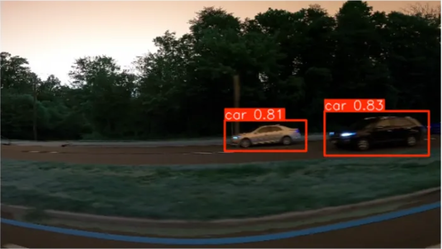

</details>

<details>
<summary>How would a bounding box be implemented?</summary>

It's often represented as a tuple with `4` elements: `(x1, y1, x2, y2)`.

The elements `x1` and `y1` are typically the top-left pixel coordinates of the bounding box.

The elements `x2` and `y2` can represent different values:

- they can be the width and height of the bounding box (in pixels);
- or they can be the bottom-right pixel coordinates of the bounding box (the way PyTorch uses them).


</details>

<details>
<summary>If we had multiple bounding boxes over an object how would we choose the one to return to the user?</summary>

We choose the one most tight one:

- it should cover the entirety of the object;
- while keeping the box area as small as possible.

</details>

PyTorch has a built-in utility function to do draw bounding boxes: [`draw_bounding_boxes`](https://pytorch.org/vision/main/generated/torchvision.utils.draw_bounding_boxes.html#draw-bounding-boxes).

```python
from torchvision import utils

bbox = torch.tensor([x_min, y_min, x_max, y_max]).unsqueeze(0) # add a batch dimension
bbox = bbox.unsqueeze(0) # add a batch dimension

# width => width of lines forming the rectangle
# colors => what color the lines should be
# NOTE: Also takes an optional parameter "labels" that adds a label to the bounding box
bbox_image = utils.draw_bounding_boxes(image_tensor, bbox, width=3, colors='red')
```

### Checkpoint

Which of the following statements about object detection and bounding boxes is true?

A. Bounding boxes are represented by the `x` and `y` coordinates of each of the four box corners, so eight numbers altogether.
B. Object detection's goal is only to identify the spatial location of an object within the image.
C. Bounding boxes are both the way to annotate the training data for object detection tasks as well as the outputs of the models.

<details>
<summary>Reveal answer</summary>

C.

For A: Two coordinates or one coordinate with width and height is enough.
For B: Next to locating the object within the image, object detection is also concerned with classifying the object it detected.

</details>

### Detecting multiple objects

<details>
<summary>What was the blueprint neural network architecture that was used to solve object classification problems?</summary>

1. Feature extraction.
2. Feature classification.


</details>

<details>
<summary>How can we extend the blueprint neural network architecture for object classification to facilitate solving object localization problems?</summary>

- We would have a second output (**multi-output** model) for the bounding box.
- This second output would be produced by a second set of fully-connected layers.


</details>

<details>
<summary>What loss function would we use for this new output?</summary>

MSE or RMSE.

</details>

#### Problem - multiple objects

But what if we had multiple objects that we have to return - our network can only output one bounding box?


<details>
<summary>Reveal answer</summary>

We can use the sliding window approach.

1. Preprocess the dataset into many different small patches of the same size.
2. Do image classification on every single patch.


You can see that this does not really solve the problem, right?

</details>

#### Problem - different scales

We can also have objects of different sizes:


<details>
<summary>How would we solve this?</summary>

We can either:

- have cropping windows of different sizes:


- have one cropping window, but start up- and downscaling the images:


This also leads to efficiency problems.

</details>

#### Problem - different aspect ratios

But then, we should also be able to handle multiple types of objects:


So you can see how the complexity of these problems quickly blows up. We can roughly say that for **a single image**:

```python
computational_cost = num_scales * num_aspect_ratios * width * height
```

And this is only for a single image!

### Rich feature hierarchies for accurate object detection and semantic segmentation (`R-CNN`)

- Part of [the region-based CNN family](https://en.wikipedia.org/wiki/Region_Based_Convolutional_Neural_Networks).
  - R-CNN;
  - Fast R-CNN;
  - Faster R-CNN.
- Paper: <https://arxiv.org/abs/1311.2524>.

<details>
<summary>Open the paper and find the number of the figure that outlines the 4 stages of the algorithm.</summary>

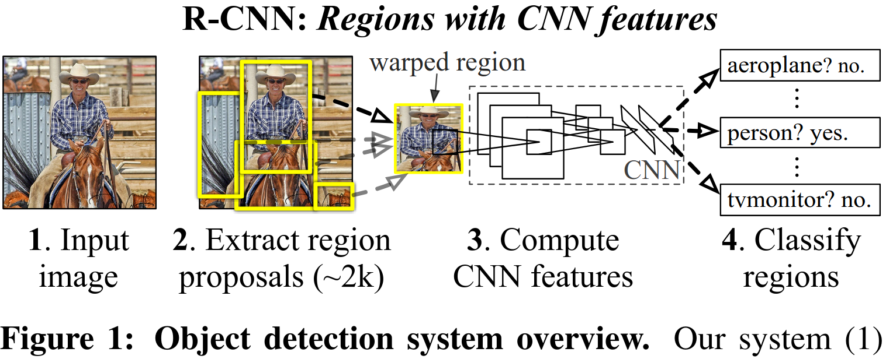

</details>

<details>
<summary>Open the paper and find the section in which the three modules of the system are defined.</summary>


</details>

<details>
<summary>Open the paper and find the name of the algorithm used by R-CNN for generating region proposals.</summary>

Selective search:

- Paper: <http://www.huppelen.nl/publications/selectiveSearchDraft.pdf>.


</details>

So the architecture of R-CNN would be:


- Module 1: generation of region proposals using the algorithm Selective Search.
  - Returns the bounding boxes where objects might be located.
- Module 2: feature extraction using pre-trained weights.
  - Returns the obtained features for every proposal with convolutional layers.
- Module 3: class and bounding box prediction.
  - Returns bounding boxes and the class labels of the objects in them with bounding box regressor layers.

### R-CNN: extracting Region proposals via Selective search

Paper: <http://www.huppelen.nl/publications/selectiveSearchDraft.pdf>.

1. Use graph segmentation to segment the image into components that are similar to each other.
   - Vertices = pixels.
   - Weighted edges = similarity metric between pixels (heavier = higher similarity).
     - color difference;
     - texture difference;
     - etc, etc.
   1. Every node is a component.
   2. Until components that have not been merged:
      1. Pick two components with smallest edge weight.
      2. If `weight < threshold`, merge components.
      3. Increase `threshold`.
2. Merge regions of interest into larger regions (components) using different similarity measures.


<details>
<summary>Open the paper and find the different similarity measures used.</summary>


</details>

### R-CNN: extracting feature representations

1. Extract Region proposals from the image (~ 2K per image).
2. For each proposal: extract feature representation.

<details>
<summary>Open the paper and find input dimension of the CNN model used.</summary>

`227 x 277`


</details>

<details>
<summary>Do you know what famous model the authors are using?</summary>

[`AlexNet`](https://en.wikipedia.org/wiki/AlexNet)


</details>

<details>
<summary>Open the paper and find the first step in the training process - what does it comprise of?</summary>

Pretrain AlexNet on ImageNet.


</details>

<details>
<summary>Open the paper and find the second step in the training process - what does it comprise of?</summary>

1. Replace the classification layer of AlexNet with the one for their (the authors') dataset and add a class for the background.
2. Use intersection-over-union to label the appropriate regions as positive or negative.
3. Fine-tune on their dataset.


</details>

#### Problem - fixed input size

The network expects images of size `227x227`, but the bounding boxes can be of arbitrary size.


<details>
<summary>Open the paper and find the section in which the authors describe how they dealt with this problem.</summary>

1. Dilate the proposal with $p$ pixels.
2. Resize the warped proposal to `227x227.`


</details>

### R-CNN: object category classifiers

<details>
<summary>Open the paper and find the model used to perform object classification?</summary>

Support Vector Machine:


</details>

<details>
<summary>What is the input to the classifier?</summary>

The output of the last fully-connected layer in AlexNet.

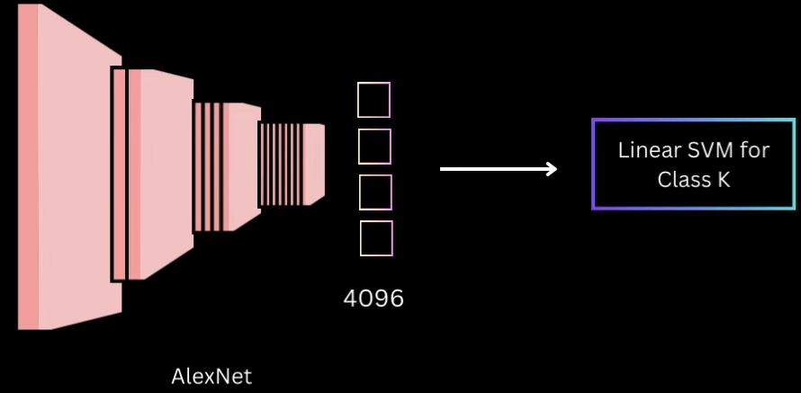

</details>

### R-CNN: bounding-box regression

<details>
<summary>Open the paper and find the section where the authors discussed how they implemented bounding box regression.</summary>

They train a linear regression model to perform a transformation on the outputs of selective search to have them more closely match the ground truth labels.


</details>

### R-CNN: **custom** backbone, classifier and regressor

```python
from torch import nn
from torchvision import models

vgg = models.vgg16(weights=models.VGG16_Weights.DEFAULT)

backbone = nn.Sequential(
  # vgg.features            => returns all layers prior to the flattening operation as blocks of layers
  # vgg.features.children() => returns all layers as a list of layers
  *list(vgg.features.children())
)

input_dimension = backbone[0].out_channels

classifier = nn.Sequential(
  nn.Linear(input_dimension, 512),
  nn.ReLU(),
  nn.Linear(512, num_classes),
)

bbox_regressor = nn.Sequential(
  nn.Linear(input_dimension, 32),
  nn.ReLU(),
  nn.Linear(32, 4),
)
```

### Evaluating object detection models

#### Intersection over union (IoU)

<details>
<summary>Can you infer what IoU calculates to evaluate the quality of object detection models?</summary>

- **Object of interest**: object in image we want to detect (e.g. dog).
- **Ground truth box**: the accurate bounding box around the object of interest.
- **Intersection over Union**: Measure the overlap between predicted bounding box and ground-truth bounding box.


<details>
<summary>If IoU is 0, this means that ...</summary>

there is no overlap; the model is bad.

</details>

<details>
<summary>If IoU is 1, this means that ...</summary>

there is perfect overlap; the model is perfect.

Often $0.5$ is used as a threshold, i.e. if IoU >= 0.5, this is regarded as a correct prediction of a bounding box.

</details>

</details>

<details>
<summary>Knowing this is IoU a metric or part of the loss function?</summary>

IoU is a metric.

</details>

<details>
<summary>Open the paper and find a section in which the authors say what metric they use.</summary>

- `mAP` - [mean Average Precision](https://en.wikipedia.org/wiki/Evaluation_measures_(information_retrieval)#Mean_average_precision)
- Is [related](https://en.wikipedia.org/wiki/Evaluation_measures_(information_retrieval)#Average_precision) to the area under the precision-recall curve.


</details>

#### IoU in PyTorch

Again, we have a built-in function: [`ops.box_iou`](https://pytorch.org/vision/0.20/generated/torchvision.ops.box_iou.html#torchvision.ops.box_iou).

```python
import torch
from torchvision import ops

bbox1 = torch.tensor([50, 50, 150, 150]).unsqueeze(0)
bbox2 = torch.tensor([100, 100, 200, 200]).unsqueeze(0)

print(ops.box_iou(bbox1, bbox2))
```

```console
tensor([[0.1429]])
```

### Non-maximum suppression (NMS)

<details>
<summary>What have you heard of NMS?</summary>

Object detection models may generate many bounding boxes and some of them may be overlapping near-duplicates.


NMS is a technique to select the most relevant bounding boxes:

- **Non-max**: Pick the box with highest probability and discard other boxes.
- **Suppression**: Discard all boxes that have high overlap with the box with most confidence.


</details>

In PyTorch we can use the function [`ops.nms`](https://pytorch.org/vision/0.20/generated/torchvision.ops.nms.html#torchvision.ops.nms):

- **Boxes**: tensors with the bounding box coordinates of the shape $[N, 4]$.
- **Scores**: tensor with the confidence score for each box of the shape $[N]$.
- **iou_threshold**: the threshold between $0.0$ and $1.0$.
- Output: indices of filtered bounding boxes.

```python
from torchvision import ops

box_indices = ops.nms(
  boxes=boxes,
  scores=scores,
  iou_threshold=0.5,
)
box_indices
```

```console
tensor([ 0,  1,  2,  8])
```

```python
filtered_boxes = boxes[box_indices]
```

### Faster R-CNN model: an advanced version of R-CNN

Paper: <https://arxiv.org/abs/1506.01497>.

#### Faster R-CNN architecture

- Module 1: Convolutional layers (backbone): obtain feature maps.
- Module 2: Region proposal network (RPN): get bounding box proposals on the feature maps.
- Module 3: Classifier and regressor to produce predictions.


#### Region Proposal Network (RPN)

- Anchor generator: Generate a set of anchor boxes of different sizes and aspect ratios.
- Classifier and regressor: Predict if the box contains an object and provide coordinates.
- Region of interest (RoI) pooling: Resize the RPN proposal to a fixed size for fully connected layers.


```python
from torchvision.models.detection import rpn

anchor_generator = rpn.AnchorGenerator(
  sizes=((32, 64, 128), ),
  aspect_ratios=((0.5, 1.0, 2.0), ),
)
```

```python
from torchvision import ops

roi_pooler = ops.MultiScaleRoIAlign( # https://pytorch.org/vision/main/generated/torchvision.ops.MultiScaleRoIAlign.html#multiscaleroialign
  featmap_names=['0'], # the first layer labeled '0' in our backbone architecture
  output_size=7,
  sampling_ratio=2, # how many samples are taken from each bin when pooling
)
```

```python
from torchvision.models.detection import FasterRCNN

backbone = torchvision.models.mobilenet_v2(weights='DEFAULT').features
backbone.out_channels = 1280

model = FasterRCNN(
  backbone=backbone,
  num_classes=num_classes,
  rpn_anchor_generator=anchor_generator,
  box_roi_pool=roi_pooler,
)
```

We can also use a pre-trained `Faster R-CNN` without manually extracting a backbone from a different model:

```python
from torchvision.models.detection.faster_rcnn import FastRCNNPredictor

num_classes = 5

model = torchvision.models.detection.faster_rcnn_resnet50_fpn(weights='DEFAULT')
in_features = model.roi_heads.box_predictor.cls_score.in_features

model.roi_heads.box_predictor = FastRCNNPredictor(in_features, num_classes)
```

### Running object recognition on a single image

1. Load and transform the image.
2. `unsqueeze()` the image to add batch dimension.
3. Pass the image tensor to the model.
4. Run `nms()` over model's output.
5. `draw_bounding_boxes()` on top of the image.

# Week 07 - Segmentation

## Setting the context around the task of Segmentation

<details>
<summary>What is image segmentation?</summary>

- Partitioning an image into multiple segments on the pixel level.
- Each pixel in an image is assigned to a particular segment.

</details>

<details>
<summary>Give three examples of image segmentation algorithms we've seen so far?</summary>

Image binarization (either manual or via a filter (for example, Otsu)):


Superpixel segmentation (using KMeans):


Selective search does image segmentation as a first step:


</details>

<details>
<summary>What is semantic segmentation?</summary>

- Each pixel is classified into a predefined class / category.
- All pixels belonging to the same class are treated equally.
- No distinction is made between different instances of the same class.

</details>

<details>
<summary>What is the main difference between image segmentation and semantic segmentation?</summary>

An object might be part of multiple segments when we use image segmentation, but is part of only segment in semantic segmentation (hence the name).

</details>

<details>
<summary>Having said this what do you think are the most popular use cases for semantic segmentation?</summary>

In general, all use cases in which there is a need for **scene understanding**:

- Autonomous navigation. <- most popular
- Assisting the partially sighted.
- Medical diagnosis.
- Image editing.


</details>

<details>
<summary>What would semantic segmentation produce for the above image?</summary>


</details>

<details>
<summary>Open the R-CNN paper and find the two main datasets used to evaluate the model.</summary>

- [PASCAL VOC 2010](http://host.robots.ox.ac.uk/pascal/VOC/voc2010/index.html).
- [ILSVRC2013 detection dataset](https://www.image-net.org/challenges/LSVRC/2013/index.php).

</details>

<details>
<summary>Look through the first dataset - does it support a segmentation task?</summary>

Yep - we can use it to create, train and evaluate semantic segmentation models:


</details>

<details>
<summary>Do you know any other popular datasets for semantic segmentation?</summary>

- [Microsoft COCO: Common Objects in Context](https://arxiv.org/abs/1405.0312) dataset ([homepage](https://cocodataset.org/#home)).
- [The Cityscapes Dataset](https://www.cityscapes-dataset.com/).

</details>

<details>
<summary>What other types of segmentation tasks are there?</summary>

- Instance segmentation.
- Panoptic segmentation.

</details>

<details>
<summary>What is instance segmentation?</summary>

- Distinguishes between different instances of the same class.
- Background is not segmented (i.e. classified as belonging to class `0`).


<details>
<summary>What would instance segmentation produce for the above image?</summary>


</details>

</details>

<details>
<summary>What is panoptic segmentation?</summary>

- Combines semantic segmentation results with instance segmentation results.
- Assigns unique label to each instance of an object.
- Classifies background at pixel level.


<details>
<summary>What would panoptic segmentation produce for the above image?</summary>


</details>

</details>

## Semantic segmentation

### Data annotations

<details>
<summary>Would would our training set look like now?</summary>

- A set of all images (3D).
- A set of the masks for each image.

</details>

<details>
<summary>What values would the mask hold?</summary>

- It's a 2D matrix with the same size of the image it's annotating.
- Each value in the mask is the class/category of each pixel in the image.

</details>

In our `DATA` folder you'll find the dataset `segmentation_cats_dogs`. It holds picture of cats and dogs alongside their masks. The pixel annotations are as follows:

- `1`: Object / Foreground.
- `2`: Background.
- `3`: Not classified.

```python
import os

from PIL import Image
import matplotlib.pyplot as plt
from torchvision import transforms

image = Image.open(os.path.join('DATA', 'segmentation_cats_dogs', 'images', 'British_Shorthair_36.jpg'))
mask = Image.open(os.path.join('DATA', 'segmentation_cats_dogs', 'annotations', 'British_Shorthair_36.png'))

plt.axis('off')
plt.imshow(image)
plt.show()

transform = transforms.Compose([
  transforms.ToTensor()
])
image_tensor = transform(image)
mask_tensor = transform(mask)

print(f'Image shape: {image_tensor.shape}')
print(f'Mask shape: {mask_tensor.shape}')
```


```console
Image shape: torch.Size([3, 333, 500])
Mask shape: torch.Size([1, 333, 500])
```

<details>
<summary>How would we print the unique values in "mask_tensor"?</summary>

```python
mask_tensor.unique()
```

```console
tensor([0.0039, 0.0078, 0.0118])
```

<details>
<summary>Wait a minute - that doesn't make sense! Why are we not seeing "1", "2" and "3"?</summary>

Because the transformation `ToTensor` also normalizes the values:

- `1 / 255 = 0.0039` - object / foreground.
- `2 / 255 = 0.0078` - background.
- `3 / 255 = 0.0118` - unclassified.

</details>

</details>

Let's say that we want to remove the third class, so as to perform binary image segmentation.


<details>
<summary>How can we create the above binary mask?</summary>

We can use `torch.where`:

```python
binary_mask = torch.where(
  mask_tensor == 1/255,
  torch.tensor(1.0),
  torch.tensor(0.0),
)

mask = transforms.ToPILImage()(binary_mask)
plt.imshow(mask)
```


</details>

<details>
<summary>How can we then get only the image of the cat?</summary>

```python
to_pil_image = transforms.ToPILImage()(image_tensor * binary_mask)
plt.imshow(to_pil_image)
```


</details>

### Fully Convolutional Networks for Semantic Segmentation (FCN)

Paper: <https://arxiv.org/abs/1411.4038>.

<details>
<summary>Open the paper and find the key difference between FCNs and traditional convolutional neural networks.</summary>

The network is now `fully convolutional`.


</details>

<details>
<summary>This is kind of vague and abstract though. Which figure describes visually the process of "convolutionalization"?</summary>

Linear layers get substituted by convolutional layers.


</details>

<details>
<summary>What is the added value of this?</summary>

By doing this we only care about the filters and we do not depend on the input size of the images that come into our network.


</details>

<details>
<summary>But wait - why are traditional CNNs bound to a particular input size?</summary>

- It's exactly because we have `Linear` layers as part of the classification.
- Recall, we have two parts in the traditional CNNs:
  1. Feature extraction.
  2. Classification.
- The final step in the feature extraction is to `flatten` the feature maps into a `feature vector` which is then fed into at least `1` `Linear` layer.
  - The first `Linear` layer always has an input size that is **dependent** on the width and height of the images it has been **trained** on.
- See how we have `64 * 16 * 16` in the below example:


In short, **if we train a CNN on a particular set of images, at inference time we must use the same size as the training images**.

</details>

<details>
<summary>Ok, so that solves something, but it does not really help us do semantic segmentation - which figure lays out the "backend" architecture of an FCN network?</summary>


</details>

<details>
<summary>What does this tell us about the final layers - what is their width?</summary>

Their width is actually `1`.

</details>

<details>
<summary>What is their height?</summary>

Their height is also `1`!

</details>

<details>
<summary>So what does this "21" refer to?</summary>

This is the depth.

</details>

<details>
<summary>By why exactly "21" - why not "42"?</summary>

The final layer is just another representation of the final `Linear` layer - it corresponds to the number of output classes.

So, in essence, we get a `1 x 1 x num_classes`.

</details>

<details>
<summary>What part do we not see in the above picture?</summary>

We're still missing the part for going from `1 x 1 x num_classes` to the original height and width.

</details>

<details>
<summary>What is the output shape of the model?</summary>

`original_height x original_width x num_classes`

</details>

<details>
<summary>What is the meaning of the last coordinate?</summary>

The model returns a mask for each class of objects. Each 2D matrix is responsible for 1 class.

</details>

<details>
<summary>What would the loss function aim to produce then?</summary>

The objective is to make each mask be binarized.

</details>

<details>
<summary>Which paragraph in the paper describes the entire architecture, including the "frontend" part?</summary>


</details>

<details>
<summary>Hmm - that's interesting - how many times does a prediction occur then?</summary>

- It occurs `n` times, where `n` is the number of max pooling layers.
- As they do max pooling, they also make a prediction (you'll see a diagram in a bit).
- Note that a prediction here is just a convolution to `C` classes in the `z` axis.

</details>

<details>
<summary>Ok, so how is the 1x1 feature map mapped back to the original size?</summary>

1. The parameters of **bilinear interpolation** are used to initialize the parameters of an upsampling inverse (transposed) convolution (referred to as **`deconvolution`**).
2. A nonlinear upsampling is learned through backpropagation.

</details>

<details>
<summary>So what are the three general stages of creating FCNs?</summary>

1. Pick a pre-trained CNN for classification (VGG, AlexNet, etc).
2. Replace the `Linear` layers with `Conv2d`.
3. Upsample the `1 x 1 x C` vector back to the original height and width, **utilizing skip connections in the process**.

</details>

### Upsampling techniques

<details>
<summary>What is their goal?</summary>

- Used between convolutional blocks as an opposite to pooling.
- **Increase height and width while reducing depth.**

</details>

Let's say that we have this feature map:


We want to upsample it into a `4x4` feature map.

#### Simplest form - Nearest Neighbor

<details>
<summary>What do you think would be the final result from NN interpolation?</summary>


</details>

#### Bilinear interpolation

<details>
<summary>How does bilinear interpolation work visually (from a birds eye view)?</summary>

1. We place the values in the corners of the new map.
2. We create a plane out of those coordinates and look up the values for the missing coordinates.


Formulas available [in Wikipedia](https://en.wikipedia.org/wiki/Bilinear_interpolation#Repeated_linear_interpolation).

</details>

#### Max Unpooling

<details>
<summary>Do you know how max unpooling works?</summary>

1. We save the coordinates of the maximum values when we do max pooling.
2. We place the input values on these locations.
3. We place `0`s everywhere else.


</details>

#### Transposed Convolutions / Inverse Convolutions / Deconvolutions

1. Insert zeros between or around the input feature map.
2. Perform a regular convolution on the zero-padded input.

Regular convolutions:

<table style="width:100%; table-layout:fixed;">
  <tr>
    <td></td>
    <td></td>
    <td></td>
  </tr>
  <tr>
    <td>No padding, no strides</td>
    <td>Arbitrary padding, no strides</td>
    <td>No padding, strides</td>
  </tr>
</table>

Transposed convolutions:

<table style="width:100%; table-layout:fixed;">
  <tr>
    <td></td>
    <td></td>
    <td></td>
  </tr>
  <tr>
    <td>No padding, no strides, transposed</td>
    <td>Arbitrary padding, no strides, transposed</td>
    <td>No padding, strides, transposed</td>
  </tr>
</table>

### Skip connections

Recall our current architecture:


<details>
<summary>What would be the result if we apply bilinear interpolation on a vector of size "1 x 1" into a "4 x 4" one?</summary>

It'll actually duplicate the value `16` times.

</details>

<details>
<summary>How do the authors deal with this problem?</summary>

1. They don't actually use pure bilinear interpolation - they use transposed convolutions which learn how to upsample.
   - The link here with the bilinear interpolation is that initally (before training) the parameters of these transposed convolutional layers have the parameters of a bilinear interpolation.
2. They make predictions before every max pooling operation (where the width and hight are larger).

</details>

<details>
<summary>How do they do that and what is the goal?</summary>

- They connect them via a skip connection to the output of the upsampling.
- In this way they combine coarse representations (coming from "the deep vector") with finer representations (coming from feature maps that are pooled).
- The goal / added value is **increasing the quality of the segmentation map**.

</details>

<details>
<summary>Open the paper and find the figure with which the authors detail "N" distinct versions of their network - how many are they and what do they comprise of?</summary>

- `FCN-32s`: Single-stream net, described in Section 4.1, upsamples stride `32` predictions back to pixels **in a single step**.
- `FCN-16s`: Combining predictions from both the final layer and the `pool4` layer, at stride `16`.
- `FCN-8s`: Additional predictions from `pool3`, at stride `8`.


</details>

<details>
<summary>What operation combines the predictions?</summary>

Addition.

</details>

<details>
<summary>What figure compares the three variants visually?</summary>


</details>

So the final model architecture (for `FCN-8` as an example) actually looks something like this:


### [Learning Deconvolution Network for Semantic Segmentation](https://www.arxiv.org/pdf/1505.04366)

- Extension of `FCN`.
- An example of the `encoder-decoder` architecture.

<details>
<summary>Open the paper and highlight the two most prominent differences.</summary>

- Does not utilize skip connections.
- Instead it relies on "successive operations of unpooling, deconvolution, and rectification".


</details>

<details>
<summary>Which figure presents the architecture?</summary>


</details>

### [U-Net](https://arxiv.org/abs/1505.04597)

### U-Net: Architecture


- Encoder:
  - Convolutional and pooling layers.
  - Downsampling: reduces spatial dimensions (height, width) while increasing depth.

- Decoder:
  - Symmetric to the encoder.
  - Upsamples feature maps with transposed convolutions.

- Skip connections:
  - Links / **Concatenations** from the encoder to the decoder.
  - Preserve details lost in downsampling.

The full process is therefore the following:

1. Pass input through encoder's convolutional blocks and pooling layers.
2. Decoder and skip connections:
   1. Pass encoded input through transposed convolution.
   2. Concatenate with corresponding encoder output.
   3. Pass through convolutional block.
   4. Repeat.
3. Return output of last decoder step.


We can then run inference using out model:

```python
model = UNet()
model.eval()

image = Image.open('car.jpg')
image_tensor = transforms.ToTensor()(image).unsqueeze(0)

with torch.no_grad():
  prediction = model(image_tensor).squeeze(0)

plt.imshow(prediction[1, :, :])
plt.show()
```


## Instance segmentation

### [`Mask R-CNN`](https://wiki.math.uwaterloo.ca/statwiki/index.php?title=Mask_RCNN)

- Paper: <https://arxiv.org/abs/1703.06870>.
- Faster R-CNN + FCN.
- Previously we covered Faster R-CNN for object recognition. Given the image, it would predict its class and the bounding box around the object.
  - Two stages:
    1. The `RPN` (Region Proposal Network) proposes candidate object bounding boxes.
    2. The `RoIPool` extracts the features from these boxes by scaling them into a fixed shape.
       - The actual scaling to, e.g., $(7, 7)$, occurs by dividing the region proposal into equally sized sections, finding the largest value in each section, and then copying these max values to the output buffer. In essence, `RoIPool` is max pooling on a discrete grid based on a box.
  - After the features are extracted they can be analyzed using classification and bounding-box regression.


- Mask R-CNN extends Faster R-CNN by adding a branch for predicting an object mask in parallel with the existing branch for bounding box recognition.
- Done by using a Fully Convolutional Network.
- Easy to generalize to other tasks, e.g., estimating human poses.
- Architecture:
  - Same first stage.
  - The second stage instead of only performing classification and bounding-box regression, also outputs a **binary mask for each RoI**.
    - The final loss is then $L = L_{cls}+L_{box}+L_{mask}$, where:
      - $L_{cls}$: classification loss;
      - $L_{box}$: bounding box loss;
      - $L_{mask}$: average binary cross-entropy loss respectively.


#### Pre-trained Mask R-CNN in PyTorch


```python
import os
from PIL import Image
import torch
from torchvision import transforms
from torchvision.models import detection

model = detection.maskrcnn_resnet50_fpn(pretrained=True)
model.eval()

image = Image.open(os.path.join('assets', 'w07_cat_and_laptop.png')).convert('RGB')
image_tensor = transforms.ToTensor()(image).unsqueeze(0)

with torch.no_grad():
  prediction = model(image_tensor)

print(type(prediction))
print(len(prediction))
print(type(prediction[0]))
print(prediction[0].keys())
```

```console
<class 'list'>
1
<class 'dict'>
dict_keys(['boxes', 'labels', 'scores', 'masks'])
```

- `prediction` is a list of length `1` since we only passed `1` image to the model.

```python
print(prediction[0]['labels'])
print(f'Number of recognized objects: {len(prediction[0]['labels'])}')
```

```console
tensor([17, 73, 76, 73, 67, 84, 42, 65, 63, 73, 73, 32, 31, 73, 62, 17, 76, 84, 17])
Number of recognized objects: 19
```

- `labels` contains the class IDs of recognized objects:
  - The IDs correspond to [the COCO dataset classes](https://cocodataset.org/#home) which we have stored in the variable class_names.
  - These class names are available [here](https://gist.github.com/tersekmatija/9d00c4683d52d94cf348acae29e8db1a).
  - We can see that the top two predicted classes with indices `17` and `73` correspond to a `cat` and a `laptop`, respectively.
    - `(1, 'person'), (2, 'bicycle'), (3, 'car'), (4, 'motorbike'), (5, 'aeroplane'), (6, 'bus'), (7, 'train'), (8, 'truck'), (9, 'boat'), (10, 'trafficlight'), (11, 'firehydrant'), (12, 'streetsign'), (13, 'stopsign'), (14, 'parkingmeter'), (15, 'bench'), (16, 'bird'), (17, 'cat'), (18, 'dog'), (19, 'horse'), (20, 'sheep'), (21, 'cow'), (22, 'elephant'), (23, 'bear'), (24, 'zebra'), (25, 'giraffe'), (26, 'hat'), (27, 'backpack'), (28, 'umbrella'), (29, 'shoe'), (30, 'eyeglasses'), (31, 'handbag'), (32, 'tie'), (33, 'suitcase'), (34, 'frisbee'), (35, 'skis'), (36, 'snowboard'), (37, 'sportsball'), (38, 'kite'), (39, 'baseballbat'), (40, 'baseballglove'), (41, 'skateboard'), (42, 'surfboard'), (43, 'tennisracket'), (44, 'bottle'), (45, 'plate'), (46, 'wineglass'), (47, 'cup'), (48, 'fork'), (49, 'knife'), (50, 'spoon'), (51, 'bowl'), (52, 'banana'), (53, 'apple'), (54, 'sandwich'), (55, 'orange'), (56, 'broccoli'), (57, 'carrot'), (58, 'hotdog'), (59, 'pizza'), (60, 'donut'), (61, 'cake'), (62, 'chair'), (63, 'sofa'), (64, 'pottedplant'), (65, 'bed'), (66, 'mirror'), (67, 'diningtable'), (68, 'window'), (69, 'desk'), (70, 'toilet'), (71, 'door'), (72, 'tvmonitor'), (73, 'laptop'), (74, 'mouse'), (75, 'remote'), (76, 'keyboard'), (77, 'cellphone'), (78, 'microwave'), (79, 'oven'), (80, 'toaster'), (81, 'sink'), (82, 'refrigerator'), (83, 'blender'), (84, 'book'), (85, 'clock'), (86, 'vase'), (87, 'scissors'), (88, 'teddybear'), (89, 'hairdrier'), (90, 'toothbrush'), (91, 'hairbrush')`

```python
prediction[0]['scores']
```

```console
tensor([0.9990, 0.9391, 0.8823, 0.7186, 0.3869, 0.3535, 0.2245, 0.2066, 0.2040,
        0.1558, 0.1145, 0.1007, 0.0870, 0.0849, 0.0788, 0.0737, 0.0660, 0.0631,
        0.0615])
```

- The `scores` key stores the class probabilities:
  - `cat` was detected with a probability of `0.9990`;
  - `laptop` with a probability of `0.9391`
  - The following values correspond to other, less probable classes.

```python
prediction[0]['masks'].shape
```

```console
torch.Size([19, 1, 395, 529])
```

- `masks` stores **instance segmentation *soft* masks** which we will look at next.

```python
prediction[0]['boxes'].shape
```

```console
torch.Size([19, 4])
```

- The Mask R-CNN prediction also contains bounding boxes. We won't be focusing on them at the moment.

#### Soft masks

- Let's see the unique mask values:

```python
print(prediction[0]['masks'].unique())
print(f"Min: {prediction[0]['masks'].min()}")
print(f"Max: {prediction[0]['masks'].max()}")
```

```console
tensor([0.0000e+00, 4.1547e-13, 4.1568e-13,  ..., 9.9996e-01, 9.9996e-01,
        9.9996e-01])
Min: 0.0
Max: 0.9999570846557617
```

- Mask R-CNN masks:
  - hold values between `0` and `1`;
  - represent the model's confidence that each pixel belongs to the object;
  - provide more nuanced information than binary masks;
  - can be binarized by thresholding if needed.

- We can display them as transparent elements of the colormap [`jet`](https://matplotlib.org/stable/users/explain/colors/colormaps.html#miscellaneous).

```python
masks = prediction[0]['masks']
labels = prediction[0]['labels']

fig, axs = plt.subplots(1, 2)

for i in range(2):
  axs[i].axis('off')
  axs[i].imshow(image)
  axs[i].imshow(
    masks[i, 0],
    cmap='jet',
    alpha=0.5,
  )
  axs[i].set_title(f'Object: {class_names[labels[i] - 1]}') # class_names is the list with the COCO labels that you saw earlier (without enumeration)

plt.show()
```


## Panoptic segmentation

<details>
<summary>What was panoptic segmentation again?</summary>

Segment an image into semantically meaningful parts or regions, while also detecting and distinguishing individual instances of objects within those regions.


- Semantic segmentation doesn't allow us to distinguish between particular cabs.
- Instance segmentation loses the distinction between the street and the buildings which are now combined together as one background.

</details>

<details>
<summary>How can we do panoptic segmentation using what we already know?</summary>

1. Generate a semantic mask with a U-Net. It'll hold the most likely class for each pixel.
2. Generate instance masks with a Mask R-CNN model.
3. Iterate over the instance masks:
   - if an object is detected with high certainty (for ex. above `> 0.5`), overlay it onto the semantic mask.

Obtaining the semantic mask could be done as follows:

```python
model = UNet()
with torch.no_grad():
  semantic_masks = model(image_tensor)
  print(semantic_masks.shape)
```

```console
torch.Size([1, 3, 427, 640])
```

From the shape of the output, we can see that there are `3` classes, likely corresponding to the cars, the buildings, and the street.

Choosing the highest-probability class for each pixel produces the following image:

```python
semantic_mask = torch.argmax(semantic_masks, dim=1)

plt.imshow(semantic_mask)
plt.show(semantic_mask)
```


Continuing on with the instance mask:

```python
model = MaskRCNN()

with torch.no_grad():
  instance_masks = model(image_tensor)[0]['masks']
  print(instance_masks.shape)
```

```console
torch.Size([80, 1, 427, 640])
```

The model has identified `80` different instance classes:


Finally, we can overlay them:

```python
panoptic_mask = torch.clone(semantic_mask)

# We know that the semantic mask has three classes (cars, street, and buildings) which means it takes the values of 0, 1, and 2.
# Therefore, we will start labeling the instance classes starting from 3 to avoid collisions.
instance_id = 3

for mask in instance_masks:
  panoptic_mask[mask > 0.5] = instance_id
  instance_id += 1
```

</details>

# Week 08 - Generative Adversarial Nets

## What are GANs?

- Paper: <https://arxiv.org/pdf/1406.2661>.

<details>
<summary>Open the paper and find a section that describes the whole idea and whole architecture of GANs.</summary>


</details>

<details>
<summary>Read through the paper and find the section in which the authors describe what the input to the generative model "G" is.</summary>


</details>

<details>
<summary>Draw the architecture of a GAN.</summary>


</details>

<details>
<summary>What is the goal of the "Discriminator"?</summary>

The `Discriminator` is trying to distinguish between `real` and `fake` inputs.

</details>

<details>
<summary>What is the goal of the "Generator"?</summary>

The `Generator` is trying to fool the `Discriminator` ("maximize the probability of $D$ making a mistake").

</details>

<details>
<summary>Why is this process guaranteed to work?</summary>

- This is essentially a minimax two-player game and on each turn both models are becoming better.
- Conflicting objectives ensure each network gets better at its task.

</details>

<details>
<summary>So what is the goal of GANs?</summary>

- Generate new samples based on training data that look like samples from that training data.
- Examples: <https://thesecatsdonotexist.com/>.

</details>

<details>
<summary>What is the most prominent difference with what we've seen so far? / What makes this paper truly novel?</summary>

- There is no connection between the `Generator` and the training data.
- Let's use the power of a really good discriminator model (which we know how to build (recall, Imagenet)) in order to train a generator.


</details>

<details>
<summary>Open the paper and find the real-world analogy the authors use to explain GANs.</summary>


</details>

<details>
<summary>Open the paper and find the section in which the authors describe "adversarial nets" - what kind of architecture do they describe?</summary>

A network in which only `nn.Linear` layers are employed.


</details>

<details>
<summary>Create such an architecture.</summary>


- `BatchNorm1d` vs `BatchNorm2d`:
  - Mathematically, there is no difference between them:
    - <https://discuss.pytorch.org/t/why-2d-batch-normalisation-is-used-in-features-and-1d-in-classifiers/88360>;
    - <https://github.com/christianversloot/machine-learning-articles/blob/main/batch-normalization-with-pytorch.md>.
  - [`BatchNorm1d`](https://pytorch.org/docs/main/generated/torch.nn.BatchNorm1d.html): Applies Batch Normalization over a `2D` or `3D` input.
  - [`BatchNorm2d`](https://pytorch.org/docs/main/generated/torch.nn.BatchNorm2d.html): Applies Batch Normalization over a `4D` input.
  - In general:
    - Whenever the previous layer handles image data with convolutions, we use `BatchNorm2d` (as each sample in the batch has `3` channels whole batch is `4D`).
    - Whenever the previous layer is `Linear`, we use `BatchNorm1d`.

</details>

<details>
<summary>So what does the Generator take as input?</summary>

- `Generator` receives a tensor of random values drawn from a standard normal distribution.
  - This acts as a `seed`.
  - Produces output based on that random noise.

</details>

Which of the following best describes the fundamental principle behind Generative Adversarial Networks (GANs)?

A. GANs utilize a single neural network that is trained to generate new data that matches the data from a training dataset.
B. GANs consist of a pair of neural networks that are trained in a collaborative manner to generate new data.
C. GANs employ two neural networks that are trained simultaneously through adversarial training, with the objective to create new data that is indistinguishable from real data.
D. GANs use a sequence of neural networks to transform raw data for easier analysis or visualization.

<details>
<summary>Reveal answer</summary>

C.

</details>

## Pokemon Sprites Dataset


- Available in our `DATA` folder as `pokemon_sprites`.
- About `1300` sprites of animal-like creatures from a video game called Pokemon.
- Our task: Generate new Pokemons!

## Training GANs

<details>
<summary>Open the paper and find the name of the section in which the loss function is shown.</summary>

Section `3 Adversarial nets`.

</details>

<details>
<summary>Open the paper and find the loss function.</summary>


</details>

<details>
<summary>What known to us loss function does it resemble?</summary>

Cross-entropy, more specifically - binary cross entropy! And it doesn't just resemble it - it is it!

$${\displaystyle J(\mathbf {w} )\ =\ {\frac {1}{N}}\sum _{n=1}^{N}H(p_{n},q_{n})\ =\ -{\frac {1}{N}}\sum _{n=1}^{N}\ {\bigg [}y_{n}\log {\hat {y}}_{n}+(1-y_{n})\log(1-{\hat {y}}_{n}){\bigg ]}\,}$$

</details>

<details>
<summary>We do we have E instead of sum?</summary>

- $E$ stands for expectation here.
- We have expectation because we're only taking random training samples - we're not iterating over all of the samples (at least in the implementation the authors are proposing).

</details>

<details>
<summary>What is the "Discriminator" trying to do with the value of the loss function?</summary>

It's trying to maximize it.

</details>


<details>
<summary>What does the above part mean?</summary>

The probability of predicting `real` samples as `real`.

</details>


<details>
<summary>What does the above part mean?</summary>

The probability of predicting `fake` samples as `fake`.

</details>

<details>
<summary>What is "z"?</summary>

- These are the parameters of the noise distribution.
- $p_z(z)$ is the probability distribution from which we sample the noise.
- This makes sure that we are able to generate different noise every time (because the generator must be able to generate new images).

</details>

<details>
<summary>What is "G(z)"?</summary>

The output of the `Generator` when receiving the noise $z$.

</details>

<details>
<summary>What is "D(G(z))"?</summary>

The probability that the `Discriminator` assigns to the output of the `Generator` when it received the noise $z$.

</details>

<details>
<summary>What is the "Generator" trying to do with the value of the loss function?</summary>

It's trying to minimize it.

</details>

<details>
<summary>Which part of the loss function is the "Generator" concerned with?</summary>

Only the second as the first is constant.

</details>

<details>
<summary>What does it mean on an intuitive level that the "Generator" is minimizing the loss function?</summary>

- It's trying to make the output of the `Generator` small.
- This means that probability of the `Generator` predicting samples from the `Discriminator` as `fake` is small.
- This means that $1 - D(G(z))$ will be close to $1$.
- This means that the value for the $\log$ will be high:


</details>


<details>
<summary>What does this mean - are we first obtaining the best possible discriminator and only then training the generator - what does the paper say?</summary>

- We can't train a generator if the discriminator is perfect.
- This is why we play it as if it were a game:
  - We train the discriminator a little bit ($k$ steps).
  - We train the generator a little bit ($1$ step).


</details>

<details>
<summary>What is one problem with "equation (1)" and how do the authors solve it?</summary>

- If the discriminator is really good, i.e. $D(G(z)) \approx 0 , ∀z$, the loss becomes $\log(0.99..) \approx 0$ and there is very little gradient for the generator.
- Thus, they replace $\log(1-D(G(z)))$ with $\log(D(G(z)))$.
  - The model now maximizes the value of the $\log(D(G(z)))$.
- Note that in the above formulation, the Generator learns (has a gradient) only when the Discriminator classifies a generated image as real.
  - We'll implement this part a bit differently.


</details>

Here's an illustration of how training might look like:


<details>
<summary>What is are the black dots?</summary>

The true data distribution.

</details>

<details>
<summary>What is the "z" again?</summary>

The noise distribution.

</details>

<details>
<summary>How is "z" distributed?</summary>

Uniformly.

</details>

<details>
<summary>How does "z" get transformed into "x"?</summary>

This mapping is done by the generator.

</details>

<details>
<summary>What is the green line?</summary>

The distribution of the fake samples.

</details>

<details>
<summary>What is the blue line?</summary>

The probability assigned by the discriminator on whether a sample is real.

</details>

<details>
<summary>So what does the figure show?</summary>

1. Initially, we start with a random discriminator.
2. We maximize $D$ a little bit to get $(b)$.
3. We now train the $G$ to go up the gradient of $D$.
4. In $(d)$ the probability, assigned by $D$ is actually $1/2$.

</details>

<details>
<summary>But does this mean that the generator just overfits the training data?</summary>

No.

1. The training data is discrete, while the generator is a continuos, smooth function.
2. It doesn't even see the training data.

</details>

<details>
<summary>Which section has the algorithm?</summary>


</details>

<details>
<summary>What are the steps to obtain the generator loss?</summary>

1. Define random noise.
2. Generate fake image.
3. Get discriminator's prediction on the fake image.
4. Use the binary cross-entropy loss: BCE between discriminator predictions and a tensor of ones.

```python
def gen_loss(gen, disc, num_images, z_dim):
  noise = torch.randn(num_images, z_dim)
  fake = gen(noise)
  disc_pred = disc(fake)
  criterion = nn.BCEWithLogitsLoss()
  gen_loss = criterion(disc_pred, torch.ones_like(disc_pred))
  return gen_loss
```

</details>

<details>
<summary>What are the steps to obtain the discriminator loss then?</summary>

1. Define random noise.
2. Generate fake images.
3. Get discriminator's prediction on the fake images.
4. Calculate the fake loss component.
5. Get discriminator's predictions for real images.
6. Calculate read loss component.
7. Final loss is the average between the real and fake loss components.

```python
def disc_loss(gen, disc, real, num_images, z_dim):
  criterion = nn.BCEWithLogitsLoss()
  noise = torch.randn(num_images, z_dim)
  fake = gen(noise)
  disc_pred_fake = disc(fake)
  fake_loss = criterion(
    disc_pred_fake,
    torch.zeros_like(disc_pred_fake)
  )
  disc_pred_real = disc(real)
  real_loss = criterion(
    disc_pred_real,
    torch.ones_like(disc_pred_real)
  )
  disc_loss = (real_loss + fake_loss) / 2
  return disc_loss
```

</details>

<details>
<summary>What are the steps to execute in the training loop?</summary>

1. Loop over epochs and real data batches and compute current batch size.
2. Reset discriminator optimizer's gradients.
3. Compute discriminator loss.
4. Compute discriminator gradients and perform the optimization step.
5. Reset generator optimizer's gradients.
6. Compute generator loss.
7. Compute generator gradients and perform the optimization step.

```python
for epoch in range(num_epochs):
  for real in dataloader:
    cur_batch_size = len(real)

    disc_opt.zero_grad()
    disc_loss_out = disc_loss(
      gen, disc, real, cur_batch_size, z_dim=16
    )
    disc_loss_out.backward()
    disc_opt.step()

    gen_opt.zero_grad()
    gen_loss_out = gen_loss(
      gen, disc, cur_batch_size, z_dim=16
    )
    gen_loss_out.backward()
    gen_opt.step()
```

</details>

## Evaluating GANs

<details>
<summary>How can we evaluate a GAN visually?</summary>

1. Create random noise.
2. Pass noise to generator.
3. Iterate over number of images.
4. Slice to select $i^{th}$ image.
5. Rearrange the image dimensions so that color channel is last.
6. Plot the image.

```python
num_images_to_generate = 9
noise = torch.randn(num_images_to_generate, 16)
with torch.no_grad():
  fake = gen(noise)
print(f'Generated shape: {fake.shape}')
```

```console
Generate shape: torch.Size([9, 3, 96, 96])
```

```python
for i in range(num_images_to_generate):
  image_tensor = fake[i, :, :, :]
  image_permuted = image_tensor.permute(1, 2, 0)
  plt.imshow(image_permuted)
  plt.show()
```


</details>

<details>
<summary>How did the authors perform evaluation?</summary>

Back then (and mostly today as well) there actually was no clear way to evaluate these models.


</details>

<details>
<summary>With which figure do the authors detail their 4 experiments?</summary>

Most of their experiments were done via `Linear` models, but they also had the foresight to try out an encoder-decoder approach!


</details>

### [Fréchet Inception Distance](https://lightning.ai/docs/torchmetrics/stable/image/frechet_inception_distance.html)

- A metric commonly used to evaluate GANs.
  - Note: lower = better!
- [Inception](https://en.wikipedia.org/wiki/Inception_(deep_learning_architecture)): a popular image classification model.
- Fréchet distance: Distance measure between two probability distributions.
- Fréchet Inception Distance:
  1. Use Inception to extract features from both real and fake images samples.
  2. Calculate means and covariances of the features for real and fake images.
  3. Calculate Fréchet distance between the real and the fake normal distributions.
- Low FID = fakes similar to training data ***and diverse***.
- Guidekine: `FID < 10` = `good`.

```python
from torchmetrics.image import fid

# use the sixty-fourth layer of the Inception model for feature extraction
# a different one can be used, too
fidist = fid.FrechetInception.Distance(feature=64)

# * 255 => convert the pixel values to integers between 0 and 255 (we have floats between 0 and 1)
fidist.update(
  (fake * 255).to(torch.uint8), real=False
)
fidist.update(
  (real * 255).to(torch.uint8), real=True
)

fid.compute()
```

```console
tensor(7.5159)
```

## Deep Convolutional GAN

- Paper: Unsupervised Representation Learning with Deep Convolutional Generative Adversarial Networks, <https://arxiv.org/pdf/1511.06434>.
  - "Historical attempts to scale up GANs using CNNs to model images have been unsuccessful."
  - Convolutional layers provide better results when processing images than basic linear layers.

<details>
<summary>Intuitively, what changes would we introduce in the architecture?</summary>

- In `Discriminator` replace linear layers with regular convolutions.
- In `Generator` use transposed convolutions to upsample the feature maps.

</details>

- Training GANs, however, is often unstable - you'll see this in this week's tasks. More adjustments are needed.
- Guidelines:
  1. Use only strided convolutions.
  2. Don't use any linear or pooling layers. "Let the network learn its own downsampling algorithm."
  3. Use batch normalization.
  4. Use `ReLU` activations in the all-but-last layers of the `Generator`.
  5. Last layer of `Generator` uses `tanh`.
  6. Use `Leaky ReLU` in the `Discriminator`.


<table style="width:100%; table-layout:fixed;">
  <tr>
    <td></td>
    <td></td>
    <td></td>
  </tr>
  <tr>
    <td>No padding, no strides</td>
    <td>Arbitrary padding, no strides</td>
    <td>No padding, strides</td>
  </tr>
</table>

The modified networks would therefore look as follows:


## Linearly interpolating coordinates in $z$ space

Using the power of GANs we can see how they morph between states:


# Week 09 - Recurrent Neural Networks. Language Models

## Sequential data

<details>

<summary>What is sequential data?</summary>

- **Ordered** in time or space.
- Having an order between the data points, means that there is an **implicit dependency** between them.

</details>

<details>

<summary>Give three examples of sequential data.</summary>

- Text.
- Time series (stock market movements).


- Audio waves.


</details>

<details>

<summary>What were the typical preprocessing steps we talked about?</summary>

- Analyzing the data type.
- Data statistics.
- Data distribution.
- Correlation analysis for feature elimination.
- Train-test split.
- Data scaling.
- Missing value imputation or removal.
- One-hot encoding.

</details>

<details>

<summary>From the above which is not applicable when solving a problem involving sequential data?</summary>

No random train-test splitting when working with sequential data!

<details>

<summary>Why?</summary>

Introduces the problem of **look-ahead** bias in which the model has information about the future.

</details>

</details>

<details>

<summary>How can we solve this?</summary>

1. We split by time, not by observation.


- Pros:
  - Straightforward.
  - Great for simple usecases.
- Cons:
  - Model becomes unreliable as OOT samples grow.

2. Use a rolling window approach: take $n$ samples and predict the $n + 1$. **<- preferred**

</details>

## Electricity consumption prediction

Let's tackle the problem of predicting electricity consumption based on past patterns. In our `DATA` folder you'll find the folder `electricity_consumption`. It contains electricity consumption in kilowatts, or kW, for a certain user recorded every 15 minutes for four years.


<details>

<summary>What would a single training example even look like?</summary>

- Our models will now take multiple rows of the data and try to predict the row that follows.
- In other words, to feed the training data to the model, we need to chunk it first to create **sequences** that the model can use as training examples.

</details>

<details>

<summary>Having understood this, what would the term "sequence length" mean?</summary>

The number of features in one training example.


</details>

<details>

<summary>If we wanted to base our prediction on the last 24 hours of consumption, what would be the sequence length of a single training example?</summary>

Because the measurements are per $15$ minutes, $4$ measurements correspond to $1$ hour. To get $24$ hours, we would take $24 * 4 = 96$ samples.

</details>

## Recurrent Neural Networks (RNNs)

### The recurrent neuron

- So far, we've only seen feed-forward networks.
- RNNs are a different class of networks that have connections pointing back at the same neuron.
- Recurrent neuron:
  - Input `x`.
  - Output `y`.
  - Hidden state `h`.
- In PyTorch: `nn.RNN()`.


#### Internals of [the `RNN` cell](https://pytorch.org/docs/stable/generated/torch.nn.RNN.html)


- Two inputs:
  - current input data `x`;
  - previous hidden state `h`.
- Two outputs:
  - current output `y`;
  - next hidden state `h`.
- What happens in the block `weights & activation` is subject to implementation - **different styles exist**:

1. We can weigh the input and the hidden state and then sum them up (PyTorch style):

```python
class RNN:
  # ...
  def step(self, x):
    # update the hidden state
    self.h = np.tanh(np.dot(self.W_hh, self.h) + np.dot(self.W_xh, x))
    # compute the output vector
    y = np.dot(self.W_hy, self.h)
    return y
```

2. We can also just concatenate them and pass them through a `nn.Linear` layer:


#### Unrolling through time

- The output at each time step depends on all the previous inputs.
- Recurrent networks maintain **memory through time**, which allows them to handle sequential data well.


#### Deep RNNs


### Architecture types

- Depending on the lengths of input and output sequences, we distinguish four different architecture types:
  - `sequence-to-sequence` (`seq2seq`);
  - `sequence-to-vector`;
  - `vector-to-sequence`;
  - `encoder-decoder`.

#### Sequence-to-sequence architecture

Pass sequence as input, use entire output sequence.


#### Sequence-to-vector architecture

Pass sequence as input, use only the last output.


In PyTorch:

```python
class Net(nn.Module):
  def __init__(self):
    super().__init__()
    self.rnn = nn.RNN(
      input_size=1, # the number of features in the input
      hidden_size=32, # a vector with 32 values for the memory
      num_layers=2, # stacking two RNNs together to form a stacked RNN, with the second RNN taking in outputs of the first RNN and computing the final results
      batch_first=True, # if True, then the input and output tensors are provided as (batch, seq, feature) instead of (seq, batch, feature)
    )
    self.fc = nn.Linear(32, 1)
  
  def forward(self, x):
    h0 = torch.zeros(2, x.size(0), 32)
    # 2 => The number of layers. Each layer has its own (unique) memory.
    # x.size(0) => Batch size.
    # 32 => Size of the memory.
    out, h_n = self.rnn(x, h0) # x has to have shape (batch size, sequence length, num features) when batch_first=True
    # The shape of "out" is (batch_size, sequence_length, hidden_size​).
    #   Note that for each element in the sequence we get the hidden state.
    # The shape of "h_n" is (batch_size, hidden_size) containing the final hidden state for each batch.
    out = self.fc(out[:, -1, :])
    return out
```

#### Vector-to-sequence architecture

Pass single input, use the entire output sequence.


#### Encoder-decoder architecture

Pass entire input sequence, only then start using output sequence.


#### Choosing the right architecture for the problem

Whenever you face a task that requires handling sequential data, you need to be able to decide what type of recurrent architecture is the most suitable for the job. Classify each of the provided use cases to the most suitable recurrent neural network architecture.


<details>

<summary>Based on a sequence of words, predict whether the sentiment is positive or negative.</summary>

Sequence-to-vector.

</details>

<details>

<summary>Translate text from Bulgarian to Greek.</summary>

Encoder-decoder.

</details>

<details>

<summary>Real-time speech recognition.</summary>

Sequence-to-sequence.

</details>

<details>

<summary>Non-real time speech recognition when the device first listens, and only then replies.</summary>

Encoder-decoder.

</details>

<details>

<summary>Image captioning: pass a representation of an image and get a caption for it.</summary>

Vector-to-sequence.

</details>

<details>

<summary>Based on the stock price in the last 30 days, predict the stock price today.</summary>

Sequence-to-vector.

</details>

<details>

<summary>Given a topic, generate text on this topic.</summary>

Vector-to-sequence.

</details>

<details>

<summary>Video classification on a frame level.</summary>

Sequence-to-sequence.

</details>

### The problem with using plain RNNs the model sequential data

<details>

<summary>What do you think?</summary>

- RNN cells maintain memory via the hidden state.
- This memory, however, is very short-lived: plain RNNs suffer from the **short-term memory problem**.
- Two more powerful cells solve this problem:
  - The Long Short-Term Memory (`LSTM`) cell.
  - The Gated Recurrent Unit (`GRU`) cell.

</details>


### Internals of [the `GRU` cell](https://pytorch.org/docs/stable/generated/torch.nn.GRU.html)


- Simplified version of the `LSTM` cell.
- Just one hidden state.
- No output gate.


Example:

```python
rnn = nn.GRU(10, 20, 2)
input_x = torch.randn(5, 3, 10)
h0 = torch.randn(2, 3, 20)
output, hn = rnn(input_x, h0)
```


### Internals of [the `LSTM` cell](https://pytorch.org/docs/stable/generated/torch.nn.LSTM.html)


- Two hidden states:
  - `h`: short-term state;
  - `c`: long-term state.
- Three inputs and outputs:
  - current input `x`;
  - previous short-term state;
  - previous long-term state.
- Three `gates`:
  - **Forget gate:** what to remove from long-term memory.
  - **Input gate:** what to save to long-term memory.
  - **Output gate:** what to return at the current time step.


Example:

```python
rnn = nn.LSTM(10, 20, 2)
input_x = torch.randn(5, 3, 10)
h0 = torch.randn(2, 3, 20)
c0 = torch.randn(2, 3, 20)
output, (hn, cn) = rnn(input_x, (h0, c0))
```


### Should I use RNN, LSTM, or GRU?

- Experiment, experiment, experiment.
- General trends:
  - RNN is not used a lot.
  - GRU is simpler than LSTM. It has less computation and is therefore faster.
  - Relative performance varies per use-case. Use the simplest model that achieves the metrics you want.

Which of the following statements about the different types of recurrent neural networks are correct? (multiple selection)

A. Plain RNN cells are able to keep a memory track of long input sequences.
B. LSTM cells keep two hidden states: one for short-term memory and one for long-term memory.
C. In both LSTM and GRU cells, the hidden state is not only passed as input to the next time step, but also returned (either as a copy or through an activation function) at the current time step.
D. LSTM cells always provide better results than GRU cells because they can handle more complexity with three rather than two gates.

<details>

<summary>Reveal answer</summary>

Answer: B, C.

</details>

## Large Language Models

<details>
<summary>What are LLMs?</summary>

- Huge neural networks with millions or billions of parameters capable of understanding and generating human language text and can handle various complex tasks.
- Most commonly a mixture of experts (`MoE`), where each expert is a [Transformer model](https://huggingface.co/learn/nlp-course/en/chapter1/4).

</details>

### Using HuggingFace models

- We're going to use mainly pretrained models from [HuggingFace](https://huggingface.co/).
- Install the [`transformers`](https://pypi.org/project/transformers/) library.
- Next, we'll see how we can use pretrained HuggingFace models (available, free for download) to solve the following tasks on the fly:
  - summarization;
  - text generation;
  - language translation.

#### Summarization

```python
import transformers

# Browse models: <https://huggingface.co/models?pipeline_tag=summarization>
summarizer = transformers.pipeline(task='summarization', model='facebook/bart-large-cnn')

text = "Walking amid Gion's Machiya wooden houses is a mesmerizing experience. The beautifully preserved structures exuded an old-world charm that transports visitorsback in time, making them feel like they had stepped into a living museum. The glow of lanterns lining the narrow streets add to the enchanting ambiance, making each stroll amemorable journey through Japan's rich cultural history."

summary = summarizer(text, max_length=50)
summary
```

Note that the models are quite big:

```console
config.json: 100%|███████████████████████████████████████████████████████████████████████████████████████████████████████████████████████████████████████| 1.58k/1.58k [00:00<00:00, 6.56MB/s]
model.safetensors: 100%|█████████████████████████████████████████████████████████████████████████████████████████████████████████████████████████████████| 1.63G/1.63G [02:11<00:00, 12.3MB/s]
generation_config.json: 100%|████████████████████████████████████████████████████████████████████████████████████████████████████████████████████████████████| 363/363 [00:00<00:00, 1.98MB/s]
vocab.json: 100%|██████████████████████████████████████████████████████████████████████████████████████████████████████████████████████████████████████████| 899k/899k [00:00<00:00, 2.90MB/s]
merges.txt: 100%|██████████████████████████████████████████████████████████████████████████████████████████████████████████████████████████████████████████| 456k/456k [00:00<00:00, 2.05MB/s]
tokenizer.json: 100%|████████████████████████████████████████████████████████████████████████████████████████████████████████████████████████████████████| 1.36M/1.36M [00:00<00:00, 3.16MB/s]
Device set to use cuda:0
```

```console
[{'summary_text': "Gion's Machiya wooden houses exuded an old-world charm. The glow of lanterns lining the narrow streets add to the enchanting ambiance. Each stroll through Japan's rich cultural history is an amemorable journey."}]
```

- Depending on model, tokenizer, or text, we may end up with unwanted whitespace in our output.
  - Remove it by adding the argument `clean_up_tokenization_spaces=True`.
    - Most of today's summarization models do this automatically, but it does not hurt to know this.

#### Text Generation

```python
import transformers
# Browse models: <https://huggingface.co/models?pipeline_tag=text-generation>
generator = transformers.pipeline(task='text-generation', model='distilgpt2')
prompt = 'The Gion neighborhood in Kyoto is famous for'

# Generator config: <https://huggingface.co/docs/transformers/main/en/main_classes/text_generation>
output = generator(prompt, max_length=100, pad_token_id=generator.tokenizer.eos_token_id)
output
```

```console
[{'generated_text': "The Gion neighborhood in Kyoto is famous for its blue skies, which is a sight for almost anyone, especially on the way to Japan. The beautiful trees, which feature vibrant natural lighting, are also perfect for an adventurous man's day in the house. To visit the Gion neighborhood, the residents would need to visit the Yotamake Square, just north of Kyoto.\n\n\nThe gion community consists of three homes: the four main houses are situated in a row in the middle"}]
```

<details>
<summary>What does the term "padding" refer to in the context of text processing?</summary>

Adding a `fill-in` character in the beginning or end of text.

</details>

<details>
<summary>Why would we want to do this?</summary>

1. So that every input to our network has equal length.
2. To mark the end of meaningful text, learned through training.

</details>

<details>
<summary>But what if the length of the input is longer than the maximum context we have?</summary>

We can move the part that is longer into a new input to the model.

</details>

<details>
<summary>What characters can we use for padding?</summary>

- If padding the beginning (less popular), `beginning-of-sequence` of the tokenizer.
- If padding the end, `end-of-sequence` token of the tokenizer.

</details>

- Model generates up to `max_length` tokens or the token `pad_token_id`.
- `max_length` (`int`, optional, defaults to `20`): The maximum length the generated tokens can have.
  - **Note**: Corresponds to the length of the input prompt + `max_new_tokens`. Its effect is overridden by `max_new_tokens`, if also set.
- `pad_token_id`: Fill in extra space up to `max_length`:
  - `bos_token_id`: Beginning-of-sequence token ID.
  - `eos_token_id`: End-of-sequence token ID.

##### Prompt Engineering

<details>
<summary>What is prompt engineering?</summary>

Outputs of generative models may be suboptimal if prompt is vague. That is why we often have to set the proper structure. This process is called `prompt engineering`.

</details>

```python
import transformers
generator = transformers.pipeline(task="text-generation", model="distilgpt2")
review = "This book was great. I enjoyed the plot twist in Chapter 10."
response = "Dear reader, thank you for your review."
prompt = f"Book review:\n{review}\n\nBook shop response to the review:\n{response}"
output = generator(prompt, max_length=100, pad_token_id=generator.tokenizer.eos_token_id)
print(output[0]["generated_text"])
```

```console
Book review:
This book was great. I enjoyed the plot twist in Chapter 10.

Book shop response to the review:
Dear reader, thank you for your review. Please help me write an update to my earlier post. I appreciate it.
```

#### Language Translation

```python
import transformers
translator = transformers.pipeline(task="translation_en_to_es", model="Helsinki-NLP/opus-mt-en-es")
text = "Walking amid Gion's Machiya wooden houses was a mesmerizing experience."
output = translator(text, clean_up_tokenization_spaces=True)
print(output[0]["translation_text"])
```

```console
Caminar entre las casas de madera Machiya de Gion fue una experiencia fascinante.
```

### What is a Transformer?

- Introduced in the paper [`Attention Is All You Need`](https://arxiv.org/abs/1706.03762).
- Their famous architecture:


- Three main variants:


- A lot of details can be found:
  - in the [paper that introduces the model](https://github.com/deepseek-ai/DeepSeek-R1/blob/main/DeepSeek_R1.pdf);
  - and/or the [`model card` in HuggingFace](https://huggingface.co/deepseek-ai/DeepSeek-R1) (if it's been uploaded there).

#### Encoder-only

- Use for understanding the input text.
- Don't use for generating sequential output.
- Common tasks:
  - Text classification.
  - Sentiment analysis.
  - Extractive question-answering (extract or label).
- Most famous encoder-only models: [`BERT` models](https://en.wikipedia.org/wiki/BERT_(language_model)#Variants).
  - Example: <https://huggingface.co/distilbert/distilbert-base-uncased-distilled-squad>.

```python
import transformers
llm = transformers.pipeline(model='bert-base-uncased')
print(llm.model)
```

```console
BertForMaskedLM(
  (bert): BertModel(
    (embeddings): BertEmbeddings(
      (word_embeddings): Embedding(30522, 768, padding_idx=0)
      (position_embeddings): Embedding(512, 768)
      (token_type_embeddings): Embedding(2, 768)
      (LayerNorm): LayerNorm((768,), eps=1e-12, elementwise_affine=True)
      (dropout): Dropout(p=0.1, inplace=False)
    )
    (encoder): BertEncoder(
      (layer): ModuleList(
```

#### Decoder-only

- Use for generating output.
- Common tasks:
  - Text generation.
  - Generative question-answering (sentence(s) or paragraph(s)).
  - Due to specifics in their architecture (we'll touch on them in the next sessions), they can generalize to all sorts of tasks.
- Most famous decoder-only models: [`GPT` models](https://en.wikipedia.org/wiki/Generative_pre-trained_transformer#Foundational_models).

#### Encoder-decoder

- Understand and process the input and output.
- Common tasks:
  - Translation.
  - Summarization.
- Most famous encoder-decoder models: [`T5`](https://en.wikipedia.org/wiki/T5_(language_model)#Variants), [`BART`](https://huggingface.co/docs/transformers/en/model_doc/bart).

#### Transfomer: Checkpoint

Example the following output of `llm.model`. What architecture does this model have?

```console
MarianMTModel(
  (model): MarianModel(
    (shared): Embedding(65001, 512, padding_idx=65000)
    (encoder): MarianEncoder(
      (embed_tokens): Embedding(65001, 512, padding_idx=65000)
      (embed_positions): MarianSinusoidalPositionalEmbedding(512, 512)
      (layers): ModuleList(
        (0-5): 6 x MarianEncoderLayer(
          (self_attn): MarianAttention(
            (k_proj): Linear(in_features=512, out_features=512, bias=True)
            (v_proj): Linear(in_features=512, out_features=512, bias=True)
            (q_proj): Linear(in_features=512, out_features=512, bias=True)
            (out_proj): Linear(in_features=512, out_features=512, bias=True)
          )
          (self_attn_layer_norm): LayerNorm((512,), eps=1e-05, elementwise_affine=True)
          (activation_fn): SiLU()
          (fc1): Linear(in_features=512, out_features=2048, bias=True)
          (fc2): Linear(in_features=2048, out_features=512, bias=True)
          (final_layer_norm): LayerNorm((512,), eps=1e-05, elementwise_affine=True)
        )
      )
    )
    (decoder): MarianDecoder(
      (embed_tokens): Embedding(65001, 512, padding_idx=65000)
      (embed_positions): MarianSinusoidalPositionalEmbedding(512, 512)
      (layers): ModuleList(
        (0-5): 6 x MarianDecoderLayer(
          (self_attn): MarianAttention(
            (k_proj): Linear(in_features=512, out_features=512, bias=True)
            (v_proj): Linear(in_features=512, out_features=512, bias=True)
            (q_proj): Linear(in_features=512, out_features=512, bias=True)
            (out_proj): Linear(in_features=512, out_features=512, bias=True)
          )
          (activation_fn): SiLU()
          (self_attn_layer_norm): LayerNorm((512,), eps=1e-05, elementwise_affine=True)
          (encoder_attn): MarianAttention(
            (k_proj): Linear(in_features=512, out_features=512, bias=True)
            (v_proj): Linear(in_features=512, out_features=512, bias=True)
            (q_proj): Linear(in_features=512, out_features=512, bias=True)
            (out_proj): Linear(in_features=512, out_features=512, bias=True)
          )
          (encoder_attn_layer_norm): LayerNorm((512,), eps=1e-05, elementwise_affine=True)
          (fc1): Linear(in_features=512, out_features=2048, bias=True)
          (fc2): Linear(in_features=2048, out_features=512, bias=True)
          (final_layer_norm): LayerNorm((512,), eps=1e-05, elementwise_affine=True)
        )
      )
    )
  )
  (lm_head): Linear(in_features=512, out_features=65001, bias=False)
)
```

<details>
<summary>Reveal answer</summary>

Encoder-decoder.

Here's how the output was obtained:

```python
import transformers
llm = transformers.pipeline(task="translation_en_to_es", model="Helsinki-NLP/opus-mt-en-es")
print(llm.model)
```

</details>

### Preparing for fine-tuning

#### Auto Classes

So far, we have used only [the `pipeline` function](https://huggingface.co/docs/transformers/en/main_classes/pipelines#transformers.pipeline):


- Pros:
  - It streamlines tasks.
  - Autmatic model and tokenizer selection.
- Cons:
  - Limited control.

[Auto classes](https://huggingface.co/docs/transformers/v4.48.2/en/model_doc/auto#auto-classes) ([`AutoModel` class](https://huggingface.co/docs/transformers/v4.48.2/en/model_doc/auto#transformers.AutoModel)) allow:

- More customization.
- Manual adjustments.
- Model fine-tuning.


#### LLM Development Lifecycle


- Two phases:
  - Phase `1`: Pre-training on a broad dataset.
    - Goal: Learn general language patterns.
  - Phase `2`: Fine-tuning on domain specific data.
    - Goal: Adapt LLM for specific task(s).


### Loading a dataset for fine-tuning and tokenizing it

```python
from datasets import load_dataset
from transformers import AutoTokenizer, AutoModelForSequenceClassification

train_data = load_dataset('imdb', split='train')
train_data = train_data.shard(num_shards=4, index=0) # take only the first chunk (from 4 equally-sized chunks)

print(train_data)

test_data = load_dataset('imdb', split='test')
test_data = test_data.shard(num_shards=4, index=0) # take only the first chunk (from 4 equally-sized chunks)

model = AutoModelForSequenceClassification.from_pretrained('bert-base-uncased')
tokenizer = AutoTokenizer.from_pretrained('bert-base-uncased')

# truncate when max_length is exceeded
# pad when max_length is not reached
tokenized_training_data = tokenizer(train_data['text'], return_tensors='pt', padding=True, truncation=True, max_length=64)
tokenized_test_data = tokenizer(test_data['text'], return_tensors='pt', padding=True, truncation=True, max_length=64)

print()
print(f"Number of documents: {len(train_data['text'])}")
print(f"Length of first document: {len(train_data['text'][0])}")
print(f"First 64 characters from the first document: {train_data['text'][0][:64]}")
print(f"Shape of tokenized result: {tokenized_training_data['input_ids'].shape}")
print(f"First document tokenized: {tokenized_training_data['input_ids'][0]}")
print(f"Full output: {tokenized_training_data}")
```

```console
Dataset({
    features: ['text', 'label'],
    num_rows: 6250
})

Number of documents: 6250
Length of first document: 1640
First 64 characters from the first document: I rented I AM CURIOUS-YELLOW from my video store because of all
Shape of tokenized result: torch.Size([6250, 64])
First document tokenized: tensor([  101,  1045, 12524,  1045,  2572,  8025,  1011,  3756,  2013,  2026,
         2678,  3573,  2138,  1997,  2035,  1996,  6704,  2008,  5129,  2009,
         2043,  2009,  2001,  2034,  2207,  1999,  3476,  1012,  1045,  2036,
         2657,  2008,  2012,  2034,  2009,  2001,  8243,  2011,  1057,  1012,
         1055,  1012,  8205,  2065,  2009,  2412,  2699,  2000,  4607,  2023,
         2406,  1010,  3568,  2108,  1037,  5470,  1997,  3152,  2641,  1000,
         6801,  1000,  1045,   102])
Full output: {'input_ids': tensor([[  101,  1045, 12524,  ...,  1000,  1045,   102],
        [  101,  1000,  1045,  ...,  1005,  1056,   102],
        [  101,  2065,  2069,  ..., 11795,  3085,   102],
        ...,
        [  101, 17012,  1010,  ...,  2668,  8631,   102],
        [  101,  2066,  2087,  ...,  2781,  1012,   102],
        [  101,  1045,  2079,  ...,  1997,  2014,   102]]), 'token_type_ids': tensor([[0, 0, 0,  ..., 0, 0, 0],
        [0, 0, 0,  ..., 0, 0, 0],
        [0, 0, 0,  ..., 0, 0, 0],
        ...,
        [0, 0, 0,  ..., 0, 0, 0],
        [0, 0, 0,  ..., 0, 0, 0],
        [0, 0, 0,  ..., 0, 0, 0]]), 'attention_mask': tensor([[1, 1, 1,  ..., 1, 1, 1],
        [1, 1, 1,  ..., 1, 1, 1],
        [1, 1, 1,  ..., 1, 1, 1],
        ...,
        [1, 1, 1,  ..., 1, 1, 1],
        [1, 1, 1,  ..., 1, 1, 1],
        [1, 1, 1,  ..., 1, 1, 1]])}
```

- The return type of directly applying the tokenizer is a dictionary.
- The training loop (i.e. the model), however, requires a [`Dataset`](https://huggingface.co/docs/datasets/v3.2.0/package_reference/main_classes#datasets.Dataset) object.
  - To get such, we can use the `map` method:

```python
def tokenize_function(text_data):
  return tokenizer(text_data["text"], return_tensors="pt", padding=True, truncation=True, max_length=64)

# set batches to "False" if "train_data" is not split in batches
tokenized_training_data = train_data.map(tokenize_function, batched=True)
print(tokenized_training_data)

# set batches to "False" if "train_data" is not split in batches
tokenized_test_data = train_data.map(tokenize_function, batched=True)
print(tokenized_test_data)
```

```console
Map: 100%|████████████████████████████████████████████████████████████████████████████████████████████████████| 6250/6250 [00:08<00:00, 749.30 examples/s]
Dataset({
    features: ['text', 'label', 'input_ids', 'token_type_ids', 'attention_mask'],
    num_rows: 6250
})
```

### Training "loop"

- In HuggingFace we don't write the training and evaluation loops ourselves.
- Instead we use the abstractions [`Trainer`](https://huggingface.co/docs/transformers/en/main_classes/trainer#transformers.Trainer) and [`TrainingArguments`](https://huggingface.co/docs/transformers/en/main_classes/trainer#transformers.TrainingArguments).

```python
from transformers import Trainer, TrainingArguments

training_args = TrainingArguments(
  output_dir='./finetuned', # output directory where the model predictions and checkpoints will be written
  eval_strategy ='epoch',
    # "no": No evaluation is done during training.
    # "steps": Evaluation is done (and logged) every eval_steps.
    # "epoch": Evaluation is done at the end of each epoch.
  num_train_epochs=3,
  learning_rate=2e-5, # The initial learning rate for AdamW optimizer (defaults to 5e-5)
  per_device_train_batch_size=8, # The batch size per GPU/TPU/NPU core/CPU for training (defaults to 8)
  per_device_eval_batch_size=8,
  weight_decay=0.01, # The weight decay to apply to all layers except all bias and LayerNorm weights in AdamW optimizer
)

trainer = Trainer(
  model=model,
  args=training_args,
  train_dataset=tokenized_training_data,
  eval_dataset=tokenized_test_data,
  processing_class=tokenizer,
)

trainer.train()
```

```console
{'eval_loss': 0.398524671792984, 'eval_runtime': 33.3145, 'eval_samples_per_second': 46.916, 'eval_steps_per_second': 5.883, 'epoch': 1.0}
{'eval_loss': 0.1745782047510147, 'eval_runtime': 33.5202, 'eval_samples_per_second': 46.629, 'eval_steps_per_second': 5.847, 'epoch': 2.0}{'loss': 0.4272, 'grad_norm': 15.558795928955078, 'learning_rate': 2.993197278911565e-06, 'epoch': 2.5510204081632653}
{'eval_loss': 0.12216147780418396, 'eval_runtime': 33.2238, 'eval_samples_per_second': 47.045, 'eval_steps_per_second': 5.899, 'epoch': 3.0}
{'train_runtime': 673.0528, 'train_samples_per_second': 6.967, 'train_steps_per_second': 0.874, 'train_loss': 0.40028538347101533, 'epoch': 3.0}

TrainOutput(
  global_step=588,
  training_loss=0.40028538347101533,
  metrics={
    'train_runtime': 673.0528,
    'train_samples_per_second': 6.967,
    'train_steps_per_second': 0.874,
    'train_loss': 0.40028538347101533,
    'epoch': 3.0
  }
)
```

### Saving and loading models and tokenizers

- Saving:

```python
model.save_pretrained('my_finetuned_model_folder')
tokenizer.save_pretrained('my_finetuned_model_folder')
```

- Loading:

```python
model = AutoModelForSequenceClassification.from_pretrained('my_finetuned_model_folder')
tokenizer = AutoTokenizer.from_pretrained('my_finetuned_model_folder')
```

### Using the fine-tuned model

```python
new_data = ["This is movie was disappointing!", "This is the best movie ever!"]
new_input = tokenizer(new_data, return_tensors="pt", padding=True, truncation=True, max_length=64)

with torch.no_grad():
  outputs = model(**new_input)

predicted_labels = torch.argmax(outputs.logits, dim=1).tolist()
label_map = {0: "NEGATIVE", 1: "POSITIVE"}
for i, predicted_label inenumerate(predicted_labels):
  sentiment = label_map[predicted_label]
  print(f"\nInput Text {i + 1}: {new_data[i]}")
  print(f"Predicted Label: {sentiment}")
```

```console
Input Text 1: This is movie was disappointing!
Predicted Label: NEGATIVE

Input Text 2: This is the best movie ever!
Predicted Label: POSITIVE
```

### Fine-tuning approaches

#### Full fine-tuning


- The entire model weights are updated.
- Computationally expensive.

#### Partial fine-tuning


- Some layers are fixed.
- Only task-specific layers (typically the last ones) are updated.

### Fine-Tuning vs Transfer Learning

- Fine-tuning has the goal to turn a model that has general knowledge to a model that has domain-specific knowledge.
- Transfer learning has the goal of turning a model that has domain-specific knowledge in one task into a model that can solve a task from another domain.


- Several approaches can be adopted for transfer learning:
  - including full and partial fine-tuning
  - another popular transfer learning approach is `n`-shot learning
    - includes zero, one, and few-shot learning.

### N-shot learning

- Zero-shot: no examples.
- Few-shot: several examples.
- One-shot: one example.

```python
from transformers import pipeline

generator = pipeline(task="sentiment-analysis", model="distilbert-base-uncased-finetuned-sst-2-english")
input_text = """
Classify the sentiment of this sentence as either Positive or Negative.
Example:
Text: "I'm feeling great today!" Sentiment: Positive
Text: "The weather today is lovely." Sentiment:
"""

result = generator(input_text, max_length=100)
print(result[0]["label"])
```

```console
POSITIVE
```

### Evaluating LLMs

#### The [`evaluate`](https://huggingface.co/docs/evaluate/en/index) library

- HuggingFace's implementation of metrics (which mostly all just reuse the implemention from `scikit-learn`).
- See all available metrics in [the HuggingFace evaluate repo](https://github.com/huggingface/evaluate/tree/main/metrics).
- The return type is a Python dictionary!
- Each metric:
  - is created via the function `load`.
  - has nicely written and easy-to-obtain documentation in the attribute `description`.
  - has an attribute `features` that shows the required parameters and their types.
- Advice:
  - be **aware**: each metric brings its own *insights*, but they also have their *limitations*.
  - be **comprehensive**: use a *combination of metrics* (and domain-specific KPIs where possible).

```python
import evaluate
accuracy = evaluate.load('accuracy')
print(accuracy.description)
```

```console
Accuracy is the proportion of correct predictions among the total number of cases processed. It can be computed with:
Accuracy = (TP + TN) / (TP + TN + FP + FN)
 Where:
TP: True positive
TN: True negative
FP: False positive
FN: False negative
```

```python
print(accuracy.features)
```

```console
{'predictions': Value(dtype='int32', id=None), 'references': Value(dtype='int32', id=None)}
```

#### Text classification metrics

The usual `4` suspects:

```python
accuracy = evaluate.load('accuracy')
precision = evaluate.load('precision')
recall = evaluate.load('recall')
f1 = evaluate.load('f1')
```

```python
classifier = transformers.pipeline('text-classification', model=model, tokenizer=tokenizer)
predictions = classifier(evaluation_text)
predicted_labels = [1 if pred['label'] == 'POSITIVE' else 0 for pred in predictions]
```

```python
real_labels = [0, 1, 0, 1, 1]
predicted_labels = [0, 0, 0, 1, 1]

print(accuracy.compute(references=real_labels, predictions=predicted_labels))
print(precision.compute(references=real_labels, predictions=predicted_labels))
print(recall.compute(references=real_labels, predictions=predicted_labels))
print(f1.compute(references=real_labels, predictions=predicted_labels))
```

```console
{'accuracy': 0.8}
{'precision': 1.0}
{'recall': 0.6666666666666666}
{'f1': 0.8}
```

```python
new_data = ['This is movie was disappointing!', 'This is the best movie ever!']

new_input = tokenizer(new_data,
                      return_tensors='pt',
                      padding=True,
                      truncation=True,
                      max_length=64)

with torch.no_grad():
  outputs = model(**new_input)

predicted = torch.argmax(outputs.logits,
                         dim=1).tolist()
real = [0, 1]
print(accuracy.compute(references=real, predictions=predicted))
print(precision.compute(references=real, predictions=predicted))
print(recall.compute(references=real, predictions=predicted))
print(f1.compute(references=real, predictions=predicted))
```

```console
{'accuracy': 1.0}
{'precision': 1.0}
{'recall': 1.0}
{'f1': 1.0}
```

#### Text generation metrics

##### Perplexity

> **Definition**: In [information theory](https://en.wikipedia.org/wiki/Information_theory), perplexity is a measure of uncertainty in the value of a sample from a discrete probability distribution. The **larger** the perplexity, **the less likely** it is that an observer can guess the value which will be drawn from the distribution.

$$PP(x) \triangleq 2^{H(x)}$$

- $x$ is a random variable: it can take a bunch of outcomes.
- $H(x)$ is the entropy of $x$:
  - Formula: $H(x)=-\sum_{i=1}^n p(x_i) \log_2 p(x_i)$
    - Recall: Binary Cross-Entropy: $-{(y\log_2(p) + (1 - y)\log_2(1 - p))}$
  - Interpretation: Minimum number of bits per outcome to encode $x$ *on average*.

Let's see how we can calculate perplexity:

- Image that I stand in this room and you go to another room - you cannot see what is happening in this room.
- I roll a dice, named $x$:
  - $x$ is a special dice - it has a strange ability to change shapes: one time, it can have only `1` side, another time - `6` sides, and so on.
  - **we (you and me) know how many sides the dice has prior to every roll.**
- I'm rolling the dice multiple times and checking the side on which it falls on.
- My task is to communicate with you the side that the dice fell on using an old telegraph machine that can only transmit `bits`.

<details>
<summary>If the dice has two sides, how many bits do I need on average?</summary>

`1`.

$P(x = a) = 0.5$
$P(x = b) = 0.5$
$H(x) = -0.5\log_2 0.5 - 0.5 \log_2 0.5 = 1$ bit
$PP(x) = 2^1 = 2$ => you have two choices from which to choose the outcome.


</details>

<details>
<summary>If the dice has one side, how many bits do I need on average?</summary>

`0`.

Whenever I'm done rolling the dice, you just shout the side, as it's always going to be it.

$P(x = a) = 1$
$H(x) = -1\log_2 1 = 0$ bits
$PP(x) = 2^0 = 1$ => you have 1 choice from which to choose the outcome.


</details>

<details>
<summary>If the dice has four sides, how many bits do I need on average?</summary>

`2`.

$P(x = a) = 0.25$
$P(x = b) = 0.25$
$P(x = c) = 0.25$
$P(x = d) = 0.25$
$H(x) = -0.25\log_2 0.25 - 0.25 \log_2 0.25 - 0.25 \log_2 0.25 - 0.25 \log_2 0.25 = 2$ bits ($\log_2 0.25 = -2$, $-2 * - 0.25 = 0.5$, $0.5 * 4 = 2$)
$PP(x) = 2^2 = 4$ => you have 4 choice from which to choose the outcome.


</details>

<details>
<summary>If the dice has four sides with likelihoods 0.7, 0.1, 0.1, and 0.1, how many bits do I need on average?</summary>

`1.35678`.

$P(x = a) = 0.7$
$P(x = b) = 0.1$
$P(x = c) = 0.1$
$P(x = d) = 0.1$
$H(x) = -0.7\log_2 0.7 - 3 * 0.1 \log_2 0.1 = 1.35678$ bits
$PP(x) = 2^{1.35678} = 2.5611$ => you have 4 choices, but not really choosing out of 4 outcomes - mostly, it is $a$. Therefore, $PP$ is lower. It means that you're choosing out of $2.56$ outcomes on average.


</details>

<details>
<summary>If the dice has four sides with likelihoods 0.97, 0.01, 0.01, and 0.01, how would the value of the perplexity change?</summary>

It'll be lower.

$P(x = a) = 0.97$
$P(x = b) = 0.01$
$P(x = c) = 0.01$
$P(x = d) = 0.01$
$H(x) = 0.2419$ bits
$PP(x) = 1.1826$


</details>

<details>
<summary>If the dice has four sides with likelihoods 0.49, 0.49, 0.01, and 0.01, can you "guestimate" the value of the perplexity?</summary>

Since $2$ of the sides are equally likely, it should be a little bit above $2$.

$P(x = a) = 0.49$
$P(x = b) = 0.49$
$P(x = c) = 0.01$
$P(x = d) = 0.01$
$H(x) = 1.1414$ bits
$PP(x) = 2.2060$


</details>

<details>
<summary>So, if you train an LLM and it has perplexity of "6" of evaluation/test data what does that mean?</summary>

When the model predicts the next output token, from all the possible tokens it can output, it only looks at $6$ of them in a weighted manner.

This gives a direct criteria for model comparison: the fewer the options (the lower the perplexity), the better (the more certain the model is).

</details>

```python
import torch
from transformers import GPT2Tokenizer, GPT2LMHeadModel
import evaluate

tokenizer = GPT2Tokenizer.from_pretrained('gpt2')
input_text = 'Latest research findings in Antarctica show'
input_text_ids = tokenizer.encode(input_text, return_tensors='pt')
print(f'Will predict based on the following tokens: {input_text_ids}')

model = GPT2LMHeadModel.from_pretrained('gpt2')
output = model.generate(input_text_ids, max_length=20, output_scores=True, return_dict_in_generate=True)
print(f'Fields in output: {dir(output)}')
print(f'The generated sequences (1 since only 1 input sentence): {output.sequences}')
generated_text = tokenizer.decode(output.sequences[0], skip_special_tokens=True)
print(f'Generated text: {generated_text}')

print(f'Data type of score: {type(output.scores)}')
print(f'Number of scores: {len(output.scores)}')
probabilities_first_token = torch.nn.functional.softmax(output.scores[0], dim=-1)
print(f'Probabilities for the first token shape: {probabilities_first_token.shape}')
print(f'Index with maximum value: {probabilities_first_token.argmax()}')

perplexity = evaluate.load('perplexity', module_type='metric')
results = perplexity.compute(predictions=[generated_text], model_id='gpt2')
print(results)
```

```console
Will predict based on the following tokens: tensor([[39478,  2267,  6373,   287, 30185,   905]])
Fields in output: ['__annotations__', '__class__', '__class_getitem__', '__contains__', '__dataclass_fields__', '__dataclass_params__', '__delattr__', '__delitem__', '__dict__', '__dir__', '__doc__', '__eq__', '__format__', '__ge__', '__getattribute__', '__getitem__', '__getstate__', '__gt__', '__hash__', '__init__', '__init_subclass__', '__ior__', '__iter__', '__le__', '__len__', '__lt__', '__match_args__', '__module__', '__ne__', '__new__', '__or__', '__post_init__', '__reduce__', '__reduce_ex__', '__repr__', '__reversed__', '__ror__', '__setattr__', '__setitem__', '__sizeof__', '__str__', '__subclasshook__', 'attentions', 'clear', 'copy', 'fromkeys', 'get', 'hidden_states', 'items', 'keys', 'logits', 'move_to_end', 'past_key_values', 'pop', 'popitem', 'scores', 
'sequences', 'setdefault', 'to_tuple', 'update', 'values']
The generated sequences (1 since only 1 input sentence): tensor([[39478,  2267,  6373,   287, 30185,   905,   326,   262,  4771,  9629,
           318, 24203,  5443,   621,  4271,  1807,    13,   198,   198,   464]])
Generated text: Latest research findings in Antarctica show that the ice sheet is melting faster than previously thought.

The
Data type of score: <class 'tuple'>
Number of scores: 14
Probabilities for the first token shape: torch.Size([1, 50257])
Index with maximum value: 326
{'perplexities': [11.812535285949707], 'mean_perplexity': np.float64(11.812535285949707)}
```

##### Bilingual Evaluation Understudy (`BLEU`)

- In the world of acting, an `understudy` is someone who learns the role of a more senior actor, so that they can take on the role of the senior actor, if necessary.
  - Thus, the `BLEU` metric substitutes human evaluators to evaluate the quality of a machine translation system.

One text can have mulitple perfectly valid translations:

```text
French: Le chat est sur le tapis.
Reference 1: The cat is on the mat.
Reference 2: There is a cat on the mat.
```

BLEU score:
- Measure how close a translation is to **any one** of a given set of references.
- Count how often `n`-grams in the machine translated (MT) text appear in the references.
  - Precision: from all of the words in the MT output, how many appear in either of the references?
    - Has a problem, that is fixed with a slight modification.
  - Formula: $BLEU_n = \sqrt[n]{p_1 \ldots p_n}$ where $p_i$ is the modified precision for all the $i$-grams.
    - The output is normalized between $0$ and $1$, with $1$ being the perfect score.

Let's say the MT output is: `the the the the the the the`.

<details>
<summary>What is the precision?</summary>

`7 / 7 = 100%`!

All `7` words are `the` and `the` is present in at least one of the references (all of them in this case).

</details>

<details>
<summary>How can we solve this problem?</summary>

We'll modify the calculation. Instead of considering whether the word appears in the references, we'll use the maximum number of times the word/`n`-gram appears in any of the references.

In our example, that would be `2 / 7` as `the` appears two times in reference `1`.

This modified precision calculation is also known as clipping the number of `n`-gram matches.

</details>

<details>
<summary>Can you intuit why we use N-grams and not just unigrams?</summary>

To also include a `meaning` evaluation.

MT output: `years six thirty have I`
Reference: `I am thirty six years old`

Modified precision = `4 / 5` which is a problem, but the problem is not in the words themselves, but how they are ordered.

If we use the `4`-gram split, we would get:

```text
years six thirty have
```

and

```text
six thirty have I
```

And now, the modified precision is `0 / 5` as none of those `4`-grams appear in the reference.

</details>

```python
bleu = evaluate.load("bleu")

input_text = "Latest research findings in Antarctica show"
references = [["Latest research findings in Antarctica show significant ice loss due to climate change.", "Latest research findings in Antarctica show that the ice sheet is melting faster than previously thought."]]
generated_text = "Latest research findings in Antarctica show that the ice sheet is melting faster than previously thought."

results = bleu.compute(predictions=[generated_text], references=references)
print(results)
```

```python
{'bleu': 1.0,
 'brevity_penalty': 1.0,
 'length_ratio': 1.2142857142857142,
 'precisions': [1.0, 1.0, 1.0, 1.0],
 'reference_length': 14,
 'translation_length': 17}
```

#### Summarization metrics

##### Recall-Oriented Understudy for Gisting Evaluation ([`ROUGE`](https://en.wikipedia.org/wiki/ROUGE_(metric)))

- Assign a score to a summary that tells how good that summary is compared to reference summaries.
- Compare `n`-grams of the generated text with the `n`-grams of the reference(s).
  - `ROUGE-N`: Overlap of n-grams between the system and reference summaries.
  - `ROUGE-1` refers to the overlap of unigrams (each word) between the system and reference summaries.
  - `ROUGE-2` refers to the overlap of bigrams between the system and reference summaries.
- `ROUGE-L`: Longest Common Subsequence (`LCS`) based statistics. Longest common subsequence problem takes into account sentence-level structure similarity naturally and identifies longest co-occurring in sequence `n`-grams automatically.
  - Computed as the average `ROUGE-L` per sentence.
- `ROUGE-Lsum`: Compute `ROUGE-L` for the whole summary (as opposed to averaging per sentence).
- Scores between `0` and `1`: higher score => higher similarity.

```python
import evaluate
rouge = evaluate.load("rouge")

predictions = ["""as we learn more about the frequency and size distribution of exoplanets, we are discovering that terrestrial planets are exceedingly common."""]
references = ["""The more we learn about the frequency and size distribution of exoplanets, the more confident we are that they are exceedingly common."""]

results = rouge.compute(predictions=predictions, references=references)
print(results)
```

```console
{'rouge1': np.float64(0.7906976744186046),
 'rouge2': np.float64(0.5365853658536585),
 'rougeL': np.float64(0.7441860465116279),
 'rougeLsum': np.float64(0.7441860465116279)}
```

#### Translation metrics

##### Metric for Evaluation of Translation with Explicit ORdering ([`METEOR`](https://en.wikipedia.org/wiki/METEOR))

- Incorporates more linguistic features into evaluation:
  - variations in words through stemming;
  - using synonyms to capture words with similar meaning;
- Penalizes differences in word order.

```python
bleu = evaluate.load("bleu")
meteor = evaluate.load("meteor")

prediction = ["He thought it right and necessary to become a knight-errant, roaming the world in armor, seeking adventures and practicing the deeds he had read about in chivalric tales."]
reference = ["He believed it was proper and essential to transform into a knight-errant, traveling the world in armor, pursuing adventures, and enacting the heroic deeds he had encountered in tales of chivalry."]

results_bleu = bleu.compute(predictions=prediction, references=reference)
results_meteor = meteor.compute(predictions=prediction, references=reference)
print(f"Bleu: {results_bleu['bleu']}")
print(f"Meteor: {results_meteor['meteor']}")
```

```console
Bleu: 0.19088841781992524
Meteor: 0.5350702240481536
```

- BLEU is lower because the words used are not the same.
- However, METEOR is larger as there is still semantic allignment in the translation.

#### Question-answering metrics

##### Extractive QA

###### Exact Match (EM)

- `1` if output matches reference exactly. `0` otherwise.

```python
from evaluate import load

exact_match = evaluate.load("exact_match")

predictions = [
  "The cat sat on the mat.",
  "Theaters are great.",
  "Like comparing oranges and apples."
  ]
references = [
  "The cat sat on the mat?",
  "Theaters are great.",
  "Like comparing apples and oranges."
  ]

results = exact_match.compute(references=references, predictions=predictions)
print(results)
```

```console
{'exact_match': np.float64(0.3333333333333333)}
```

- Only the second answer fully matches the reference, resulting in a score of `~0.3`.
- Due to being a highly sensitive metric, it is frequent to use `EM` together with the `F1` score, rather than in isolation.

##### Generative QA

- `BLUE` / `ROUGE`

#### Summary diagram


# Week 10 - The Transformer Architecture

## The paper that changed everything

- [Attention Is All You Need](https://arxiv.org/abs/1706.03762).
  - Brought together various advancements in the deep learning field, like attention mechanisms, into a new architecture optimized for modeling sequences like text.
  - The building blocks of Large Language Models (LLMs).

<details>
<summary>In which year was the paper released?</summary>

$2017$

</details>

<details>
<summary>Open the paper and find the number of the figure that introduces the architecture of the Transformer.</summary>

`Figure 1`.


</details>

## Building intuition

<details>
<summary>Read through the paper - what are the two blocks that make up the Transformer?</summary>

- the Encoder block:


- and the Decoder block:


</details>

Lets take a translation example from English to Spanish. A user inputs:

```text
We have 5 dogs
```

And if the translation is correct they should get as a result:

```text
Nosotras tenemos 5 perros
```

<details>
<summary>Can you intuit what the encoder would do?</summary>

1. Encode the English sentence in numerical form.
2. Produce an **attention vector** as output.
  - Think of it as the **feature vector** that is produced by the filters of CNNs.

</details>

<details>
<summary>Can you intuit what the decoder would do?</summary>

1. Be fed the attention vector and a `<START>` token.
2. (should) Produce the first Spanish word - *Nosotras*. This is $Y_t$.
3. Be fed again the same attention vector from the encoder as well as the `<START>` token **and** the previous output $Y_{t-1}$ - *Nosotras*.
4. (should) Produce the second Spanish word - *tenemos*
5. And so on and so forth
6. Until the decoder produces an `<END>` token.

The decoder is thus an [Autoregressive Model](https://en.wikipedia.org/wiki/Autoregressive_model). It relies on its own output to generate the next sequence.

More details [here](https://stackoverflow.com/questions/72673637/the-decoder-part-in-a-transformer-model).

</details>

## Input embedding

<details>
<summary>If we regard embedding as a function, what does it take as input and what does it return as output?</summary>

Input: Token IDs.
Output: Embedding vectors.

</details>

<details>
<summary>Draw a diagram as an example.</summary>


</details>

<details>
<summary>How many rows would the embedding table have?</summary>

It'll be the number of possible tokens, also known as the size of the vocabulary (`vocab_size`).

</details>

<details>
<summary>What do the columns mean?</summary>

- The columns represent the embedding.
- Each row is therefore a mapping from a token id to an `n`-dimensional vector that semantically embeds that token id.

</details>

<details>
<summary>How many columns would the embedding table have?</summary>

- This is a hyperparameter that is set by us (`embedding_dim`).
- More columns => larger expressiveness & more parameters & longer training.
- Less columns => smaller expressiveness & less parameters & faster training.
- Experiment, experiment, experiment!

</details>

<details>
<summary>What variable is used in the Transformer paper to refer to "embedding_dim"?</summary>

The dimensionality of the model (`d_model`).

</details>

<details>
<summary>Open the paper and find what value the authors used for "d_model"?</summary>

`512`


</details>

<details>
<summary>What built-in functionality in PyTorch can we use to implement an embedding table?</summary>

[`nn.Embedding`](https://pytorch.org/docs/stable/generated/torch.nn.Embedding.html)

</details>

<details>
<summary>Open the paper and find the section where the authors detail what post-processing operation they perform after the embedding layer?</summary>

They scale the outputs of the embedding layer by $\sqrt{d_{model}}$.


This ensures that the token embeddings and the positional encodings are on the same scale.

</details>

## Positional encoding

<details>
<summary>If we regard the positional encoding as a function, what does it take as input and what does it return as output?</summary>

Input: Embedding vectors.
Output: Positional encodings.

</details>

<details>
<summary>Why is it needed?</summary>

By processing everything all at once, we've lost the information about the position of each token, so we add it back using positional encoding.

</details>

<details>
<summary>Draw a diagram as an example.</summary>

We add a vector of the same size to the token embeddings.


</details>

<details>
<summary>Open the paper and find the method the authors use to obtain the values of the positional encoding.</summary>

They use the function `sin` for values in even indices and the function `cos` for values in odd indices.


Which changes our figure from above to be:


> **Remember**: `sin` for even values, `cos` for odd values.

</details>

<details>
<summary>Why would the authors use those functions?</summary>

Any periodic function can be used as it'll nicely model the sequence relationship between the tokens.


But why use two functions in the first place?

This is a more loaded question. For every sine-cosine pair corresponding to frequency $\omega_k$, there is a linear transformation $M \in \mathbb{R}^{2\times2}$ (independent of $t$) where the following equation holds:

$$M.\begin{bmatrix}
     \sin(\omega_k . t) \\
     \cos(\omega_k . t)
 \end{bmatrix} = \begin{bmatrix}
     \sin(\omega_k . (t + \phi)) \\
     \cos(\omega_k . (t + \phi))
 \end{bmatrix}$$

Proof: [here](https://kazemnejad.com/blog/transformer_architecture_positional_encoding/).

This enables the model to attend to relative positions by simply generating a transformation matrix, which only depends on $k$. Given any input PE(pos), the model can create the attention `query` matrix $Q$ that targets PE(pos+k) by multiplying the PE(pos) with a weight matrix $M$ (the transformation matrix). The weight matrix $M$, which could be parameters of a single feed-forward layer, can be learned during the training process.

If only one of the functions was used, this property would not hold.

**Note that in more recent versions the complexity of the positional encoding has decreased as people started just passing it as another set of learnable parameters.**

</details>

<details>
<summary>How can we implement positional encoding?</summary>

1. Create a matrix with zeros that will be `max_seq_length x d_model`.
   - We'll fill in this matrix with the values for the positional encoding.
   - The ides is to have the token IDs on each row and their encoding on the columns, so mapping token ID to encoding.
2. Create a vector with the indices from `0` to `max_seq_length - 1`. It'll store the positions that will be encoded with the functions `sin` and `cos`.
3. Now, we have to implement these formulas:


One way to do this is by using two nested `for` loops - one for each row (token ID) and another for each embedding value (each such value depends both on the position of the token ID and on the position of the value itself):

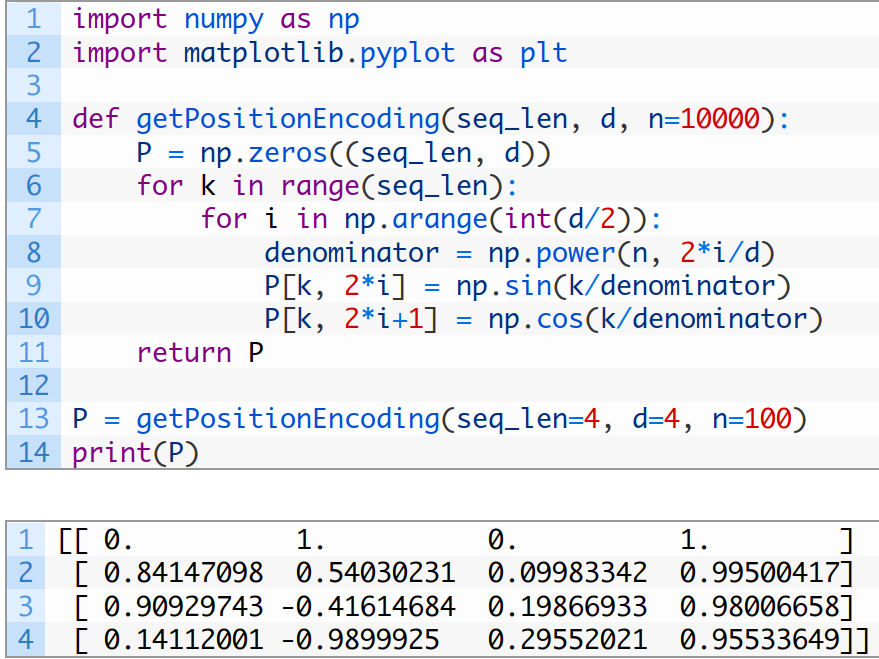

Code taken from [here](https://machinelearningmastery.com/a-gentle-introduction-to-positional-encoding-in-transformer-models-part-1/).

This could become inefficient, so let's show how it can be done in a vectorized way:

The divisor is:


By utilizing properties of the logarithm we could rewrite it in the following way:


This is significant because it can be used to generate **all the divisors** (per row and column) for the positional encodings at once. Below we can see that only two divisors are necessary for a `4`-dimensional embedding since the divisor only changes every $2i$, where $i$ is the dimension. This repeats across each position:


4. In step 3. we generated all divisors. Now, we can go through all the:
   - even indices and apply a function `sin` on the position multiplied by the divisor;
   - odd indices and apply a function `cos` on the position multiplied by the divisor.

The end result is a single vector in which all even indices have been encoded using the `sin` formula and all of the odd indices - the `cos` formula.

</details>

## Multi-head self-attention

<details>
<summary>How many parameters do attention blocks take as input?</summary>


- The idea is to apply **three sets of matrices** that through backpropagation would learn:
  - the relationship between the tokens;
  - the importance of each token.
- Multi-head attention blocks:
  - Clones input into $h$ **heads** (creates $h$ copies of the input, called **heads**).
  - Applies different matrices in each head, leading to different patterns being captured.
    - Think of this as having multiple filters in a Convolutional Neural Network.
      - Each filter discovers a different pattern from the rest.
      - Combined, they produce multiple points of view of the same input.

</details>

Three types of attention:

- Self-attention.
- Masked self-attention.
- Cross-attention.


*By dvgodoy - https://github.com/dvgodoy/dl-visuals/?tab=readme-ov-file, CC BY 4.0, https://commons.wikimedia.org/w/index.php?curid=151216016*

<details>
<summary>Open the paper and find the two diagrams that illustrate the operations behind attention and how attention is used.</summary>


- **Q**: Indicate what each token is "looking for" in other tokens.
- **K**: The "content" of each token that other tokens might find relevant.
- **V**: Contains the actual content to be aggregated or weighted, based on attention scores.

</details>

<details>
<summary>Open the paper and find the formula for attention.</summary>


</details>

### Step 1

<details>
<summary>The token embeddings get turned into Q, K, and V. By looking at the paper, can you intuit how this may be happening?</summary>

1. Pass the positional encodings into $h$ different attention heads.
2. Each head:
   1. Has three `3` different `nn.Linear` transformations (usually without biases). These are referred to as the projections that will form `Q`, `K`, `V`.
      - The input dimension is $d_{model}$.
      - The output dimension of these linear layers is called `head_size`.
        - In the paper they refer to it as $d_k$.
      - The `head_size` is typically evenly distributed between heads to make up $d_{model}$. So, if $d_{model} = 512$ and $h = 8$, then $d_k = 512 / 8 = 64$.
   2. Passes the received input through these linear transformations.
   3. The results are the matrices `Q`, `K`, `V`.
   4. Perform Scaled Dot-Product Attention.
   5. Concatenate the results.
   6. Linearly transform the concatenation back to the shape of the input.


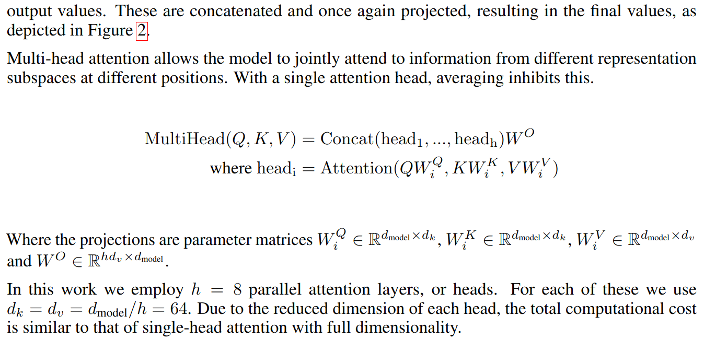


Here's what happens as the first step in each head ($X = K = V = Q$, where $X$ are the encoded tokens):


Transforming each token's embeddings into these roles helps the model learn more nuanced token relationships.

</details>

### Step 2

For each *query* vector, calculate a score with each *key* vector that determines how much focus to place on that *key* vector.


The score is calculated by taking the dot product of the *query* vector with each *key* vector of the respective word we’re scoring.

So if we’re processing the self-attention for the word in position `#1`, the first score would be the dot product of `q1` and `k1`. The second score would be the dot product of `q1` and `k2`.


### Steps 3 and 4

Divide the scores by the square root of the head size and pass the result through the `softmax` function.

<details>
<summary>Open the paper and find the head size used by the authors.</summary>

$64$.


</details>

<details>
<summary>Open the paper and find why dividing by the square root of "d_k" is needed.</summary>

It leads to having more stable gradients for larger values of $d_k$.


</details>

Softmax normalizes the scores so they’re all positive and add up to $1$.

Here's how we can continue the example:


### Steps 5 and 6

Multiply each `Value` vector by the softmax score and sum up the results.

The intuition is to keep intact the values of the word(s) we want to focus on, and remove irrelevant words (ex. by multiplying them by tiny numbers like $0.001$).


When working with matrices this means multiplying the `Values` matrix, which are the token encodings, by the **attention weights** matrix to update the encodings with the attention information.


### Combining outputs

When we have multiple heads, their outputs get concatenated and linearly projected:


## Masking in the encoder

<details>
<summary>Why would the encoder need a mask?</summary>

- The encoder shouldn't pay attention to padding tokens.
- The formula would change as follows:

$$\mathrm{Attention}(Q, K, V, M) = \mathrm{softmax}\left(\frac{QK^T}{\sqrt{d_k}}M\right)V$$

</details>

<details>
<summary>What data type would the mask hold?</summary>

It would be best if the mask holds values, $0$ and $1$, where

- $0$ means that this is a `pad` token and it should receive $0$ attention;
- $1$ means that this is not a `pad` token and it should receive attention.

</details>

<details>
<summary>What shape should the mask be in?</summary>

- Since the dot product produces a shape `batch_size` x `maximum_sequence_length` x `maximum_sequence_length` (how much attention each token should pay to each other token), the mask should should also be in that dimension.
- Note that the source mask is most easily created out of the matrix with the token ids that has shape `batch_size` x `maximum_sequence_length`.
- To get it to that dimension, we can:
  1. Generate a matrix with $1$s of the size of the input (`batch_size` x `maximum_sequence_length`).
  2. Change the $1$s that are on indices of padding tokens to $0$.
  3. Use the function `unsqueeze(1)` to get size `batch_size` x $1$ x `maximum_sequence_length`.
  4. Use the function `expand(-1, maximum_sequence_length, -1)` to get size `batch_size` x `maximum_sequence_length` x `maximum_sequence_length`.

</details>

<details>
<summary>What part of the encoder will change and how?</summary>

- The `forward` method of the attention `Head` will accept one more parameter that will be the `mask` to apply before `softmax`.
- This would mean that the `forward` method of the class `MultiHeadAttention` would also change to accept the new `mask` parameter.
- The `Head` will use the mask before applying the softmax as follows: `scores.masked_fill(key_padding_mask_expanded == 0, -torch.inf)`.
  - This will have the effect of making the outputs of the softmax $0$ for all `pad` tokens.

</details>

## Position-wise Feed-Forward Networks

<details>
<summary>Open the paper and find the section in which position-wise feed-forward layers are discussed.</summary>


</details>

<details>
<summary>How would we implement this layer in PyTorch?</summary>

1. Apply one `Linear` layer (with `bias`) to go from $d_{model}$ to $d_{ff}$.
2. Apply non-linearity using `ReLU`.
3. Apply a second `Linear` layer (with `bias`) to go from $d_{ff}$ to $d_{model}$.

</details>

## Addition and Layer Normalization

Deep neural networks by design suffer from unstable gradients:

- either vanishing gradient;
- or exploding gradient.

<details>
<summary>Dealing with the second problem is rather easy - how?</summary>

Gradient clipping.

</details>

<details>
<summary>How do the authors solve the first problem?</summary>

They use skip connections / residual connections.


</details>

<details>
<summary>What do skip-connections do that allows the gradients to stabilize?</summary>


- It distributes gradients equally to both of its branches.
- This means that the gradients from the loss "hop" through multiple forked-off operations, keeping the gradient "alive".

</details>

- Layer Normalization is used to keep the scales and variances of inputs equal before and after the feed forward layer.
  - It is similar to batch normalization, but normalizes the samples (dimension $1$), instead of the batches (dimension $0$):
  - We'll use the built-in class [nn.LayerNorm](https://pytorch.org/docs/stable/generated/torch.nn.LayerNorm.html#layernorm) passing in $d_{model}$.

## The Encoder block

<details>
<summary>So, what are the steps that are followed in a single encoder layer?</summary>

1. The input is passed through `MultiHeadAttention` along with the mask.
2. That result is passed through dropout.
3. That result is added to the input that was passed to the attention (this addition is the first skip connection).
4. That result is passed through a `LayerNorm` instance.
5. That result is passed through a feed-forward sublayer.
6. That result is passed through the same dropout as in step `2.`.
7. That result is added to the input that was passed to the feed-forward sublayer (this addition is the second skip connection).
8. That result is passed through a different `LayerNorm` instance.
9. The result is returned as the output of the encoder block.

</details>

<details>
<summary>And so what are the steps that happen in the Transformer body of an encoder-only Transformer?</summary>

1. The input is passed to a token embedding layer.
2. That result is passed to a positional encoding layer.
3. That result is passed to the first encoder layer along with the mask.
4. The output of each encoding layer is passed to the next one.
5. The output of the final encoding layer is returned as the output of the Transformer body.

</details>

<details>
<summary>What is left is the transformer head - what are the steps if the head is a classification one?</summary>

1. The input is passed through a linear layer that goes from `d_model` to `num_classes`.
2. (Optionally) Softmax is applied to the logits.

</details>

<details>
<summary>What if the head is a regression one?</summary>

1. The input is passed through a linear layer that goes from `d_model` to `output_dim`.
   - If a single numerical value is to be predicted, `output_dim = 1`.
2. The result is returned.

</details>

## Encoder-only transformers


- Place emphasis on understanding and representing input data.
- They excel at **supervised tasks** for **sequence classification**:
  - any type of text classification:
    - sentiment analysis;
    - topic classification;
    - etc.
  - time-series prediction.
  - etc.

<details>
<summary>Open the paper and find the rate of dropout.</summary>

$0.1$


</details>

## Decoder-only transformers


These types of transformers excel at **autoregressive sequence generation**:

- text generation;
- text completion.

### Masking in the decoder

<details>
<summary>When we were creating masks in the encoder, what did we ignore using them?</summary>

The padding tokens.

</details>

<details>
<summary>Should we ignore them in the decoder as well?</summary>

Yes, though we should also ignore other tokens.

</details>

<details>
<summary>Open the paper and find the section that details the differences between the attention in the decoder vs the encoder? What other tokens should we ignore?</summary>

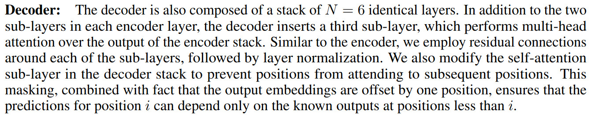

We should no pay attention to all **future tokens**.

- Recall that our matrix with attention scores had every input token on the rows and on the columns.
  - This means that there is attention from every token to every other token.
  - In the decoder, however, we want to pay attention to all the tokens leading up to the current token to predict.

</details>

<details>
<summary>And so how would the attention matrix look like for the sentence "I enter the cinema to watch a movie"</summary>


</details>

<details>
<summary>How would we implement this on a technical level?</summary>

1. Create a matrix - `tgt_mask`, with $1$s of shape `maximum_sequence_length` x `maximum_sequence_length`.

```python
mask = torch.ones(max_seq_len, max_seq_len)
```

2. Make `tgt_mask` a lower triangular matrix.

```python
torch.tril(mask)
```

3. Calculate the attention scores.

```python
attention_scores = q @ k.transpose(-2, -1) * dk**-0.5
```

4. Use `tgt_mask` to substitute all attention scores for which the entry in `tgt_mask` is $0$ with negative infinity.

```python
attention_scores = attention_scores.masked_fill(tgt_mask == 0, float('-inf'))
```

</details>

### Decoder layer

The decoder layer is the same as the encoder layer we created before:

- multi-head attention;
- feed-forward sublayer;
- layer normalizations and dropouts before and after.

The only difference is that the padding mask has been replaced with the causal attention mask in the forward pass.

## Encoder-decoder-only transformers

### Cross-attention + `LayerNorm`

1. Queries come from the decoder.
2. Keys and values come from the encoder.
3. They are combined into a new attention layer, called `cross-attention`.
   - In our implementation, this will be another multihead attention block, but this time we'll have to modify it, to accept three different parameters for the input.
     - In the encoder and decoder self-attention layers, those three parameters will all be the same.
     - In the cross-attention:
       - the queries will be the outputs of the self-attention of the decoder;
       - the keys and values will come as the output of the encoder.


### Some changes required

The `forward` method of the single decoder layer will now accept two more parameters. So in total it'll have $4$ parameters:
  - `x`: the input to the self-attention of the decoder;
  - `y`: the output of the encoder;
  - `tgt_mask`: the target mask;
  - `cross_mask`: the padding mask to be used in the encoder.
  - Those parameters would need to be accepted in the decoder block and passed to each layer.

We should then be able to compose the two classes in the final class `Transformer`:

```python
class Transformer(nn.Module):
  def __init__(self, vocab_size, d_model, num_heads, num_layers, d_ff, max_seq_len, dropout_rate):
    super().__init__()
    self.encoder = TransformerEncoder(vocab_size, d_model, num_heads, num_layers, d_ff, dropout, max_seq_len)
    self.decoder = TransformerDecoder(vocab_size, d_model, num_heads, num_layers, d_ff, dropout, max_seq_len)
  
  def forward(self, x, src_mask, tgt_mask):
    encoder_output = self.encoder(x, src_mask)
    decoder_output = self.decoder(x, encoder_output, tgt_mask, src_mask)
    return decoder_output
```

## Using a pre-built architecture

PyTorch provides a high-level class in `torch.nn` to quickly define the architecture - [`nn.Transformer`](https://pytorch.org/docs/stable/generated/torch.nn.Transformer.html#transformer).

```python
import torch.nn as nn

model = nn.Transformer(
  d_model=512,
  nhead=8,
  num_encoder_layers=6,
  num_decoder_layers=6,
)

print(model)
```

- `d_model`: Dimensionality of model inputs.
- `nheads`: Number of attention heads.
- `num_encoder_layers`: Number of encoder layers.
- `num_decoder_layers`: Number of decoder layers.

```console
Transformer(
  (encoder): TransformerEncoder(
    (layers): ModuleList(
      (0-5): 6 x TransformerEncoderLayer(
        (self_attn): MultiheadAttention(
          (out_proj): NonDynamicallyQuantizableLinear(in_features=512, out_features=512, bias=True)
        )
        (linear1): Linear(in_features=512, out_features=2048, bias=True)
        (dropout): Dropout(p=0.1, inplace=False)
        (linear2): Linear(in_features=2048, out_features=512, bias=True)
        (norm1): LayerNorm((512,), eps=1e-05, elementwise_affine=True)
        (norm2): LayerNorm((512,), eps=1e-05, elementwise_affine=True)
        (dropout1): Dropout(p=0.1, inplace=False)
        (dropout2): Dropout(p=0.1, inplace=False)
      )
    )
    (norm): LayerNorm((512,), eps=1e-05, elementwise_affine=True)
  )
  (decoder): TransformerDecoder(
    (layers): ModuleList(
      (0-5): 6 x TransformerDecoderLayer(
        (self_attn): MultiheadAttention(
          (out_proj): NonDynamicallyQuantizableLinear(in_features=512, out_features=512, bias=True)
        )
        (multihead_attn): MultiheadAttention(
          (out_proj): NonDynamicallyQuantizableLinear(in_features=512, out_features=512, bias=True)
        )
        (linear1): Linear(in_features=512, out_features=2048, bias=True)
        (dropout): Dropout(p=0.1, inplace=False)
        (linear2): Linear(in_features=2048, out_features=512, bias=True)
        (norm1): LayerNorm((512,), eps=1e-05, elementwise_affine=True)
        (norm2): LayerNorm((512,), eps=1e-05, elementwise_affine=True)
        (norm3): LayerNorm((512,), eps=1e-05, elementwise_affine=True)
        (dropout1): Dropout(p=0.1, inplace=False)
        (dropout2): Dropout(p=0.1, inplace=False)
        (dropout3): Dropout(p=0.1, inplace=False)
      )
    )
    (norm): LayerNorm((512,), eps=1e-05, elementwise_affine=True)
  )
)
```

# Week 11 - Bigram language model using counting

## Generating human names

- Our goal for the next few weeks is to create models that can generate human-like names (like the ones they were trained on).
- We're going to try out three approaches:
  1. Character-level bigram language model built just from counting (no fancy neural networks and backpropagation).
  2. Character-level bigram language model using a proper neural network (with a single `Linear` layer).
  3. Multilayer perceptron (MLP) character-level language model.

We hope to get results similar to these:

```text
mona
kayah
see
med
rylla
emmaniendra
gracee
daeliah
miloelle
elieanana
leigh
malaia
noshuder
shiriel
kinde
jennox
teus
kunzey
dariyah
faeh
```

## Character-level language model

<details>
<summary>What is a language model?</summary>

An algorithm that returns probabilities for the possible next token in a sequence.

</details>

<details>
<summary>What is a character-level language model?</summary>

- When the tokens are characters.
- The language model is therefore:
  - modelling sequences of characters;
  - able to predict the next character in a sequence of characters.

</details>

## An $n$-gram language model

<details>
<summary>What do you know about these types of language models?</summary>

$n$-gram language models are statistical models over sequences of tokens:

- if the tokens are words, then we have a [word $n$-gram language model](https://en.wikipedia.org/wiki/Word_n-gram_language_model);
- if they are characters, then we have a character-level language model.

</details>

<details>
<summary>What does "n" refer to?</summary>

$n$ = length of the sequence = size of the context.

</details>

<details>
<summary>Can a token be a sequence of characters (but not a full word) or a number of words (but not a full sentence)?</summary>

Yep - actually, such methods are used in GPT-3.5 and GPT-4. Feel free to read more about [Byte pair encoding](https://en.wikipedia.org/wiki/Byte_pair_encoding).

</details>

<details>
<summary>What is the assumption that drives the logic of such models?</summary>

The probability of the next token in a sequence depends only on a fixed size window of previous tokens.

</details>

<details>
<summary>What is then a bigram model?</summary>

When only one previous token is considered to predict the current/next one.

</details>

<details>
<summary>What is then a trigram model?</summary>

When two previous tokens are considered to predict the current/next one.

</details>

<details>
<summary>And so, what is then an n-gram model?</summary>

When $n - 1$ previous tokens are considered to predict the current/next one.

</details>

## Building out a character-level bigram language model

The first thing we think about when creating a model is the data. Here are the first few names in our training dataset:

```text
emma
olivia
ava
isabella
```

<details>
<summary>What would the training examples for our model look like?</summary>

- Every name has quite a few examples packed in it.
- An existence of a word like `isabella` is telling us that:
  1. The character `i` is likely to be followed by the character `s`.
  2. The character `s` is likely to be followed by the character `a`.
  3. The character `a` is likely to be followed by the character `b`.
  4. The character `b` is likely to be followed by the character `e`.
  5. The character `e` is likely to be followed by the character `l`.
  6. The character `l` is likely to be followed by the character `l`.
  7. The character `l` is also likely to be followed by the character `a`.

</details>

<details>
<summary>However, we have a little bit more information - which bigrams did we miss?</summary>

1. We also know that `i` is likely to start a sequence.
2. And `a` is likely to end a sequence.

</details>

<details>
<summary>How can we solve this problem?</summary>

We can introduce special tokens - `<S>` for "start-of-sequence/word token", and `<E>` for "end-of-sequence/word token".

We would then get this:

1. `<S>i` (short for: `<S>` is followed by `i`)
2. `is` (short for: `i` is followed by `s`)
3. `sa` (short for: `s` is followed by `a`)
4. `ab` (short for: `a` is followed by `b`)
5. `be` (short for: `b` is followed by `e`)
6. `el` (short for: `e` is followed by `l`)
7. `ll` (short for: `l` is followed by `l`)
8. `la` (short for: `l` is followed by `a`)
9. `a<E>` (short for: `a` is followed by `<E>`)

</details>

<details>
<summary>How can we use this information to proceed with our task?</summary>

1. We can **count** the number of times each possible bigram appears in the training set.
2. We can use those counts to get a **probability** distribution over the next character given a current one.
3. We can then **sample** from this distribution (each character will get a weight) - this is also known as the [Multinomial distribution](https://en.wikipedia.org/wiki/Multinomial_distribution).

</details>

<details>
<summary>Technical question: how would it be best for us to store those counts?</summary>

Since the possible bigrams are not that much - `28` (including `SOS` and `EOS`), we can just have a matrix of size `28x28` in which each element:

- is of the form `xy`, meaning `the character "x" is followed by the character "y"`;
- holds how many times `the character "x" is followed by the character "y"` in the training dataset.

</details>

By doing so we'll get a matrix that looks like this:


<details>
<summary>What are two problems with this matrix?</summary>

It has unnecessary information - the bottom row is only zeros as is the second to last column. This is because:

- it's impossible for something to follow the `<E>` token;
- and it's impossible for the `<S>` token to follow a character.

Thus, we are wasting space enumerating impossible situations (bigrams).

</details>

<details>
<summary>How can we overcome this?</summary>

Let's replace `<S>` and `<E>` with `.` and place the enumerations of `.` to be the beginning of the matrix.

</details>

We would then get this:


<details>
<summary>What would our next step be and why?</summary>

We'd convert each row from counts to probabilities.

This is so that, for example, when we have the character `.` (beginning of a sentence) we can tell what's the most likely next character.

</details>

## The Multinomial Distribution

<details>
<summary>What do you know about it?</summary>

Ok, let's explain it with examples.

</details>

- You have a coin.
- Your experiment is throwing that coin $1$ time and checking whether it landed on `heads`. It's either going to be $1$ or $0$.

<details>
<summary>What distribution do you use to model these 0s and 1s?</summary>

[Bernoulli distribution](https://en.wikipedia.org/wiki/Bernoulli_distribution): $K = 2$ outcomes, $n = 1$ trial.

</details>

- You have a coin.
- Your experiment is throwing that coin $n$ times and counting the total number of times it landed on `heads`. The result is a number from $0$ to $n$.

<details>
<summary>What distribution do you use to model this count?</summary>

[Binomial distribution](https://en.wikipedia.org/wiki/Binomial_distribution): $K = 2$ outcomes, $n >= 1$ trial.

</details>

- You now have a dice.
- Your experiment is throwing that dice $1$ time and checking whether it landed on $6$. It's either going to be $1$ or $0$.

<details>
<summary>What distribution do you use to model these 0s and 1s?</summary>

[Categorical distribution](https://en.wikipedia.org/wiki/Categorical_distribution): $K >= 2$ outcomes, $n = 1$ trial.

</details>

- You have a dice.
- Your experiment is throwing that dice $n$ times and counting:
  - the total number of times it landed on $1$
  - and the total number of times it landed on $2$
  - and the total number of times it landed on $3$
  - and the total number of times it landed on $4$
  - and the total number of times it landed on $5$
  - and the total number of times it landed on $6$

<details>
<summary>What distribution do you use to model these counts?</summary>

[Multinomial distribution](https://en.wikipedia.org/wiki/Multinomial_distribution): $K >= 2$ outcomes, $n >= 1$ trial(s).

</details>

- Generalization of the binomial distribution.
- The number of outcomes is allowed to be greater than $2$.
- `You give me probabilities for integers and I'll give you integers that are sampled according to those probabilities.`
- Available in PyTorch as [`torch.multinomial`](https://pytorch.org/docs/stable/generated/torch.multinomial.html#torch-multinomial).

## Sampling from a multinomial distribution with PyTorch

### The [`Generator` class](https://pytorch.org/docs/stable/generated/torch.Generator.html#generator) in PyTorch

- If we regard `torch.manual_seed` as the "functional" way to set the seed, then using `Generator` is the "OOP" way.
- Used as a keyword argument in many [in-place random sampling functions](https://pytorch.org/docs/stable/torch.html#inplace-random-sampling).

### Sampling with a `Generator`

```python
g = torch.Generator().manual_seed(42)
p = torch.rand(3, generator=g)
p
```

The above would always produce:

```console
tensor([0.8823, 0.9150, 0.3829])
```

Let's normalize and draw from the multinomial distribution:

```python
import torch
g = torch.Generator().manual_seed(42)
p = torch.rand(3, generator=g)
p /= p.sum()
print(p) # tensor([0.4047, 0.4197, 0.1756])
drawn = torch.multinomial(p, num_samples=1000, replacement=True, generator=g)
print(f'Proportion of 0: {drawn[drawn == 0].shape[0] / drawn.shape[0]}') # Proportion of 0: 0.404
print(f'Proportion of 1: {drawn[drawn == 1].shape[0] / drawn.shape[0]}') # Proportion of 1: 0.425
print(f'Proportion of 2: {drawn[drawn == 2].shape[0] / drawn.shape[0]}') # Proportion of 2: 0.171
```

Notice how the probability of each index dictates how often it gets drawn.

<details>
<summary>So, if we have to use our model to create a new name, what are the steps to follow?</summary>

1. Create a string with a `.`.
2. Get the row that stores the probabilities of the characters that can follow `.`.
3. Sample an index using the probabilities.
4. Look up that index to see which letter it corresponds to. Let's say it's `m`.
5. Add `m` to the initial string. It is now `.m`.
6. Get the row that stores the probabilities of the characters that can follow `m`.
7. Sample an index using the probabilities.
8. Look up that index to see which letter it corresponds to. Let's say it's `a`.
9. Add `a` to the initial string. It is now `.ma`.
10. And so on...

</details>

<details>
<summary>When do we end the process?</summary>

Two possibilities:

- either we sample the character `.` again;
- or we have a predefined `max_sequence_length` and we stop once that many characters are sampled.

</details>

## Negative Log Likelihood

Let's explore how we can evaluate the quality of our model.

<details>
<summary>How would the baseline model work?</summary>

The baseline / "dumbest" model would predict everything as equally likely, so each probability of a bigram pair would be $1/27 = 0.037$.

</details>

<details>
<summary>How would we know that our model has learned anything?</summary>

If our model assigns probabilities above $0.037$, then it has learned some pattern.

</details>

Let's say that after we create the table with the probabilities, we check what probabilities the model assigns to the bigrams formed by the first `3` names and we get this:


<details>
<summary>In the idea situation what values would we want to have?</summary>

We would want to have all values close to $1$, since that means that the model has learned the pattern in the training set.

</details>

<details>
<summary>Can we calculate a single number that would say how likely the model is to generate the names it was trained on?</summary>

We can estimate the likelihood of the data (i.e. that the model would generate names like the ones it was trained on). This would be equivalent to the product of all probabilities assigned by the model for all training bigrams.

</details>

<details>
<summary>What would a good model do with this number?</summary>

It would [maximize the likelihood](https://en.wikipedia.org/wiki/Maximum_likelihood_estimation).

</details>

Let's define it mathematically:

${\displaystyle L = \prod_{i=1}^n p(y_i)}$

<details>
<summary>What is the problem of directly applying this?</summary>

- All of the probabilities are between $0$ and $1$.
- If we multiply them we're going to get a very small number:
  - It will become even smaller as more probabilities are present.

</details>

<details>
<summary>How can we solve this problem?</summary>

We can take the $\log$ of the product!

$\log$ is:

- monotonically increasing;
- can better "distinguish" between very small numbers (we plug-in $x$, it gives us $y$);


- and has this very nice equivalence: $\log (abc) = \log a + \log b + \log c$
- the base is usually $e$, though it can vary.

The formula would then become:

${\displaystyle L = \sum_{i=1}^n \ln(p(y_i))}$

</details>

<details>
<summary>How large can that value get?</summary>

The largest possible log-likelihood is $0$.

</details>

<details>
<summary>Why is this a problem?</summary>

Because these are not the semantics we want out of a loss function. We want to minimize loss functions.

</details>

<details>
<summary>How can we solve this?</summary>

We can measure the negative log-likelihood!

The formula would then become:

${\displaystyle L = - \sum_{i=1}^n \ln(p(y_i))}$

</details>

And finally, for convenience, we usually normalize the values of the loss functions using the number of used samples, so the final version of the $NLL$ loss is:

${\displaystyle NLL = -\frac{1}{n} \sum_{i=1}^n \ln(p(y_i))}$

We've heard about the loss function [Cross-entropy](https://en.wikipedia.org/wiki/Cross-entropy). It's actually the same as calling $NLL$ after passing the logits through $Softmax$:

- Here's the implementation of it in C++: <https://github.com/pytorch/pytorch/blob/e0ff6a21d8bf3935f4332fb18b40b48472f9b648/aten/src/ATen/native/LossNLL.cpp#L607-L612>.
- So, then:

```python
F.nll_loss(-log(softmax(logits, dim=1)),targets)
```

is equivalent to:

```python
F.cross_entropy(logits,targets)
```

But wait - this:

$$\text{NLL} = -\frac{1}{n} \sum_{i=1}^n \ln(p(y_i))$$

is different from this

$$\text{CrossEntropy}(y, \hat{y}) = -\frac{1}{n} \sum_{j=1}^{n} \sum_{i=1}^{C} y_i \log(\hat{y}_i)$$

, right?

Actually, they are the same thing.

- $y_i$ is the true label for class $i$. In most classification tasks, this is one-hot encoded, meaning:
  - $y_i = 1$ for the correct class $t$;
  - $y_i = 0$ for all other classes.

For any single sample only one $y_i$ will be $1$, so we can simplify the summation to:

$$\text{CrossEntropy}(y, \hat{y}) = -\log(\hat{y}_t)$$

Suppose we have $3$ classes, and the true class is class $2$. The model outputs:

$$\hat{y} = [0.1, 0.7, 0.2]$$

Then the true label vector is:

$$y = [0, 1, 0]$$

The cross entropy loss becomes:

$$-\left(0 \cdot \log(0.1) + 1 \cdot \log(0.7) + 0 \cdot \log(0.2)\right) = -\log(0.7)$$

## Model Smoothing and Regularization

In the previous section we saw how we can calculate the probability that our model would predict any given name. We start testing it out and for the word `jaguar` the model returns $-3.5$.

<details>
<summary>Does this mean that the model is likely to generate it or no?</summary>

This is far from $0$, so it's not very likely to generate it.

</details>

<details>
<summary>What number would we expect to get for the word "jqaguar" compared to "jaguar"?</summary>

We would expect something more negative, but actually if we run this through the model, we would get $\inf$!

</details>

<details>
<summary>Why is that?</summary>

By storing the true counts we start to miss edge-cases (the model loses its novelty):

- it won't be able to generate bigrams it hasn't seen:
  - the counts would be `0` as the training set does not contain examples of them;
  - thus, the model would assign `probability=0` if checked for unseen bigrams.
  - when the loss is calculated, we can get $\inf$ because `log(0)` is `undefined`.

But this is not ok - the model should be able to generate a name that is rather uncommon, but still possible - uncommon names exist in real life.
</details>

<details>
<summary>How can we fix this?</summary>

We can utilize a technique called **model smoothing** to overcome this:

- smoothing is used to regulate the probability assigned to words that have unseen bigrams;
- it has various forms: you can read more [here](http://mlwiki.org/index.php/Smoothing_for_Language_Models) and [here](https://github.com/akash18tripathi/Language-Modelling-and-Smoothing-techniques?tab=readme-ov-file#smoothing-in-language-modeling);
- we'll use a very simple form: just start counting from $1$ instead of $0$;
  - we can add smoothing at the step in which we're turning the counts into probabilities - instead of turning the raw counts, we'll use `counts + 1`. This variation is known as `+1 smoothing`.

Using `+1 smoothing` ensures every possible bigram, even those not present in our training dataset, has been "seen" by the model at least `1` time. As expected very low probabilities would be assigned to words containing unseen bigrams, but at least they wouldn't be zero.

</details>

<details>
<summary>What would happen if we start increasing those "fake" counts - what if it was 1000 instead of 1?</summary>

This would lead to more uniformly distributed probabilities all bigrams will be more equally likely to get predicted.

</details>

<details>
<summary>So in the end it seems that this is making our model more dumb in exchange to produce unconventional results. What is this technique (that introduce more bias to reduce the variance) called?</summary>

Model regularization!

</details>

# Week 12 - Building a bigram language model using a neural network

## Defining the architecture

<details>
<summary>What is a deep learning model?</summary>

A set of parameters (weights and biases).

</details>

<details>
<summary>What was our model in the previous week?</summary>

A 2D matrix with probabilities.

</details>

<details>
<summary>What kind of model was it?</summary>

It was a statistical model (based on counting), not a deep learning model.

</details>

<details>
<summary>What are the downsides we saw with this approach?</summary>

- The model is not flexible - it can't do feature engineering; can't produce `novel` names.
- The model requires very high quality data.

</details>

<details>
<summary>What would happen to the size of the table if we start increasing the context length?</summary>

It'll grow exponentially with the length of the context.

</details>

<details>
<summary>How many rows and columns would we need if we have 1 character of context?</summary>

$27$.

</details>

<details>
<summary>What if we take 2 characters of context (for predicting the third one)?</summary>

$27 * 27 = 729$.

</details>

<details>
<summary>What if we take 3 characters of context?</summary>

$27 * 27 * 27 = 19,683$.

</details>

<details>
<summary>What happens to the values in the table as it grows?</summary>

It becomes more and more **sparse**:

1. Way too few counts.
2. Way more zeros.
3. Need a much bigger (training) dataset to fill-in these zeros.

</details>

<details>
<summary>What steps would a neural network need to perform to solve our problem?</summary>

1. Receive a single character as an input.
2. It goes through some weights.
3. The output is be a probability distribution over the next character in the sequence.

</details>

<details>
<summary>What benefits do we get?</summary>

- We can evaluate any setting of the parameters: their number, how they interact, etc.
- In the end, we **hope** to get a more flexible model that can generate more human-like names, performing feature engineering by itself to learn the hidden patterns.

</details>

<details>
<summary>Are we expecting the neural network to get a lower loss?</summary>

No.

- The network should converge to the loss we've observed via counting (`2.4540`) since it is litterally "the best we can do".
- The best solution is counting, we don't expect the NN to beat it.
- It's like teaching a neural network to prove the counts.

<details>
<summary>But then why are we using a neural network?</summary>

- It is not because it'll be better than counting.
- It's because **NNs are more scalable** and we can further "complexify" them.
  - As data and the complexity of the task (trigram, more letters, etc) grow, it's a lot:
    - easier for a neural network to find patterns and produce results (letting it **figure out the most optimal way of doing it**);
    - harder to manually code the solution, storing gigabytes in a table (in-memory, btw!).
      - There isn't an obvious way in which we could use multiple previous characters using only tables - there will be way too many combinations of what previous characters could be.

</details>

</details>

<details>
<summary>How would the training dataset look like?</summary>

- We'll have `xs` and `ys`.
- Each sample has one characteristic: its value `x`.
- Each label is the character that should follow `x`.

</details>

<details>
<summary>How would the training example(s) for "emma" look like?</summary>

There are $5$ separate examples:

```text
. e
e m
m m
m a
a .
```

Which would translate to:

```python
xs = tensor([0, 5, 13, 13, 1])
ys = tensor([5, 13, 13, 1, 0])
```

</details>

<details>
<summary>How would we feed-in our training examples?</summary>

- Our examples are integers but they don't have inherent natural ordering
  - the character `m` may have a value `5` but that does not mean that it's "greater" than the character `a` with a value of `1`.

We can use **the one hot encoding technique** to avoid the problem of ordinality.

Example:

| Fruit  | Categorical value of fruit | Price |
| ------ | -------------------------- | ----- |
| apple  | 1                          | 5     |
| mango  | 2                          | 10    |
| apple  | 1                          | 15    |
| orange | 3                          | 20    |

The output after applying one-hot encoding on the data is given as follows:

| apple | mango | orange | price |
| ----- | ----- | ------ | ----- |
| 1     | 0     | 0      | 5     |
| 0     | 1     | 0      | 10    |
| 1     | 0     | 0      | 15    |
| 0     | 0     | 1      | 20    |

</details>

Pytorch already has an implementation for one hot encoding a tensor of numbers: [torch.nn.functional.one_hot](https://pytorch.org/docs/stable/generated/torch.nn.functional.one_hot.html#torch-nn-functional-one-hot). We can use it directly.

If we have `xs = torch.tensor([0, 5, 13, 13, 1])`, the we can use `F.one_hot` on it.

<details>
<summary>What value would we put for the "num_classes" parameter `F.one_hot(xs, num_classes=???)`?</summary>

$27$

</details>

<details>
<summary>Why?</summary>

The number of possible next characters is $27$.

</details>

<details>
<summary>What would happen if we didn't set "num_classes" when encoding "xs"?</summary>

We would get subvectors with length $14$ which would not be able to encode all examples properly.

Without `num_classes`:

```python
import torch
import torch.nn.functional as F
xs = torch.tensor([0, 5, 13, 13, 1])
print(F.one_hot(xs))
print(F.one_hot(xs).shape)
```

```console
tensor([[1, 0, 0, 0, 0, 0, 0, 0, 0, 0, 0, 0, 0, 0],
        [0, 0, 0, 0, 0, 1, 0, 0, 0, 0, 0, 0, 0, 0],
        [0, 0, 0, 0, 0, 0, 0, 0, 0, 0, 0, 0, 0, 1],
        [0, 0, 0, 0, 0, 0, 0, 0, 0, 0, 0, 0, 0, 1],
        [0, 1, 0, 0, 0, 0, 0, 0, 0, 0, 0, 0, 0, 0]])
torch.Size([5, 14])
```

With `num_classes`:

```python
import torch
import torch.nn.functional as F
xs = torch.tensor([0, 5, 13, 13, 1])
print(F.one_hot(xs, num_classes=27))
print(F.one_hot(xs, num_classes=27).shape)
```

```console
tensor([[1, 0, 0, 0, 0, 0, 0, 0, 0, 0, 0, 0, 0, 0, 0, 0, 0, 0, 0, 0, 0, 0, 0, 0, 0, 0, 0],
        [0, 0, 0, 0, 0, 1, 0, 0, 0, 0, 0, 0, 0, 0, 0, 0, 0, 0, 0, 0, 0, 0, 0, 0, 0, 0, 0],
        [0, 0, 0, 0, 0, 0, 0, 0, 0, 0, 0, 0, 0, 1, 0, 0, 0, 0, 0, 0, 0, 0, 0, 0, 0, 0, 0],
        [0, 0, 0, 0, 0, 0, 0, 0, 0, 0, 0, 0, 0, 1, 0, 0, 0, 0, 0, 0, 0, 0, 0, 0, 0, 0, 0],
        [0, 1, 0, 0, 0, 0, 0, 0, 0, 0, 0, 0, 0, 0, 0, 0, 0, 0, 0, 0, 0, 0, 0, 0, 0, 0, 0]])
torch.Size([5, 27])
```

</details>

<details>
<summary>So what would our training set look like?</summary>

A tensor of one hot encoded indices.

</details>

<details>
<summary>Looking at the above examples, what is the data type of the resulting tensor (after one hot encoding)?</summary>

Integer.

</details>

<details>
<summary>What data type do neural networks work with (accept as input, process and output)?</summary>

Floating-point numbers.

</details>

<details>
<summary>How can we deal with this?</summary>

We can cast the result using `.float`.

</details>

<details>
<summary>Architecturally, how would our model look like so far?</summary>


</details>

<details>
<summary>How can we continue the architecture?</summary>

We can have a simple linear layer that accepts $27$ neurons and returns $27$ neurons (for every possible character).


</details>

<details>
<summary>What values should we give to the layer weights at initialization?</summary>

- Let's use the standard normal distribution so as to give each of them a value that's very close to $0$.
- PyTorch has built-in functionality for this: `torch.randn` - <https://pytorch.org/docs/stable/generated/torch.randn.html#torch.randn>.

</details>

Here is roughly what we'll get when we do the multiplication between the input and the weights:

```console
tensor([[-6.5284e-01,  3.2174e-02, -8.6152e-02,  3.3818e-01,  1.4050e-01,
          1.2501e+00,  4.8419e-02, -9.4795e-01, -2.5459e-01, -1.5428e+00,
         -1.4162e+00, -4.9870e-02, -1.3397e+00,  2.7990e+00, -2.2559e-01,
         -1.0132e+00, -2.5008e-01,  8.5907e-02, -2.4204e-01, -9.8390e-01,
          1.0928e+00,  4.8963e-01, -6.3705e-01,  1.6060e+00, -5.2040e-01,
         -1.1006e+00, -1.7312e+00],
        [ 5.9505e-01, -6.4982e-01, -1.8143e+00, -2.0155e-01, -1.7971e-01,
         -1.1265e+00, -1.1601e+00, -5.0515e-01, -2.2379e-01, -8.0933e-01,
          7.3219e-01, -2.9528e-01, -5.1804e-01,  1.4251e+00,  2.3924e-01,
          1.6883e-01,  9.4835e-01,  5.6405e-02, -8.0089e-01, -1.5765e+00,
          1.3998e+00, -6.0954e-01,  4.5337e-02, -4.2532e-01, -1.5304e+00,
          5.1179e-01,  4.5007e-01
        ...
```

Notice that the output currently is just a bunch of negative and positive numbers.

<details>
<summary>What do we want to get?</summary>

Ideally, we want to get **counts** and via them **probabilities**.

</details>

<details>
<summary>We don't have them - how can we get them?</summary>

We can interpret the outputs as $\ln(counts)$!

So then:

$counts = e^{\ln(counts)}$

```console
tensor([[ 2.4181,  0.2485,  7.2132,  0.3435,  0.2001,  0.6504,  3.7926,  1.4240,
          1.2924,  1.5735,  1.0622,  1.1639,  0.4037,  1.0887,  0.9408,  0.6145,
          0.7605,  0.5209,  1.1012,  2.3544,  0.4258,  2.0838,  4.0306,  1.9755,
          0.2821, 13.2988,  2.2822],
        [ 0.4773,  1.2983,  3.1333,  1.3588,  0.6798,  7.2575,  3.6614,  3.1763,
          0.6540,  0.3940,  4.3991,  0.4993,  0.4706,  1.6783,  1.5216,  2.5320,
          1.0845,  1.0516,  1.3963,  0.8255,  0.3561,  0.2418,  0.2549,  1.4301,
          1.5655,  1.9841,  2.3581
        ...
```

Now, we won't get exactly integers, but this is ok - at least they'll be positive.

</details>

What we have above is equivalent to the `count` matrix we created in the previous week. Because our goal is have all of our parameters interact with the user input, we'll not be using a bias in this model.

<details>
<summary>How do we obtain the probabilities?</summary>

We normalize the exponentiated result by the rows.

Thus, the outputs of the network are now probabiltiies - we successfully reproduced last week's bigram language model 🥳!

</details>

<details>
<summary>List the steps that occur for our neural network to accept a character and produce the character that should follow it.</summary>

1. We turn the input character into a vector with all zeros, except a `1` at the index of the character (**one-hot encoding**).
2. The vector goes through the neural network to produce a **probability distribution over all possible characters**.
3. From this vector of probabilities we say that the next character is the one on the index with the **maximum probability**.

</details>

## Fighting overfitting

Recall that when counting we added "fake counts" to our `counts` matrix.

<details>
<summary>What was the added value of this operation?</summary>

- This allowed us to make the distribution of the probabilities more uniform:
  - this allowed the model to work with unseen bigrams
    - it didn't assign $0$ probabilities anymore

So, as that count increased every possible character became equally likely to follow the current one.

</details>

The gradient-based approach has an equivalent to smoothing.

<details>
<summary>What values would the logits be if every entry in "W" is "0"?</summary>

$0$.

</details>

<details>
<summary>What values would exponentiation produce?</summary>

We would have $e^0$ which is $1$, so we'll get `1 / 27` as the probability for every possible character!!

</details>

Trying to incentivize the values of `W` to all be near `0` is equivalent to model smoothing! The process of model smoothing, as we discussed before, is called **regularization**.

Adding regularization can help our model achieve greater generalization ability by **limiting the possibility of overfitting**. When working with neural networks regularization is added to the final value of the loss in the form of:

$$\lambda \times \frac{1}{n} \sum_{w \in W}w^2$$

where:

- $\lambda$ is a regularization parameter - the higher it is, the higher the smoothing will be, the "dumb"-er our model would become;
- $w$ is every weight;
- $n$ is the number of weights.

So the final loss becomes:

$$J = softmax + \lambda \times \frac{1}{n} \sum_{w \in W}w^2$$

The regularization loss would be `0` is every parameter in `W` is `0`. Now, when optimizing the network would have two goals:

- not only will it try to make all the probabilities work out;
- but it'll also be trying to minimize all of its parameters.

The probabilities would want to all be `0` while at the same time reflect what is present in the data.

> The amount of $\lambda$ is directly equivalent to the amount by which `counts` was increased!

# Week 13 - Multilayer Perceptron as a Generative model

## Problems with the previous approach(es)

<details>
<summary>What were the limitations of the previous two approaches?</summary>

1. The context size was small: $1$ (we took in one character and predicted the next one).
2. The predictions were not great:

```python
['ya', 'syahavilin', 'dleekahmangonya', 'tryahe', 'chen', 'ena', 'da', 'amiiae', 'a', 'keles']
```

</details>

## How can we overcome them?

Paper: A Neural Probabilistic Language Model (<https://www.jmlr.org/papers/volume3/bengio03a/bengio03a.pdf>).

<details>
<summary>What happened to the values in the table from the first approach as it grew in size?</summary>

It becomes more and more **sparse**:

1. Way too few counts.
2. Way more zeros.
3. Need a much bigger (training) dataset to fill-in these zeros.

</details>

<details>
<summary>Open the paper and find the technical term for the above "sparsification".</summary>

The curse of dimensionality.

</details>

<details>
<summary>Open the paper and find the type of task that the authors solve with their model.</summary>

A word-level language model.


Keep in mind that our task is different - character-level language model.

</details>

<details>
<summary>How big is their vocabulary?</summary>

$17,000$


</details>

<details>
<summary>Find the name of the section in which the authors outline their solution.</summary>


</details>

<details>
<summary>What does the first point mean?</summary>

We create a map / dictionary in which each word is mapped (associated) with a vector of size $m$.

</details>

<details>
<summary>How many vectors do we have in that "m"-dimensional space?</summary>

$17,000$

</details>

<details>
<summary>How big are the feature vectors that the authors use?</summary>


</details>

<details>
<summary>How are the word vectors spread initially?</summary>

They are initialized with random values, so they're spead at random locations.

</details>

<details>
<summary>What are we learning then?</summary>

We are learning that mapping - what values should each word have in the $m$-dimensional space.

</details>

<details>
<summary>What would be the end result in the best scenario?</summary>

1. Words that have similar meaning (for example synonyms) will end up in the same part of the space.
2. Words that have opposite meaning will be very far apart.

</details>

<details>
<summary>Find the section in the paper in which the authors explain their intiution?</summary>


1. Suppose that the model has never seen the context `A dog was running in a ???` during training.
2. If we discard the fact that we have a trained model, we have no reason to suspect what word could come next.
3. However, if the model has seen the context `The cat is walking in the bedroom` and is associating `bedroom` with `room` it very well should predict `A dog was running in a room`.

</details>

<details>
<summary>What is the number of the figure that shows the architecture visually?</summary>


</details>

<details>
<summary>What does the network take as input?</summary>

The index of the word.

</details>

<details>
<summary>What values can it take?</summary>

`[0 .. 16,999]`

</details>

<details>
<summary>What happens next?</summary>

We do a look-up in a matrix $C$.

</details>

<details>
<summary>What is the shape of that matrix?</summary>

$17,000$ x $30$ (or $m$ in general)

</details>

<details>
<summary>What is the goal of this matrix?</summary>

Each index is plucking out a row from this matrix and therefore (each index) gets converted to an $m$-dimensional embedding vector.

</details>

<details>
<summary>What happens next?</summary>

Next is a hidden `nn.Linear` layer. Its size is a hyperparameter.

</details>

<details>
<summary>What nonlinearity used?</summary>

$tanh$

</details>

<details>
<summary>What happens next?</summary>

Next is the final `nn.Linear` layer.

</details>

<details>
<summary>What is its size?</summary>

$17,000$

</details>

<details>
<summary>What are the parameters of the proposed model?</summary>

- The weights of the matrix `C` holding the embeddings.
- The weights and biases of the layer with `tanh` activations (the hidden layer).
- The weights and biases of the layer with `softmax` activations (the final output layer).

</details>

## Implementing the solution ourselves

<details>
<summary>How would we implement an embedding layer?</summary>

- It's an `nn.Linear` layer without biases.
- In PyTorch it's built-in: <https://pytorch.org/docs/stable/generated/torch.nn.Embedding.html>.

</details>

<details>
<summary>How would our training examples look like?</summary>

We would first chop them up according to the context length: `block_size` (or `context_size - 1`) characters would be used to predict the next character:

```text
emma
... -> e
..e -> m
.em -> m
emm -> a
mma -> .
olivia
... -> o
..o -> l
.ol -> i
oli -> v
liv -> i
ivi -> a
via -> .
```

We'll then convert each of them into indices:

```text
tensor([[ 0,  0,  0],
        [ 0,  0,  5],
        [ 0,  5, 13],
        [ 5, 13, 13],
        [13, 13,  1],
        [ 0,  0,  0],
        [ 0,  0, 15],
        [ 0, 15, 12],
        [15, 12,  9],
        [12,  9, 22],
        [ 9, 22,  9],
        [22,  9,  1],
...
```

</details>

## Recap of training techniques

We should be familiar with these techniques, but it never hurts to explain their use-cases again.

### Faster training

We can bump into one of two problems while training a large neural network:

1. Long time for going through $1$ epoch.
2. We cannot fit all the training examples into memory.

<details>
<summary>How can we deal with these problems?</summary>

This happens because we're doing too many computations forwarding and backwarding a large number of examples for every single iteration.

What we can do is sample a small portion of the training set and only forward, backward and update based on that little portion.

- When the portion consists of $n$ examples, this is called minibatch gradient descent.
- When the portion consists of $1$ example, this is called stochastic gradient descent.


Because we're only training with a small number of examples, the quality of gradient is lower.

The benefit we get is that we can train faster and for longer achieving the same end goal. It's more efficient to have an approximate gradient and just make more steps, rather than have the exact gradient and take longer for just a fewer steps.

</details>

### Optimal hyperparameter values

It can often be the case that we have a model with a lot of hyperparameters and in order to find the best values for them we're stuck with doing slight modifications by hand and waiting for the whole training pipeline to complete before we see what the results are.

<details>
<summary>How can we deal with these problems?</summary>

`Grid searching`.

Let's say we want to try out $n$ values for the learning rate.

1. Create two tensors:

- `lre`: holds the values for the exponents of the learning rate;
- `lrs`: holds the values of the learning rate from these exponents.

As a rule of thumb, most learning rates fall within the window of $[10^{-3}, 10^0]$.

Example:

```python
lre = torch.linspace(-3, 0, n)
lrs = 10**lre
```

What we're doing is stepping linearly between the exponents of the learning rates: from $0.001$ to $1$.

2. Then:

- train for $n$ epochs (has to be the same as the $n$ in step `1.`);
- when updating the weights, step with the learning rate that's on the index of the epoch;
- save the exponent of the learning rate and the loss in two lists.

3. After training has completed, create a line plot with the learning rate on the $x$-axis and the value of the loss on the $y$-axis. The plot should look something similar to:


Search for the value after which the loss gets higher. This is your learning rate.

4. After we find a good learning rate, we can utilize the technique known as **learning rate decay**. That is:

- train for $n$ epochs;
- lower the learning rate by a factor of $10$: for example, from $0.1$ to $0.01$;
- train for another $m$ epochs, where `m << n`.

In this way we can make even smaller steps as we get closer to the local minimum with the idea of going as close as possible to it.

</details>

## Activations & Gradients / How to do a health check of a neural network?

We generally have two things to make sure are ok:

- [ ] The initial value of the loss is logical.
- [ ] There are no dead neurons.

### Fixing the initial loss

Let's say that we start training and experimenting and at some point reach a model, producing this diagram:


<details>
<summary>What is the problem here?</summary>

The initial loss is way to high.

</details>

<details>
<summary>Ok - so what is the expected number?</summary>

1. At initilization the network should have no reason to believe that one character is more likely to follow another.
2. It should thus assign equal probabilities ($1/27$) to each of the possible next characters.
3. The loss we would expect, therefore, would be $-log(1/27) = 3.29$.

</details>

<details>
<summary>Why might this be happening?</summary>

Because the distribution that comes out is not uniform.

This means that the logits are very different from each other and take on extreme values - for some characters the network is very confident:

- that they do follow the current ones;
- that they do not follow the current ones.

The problem is that the network is **very confidently wrong** and this makes the cross-entropy explode.

</details>

<details>
<summary>How can we solve this?</summary>

We make the logits be closer to each other:

- be it around $0$;
- or just making them equal to each other.

Then the softmax would produce a more uniform output distribution.

</details>

<details>
<summary>Which one of the options should we choose?</summary>

Usually logits are kept centered around $0$ to have symmetry.

</details>

<details>
<summary>Which part of the architecture should we change to alter the values of the logits?</summary>

We should change the initial values in the last layer that goes from the hidden units to the predictions.

</details>

<details>
<summary>What is this part comprised of?</summary>

A weigth matrix $W$ and a vector of biases - $b$.

</details>

<details>
<summary>With what values would we initialize these usually when we're not using built-in classes?</summary>

With random values drawn from the standard normal distribution - using [torch-randn](https://pytorch.org/docs/stable/generated/torch.randn.html#torch-randn).

</details>

<details>
<summary>What changes should we make to the bias and to the weights so that the logits that come out are clustered around 0?</summary>

- Set the bias to all $0$s.
- Multiply the weights by a small number (for example $0.1$ or $0.01$). This would reduce the variance further and make the values be closer to $0$.

Compare this:

```python
torch.randn(10)
```

```console
tensor([-0.2701, -1.1423, -0.1991, -0.0445,  0.4379, -0.9531, -0.0175,  2.2765,
        -0.5381,  1.2188])
```

to this:

```python
torch.randn(10) * 0.1
```

```console
tensor([-0.0513,  0.1014, -0.0775, -0.0139, -0.1651, -0.0809, -0.1528,  0.0290,
        -0.0828,  0.1552])
```

</details>

Doing so would lead us to obtaining this graph:


### Fixing saturated activations

Let's print the activations from $tanh$:

```console
Shape: torch.Size([32, 200])
tensor([[ 0.8100, -0.8997, -0.9993,  ..., -0.9097, -1.0000,  1.0000],
        [-1.0000, -0.9571, -0.7145,  ...,  0.4898,  0.9090,  0.9937],
        [ 0.9983, -0.3340,  1.0000,  ...,  0.9443,  0.9905,  1.0000],
        ...,
        [-1.0000,  0.9604, -0.1418,  ..., -0.1266,  1.0000,  1.0000],
        [-1.0000, -0.4385, -0.8882,  ..., -0.3316,  0.9995,  1.0000],
        [-1.0000,  0.9604, -0.1418,  ..., -0.1266,  1.0000,  1.0000]],
       grad_fn=<TanhBackward0>)
```

<details>
<summary>Do you notice anything unusual here?</summary>

A lot of the values are $-1$ and $1$ (or very close to them).

</details>

<details>
<summary>But we actually don't know whether these numbers are really that common or it just seems like that - how can we visually see how often a value is present in the tensor?</summary>

We can do a histogram:


</details>

<details>
<summary>Yeah, -1 and 1 are common - what would that lead to?</summary>

There is no gradient when backpropagating!

Recall, that $tanh$ squashes inputs between $-1$ and $1$:


Looking back to when we manually defined it, we had the following logic for doing the backward pass:

```python
def tanh(self) -> Value:

    def backward():
        self.grad += result.grad * (1 - result.data**2) # self.grad doesn't change when result.data is -1 and 1

    data = (np.exp(2 * self.data) - 1) / (np.exp(2 * self.data) + 1)
    result = Value(data=data, _children=(self, ), _op='tanh')
    result._backward = backward
    return result
```

The $tanh$ is saturated and very active - this prevents the network from learning.

</details>

<details>
<summary>What is a dead neuron?</summary>

A neuron that:

- never changes the values of its weights and biases;
- always receives $0$ gradient.

Notice: dead nerons are permanent brain damage. The only way to fix them is by starting over.

</details>

<details>
<summary>How can we check for dead neurons in the hidden layer?</summary>

We can check whether any samples in our batch lead to activations the absolute value of which is above a certain threshold, for example, $0.99$.

This can be done by plotting a boolean tensor:


</details>

<details>
<summary>What would indicate that we have dead neurons - white row, black row, a combination, something else?</summary>

- Rows: batches.
- Columns: neuron outputs (logits / pre-activations).

So, if we have a white-only column that means that the neuron produced a very large/small activation for all samples in the batch and received hardly any updates.

</details>

<details>
<summary>Why does this happen, though?</summary>

Because the variance of the preactivations / logits is too large (there are a lot of values that are smaller than $-1$ and larger than $1$):


</details>

<details>
<summary>How can we fix that?</summary>

- Set the bias to all $0$s or $0.01$.
- Multiply the weights by a small number (for example $0.1$ or $0.01$ or $0.2$).

By doing so we would get something like this which is much better:


</details>

### Proper layer initialization

Our discussion so far has produced some strange *magic* numbers. It seems as though we would have to hardcode them and try out different variations until we get something satisfying. There has to be a way to do this automatically.

<details>
<summary>In both of the above problems there was one culprit - what was it?</summary>

The standard deviation / variance of the preactivations.

</details>

Ok, let's say I have this code:

```python
import torch
import matplotlib.pyplot as plt
x = torch.randn(1000, 10) # 1000 samples, each with 10 features
w = torch.randn(10, 200) # turn each of the 10 features into 200
y = x @ w
print(x.mean(), x.std())
print(y.mean(), y.std())
plt.figure(figsize=(20, 5))
plt.subplot(121)
plt.hist(x.view(-1).tolist(), 50, density=True)
plt.subplot(122)
plt.hist(y.view(-1).tolist(), 50, density=True)
plt.tight_layout()
plt.show()
```

<details>
<summary>What numbers do you expect to see on the first line of the output?</summary>

$\sim0$ and $\sim1$

</details>

<details>
<summary>Would the numbers on the second line of the output be larger or smaller than the ones on the first line?</summary>

- The mean could change slightly (can go either direction, but by a small amount).
- The variance will be much larger.

```console
tensor(0.0023) tensor(0.9991)
tensor(0.0024) tensor(3.1895)
```


</details>

Now, we let's say we have this code:

```python
import torch
import matplotlib.pyplot as plt
k = 5
x = torch.randn(1000, 10)
w = torch.randn(10, 200) * k
y = x @ w
print(x.mean(), x.std())
print(y.mean(), y.std())
plt.figure(figsize=(20, 5))
plt.subplot(121)
plt.hist(x.view(-1).tolist(), 50, density=True)
plt.subplot(122)
plt.hist(y.view(-1).tolist(), 50, density=True)
plt.tight_layout()
plt.show()
```

<details>
<summary>What would we get on the second line now compared to the second line before?</summary>

The variance again will be much larger.

```console
tensor(-0.0056) tensor(1.0016)
tensor(0.0393) tensor(15.6916)
```


</details>

Now, we let's say we have this code:

```python
import torch
import matplotlib.pyplot as plt
k = 0.05
x = torch.randn(1000, 10)
w = torch.randn(10, 200) * k
y = x @ w
print(x.mean(), x.std())
print(y.mean(), y.std())
plt.figure(figsize=(20, 5))
plt.subplot(121)
plt.hist(x.view(-1).tolist(), 50, density=True)
plt.subplot(122)
plt.hist(y.view(-1).tolist(), 50, density=True)
plt.tight_layout()
plt.show()
```

<details>
<summary>What would we get on the second line now compared to the second line before?</summary>

The variance will be much smaller.

```console
tensor(-0.0071) tensor(0.9955)
tensor(-0.0001) tensor(0.1610)
```


</details>

<details>
<summary>Ok, so what is the question / problem that we have to answer / solve?</summary>

What is the value of $k$ that preserves a standard deviation of $1$?

</details>

The paper that gives an answer to this is the ["Kaiming init" paper](https://arxiv.org/abs/1502.01852).

<details>
<summary>Open it and find the formula the authors suggest using for obtaining the value of "k".</summary>

$\sqrt{2/n_l}$


Implemented in PyTorch as [nn.init.kaiming_normal_](https://pytorch.org/docs/stable/nn.init.html#torch.nn.init.kaiming_normal_).

- The authors of the paper studied the activation `ReLU`, so the above formula is only for it.
- Depending on the activation function we would have slightly different numbers.
  - If the activation function is a *squashing* one (i.e. has flat tails), we have positive *gain*:
    - the possible gains are listed [here](https://pytorch.org/docs/stable/nn.init.html#torch.nn.init.calculate_gain)
      - in `ReLU` was have `gain=2`, because we discard half of the population
      - in our current example we don't use any activation, so we can regard it as an identity
    - `mode='fan_in'` means that we use the number of incoming neurons.

The correct answer, thus, for our case is to divide by the square root of the number of input features - in our case $10$.

```python
import torch
import matplotlib.pyplot as plt
x = torch.randn(1000, 10)
w = torch.randn(10, 200) / 10**0.5
y = x @ w
print(x.mean(), x.std())
print(y.mean(), y.std())
plt.figure(figsize=(20, 5))
plt.subplot(121)
plt.hist(x.view(-1).tolist(), 50, density=True)
plt.subplot(122)
plt.hist(y.view(-1).tolist(), 50, density=True)
plt.tight_layout()
plt.show()
```

```console
tensor(0.0005) tensor(0.9872)
tensor(0.0005) tensor(1.0064)
```


</details>

# Week 14 - Generatively Pretrained Transformer (part 1)

In the last two sessions we are going to create a character-level language model that can generate text in the style of Shakespeare.

Here's what we'll aim for:

```text
VIRGIA:

VOLUToENTA:
Help, to thou the priest, I'll tell you fair,
If any it wis not mine abhorr'd;
That I might, because perilars again,
New, loving to go he accomptions,
Eaping roughly; to the caius bosom.

CORIOLANUS:
Nay, dispossible and spit with past while.

MENENIUS:
Mighter!
No, would he had not? What's he into this?
Is myself? I think your danger he has saved.

First Senator:
Well, how Case you not sleep in your worse?

First Murderer:
Must of you scanderly clearly she god:
Some comes y
```

<details>
<summary>What would our first step be?</summary>

Tokenizing the input text.

</details>

<details>
<summary>What are the possible ways we can do it?</summary>

1. Each character is a token (character-level tokenization).
2. A chunk of characters, but not a whole word, is one token (subword tokenization).
3. A word is a token (word-level tokenization).

</details>

<details>
<summary>Can you give examples of algorithms that execute the second strategy?</summary>

- [WordPiece](https://research.google/blog/a-fast-wordpiece-tokenization-system/);
- [Byte Pair Encoding (BPE)](https://en.wikipedia.org/wiki/Byte-pair_encoding):
  - Used by OpenAI: [tiktoken](https://github.com/openai/tiktoken?tab=readme-ov-file#-tiktoken)!
- [SentencePiece](https://github.com/google/sentencepiece?tab=readme-ov-file#sentencepiece).

Here's a demo of how to use `tiktoken` (running it would require `pip install tiktoken`):

```python
import tiktoken
enc = tiktoken.get_encoding('gpt2')
enc.n_vocab
```

```console
50257
```

```python
enc.encode('hii there')
```

```console
[71, 4178, 612]
```

```python
enc.decode([71, 4178, 612])
```

```console
'hii there'
```

</details>

<details>
<summary>Which strategy would we be using?</summary>

So far we've used the first one - we'll continue to stick with it.

</details>

<details>
<summary>How would our strategy work?</summary>

We'll encode each character with the position it's in in the sorted vocabulary.

</details>

## Block sizes

### Single sample

- We're going to refer to the amount of characters we use to predict the current one, with the term **block_size**.
- We're also going to train our GPT to be able to predict with **variable-length input** (i.e. prediction for every position).

If our block size is $8$ and we have the following sequence:

```python
[18, 47, 56, 57, 58,  1, 15, 47, 58]
```

<details>
<summary>How many samples do we have in that sequence?</summary>

$8$.

Sample 1: given `[18]`, predict $47$.
Sample 2: given `[18, 47]`, predict $56$.
Sample 3: given `[18, 47, 56]`, predict $57$.
Sample 4: given `[18, 47, 56, 57]`, predict $58$.
Sample 5: given `[18, 47, 56, 57, 58]`, predict $1$.
Sample 6: given `[18, 47, 56, 57, 58,  1]`, predict $15$.
Sample 7: given `[18, 47, 56, 57, 58,  1, 15]`, predict $47$.
Sample 8: given `[18, 47, 56, 57, 58,  1, 15, 47]`, predict $58$.

</details>

### Batch of samples

We would want to have multiple examples fed at once to our model to keep the hardware busy.

<details>
<summary>Could you describe a process for creating a batch of randomly obtained sequences?</summary>

1. Generate `batch_size` random integers in the interval `[0 .. len(data) - block_size)`.
2. For every single one of those integers, get the next `block_size` characters. These will be the `xs`.
3. For every single one of those integers, get the next `block_size + 1` characters. These will be the `yss`.

</details>

## Implementing an $n$-gram language model

- The simplest possible model is a bigram language model. We're going to start with this idea, but use an arbitrary amount of context.
- We'll implement it using a single `nn.Embedding` layer.
  - It'll receive an input of size `(batch_size, sequence_length)`.
  - Each element in the sequence would get embedded with a vector of size `vocab_size`. The result would be of shape `(batch_size, sequence_length, vocab_size)`.
  - We'll treat this as the tensor with predictions and calculate the cross-entropy between those values and the targets.

<details>
<summary>What loss would our baseline model have if the number of possible characters is 65?</summary>

$-\ln(1/65) = 4.174$

</details>

# Week 15 - Generatively Pretrained Transformer (part 2)

## Implementing self-attention in a *Decoder*

### Setup

We have $8$ tokens in each batch.

Currently, they are not talking to each other when they're trying to predict the next character.

**Goal: Make the tokens talk to each other so that the predictions are more informed of the context.**

```python
import torch
torch.manual_seed(1337)
B, T, C = 4, 8, 2
xs = torch.randn(B, T, C)
xs.shape
```

```console
torch.Size([4, 8, 2])
```

<details>
<summary>Which tokens should the token in position 5 communicate to?</summary>

- Only to the tokens in positions $4$, $3$, $2$, and $1$.
- In this way information flows only from the previous context to the current time step.

</details>

<details>
<summary>Why not the others?</summary>

The tokens in positions $6$, $7$, and $8$ are future tokens in the sequence. They are about to be predicted. It'll be a form of cheating as in the real world we don't know them.

</details>

### Version 1

<details>
<summary>What is the easiest way for tokens to communicate?</summary>

Do the average of all the preceding elements.

$$x[b, t] = mean_{i<=t}x[b,i]$$

If I'm token $5$, I would want to take my channels ($C$) and all the previous channels and average them to get a feature vector that summarizes me in the context of my history.

</details>

<details>
<summary>What is one problem with this approach?</summary>

We lose the spatial information (how my history is ordered), but this is ok for now.

</details>

Here's an example implementation:

```python
xbow = torch.zeros((B, T, C))
for b in range(B):
  for t in range(T):
    xprev = xs[b, :t+1] # (t, C)
    xbow[b, t] = torch.mean(xprev, 0) # vertical average => (C,)

print(xs[0])
print(xbow[0])
```

```console
tensor([[ 0.1808, -0.0700],
        [-0.3596, -0.9152],
        [ 0.6258,  0.0255],
        [ 0.9545,  0.0643],
        [ 0.3612,  1.1679],
        [-1.3499, -0.5102],
        [ 0.2360, -0.2398],
        [-0.9211,  1.5433]])

tensor([[ 0.1808, -0.0700],
        [-0.0894, -0.4926],
        [ 0.1490, -0.3199],
        [ 0.3504, -0.2238],
        [ 0.3525,  0.0545],
        [ 0.0688, -0.0396],
        [ 0.0927, -0.0682],
        [-0.0341,  0.1332]])
```

### Version 2

#### Goal 1

I have this matrix $b$:

```text
b=
tensor([[2., 7.],
        [6., 4.],
        [6., 5.]])
```

I want to get a matrix $c$ in which each element per column is the **sum of all the elements in that column** in $b$, i.e. I want to get this:

```text
c=
tensor([[14., 16.],
        [14., 16.],
        [14., 16.]])
```

<details>
<summary>How can I do it without "for" loops?</summary>

We can use a matrix with all $1$s:

```python
torch.manual_seed(42)
a = torch.ones(3, 3)
b = torch.randint(0, 10, (3, 2)).float()
c = a @ b
print('a=')
print(a)
print('b=')
print(b)
print('c=')
print(c)
```

```console
a=
tensor([[1., 1., 1.],
        [1., 1., 1.],
        [1., 1., 1.]])
b=
tensor([[2., 7.],
        [6., 4.],
        [6., 5.]])
c=
tensor([[14., 16.],
        [14., 16.],
        [14., 16.]])
```

</details>

#### Goal 2

I have this matrix $b$:

```text
b=
tensor([[2., 7.],
        [6., 4.],
        [6., 5.]])
```

I want to get a matrix $c$ in which each element per row is the **sum of all the elements up to the current one in that column** in $b$, i.e. I want to get this:

```text
c=
tensor([[ 2.,  7.],
        [ 8., 11.],
        [14., 16.]])
```

<details>
<summary>How can I do it without "for" loops?</summary>

We can convert `a` to be a matrix of lower-triangular form:

```python
torch.tril(torch.ones(3, 3))
```

```console
tensor([[1., 0., 0.],
        [1., 1., 0.],
        [1., 1., 1.]])
```

And then we would get this:

```python
torch.manual_seed(42)
a = torch.tril(torch.ones(3, 3))
b = torch.randint(0, 10, (3, 2)).float()
c = a @ b
print('a=')
print(a)
print('b=')
print(b)
print('c=')
print(c)
```

```console
a=
tensor([[1., 0., 0.],
        [1., 1., 0.],
        [1., 1., 1.]])
b=
tensor([[2., 7.],
        [6., 4.],
        [6., 5.]])
c=
tensor([[ 2.,  7.],
        [ 8., 11.],
        [14., 16.]])
```

</details>

#### Goal 3

I have this matrix $b$:

```text
b=
tensor([[2., 7.],
        [6., 4.],
        [6., 5.]])
```

I want to get a matrix $c$ in which each element per row is the ***average* of all the elements up to the current one in that column** in $b$, i.e. I want to get this:

```text
c=
tensor([[2.0000, 7.0000],
        [4.0000, 5.5000],
        [4.6667, 5.3333]])
```

<details>
<summary>How can I do it without "for" loops?</summary>

We can normalize `a` row-wise!

```python
torch.manual_seed(42)
a = torch.tril(torch.ones(3, 3))
a = a / torch.sum(a, 1, keepdim=True)
b = torch.randint(0, 10, (3, 2)).float()
c = a @ b
print('a=')
print(a)
print('b=')
print(b)
print('c=')
print(c)
```

```console
a=
tensor([[1.0000, 0.0000, 0.0000],
        [0.5000, 0.5000, 0.0000],
        [0.3333, 0.3333, 0.3333]])
b=
tensor([[2., 7.],
        [6., 4.],
        [6., 5.]])
c=
tensor([[2.0000, 7.0000],
        [4.0000, 5.5000],
        [4.6667, 5.3333]])
```

</details>

#### Applying version 2

We're going to have a matrix with the averages:

```python
wei = torch.tril(torch.ones(T, T))
wei = wei / wei.sum(1, keepdim=True)
wei
```

```console
tensor([[1.0000, 0.0000, 0.0000, 0.0000, 0.0000, 0.0000, 0.0000, 0.0000],
        [0.5000, 0.5000, 0.0000, 0.0000, 0.0000, 0.0000, 0.0000, 0.0000],
        [0.3333, 0.3333, 0.3333, 0.0000, 0.0000, 0.0000, 0.0000, 0.0000],
        [0.2500, 0.2500, 0.2500, 0.2500, 0.0000, 0.0000, 0.0000, 0.0000],
        [0.2000, 0.2000, 0.2000, 0.2000, 0.2000, 0.0000, 0.0000, 0.0000],
        [0.1667, 0.1667, 0.1667, 0.1667, 0.1667, 0.1667, 0.0000, 0.0000],
        [0.1429, 0.1429, 0.1429, 0.1429, 0.1429, 0.1429, 0.1429, 0.0000],
        [0.1250, 0.1250, 0.1250, 0.1250, 0.1250, 0.1250, 0.1250, 0.1250]])
```

And we're going to multiply it with `xs`:

```python
xbow2 = wei @ xs # (T, T) @ (B, T, C) => (B, T, T) @ (B, T, C) => (B, T, C)
print(xbow2[0])
print(xbow[0])
```

```console
tensor([[ 0.1808, -0.0700],
        [-0.0894, -0.4926],
        [ 0.1490, -0.3199],
        [ 0.3504, -0.2238],
        [ 0.3525,  0.0545],
        [ 0.0688, -0.0396],
        [ 0.0927, -0.0682],
        [-0.0341,  0.1332]])
tensor([[ 0.1808, -0.0700],
        [-0.0894, -0.4926],
        [ 0.1490, -0.3199],
        [ 0.3504, -0.2238],
        [ 0.3525,  0.0545],
        [ 0.0688, -0.0396],
        [ 0.0927, -0.0682],
        [-0.0341,  0.1332]])
```

### Version 3

<details>
<summary>In the above version the weights were initialized as ones. How can we obtain the above results with the weights initialized to 0?</summary>

We can use softmax!

```python
import torch.nn.functional as F
tril = torch.tril(torch.ones(T, T)) # 0 => future (no attention), 1 => past (attention)
wei = torch.zeros((T, T)) # these are our attention weights!
wei = wei.masked_fill(tril == 0, float('-inf')) # the future cannot communicate with the past
wei = F.softmax(wei, dim=-1)
xbow3 = wei @ xs
torch.allclose(xbow2, xbow3)
```

```console
True
```

</details>

## The use-case for self-attention

Perfect - let's now implement self-attention in a single individual head!

```python
torch.manual_seed(1337)
B, T, C = 4, 8, 32
x = torch.randn(B, T, C)

tril = torch.tril(torch.ones(T, T))
wei = torch.zeros((T, T))
wei = wei.masked_fill(tril == 0, float('-inf'))
wei = F.softmax(wei, dim=-1)
out = wei @ x

out.shape
```

```console
torch.Size([4, 8, 32])
```

```python
tril
```

```console
tensor([[1., 0., 0., 0., 0., 0., 0., 0.],
        [1., 1., 0., 0., 0., 0., 0., 0.],
        [1., 1., 1., 0., 0., 0., 0., 0.],
        [1., 1., 1., 1., 0., 0., 0., 0.],
        [1., 1., 1., 1., 1., 0., 0., 0.],
        [1., 1., 1., 1., 1., 1., 0., 0.],
        [1., 1., 1., 1., 1., 1., 1., 0.],
        [1., 1., 1., 1., 1., 1., 1., 1.]])
```

```python
wei
```

```console
tensor([[1.0000, 0.0000, 0.0000, 0.0000, 0.0000, 0.0000, 0.0000, 0.0000],
        [0.5000, 0.5000, 0.0000, 0.0000, 0.0000, 0.0000, 0.0000, 0.0000],
        [0.3333, 0.3333, 0.3333, 0.0000, 0.0000, 0.0000, 0.0000, 0.0000],
        [0.2500, 0.2500, 0.2500, 0.2500, 0.0000, 0.0000, 0.0000, 0.0000],
        [0.2000, 0.2000, 0.2000, 0.2000, 0.2000, 0.0000, 0.0000, 0.0000],
        [0.1667, 0.1667, 0.1667, 0.1667, 0.1667, 0.1667, 0.0000, 0.0000],
        [0.1429, 0.1429, 0.1429, 0.1429, 0.1429, 0.1429, 0.1429, 0.0000],
        [0.1250, 0.1250, 0.1250, 0.1250, 0.1250, 0.1250, 0.1250, 0.1250]])
```

The code above does a simple average of the past tokens and the current token (past and future information is mixed together via an "average" function).

However, we know that different words interact in various strengths with other words. So, we don't want the matrix `wei` to be initialized uniformly.

- If the current token is a vowel it may search for the consonants in the past.

We want to gather information from the past and we want to do it in a data dependent way. <- This is the problem that self-attention solves.

## The solution

### The $K$ and the $Q$

Every single token will emit two vectors - a `query` and a `key`.

- `query`: what am I looking for?
- `key`: what do I contain?

To get affinities between the keys and queries we do a dot product between them.

- My query dot products with all the keys of all the other tokens.

That dot product becomes `wei`.

- If the key and query are aligned they'll interact to a high amount which would mean that I'll get to learn more about that specific token as opposed to any other token in the sequence.

Thus, the weighted aggregation is done in a data-dependent manner.

Let's see a single Head perform self-attention

```python
torch.manual_seed(1337)
B, T, C = 4, 8, 32
x = torch.randn(B, T, C)

head_size = 16
key = nn.Linear(C, head_size, bias=False)
query = nn.Linear(C, head_size, bias=False)
k = key(x) # (B, T, 16)
q = query(x) # (B, T, 16)
wei = q @ k.transpose(-2, -1) # (B, T, 16) @ (B, 16, T) ---> (B, T, T)

tril = torch.tril(torch.ones(T, T))
wei = wei.masked_fill(tril == 0, float('-inf'))
wei = F.softmax(wei, dim=-1)
out = wei @ x

out.shape
```

```console
torch.Size([4, 8, 32])
```

```python
wei
```

```console
tensor([[[1.0000, 0.0000, 0.0000, 0.0000, 0.0000, 0.0000, 0.0000, 0.0000],
         [0.1574, 0.8426, 0.0000, 0.0000, 0.0000, 0.0000, 0.0000, 0.0000],
         [0.2088, 0.1646, 0.6266, 0.0000, 0.0000, 0.0000, 0.0000, 0.0000],
         [0.5792, 0.1187, 0.1889, 0.1131, 0.0000, 0.0000, 0.0000, 0.0000],
         [0.0294, 0.1052, 0.0469, 0.0276, 0.7909, 0.0000, 0.0000, 0.0000],
         [0.0176, 0.2689, 0.0215, 0.0089, 0.6812, 0.0019, 0.0000, 0.0000],
         [0.1691, 0.4066, 0.0438, 0.0416, 0.1048, 0.2012, 0.0329, 0.0000],
         [0.0210, 0.0843, 0.0555, 0.2297, 0.0573, 0.0709, 0.2023, 0.2391]],

        [[1.0000, 0.0000, 0.0000, 0.0000, 0.0000, 0.0000, 0.0000, 0.0000],
         [0.1687, 0.8313, 0.0000, 0.0000, 0.0000, 0.0000, 0.0000, 0.0000],
         [0.2477, 0.0514, 0.7008, 0.0000, 0.0000, 0.0000, 0.0000, 0.0000],
         [0.4410, 0.0957, 0.3747, 0.0887, 0.0000, 0.0000, 0.0000, 0.0000],
         [0.0069, 0.0456, 0.0300, 0.7748, 0.1427, 0.0000, 0.0000, 0.0000],
         [0.0660, 0.0892, 0.0413, 0.6316, 0.1649, 0.0069, 0.0000, 0.0000],
         [0.0396, 0.2288, 0.0090, 0.2000, 0.2061, 0.1949, 0.1217, 0.0000],
         [0.3650, 0.0474, 0.0767, 0.0293, 0.3084, 0.0784, 0.0455, 0.0493]],

        [[1.0000, 0.0000, 0.0000, 0.0000, 0.0000, 0.0000, 0.0000, 0.0000],
         [0.4820, 0.5180, 0.0000, 0.0000, 0.0000, 0.0000, 0.0000, 0.0000],
         [0.1705, 0.4550, 0.3745, 0.0000, 0.0000, 0.0000, 0.0000, 0.0000],
         [0.0074, 0.7444, 0.0477, 0.2005, 0.0000, 0.0000, 0.0000, 0.0000],
         [0.8359, 0.0416, 0.0525, 0.0580, 0.0119, 0.0000, 0.0000, 0.0000],
         [0.1195, 0.2061, 0.1019, 0.1153, 0.1814, 0.2758, 0.0000, 0.0000],
         [0.0065, 0.0589, 0.0372, 0.3063, 0.1325, 0.3209, 0.1378, 0.0000],
         [0.1416, 0.1519, 0.0384, 0.1643, 0.1207, 0.1254, 0.0169, 0.2408]],

        [[1.0000, 0.0000, 0.0000, 0.0000, 0.0000, 0.0000, 0.0000, 0.0000],
         [0.6369, 0.3631, 0.0000, 0.0000, 0.0000, 0.0000, 0.0000, 0.0000],
         [0.2586, 0.7376, 0.0038, 0.0000, 0.0000, 0.0000, 0.0000, 0.0000],
         [0.4692, 0.3440, 0.1237, 0.0631, 0.0000, 0.0000, 0.0000, 0.0000],
         [0.1865, 0.4680, 0.0353, 0.1854, 0.1248, 0.0000, 0.0000, 0.0000],
         [0.0828, 0.7479, 0.0017, 0.0735, 0.0712, 0.0228, 0.0000, 0.0000],
         [0.0522, 0.0517, 0.0961, 0.0375, 0.1024, 0.5730, 0.0872, 0.0000],
         [0.0306, 0.2728, 0.0333, 0.1409, 0.1414, 0.0582, 0.0825, 0.2402]]],
       grad_fn=<SoftmaxBackward0>)
```

- Before `wei` was constant - it was applied in the same way to all the batch elements.
- Now every batch element would have its own `wei` because there're different tokens in different positions.

Let's inspect the last token from the first row:

```console
tensor([0.0210, 0.0843, 0.0555, 0.2297, 0.0573, 0.0709, 0.2023, 0.2391],
       grad_fn=<SelectBackward0>)
```

How can we interpret it?

1. We're at the eight token.
2. It knows what content it has due to the input embedding.
3. It knows what position it's in due to the positional encoding.
4. Based on the above information it outputs a `query`: *Hey, I'm looking for this kind of stuff (I'm a vowel, I'm at the 8th position, I'm looking for consonants at positions up to 4.)*
5. All the tokens emit keys. Maybe one of the channels is: *I'm a consonant at position up to 4.*
6. That key would have a high value in that specific channel.
7. That key and that query produce a high value when multiplied and basically *find each other*.

We can see that the token in position 4 has the highest value (apart from the current token in position 8): $0.2297$. This means that through the softmax it'll aggregate the most amount of information.

### The $V$

There's one more part to a single self-attention head.

Previously, when we did the aggregation we had this:

```python
out = wei @ x
```

We don't aggregate the raw tokens. Instead, we produce and aggregate the `value` of each token:

```python
torch.manual_seed(1337)
B, T, C = 4, 8, 32
x = torch.randn(B, T, C)

head_size = 16
key = nn.Linear(C, head_size, bias=False)
query = nn.Linear(C, head_size, bias=False)
value = nn.Linear(C, head_size, bias=False)
k = key(x) # (B, T, 16)
q = query(x) # (B, T, 16)
v = value(x) # (B, T, 16)
wei = q @ k.transpose(-2, -1) # (B, T, 16) @ (B, 16, T) ---> (B, T, T)

tril = torch.tril(torch.ones(T, T))
wei = wei.masked_fill(tril == 0, float('-inf'))
wei = F.softmax(wei, dim=-1)

out = wei @ v
```

This allows each `Head` to have its own version of the "public" information that is stored in `x` (if we regard `x` as holding "private" information that should not be shared among different heads).

## The crux

1. Attention is a communication mechanism. Can be seen as nodes in a directed graph looking at each other and aggregating information with a weighted sum from all nodes that point to them, with data-dependent weights.
2. There is no notion of space. Attention acts over a set of vectors. This is why we need to positionally encode tokens.
3. Each set of examples across the batch dimension is processed independently from the others. No "talking" is happening between batches.
4. Self-attention means that the keys and values are produced from the same source as the queries.
5. Cross-attention means that the queries get produced from `x`, but the keys and values come from some other external source (e.g. an encoder module).
6. To get an "encoder" attention block, delete the line masking `tril`: `wei.masked_fill(tril == 0, float('-inf'))`. This will allow all tokens to communicate.
7. "Scaled" attention includes the division of `wei` by $\frac{1}{\sqrt{\text{head\_size}}}$. This makes it so when the inputs $Q$ and $K$ have unit variance, `wei` will be unit variance too and softmax will stay diffuse and not saturated.

Let's illustrate the last point with an example:

```python
k = torch.randn(B, T, head_size)
q = torch.randn(B, T, head_size)
wei = q @ k.transpose(-2, -1) # The variance will be around the order of head_size (16 in our case)
print(k.var(), q.var(), wei.var())
```

```console
tensor(1.0700) tensor(0.9006) tensor(18.0429)
```

But if we scale it, it'll be $1$:

```python
k = torch.randn(B, T, head_size)
q = torch.randn(B, T, head_size)
wei = q @ k.transpose(-2, -1) * head_size**-0.5
print(k.var(), q.var(), wei.var())
```

```console
tensor(1.0037) tensor(1.0966) tensor(1.2769)
```

Why is this important?

- `wei` feeds into softmax;
- if `wei` takes on very positive or very negative numbers, softmax will converge to one-hot vectors;

```python
torch.softmax(torch.tensor([0.1, -0.2, 0.3, -0.2, 0.5]), dim=-1)
```

```console
tensor([0.1925, 0.1426, 0.2351, 0.1426, 0.2872])
```

```python
torch.softmax(torch.tensor([0.1, -0.2, 0.3, -0.2, 0.5]) * 8, dim=-1)
```

```console
tensor([0.0326, 0.0030, 0.1615, 0.0030, 0.8000])
```
